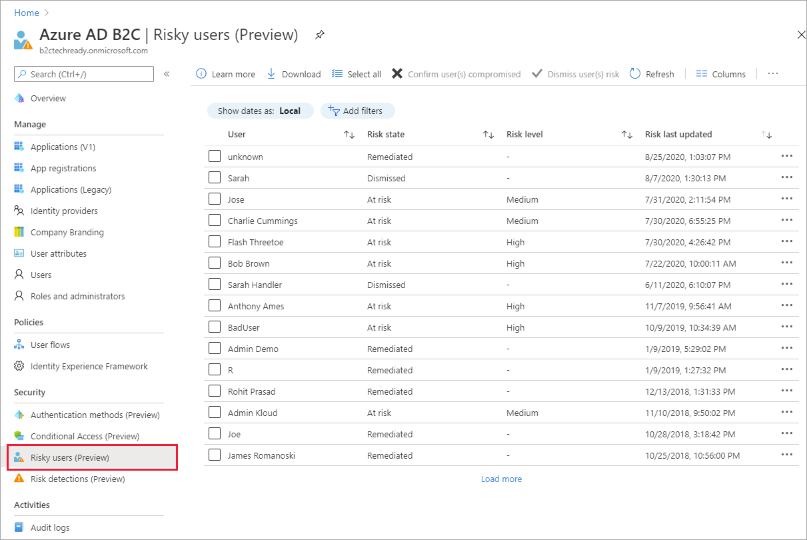

# Azure AD B2C の Identity Protection を使用したリスクの調査

[!INCLUDE [b2c-public-preview-feature](../../includes/active-directory-b2c-public-preview.md)]

Identity Protection は、ご自分の Azure AD B2C テナントに継続的なリスク検出を提供するものです。 これにより、組織は ID ベースのリスクを検出、調査し、修復できます。 Identity Protection には、Azure AD B2C テナントの ID のリスクを調査するために使用できるリスク レポートが用意されています。 この記事では、リスクを調査して軽減する方法について説明します。

## 概要

Azure AD B2C Identity Protection では、2 つのレポートが提供されます。 "*危険なユーザー*" レポートでは、管理者は、危険にさらされているユーザーと検出の詳細を確認できます。 "*リスク検出*" レポートでは、各リスク検出に関する情報 (種類、同時にトリガーされた他のリスク、サインインが試行された場所など) が提供されます。

各レポートは、レポートの上部に表示されている期間のすべての検出の一覧と共に起動します。 レポートは、レポートの上部にあるフィルターを使用してフィルター処理できます。 管理者は、データをダウンロードするか、[MS Graph API と Microsoft Graph PowerShell SDK](../active-directory/identity-protection/howto-identity-protection-graph-api.md) を使用してデータを継続的にエクスポートするかを選択できます。

## サービスの制限と考慮事項

Identity Protection を使用するときは、次の点を考慮してください。

- Identity Protection は既定でオンになっています。
- Identity Protection は、ローカル ID と、Google や Facebook などのソーシャル ID の両方で使用できます。 ソーシャル ID の場合、条件付きアクセスをアクティブにする必要があります。 ソーシャル アカウントの資格情報は外部の ID プロバイダーによって管理されているため、検出が制限されます。
- Azure AD B2C テナントでは、[Azure AD Identity Protection のリスク検出](../active-directory/identity-protection/overview-identity-protection.md)のサブセットのみを使用できます。 Azure AD B2C では、次のリスク検出がサポートされています。  

|リスク検出の種類  |説明  |
|---------|---------|
| 特殊な移動     | ユーザーの最近のサインインに基づき特殊と判断された場所からのサインイン。        |
|匿名 IP アドレス     | 匿名の IP アドレスからのサインイン (例: Tor Browser、Anonymizer VPN)。        |
|マルウェアにリンクした IP アドレス     | マルウェアにリンクした IP アドレスからのサインイン。         |
|通常とは異なるサインイン プロパティ     | 指定されたユーザーで最近観察されていないプロパティを使用したサインイン。        |
|ユーザーに対するセキュリティ侵害を管理者が確認しました    | 管理者は、ユーザーが侵害されたことを示しています。             |
|パスワード スプレー     | パスワード スプレー攻撃を使用したサインイン。      |
|Azure AD 脅威インテリジェンス     | Microsoft の内部および外部の脅威インテリジェンス ソースが既知の攻撃パターンを特定しました。        |

## Pricing tier

Identity Protection の一部の機能には、Azure AD B2C Premium P2 が必要です。 必要に応じて、[Azure AD B2C の価格レベルを Premium P2 に変更](./billing.md)してください。 次の表に、Identity Protection の機能と必要な価格レベルを示します。  

|機能   |P1   |P2|
|----------|:-----------:|:------------:|
|危険なユーザー レポート     |&#x2713; |&#x2713; |
|危険なユーザー レポートの詳細  | |&#x2713; |
|危険なユーザー レポートの修復    | &#x2713; |&#x2713; |
|リスク検出レポート   |&#x2713;|&#x2713;|
|リスク検出レポートの詳細  ||&#x2713;|
|レポートのダウンロード |  &#x2713;| &#x2713;|
|MS Graph API アクセス |  &#x2713;| &#x2713;|

## 前提条件

[!INCLUDE [active-directory-b2c-customization-prerequisites](../../includes/active-directory-b2c-customization-prerequisites.md)]

## 危険性の高いユーザーを調査する

危険なユーザー レポートによって提供される情報を使用して、管理者は、以下を見つけることができます。

- どのユーザーにリスクがあり、リスクが修復されたか無視されたか
- 検出の詳細
- すべての危険なサインインの履歴
- リスクの履歴
 
管理者は、これらのイベントに対してアクションを実行することを選択できます。 管理者は、以下を実行することを選択できます。

- ユーザー パスワードをリセットする
- ユーザーの侵害を確認する
- ユーザー リスクを無視する
- ユーザーによるサインインをブロックする
- Azure ATP を使用してさらに調査する

### 危険なユーザー レポート内の移動

1. [Azure portal](https://portal.azure.com/) にサインインします。

1. ポータル ツール バーにある **[ディレクトリ + サブスクリプション]** アイコンを選択し、Azure AD B2C テナントを含むディレクトリを選択します。

1. **[Azure サービス]** で、 **[Azure AD B2C]** を選択します。 または、検索ボックスを使用して検索し、 **[Azure AD B2C]** を選択します。

1. **[セキュリティ]** で、 **[危険なユーザー (プレビュー)]** を選択します。

   

    個々のエントリを選択すると、検出の下に [詳細] ウィンドウが展開されます。 詳細ビューで、管理者は、各検出を調査してアクションを実行できます。

    

## リスク検出レポート

リスク検出レポートには、最長で過去 90 日間 (3 か月) のフィルター可能なデータが含まれています。

リスク検出レポートによって提供される情報を使用して、管理者は、以下を見つけることができます。

- 各リスク検出についての種類を含む情報
- 同時にトリガーされた他のリスク
- サインインが試行された場所

管理者は、ユーザーのリスク レポートまたはサインイン レポートに戻り、収集された情報に基づいてアクションを実行できます。

### リスク検出レポート内の移動

1. Azure portal で、 **[Azure AD B2C]** を検索して選択します。
1. **[セキュリティ]** で、 **[リスク検出 (プレビュー)]** を選択します。

   

## 次のステップ

- [ユーザー フローに条件付きアクセスを追加する](conditional-access-user-flow.md)。