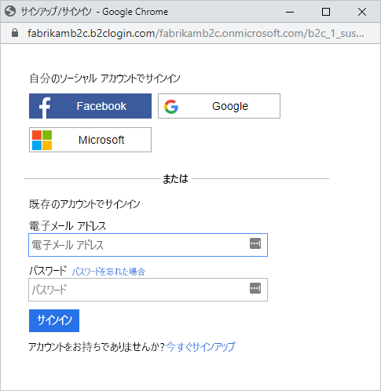

# <a name="quickstart-set-up-sign-in-for-a-single-page-app-using-azure-active-directory-b2c"></a>クイック スタート:Azure Active Directory B2C を使用したシングルページ アプリのサインインの設定

Azure Active Directory B2C (Azure AD B2C) は、アプリケーション、ビジネス、顧客を保護するためのクラウド ID 管理を提供します。 Azure AD B2C に対応したアプリケーションは、オープンな標準プロトコルを使用し、ソーシャル アカウントやエンタープライズ アカウントで認証を行うことができます。 このクイック スタートでは、シングル ページ アプリケーションにソーシャル ID プロバイダーを使ってサインインし、Azure AD B2C で保護された Web API を呼び出します。

[!INCLUDE [quickstarts-free-trial-note](../../includes/quickstarts-free-trial-note.md)]

## <a name="prerequisites"></a>前提条件

- [Visual Studio Code](https://code.visualstudio.com/)
- [Node.js](https://nodejs.org/en/download/)
- Facebook、Google、または Microsoft のソーシャル アカウント
- GitHub のコード サンプル: [active-directory-b2c-javascript-msal-singlepageapp](https://github.com/Azure-Samples/active-directory-b2c-javascript-msal-singlepageapp)

    [zip アーカイブをダウンロードする](https://github.com/Azure-Samples/active-directory-b2c-javascript-msal-singlepageapp/archive/master.zip)か、リポジトリを複製することができます。

    ```console
    git clone https://github.com/Azure-Samples/active-directory-b2c-javascript-msal-singlepageapp.git
    ```

## <a name="run-the-application"></a>アプリケーションの実行

1. Node.js のコマンド プロンプトから次のコマンドを実行してサーバーを起動します。

    ```console
    cd active-directory-b2c-javascript-msal-singlepageapp
    npm install && npm update
    npm start
    ```

    *server.js* によって起動されたサーバーが、リッスンしているポートを表示します。

    ```console
    Listening on port 6420...
    ```

1. ブラウザーでアプリケーションの URL にアクセスします。 たとえば、「 `http://localhost:6420` 」のように入力します。

    

## <a name="sign-in-using-your-account"></a>自分のアカウントを使用してサインインする

1. **[サインイン]** を選択して、ユーザー体験を開始します。
1. Azure AD B2C では、サンプルの Web アプリケーションに対する Fabrikam と呼ばれる架空の会社のサインイン ページが提供されます。 ソーシャル ID プロバイダーを使用してサインアップするには、使用する ID プロバイダーのボタンを選択します。

    

    ユーザーは、ソーシャル アカウントの資格情報を使用して認証 (サインイン) し、アプリケーションがそのソーシャル アカウントから情報を読み取ることを承認します。 アクセスを許可することにより、アプリケーションはソーシャル アカウントからプロファイル情報 (名前やお住まいの都市など) を取得できるようになります。

1. ID プロバイダーのサインイン プロセスを完了します。

## <a name="access-a-protected-api-resource"></a>保護された API リソースにアクセスする

**[Call API]\(API の呼び出し\)** を選択すると、Web API から表示名が JSON オブジェクトとして返されます。


このシングルページ アプリケーション サンプルは、保護された Web API リソースへの要求にアクセス トークンを追加します。

## <a name="clean-up-resources"></a>リソースをクリーンアップする

他の Azure AD B2C クイックスタートやチュートリアルを試す場合は、Azure AD B2C テナントを使用できます。 不要になったら、[Azure AD B2C テナントを削除する](faq.md#how-do-i-delete-my-azure-ad-b2c-tenant)ことができます。

## <a name="next-steps"></a>次のステップ

このクイック スタートでは、サンプルのシングルページ アプリケーションを使用して次のことを行いました。

- ソーシャル ID プロバイダーを使用してサインインする
- Azure AD B2C ユーザー アカウントを作成する (サインイン時に自動的に作成されます)
- Azure AD B2C によって保護された Web API を呼び出す

独自の Azure AD B2C テナントを作成してみましょう。

> [!div class="nextstepaction"]
> [Azure Portal で Azure Active Directory B2C テナントを作成する](tutorial-create-tenant.md)
