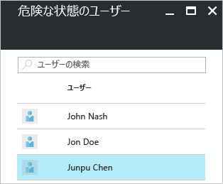
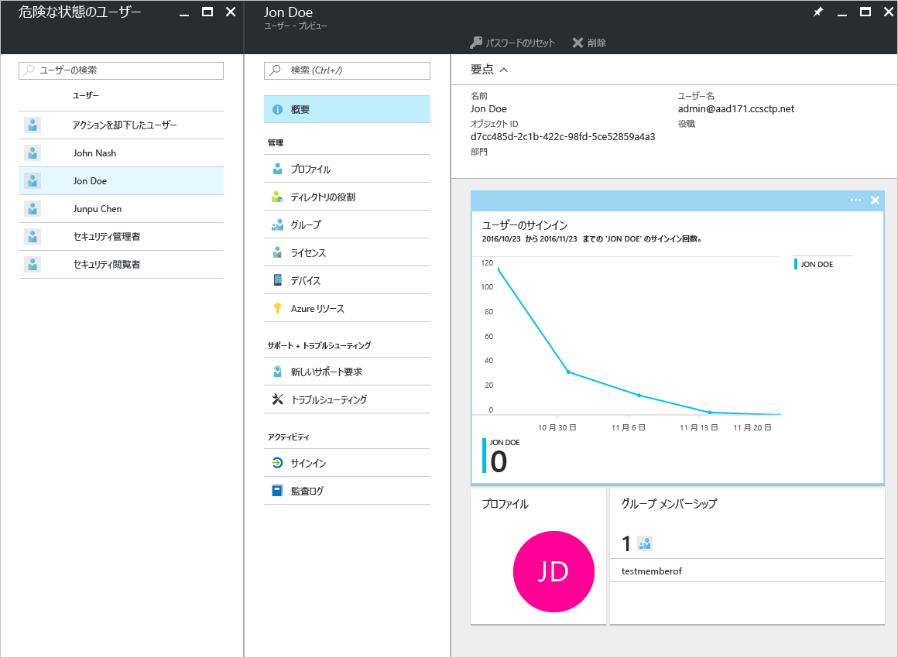
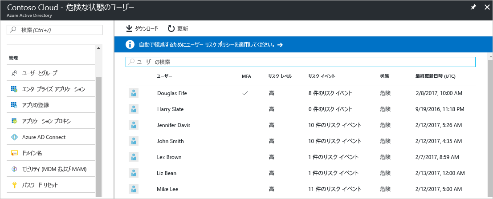
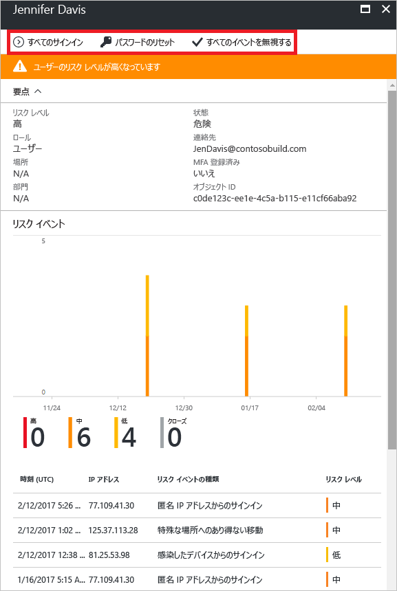
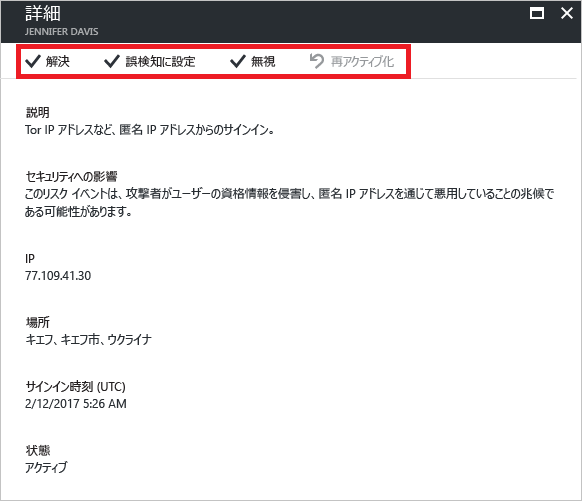

# Azure Active Directory ポータルのリスクのフラグ付きユーザー セキュリティ レポート

Azure Active Directory (Azure AD) のセキュリティ レポートでは、環境内でユーザー アカウントが侵害されている確率を調べることができます。 

Azure Active Directory は、ユーザー アカウントに関連する疑わしい動作を検出します。 検出された動作ごとに、"*リスク イベント*" と呼ばれるレコードが作成されます。 詳細については、「[Azure Active Directory リスク イベント](active-directory-identity-protection-risk-events.md)」を参照してください。 

検出されたリスク イベントは、以下のものの計算に使用されます。

- **リスクの高いサインイン** - リスクの高いサインインは、ユーザー アカウントの正当な所有者ではない人によって行われた可能性があるサインイン試行の指標です。 詳細については、「[リスクの高いサインイン](active-directory-identityprotection.md#risky-sign-ins)」を参照してください。 

- **リスクのフラグ付きユーザー** - リスクの高いユーザーは、侵害された可能性があるユーザー アカウントの指標です。 詳細については、「[リスクのフラグ付きユーザー](active-directory-identityprotection.md#users-flagged-for-risk)」を参照してください。  

Azure Portal では、**[Azure Active Directory]** ブレードの **[セキュリティ]** セクションで、セキュリティ レポートを確認できます。  

## セキュリティ レポートにアクセスするために必要な Azure AD ライセンス  

"リスクのフラグ付きユーザー" レポートは、Azure Active Directory の全エディションで利用できます。  
ただしエディションによってレポートの粒度が異なります。 

- リスクのフラグ付きユーザーは、**Azure Active Directory の Free エディションと Basic エディション**でも一覧表示できます。 

- **Azure Active Directory Premium 1** エディションではこのモデルが拡張され、各レポートについて検出された、基になるリスク イベントの一部を調べることができます。 

- **Azure Active Directory Premium 2** エディションでは、基になるすべてのリスク イベントについて最も詳しい情報が得られます。また、構成されているリスク レベルに対して自動的に対応するセキュリティ ポリシーを構成することができます。

## Azure Active Directory の Free および Basic エディション

Azure Active Directory の Free および Basic エディションのリスクのフラグ付きユーザー レポートでは、侵害された可能性があるユーザー アカウントの一覧を提供します。 

ユーザーを選択すると、関連するユーザー データ ブレードが開きます。
危険な状態のユーザーに関して、そのユーザーのサインイン履歴を確認し、必要に応じてパスワードをリセットすることができます。

このダイアログから次の操作を行うことができます。

- レポートのダウンロード

- ユーザーの検索

## Azure Active Directory Premium エディション

Azure Active Directory Premium エディションのリスクのフラグ付きユーザー レポートで提供される情報を以下に示します。

- 侵害された可能性のある[ユーザー アカウントの一覧](active-directory-identityprotection.md#users-flagged-for-risk) 

- 検出された[リスク イベントの種類](active-directory-identity-protection-risk-events.md)に関する集計情報

- レポートをダウンロードするオプション

- [ユーザー リスク修復ポリシー](active-directory-identityprotection.md#user-risk-security-policy)を構成するオプション  

ユーザーを選択すると、そのユーザーの詳細なレポート ビューが表示されます。ここから次の機能を利用できます。

- [All sign-ins (すべてのサインイン)] ビューを開く

- ユーザーのパスワードをリセットする

- すべてのイベントを閉じる

- そのユーザーについて報告されたリスク イベントを調査する 

リスク イベントを調査するには、一覧からリスク イベントを 1 つ選択してその **[詳細]** ブレードを表示します。 **[詳細]** ブレードで、[リスク イベントを手動で閉じる](active-directory-identityprotection.md#closing-risk-events-manually)か、手動で閉じたリスク イベントを再アクティブ化することができます。 

## 次のステップ

- Azure Active Directory Identity Protection の詳細については、「[Azure Active Directory Identity Protection](active-directory-identityprotection.md)」を参照してください。

