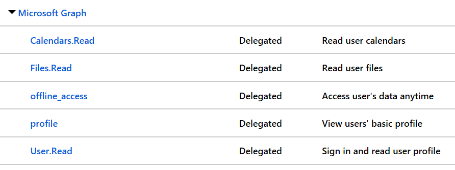

# <a name="why-update-to-microsoft-identity-platform-v20"></a>Microsoft ID プラットフォーム (v2.0) に更新する理由

新しいアプリケーションを開発する場合、Microsoft ID プラットフォーム (v2.0) エンドポイントと Azure Active Directory (v1.0) エンドポイントの相違点を把握しておくことが重要です。 この記事では、各エンドポイントの主な相違点と、Microsoft ID プラットフォームに関する既存の制限について説明します。

## <a name="who-can-sign-in"></a>サインインできるユーザー


* v1.0 エンドポイントでは、職場と学校のアカウント (Azure AD) でのみ、ご利用のアプリケーションにサインインすることができます。
* Microsoft ID プラットフォーム エンドポイントでは、Azure AD からの職場と学校のアカウント、および個人の Microsoft アカウント (MSA) (hotmail.com、outlook.com、msn.com など) でサインインできます。
* 両方のエンドポイントで、 *[シングルテナント](../develop/single-and-multi-tenant-apps.md?toc=/azure/active-directory/azuread-dev/toc.json&bc=/azure/active-directory/azuread-dev/breadcrumb/toc.json)* として構成されているアプリケーション、またはテナント固有のエンドポイント (`https://login.microsoftonline.com/{TenantId_or_Name}`) を指すように構成されている*マルチテナント* アプリケーションに対する Azure AD ディレクトリの *[ゲスト ユーザー](../external-identities/what-is-b2b.md)* によるサインインも受け入れられます。

Microsoft ID プラットフォーム エンドポイントを使用した場合は、個人の Microsoft アカウントに加え、職場や学校のアカウントからのサインインを受け付けるアプリを記述することができます。 そのため、完全にアカウント非依存のアプリを作成することができます。 たとえば、アプリで [Microsoft Graph](https://graph.microsoft.io) を呼び出す場合、SharePoint サイトやディレクトリ データなど、いくつかの追加の機能とデータを職場のアカウントで使用できます。 しかし、[ユーザーのメールの読み取り](/graph/api/user-list-messages)など、多くのアクションでは、同じコードで個人アカウントおよび職場と学校のアカウントの両方のメールにアクセスすることができます。

Microsoft ID プラットフォーム エンドポイントの場合、Microsoft Authentication Library (MSAL) を使用して、コンシューマー向け、教育向け、エンタープライズ向けのいずれの環境にもアクセスできます。 Azure AD v1.0 エンドポイントでは、職場と学校のアカウントのみからのサインインが受け入れられます。

## <a name="incremental-and-dynamic-consent"></a>増分および動的な同意

必要な OAuth 2.0 アクセス許可を事前に指定するには、Azure AD v1.0 エンドポイントを使用するアプリが必要になります。その例を以下に示します。



アプリケーションの登録時に直接設定されるアクセス許可は**静的**となります。 アプリの静的アクセス許可は Azure portal で定義されており、コードを適切に維持できますが、開発者にとってはそれがいくつかの問題を引き起こす場合があります。

* アプリで、ユーザーの初回サインインの時点で必要になる可能性があるすべてのアクセス許可を要求する必要があります。 アクセス許可のリストは長くなる場合があり、エンドユーザーが初回サインイン時にアプリのアクセスを承認することを阻げる要因となります。

* アプリでアクセスする可能性のあるすべてのリソースが事前にわかっている必要があります。 任意の数のリソースにアクセスするアプリを作成することは、困難でした。

Microsoft ID プラットフォーム エンドポイントでは、Azure portal のアプリ登録情報で定義された静的アクセス許可を無視し、代わりにアクセス許可を追加的に要求することができます。つまり、最初は最小限の権限セットを要求し、その後、お客様が使用する追加のアプリ機能に応じて要求を追加することができます。 これを行うために、任意の時点でアプリに必要なスコープを指定できます。その場合、アクセス トークンの要求時に `scope` パラメーターに新しいスコープを含めます。アプリケーションの登録情報で事前に定義する必要はありません。 要求に追加された新しいスコープにユーザーがまだ同意していない場合、新しいアクセス許可のみの同意を求められます。 詳細については、[アクセス許可、同意、スコープ](../develop/v2-permissions-and-consent.md?toc=/azure/active-directory/azuread-dev/toc.json&bc=/azure/active-directory/azuread-dev/breadcrumb/toc.json)の説明を参照してください。

`scope` パラメーターを使用してアプリからアクセス許可を動的に要求できるため、開発者はユーザーの操作を完全に制御できます。 同意操作を初期段階に組み込み、1 回の初期承認要求ですべてのアクセス許可を求めることもできます。 アプリで多数のアクセス許可が必要な場合は、時間の経過と共に、ユーザーがアプリの特定の機能を使用するときにアクセス許可を集めることができます。

組織に代わって行われる管理者の同意では、引き続き、アプリ用に登録された静的アクセス許可が要求されるため、組織全体に代わり、管理者が同意する必要がある場合は、アプリ登録ポータル内のアプリに対してこれらのアクセス許可を設定するようにしてください。 これにより、アプリケーションを設定するために組織の管理者に必要なサイクルが減ります。

## <a name="scopes-not-resources"></a>リソースではなくスコープ

v1.0 エンドポイントを使用するアプリの場合、アプリは、**リソース**、またはトークンの受信者として動作できます。 リソースには、リソースで識別できる多数の**スコープ**または **oAuth2Permissions** を定義できます。それによりクライアント アプリは、そのリソースから特定のスコープのセットのトークンを要求できます。 リソースの例として、Microsoft Graph API があります。

* リソース識別子、または `AppID URI`: `https://graph.microsoft.com/`
* スコープ、または `oAuth2Permissions`: `Directory.Read`、`Directory.Write` など。

これは、Microsoft ID プラットフォーム エンドポイントの場合に該当します。 アプリはリソースとして動作し、スコープを定義することができ、URI によって識別できます。 また、クライアント アプリは、スコープへのアクセスを要求できます。 ただし、クライアントがそれらのアクセス許可を要求する方法が変更されました。

v1.0 エンドポイントでは、Azure AD への OAuth 2.0 承認要求は、次のようになっていました。

```text
GET https://login.microsoftonline.com/common/oauth2/authorize?
client_id=2d4d11a2-f814-46a7-890a-274a72a7309e
&resource=https://graph.microsoft.com/
...
```

ここで、**resource** パラメーターは、クライアント アプリが認証を求めている対象のリソースを示します。 Azure AD は、Azure Portal での静的な構成に基づいて、アプリによって要求されたアクセス許可を計算し、適切なトークンを発行していました。

Microsoft ID プラットフォーム エンドポイントを使用するアプリケーションでは、同じ OAuth 2.0 承認要求が次のようになります。

```text
GET https://login.microsoftonline.com/common/oauth2/v2.0/authorize?
client_id=2d4d11a2-f814-46a7-890a-274a72a7309e
&scope=https://graph.microsoft.com/directory.read%20https://graph.microsoft.com/directory.write
...
```

ここで、**scope** パラメーターは、アプリで承認を要求している対象のリソースとアクセス許可を示します。 要求されているリソースはまだ要求内に存在していて、scope パラメーターの各値の中に含まれています。 このように scope パラメーターを使用すると、Microsoft ID プラットフォーム エンドポイントの OAuth 2.0 仕様への準拠を高め、一般的な業界の慣行に近づけることができます。 また、アプリで[増分同意](#incremental-and-dynamic-consent)を行うこともできます。つまり、アプリケーションで最初の要求以外のアクセス許可が必要な場合にのみ、それらのアクセス許可を要求することもできます。

## <a name="well-known-scopes"></a>既知のスコープ

### <a name="offline-access"></a>オフライン アクセス

Microsoft ID プラットフォーム エンドポイントを使用するアプリでは、アプリ向けで既知の新たなアクセス許可 (`offline_access` スコープ) を使用する必要がある場合があります。 すべてのアプリは、ユーザーがアプリを積極的に利用しない可能性がある場合でも、長期間ユーザーに代わってリソースにアクセスするために必要な、このアクセス許可を要求する必要があります。 `offline_access` スコープは、同意ダイアログで "**いつでもデータにアクセスできます**" と表示され、ユーザーはこれに同意する必要があります。 `offline_access` アクセス許可を要求すると、Web アプリで Microsoft ID プラットフォーム エンドポイントから OAuth 2.0 の refresh_tokens を受け取ることができます。 更新トークンは長期間維持され、アクセスの期間を延長するために新しい OAuth 2.0 のアクセス トークンと交換することができます。

アプリが `offline_access` スコープを要求しない場合、更新トークンを受け取ることはありません。 つまり、OAuth 2.0 承認コード フローの承認コードを使用すると、`/token` エンドポイントからのアクセス トークンのみを受け取ることになります。 そのアクセス トークンは短時間 (通常は 1 時間) 有効ですが、最終的には期限が切れます。 その時点で、アプリでユーザーを `/authorize` エンドポイントにリダイレクトし、新しい承認コードを取得する必要があります。 このリダイレクト中に、アプリの種類によっては、ユーザーが資格情報を再入力したり、アクセス許可に再同意したりする必要がある場合もあります。

OAuth 2.0、`refresh_tokens`、および `access_tokens` の詳細については、[Microsoft ID プラットフォーム プロトコルのリファレンス](../develop/active-directory-v2-protocols.md?toc=/azure/active-directory/azuread-dev/toc.json&bc=/azure/active-directory/azuread-dev/breadcrumb/toc.json)を参照してください。

### <a name="openid-profile-and-email"></a>OpenID、プロファイル、および電子メール

これまでは、Microsoft ID プラットフォームを使用する最も基本的な OpenID 接続サインイン フローによって、結果の *id_token* 内でユーザーに関する多くの情報が提供されていました。 id_token 内の要求には、ユーザー名、推奨ユーザー名、電子メール アドレス、オブジェクト ID などを含めることができます。

アプリが `openid` のスコープでアクセスできる情報は、現在では制限されています。 `openid` スコープでアプリに許可されるのは、ユーザーのサインインと、ユーザーのためにアプリ固有の ID を受信することだけです。 アプリでユーザーに関する個人データを取得する場合は、アプリからユーザーに追加のアクセス許可を要求する必要があります。 2 つの新しいスコープである `email` と `profile` を使用すると、追加のアクセス許可を要求できます。

* `email` スコープでは、アプリは id_token の `email` 要求を使用して、ユーザーのプライマリ電子メール アドレスにアクセスできます (アドレス指定可能な電子メール アドレスをユーザーが持っている場合)。
* `profile` スコープでは、id_token 内の名前、推奨ユーザー名、オブジェクト ID など、ユーザーに関するその他のすべての基本的な情報へのアクセスをアプリに許可します。

これらのスコープにより、情報の公開を最小限にとどめる方法でアプリを記述し、アプリがジョブを実行するために必要な情報セットのみをユーザーに要求することができます。 これらのスコープの詳細については、[Microsoft ID プラットフォーム スコープのリファレンス](../develop/v2-permissions-and-consent.md?toc=/azure/active-directory/azuread-dev/toc.json&bc=/azure/active-directory/azuread-dev/breadcrumb/toc.json)を参照してください。

## <a name="token-claims"></a>トークン要求

Microsoft ID プラットフォーム エンドポイントでは、ペイロードを小さくするため、トークン内の一部の要求のみが既定で発行されます。 Microsoft ID プラットフォーム トークンの既定では提供されない v1.0 トークン内の特定の要求に依存するアプリやサービスがある場合は、[省略可能な要求](../develop/active-directory-optional-claims.md?toc=/azure/active-directory/azuread-dev/toc.json&bc=/azure/active-directory/azuread-dev/breadcrumb/toc.json)の機能を使用してそのクレームを含めることを検討してください。

> [!IMPORTANT]
> v1.0 および v2.0 のトークンは、v1.0 と v2.0 のどちらのエンドポイントからでも発行できます。 id_tokens は "*必ず*" その要求元のエンドポイントと一致し、アクセス トークンは "*必ず*"、そのトークンを使用してクライアントが呼び出す Web API で想定された形式と一致します。  したがって、アプリで v2.0 エンドポイントを使用して、Microsoft Graph を呼び出すためのトークンを取得する場合、v1.0 形式のアクセス トークンが想定されているため、アプリは v1.0 形式でトークンを受け取ります。

## <a name="limitations"></a>制限事項

Microsoft ID プラットフォーム を使用する場合に注意する必要があるいくつかの制限があります。

Microsoft ID プラットフォームと統合するアプリケーションを構築する場合は、Microsoft ID プラットフォーム エンドポイントと認証プロトコルがニーズを満たすかどうかを判断する必要があります。 v1.0 エンドポイントとプラットフォームは引き続き完全にサポートされ、いくつかの点では Microsoft ID プラットフォームよりも機能が豊富です。 ただし、Microsoft ID プラットフォームは、開発者に[大きなメリット](azure-ad-endpoint-comparison.md)を提供します。

現在の開発者向けの推奨は、下記のようにシンプルです。

* アプリケーションで個人の Microsoft アカウントをサポートする必要がある場合や、新しいアプリケーションを作成する場合は、Microsoft ID プラットフォームを使用してください。 ただしその準備として、この記事で説明する制限事項を必ず理解してください。
* SAML に依存するアプリケーションを移行または更新する場合には、Microsoft ID プラットフォームを使用することはできません。 代わりに、[Azure AD 1.0 ガイド](v1-overview.md)に関するページを参照してください。

Microsoft ID プラットフォーム エンドポイントはこの一覧に記載された制限事項をなくすように進化するため、Microsoft ID プラットフォーム エンドポイントのみを使用すればよくなる予定です。 当面は、この記事を参照して、Microsoft ID プラットフォーム エンドポイントがニーズを満たしているかどうかを判断してください。 Microsoft ID プラットフォーム エンドポイントの現在の状態を反映するように、この記事を引き続き更新する予定です。 Microsoft ID プラットフォームの機能に対して、要件を再確認してください。

### <a name="restrictions-on-app-registrations"></a>アプリの登録に関する制限事項

Microsoft ID プラットフォーム エンドポイントと統合するアプリごとに、Azure portal の新しい[**アプリ登録**エクスペリエンス](https://aka.ms/appregistrations)でアプリの登録を作成することができます。 既存の Microsoft アカウント アプリはポータルとの互換性がありませんが、Azure AD アプリはすべて、登録された日時や場所に関係なく互換性があります。

職場や学校のアカウントと個人用アカウントをサポートするアプリの登録については、次の注意事項があります。

* アプリケーション ID ごとに許可されるアプリ シークレットは 2 種類のみです。
* テナントに登録されなかったアプリケーションは、それを登録したアカウントによってのみ管理できます。 これは他の開発者とは共有できません。 アプリ登録ポータルで個人の Microsoft アカウントを使用して登録されたアプリの多くは、これに該当します。 アプリの登録を複数の開発者と共有したい場合は、Azure portal の新しい **[アプリの登録]** セクションを使用して、アプリケーションをテナントに登録してください。
* 許可されるリダイレクト URL の形式には、いくつかの制限事項があります。 リダイレクト URL の詳細については、次のセクションを参照してください。

### <a name="restrictions-on-redirect-urls"></a>リダイレクト URL に関する制限事項

Microsoft ID プラットフォームに登録されている、アプリのリダイレクト URL の制限に関する最新情報については、Microsoft ID プラットフォームのドキュメントで、[リダイレクト URI/応答 URL における制約と制限](../develop/reply-url.md)に関するページを参照してください。

Microsoft ID プラットフォームで使用するアプリを登録する方法については、[新しいアプリ登録エクスペリエンスを使用したアプリの登録](../develop/quickstart-register-app.md?toc=/azure/active-directory/azuread-dev/toc.json&bc=/azure/active-directory/azuread-dev/breadcrumb/toc.json)に関するページを参照してください。

### <a name="restrictions-on-libraries-and-sdks"></a>ライブラリと SDK に関する制限事項

現時点では、Microsoft ID プラットフォーム エンドポイントのライブラリ サポートは制限されています。 運用環境のアプリケーションで Microsoft ID プラットフォーム エンドポイントを使用する場合は、次の選択肢があります。

* Web アプリケーションを構築する場合は、一般提供されているサーバー側のミドルウェアを使用して、サインインとトークンの検証を安全に実行できます。 このようなミドルウェアには、OWIN の ASP.NET 用 OpenID Connect ミドルウェアや Node.js 用 Passport プラグインなどがあります。 Microsoft のミドルウェアを使用するコード サンプルについては、[Microsoft ID プラットフォームの「使用の開始」](../develop/v2-overview.md?toc=/azure/active-directory/azuread-dev/toc.json&bc=/azure/active-directory/azuread-dev/breadcrumb/toc.json#getting-started)セクションを参照してください。
* デスクトップまたはモバイル アプリケーションを構築する場合は、Microsoft の認証ライブラリ (MSAL) のいずれかを使用できます。 これらのライブラリは、一般提供されているか運用環境でサポートされているプレビュー版なので、実稼働アプリケーションで使用しても安全です。 プレビューの使用条件と使用可能なライブラリの詳細については、[認証ライブラリのリファレンス](../develop/reference-v2-libraries.md?toc=/azure/active-directory/azuread-dev/toc.json&bc=/azure/active-directory/azuread-dev/breadcrumb/toc.json)に関するページをご覧ください。
* Microsoft ライブラリの対象ではないプラットフォームでは、アプリケーション コードで直接プロトコル メッセージを送受信することで Microsoft ID プラットフォーム エンドポイントと統合できます。 OpenID Connect プロトコルと OAuth プロトコルについては、このような統合の実施に役立つように、[明確に文書化](../develop/active-directory-v2-protocols.md?toc=/azure/active-directory/azuread-dev/toc.json&bc=/azure/active-directory/azuread-dev/breadcrumb/toc.json)されています。
* オープン ソースの OpenID Connect および OAuth のライブラリを使用して、Microsoft ID プラットフォーム エンドポイントと統合できます。 Microsoft ID プラットフォームのエンドポイントは通常、変更を加えなくても、多数のオープンソース プロトコル ライブラリと互換性があります。 これらのライブラリが使用可能かどうかは、言語とプラットフォームによって異なります。 [OpenID Connect](https://openid.net/connect/) および [OAuth 2.0](https://oauth.net/2/) の Web サイトでは、一般的な実装のリストを公開しています。 詳細については、[Microsoft ID プラットフォームと認証ライブラリ](../develop/reference-v2-libraries.md?toc=/azure/active-directory/azuread-dev/toc.json&bc=/azure/active-directory/azuread-dev/breadcrumb/toc.json)に関するページと、Microsoft ID プラットフォーム エンドポイントでテスト済みのオープンソース クライアント ライブラリとサンプルの一覧を参照してください。
* 参照情報: Microsoft ID プラットフォーム共通エンドポイントの `.well-known` エンドポイントは `https://login.microsoftonline.com/common/v2.0/.well-known/openid-configuration` です。 `common` とテナント ID を置き換えて、お使いのテナントに固有のデータを取得します。

### <a name="protocol-changes"></a>プロトコルの変更

Microsoft ID プラットフォーム エンドポイントは SAML と WS-Federation をサポートしていません。OpenID 接続と OAuth 2.0 のみをサポートしています。  OAuth 2.0 プロトコルに加えられた、ｖ1.0 エンドポイントからの主な変更点は次のとおりです。

* `email` 要求は、省略可能な要求が構成されている場合、**または**その要求の中で scope=email が指定されている場合に返されます。
* `resource` パラメーターに代わって、`scope` パラメーターがサポートされるようになりました。
* OAuth 2.0 仕様への準拠性を高めるため、多くの応答に変更が加えられました (たとえば、`expires_in` を文字列ではなく整数として正しく返すなど)。

Microsoft ID プラットフォーム エンドポイントでサポートされているプロトコル機能の範囲について詳しく理解するには、[OpenID Connect および OAuth 2.0 プロトコルに関するリファレンス](../develop/active-directory-v2-protocols.md?toc=/azure/active-directory/azuread-dev/toc.json&bc=/azure/active-directory/azuread-dev/breadcrumb/toc.json)を参照してください。

#### <a name="saml-usage"></a>SAML の使用状況

Windows アプリケーションで Active Directory Authentication Library (ADAL) を使用している場合は、Windows 統合認証を活用している可能性がありますが、これは Security Assertion Markup Language (SAML) アサーション付与を使用しています。 この付与により、フェデレーション Azure AD テナントのユーザーは資格情報を入力せずに、オンプレミスの Active Directory インスタンスで自動的に認証できます。 SAML はエンタープライズ ユーザーで使用するために[引き続きサポートされているプロトコル](../develop/active-directory-saml-protocol-reference.md)ですが、v2.0 エンドポイントは OAuth 2.0 アプリケーションでのみ使用されます。

## <a name="next-steps"></a>次の手順

[Microsoft ID プラットフォームのドキュメント](../develop/index.yml)で詳細を確認してください。
