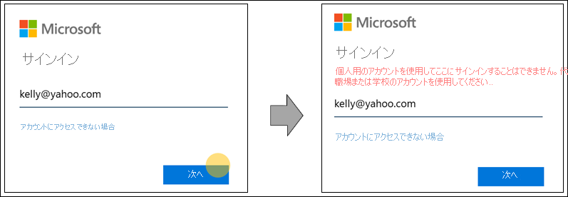

# Azure Active Directory サインイン ページのホーム領域検出

Microsoft では、新しい認証方法用の領域を確保し、使いやすさを向上させるために Azure Active Directory (Azure AD) のサインイン動作を変更しています。 サインイン中は、ユーザーを認証する必要がある場所が Azure AD によって決定されます。 Azure AD では、サインイン ページに入力されたユーザー名に対して組織およびユーザーの設定を読み取ることで、インテリジェントな判定が行われます。 これは、パスワードを使用しない将来に向けた第一歩であり、これにより、FIDO 2.0 のような追加の資格情報を使用できるようになります。

## ホーム領域検出の動作

従来、ホーム領域検出は、サインイン時に提供されるドメインによって、または一部のレガシ アプリケーションの場合はホーム領域検出ポリシーによって管理されていました。 たとえば、検出動作では、Azure Active Directory ユーザーが自分のユーザー名を間違えて入力しても、組織の資格情報コレクション画面がユーザーに表示されていました。 これは、ユーザーが組織のドメイン名 "contoso.com" を正しく入力した場合に起こります。 この動作では、個々のユーザーに合わせてエクスペリエンスをカスタマイズする細分性は許可されていません。

広範な資格情報をサポートし、使いやすさを向上させるために、サインイン プロセス中に行われる Azure Active Directory のユーザー名参照動作が更新されました。 新しい動作では、サインイン ページに入力されたユーザー名に基づいて組織レベルおよびユーザー レベルの設定を読み取ることで、インテリジェントな判定が行われます。 これを可能にするために、Azure Active Directory では、サインイン ページに入力されたユーザー名が指定されたドメイン内に存在するかどうかが確認されるか、または自分の資格情報を入力するようにユーザーがリダイレクトされます。

この動作の他の利点として、エラー メッセージの強化が挙げられます。 ここでは、Azure Active Directory ユーザーのみをサポートするアプリケーションにサインインする場合に表示されるエラー メッセージの改善例をいくつか示します。

- ユーザー名が間違って入力されたか、ユーザー名が Azure AD にまだ同期されていない場合: 
  
    
  
- ドメイン名が間違って入力された場合: 
  
    
  
- ユーザーが既知のコンシューマー ドメインを使用してサインインを試みた場合: 
  
    
  
- パスワードは間違って入力されているが、ユーザー名は正確である場合:   
  
    
  
> [!IMPORTANT]
> この機能は、フェデレーションを強制するために以前のドメイン レベルのホーム領域検出に依存しているフェデレーション ドメインに影響を与える可能性があります。 フェデレーション ドメインのサポートが追加されるときの更新については、「[Microsoft 365 サービスのサインイン時のホーム領域検出](https://azure.microsoft.com/updates/signin-hrd/)」をご覧ください。 それまでの間、一部の組織では、Azure Active Directory に存在していなくても適切なドメイン名を含むユーザー名を使用してサインインするように従業員をトレーニングしてきました。これは、現時点で、ドメイン名によってユーザーが自分の組織のドメイン エンドポイントにルーティングされるからです。 新しいサインイン動作では、これは許可されません。 ユーザーは、ユーザー名を修正するように通知され、Azure Active Directory 内に存在しないユーザー名を使用してサインインすることは許されません。
>
> ご利用のプラクティスまたはご自分の組織のプラクティスが以前の動作に依存している場合、組織の管理者は、従業員のサインインおよび認証に関するドキュメントを更新し、適切な Azure Active Directory ユーザー名を使用してサインインするように従業員をトレーニングすることが重要です。
  
新しい動作に問題がある場合は、この記事の「**フィードバック**」セクションにご意見を入力してください。  

## 次のステップ

[サインイン ブランドのカスタマイズ](../fundamentals/add-custom-domain.md)
