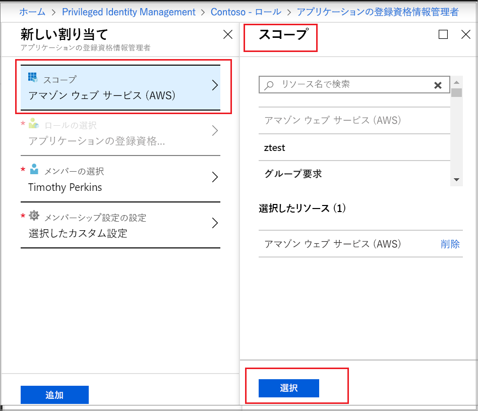

# Privileged Identity Management (PIM) で Azure AD のカスタム ロールをアクティブ化する

Azure Active Directory (Azure AD) の Privileged Identity Management が、"ID とアクセス管理" の管理エクスペリエンスにおいて、アプリケーション管理用に作成されたカスタム ロールへの Just-In-Time の割り当てと期限限定の割り当てに対応しました。 Azure AD でカスタム ロールを作成してアプリケーション管理を委任する方法について詳しくは、「[Azure Active Directory でのカスタム管理者ロール (プレビュー)](../roles/custom-overview.md)」を参照してください。

> [!NOTE]
> プレビュー段階では、Azure AD のカスタム ロールがビルトイン ディレクトリ ロールと連携していません。 その機能の一般提供が開始されれば、ビルトイン ロールのエクスペリエンスでロールの管理が行えるようになります。 次のバナーが表示される場合は、これらのロールは[組み込みロールのエクスペリエンスで](pim-how-to-activate-role.md)管理する必要があり、この記事は適用されません。
>
> :::image type="content" source="media/pim-how-to-add-role-to-user/pim-new-version.png" alt-text="Azure AD で [Privileged Identity Management] を選択します。" lightbox="media/pim-how-to-add-role-to-user/pim-new-version.png":::

## ロールのアクティブ化

Azure AD のカスタム ロールをアクティブ化する必要がある場合は、Privileged Identity Management で [自分のロール] ナビゲーション オプションを選択してアクティブ化を要求します。

1. [Azure ポータル](https://portal.azure.com)にサインインします。
1. [[Azure AD Privileged Identity Management]](https://portal.azure.com/?Microsoft_AAD_IAM_enableCustomRoleManagement=true&Microsoft_AAD_IAM_enableCustomRoleAssignment=true&feature.rbacv2roles=true&feature.rbacv2=true&Microsoft_AAD_RegisteredApps=demo#blade/Microsoft_Azure_PIMCommon/CommonMenuBlade/quickStart) を開きます。

1. **[Azure AD カスタム ロール]** を選択して、資格のある Azure AD カスタム ロールの割り当てを一覧表示します。

   

> [!Note] 
> ロールを割り当てる前に、ロールを作成または構成する必要があります。 AAD カスタム ロールの構成に関する詳細については、「[Privileged Identity Management で Azure AD のカスタム ロールを構成する](azure-ad-custom-roles-configure.md)」を参照してください。

1. **[Azure AD カスタム ロール (プレビュー)]** ページで、必要な割り当てを探します。
1. **[自分のロールをアクティブにします ]** を選択して **[アクティブ化]** ページを開きます。
1. お使いのロールで多要素認証が必要な場合は、 **[続行する前に ID を確認してください]** をクリックします。 認証が要求されるのは、各セッションにつき 1 回だけです。
1. **[ID を確認]** をクリックし、指示に従って追加のセキュリティ確認を提供します。
1. カスタム アプリケーション スコープを指定するには、 **[スコープ]** を選択してフィルター ウィンドウを開きます。 ロールへのアクセスは、必要最小限のスコープで要求するようにしてください。 アプリケーション スコープで割り当てを行った場合、そのスコープでのみアクティブ化を行うことができます。

   

1. 必要に応じて、カスタムのアクティブ化開始時刻を指定します。 使用した場合、指定した時刻にロールのメンバーがアクティブ化されます。
1. **[理由]** ボックスに、アクティブ化要求の理由を入力します。 これらはロールの設定で必須または省略可能にすることができます。
1. **[アクティブ化]** を選びます。

承認が不要なロールは、設定に従ってアクティブ化され、アクティブなロールの一覧に追加されます。 アクティブ化したロールを使用したい場合は、「[Privileged Identity Management で Azure AD のカスタム ロールを割り当てる](azure-ad-custom-roles-assign.md)」の手順に進んでください。

ロールをアクティブ化するために承認が必要な場合、要求が承認待ちになっていることを伝える通知が Azure から届きます。

## 次のステップ

- [Azure AD のカスタム ロールを割り当てる](azure-ad-custom-roles-assign.md)
- [Azure AD のカスタム ロールの割り当てを削除または更新する](azure-ad-custom-roles-update-remove.md)
- [Azure AD のカスタム ロールの割り当てを構成する](azure-ad-custom-roles-configure.md)
- [Azure AD のロールの定義](../roles/permissions-reference.md)
