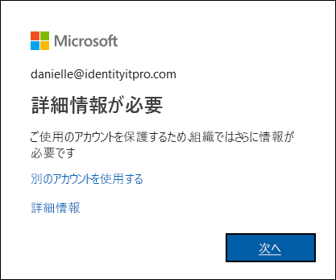

# 使用する 2 要素認証方法の設定の概要

ご自分の組織で 2 要素認証が有効になるということは、ご自分の職場または学校のアカウントにサインインするときに、ご自分のユーザー名、パスワード、およびモバイル デバイスまたは電話の組み合わせが必要になることを意味します。 組織でこの余分な認証を有効にするのは、ユーザーが知っているものとユーザーが所有するものの 2 つの形式の認証を使用するため、パスワードだけよりも安全性が高くなるためです。 2 要素認証は、悪意のあるハッカーによるなりすましを防ぐのに役立ちます。なぜなら、悪意のあるハッカーがあなたのパスワードを知っていたとしても、あなたのデバイスを持っていない可能性も高いためです。

>[!Important]
>このコンテンツはユーザーを対象としています。 管理者の方は、Azure Active Directory (Azure AD) 環境の設定と管理方法の詳細については、「[Azure Active Directory のドキュメント](https://docs.microsoft.com/azure/active-directory)」を参照してください。

## この機能の使用を決定するユーザー

アカウントの種類に応じて、2 要素認証を使用しなければならないことをお客様の組織が決定する場合、またはお客様が自分で決定できる場合があります。

- **職場または学校のアカウント。** 職場または学校アカウント (例: alain@contoso.com) を使用している場合、お客様が 2 要素認証を使用しなければならないかどうかは、特定の認証方法と共にお客様の組織が決定します。 この機能は、お客様の組織で使用する必要があると判断されたため、個人で無効にすることはできません。

- **個人の Microsoft アカウント。** 個人の Microsoft アカウント (例: alain@outlook.com) の場合、2 要素認証の設定を選択できます。 2 要素認証とご自分の個人の Microsoft アカウントで問題が発生する場合は、「[Microsoft アカウントの 2 段階認証を有効または無効にする](https://support.microsoft.com/help/4028586/microsoft-account-turning-two-step-verification-on-or-off)」を参照してください。 この機能の使用はユーザーが選択するので、ユーザーは必要に応じていつでもこれをオンまたはオフにできます。

## [追加のセキュリティ確認] ページにアクセスする

ご自分の組織で 2 要素認証をオンにして設定を行ったら、ご自分のアカウントのセキュリティを確保する詳細情報の提供を求めるプロンプトが表示されます。

### [追加のセキュリティ確認] ページにアクセスするには

1. **[詳細情報が必要]** プロンプトで **[次へ]** を選択します。

    **[追加のセキュリティ確認]** ページが表示されます。

2. ご自分の職場または学校アカウントへのサインイン後、ユーザー確認にどの 2 要素認証方法を使用するかを、 **[追加のセキュリティ確認]** ページで決定する必要があります。 選択できるオプションは次のとおりです。

    | 連絡方法 | 説明 |
    | --- | --- |
    | モバイル アプリ | <ul><li>**[確認のため通知を受け取る]** : このオプションは、ユーザーのスマート フォンまたはタブレット上の認証アプリに通知をプッシュします。 通知を確認し、適切である場合は、アプリで **[認証]** を選択するだけです。 会社または学校の場合は、認証する前に PIN を入力する必要があります。</li><li>**[確認コードを使用する]** : このモードでは、認証アプリは 30 秒ごとに更新される確認コードを生成します。 サインイン画面に最新の確認コードを入力します。 Microsoft Authenticator アプリは、[Android](https://go.microsoft.com/fwlink/?linkid=866594) および [iOS](https://go.microsoft.com/fwlink/?linkid=866594) で利用できます。</li></ul> |
    | 認証用電話 | <ul><li>**[電話]** はユーザーが指定した電話番号に自動音声通話を行います。 呼び出しに応答し、電話のキーパッドの # (シャープ記号) を押して認証を行います。</li><li>**[テキスト メッセージ]** は確認コードを含むテキスト メッセージを送信します。 テキスト内の指示に従って、テキスト メッセージに返信するか、指定された確認コードをサインイン インターフェイスに入力します。</li></ul> |
    | 会社電話 | ユーザーが設定した電話番号に自動音声通話を行います。 呼び出しに応答し、電話のキーパッドの # (シャープ記号) を押して認証を行います。 |

## 次の手順

**[追加のセキュリティ確認]** ページにアクセスしたら、ご自分の 2 要素認証方法を選択して設定する必要があります。

- [モバイル デバイスを認証方法として設定する](multi-factor-authentication-setup-phone-number.md)

- [会社の電話を認証方法として設定する](multi-factor-authentication-setup-office-phone.md)

- [Microsoft Authenticator アプリを認証方法として設定する](multi-factor-authentication-setup-auth-app.md)

## 関連リソース

- [2 要素認証方法の設定を管理する](multi-factor-authentication-end-user-manage-settings.md)

- [アプリ パスワードの管理](multi-factor-authentication-end-user-app-passwords.md)

- [2 要素認証を使用してサインインする](multi-factor-authentication-end-user-signin.md)

- [2 要素認証のサポートを受ける](multi-factor-authentication-end-user-troubleshoot.md) 
