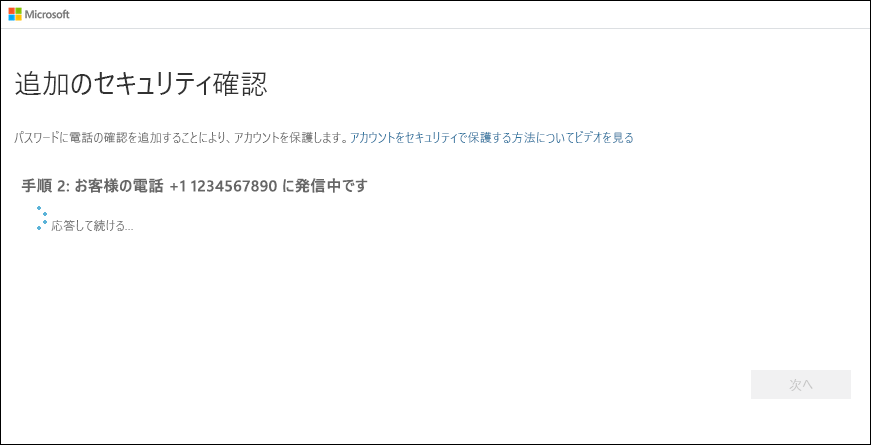

# モバイル デバイスを 2 要素認証方法として設定する

ご利用のモバイル デバイスを 2 要素認証方法として動作するように設定できます。 携帯電話で、確認コードを含むテキスト メッセージを受信するか、電話で確認コードを受け取ることができます。

>[!Note]
> 認証用電話オプションが灰色表示される場合、検証に電話番号またはテキスト メッセージを使用することを組織が許可していない可能性があります。 この場合、別の方法を選択するか、管理者に支援を要請する必要があります。

## 確認方法としてテキスト メッセージを使用するようにモバイル デバイスを設定する

1. **[追加のセキュリティ確認]** ページの **[手順 1: ご希望のご連絡方法をお知らせください]** 領域で **[認証用電話]** を選択し、ドロップダウン リストからお住まいの国または地域を選択して、モバイル デバイスの電話番号を入力してください。

2. **[方法]** 領域で **[テキスト メッセージでコードを送信する]** を選択してから、 **[次へ]** を選択します。

    ![[追加のセキュリティ確認] ページを示すスクリーンショット。[認証用電話] と [テキスト メッセージでコードを送信する] が選択されています。](media/multi-factor-authentication-verification-methods/multi-factor-authentication-text-message.png)

3. **[手順 2: お客様の電話にテキスト メッセージを送信しました]** 領域で、Microsoft から送信されたテキスト メッセージに含まれている確認コードを入力し、 **[確認]** を選択します。

    ![[認証用電話] を選択し、[テキスト メッセージでコードを送信する] を選択した [追加のセキュリティ確認] ページ](media/multi-factor-authentication-verification-methods/multi-factor-authentication-text-message-test.png)

4. **[手順 3: 既存のアプリケーションを使用し続ける]** 領域から、指定されたアプリ パスワードをコピーし、それを安全な場所に貼り付けます。

    ![[追加のセキュリティ確認] ページの [アプリ パスワード] 領域](media/multi-factor-authentication-verification-methods/multi-factor-authentication-app-passwords.png)

    >[!Note]
    >古いアプリでアプリ パスワードを使用する方法の詳細については、「[アプリ パスワードの管理](multi-factor-authentication-end-user-app-passwords.md)」を参照してください。 2 要素認証をサポートしていない古いアプリを引き続き使用する場合のみ、アプリ パスワードを使用する必要があります。

5. **[Done]** を選択します。

## 電話で確認コードを受け取るようにモバイル デバイスを設定する

1. **[追加のセキュリティ確認]** ページの **[手順 1: ご希望のご連絡方法をお知らせください]** 領域で **[認証用電話]** を選択し、ドロップダウン リストからお住まいの国または地域を選択して、モバイル デバイスの電話番号を入力してください。

2. **[方法]** 領域で **[電話で確認コードを受け取る]** を選択してから、 **[次へ]** を選択します。

    ![[認証用電話] を選択し、[電話で確認コードを受け取る] をオンにした [追加のセキュリティ確認] ページ](media/multi-factor-authentication-verification-methods/multi-factor-authentication-phone-call.png)

3. Microsoft から電話がかかってきて、ID を確認するためにモバイル デバイスでポンド (#) 記号を押すように求められます。

    

4. **[手順 3: 既存のアプリケーションを使用し続ける]** 領域から、指定されたアプリ パスワードをコピーし、それを安全な場所に貼り付けます。

    ![[追加のセキュリティ確認] ページの [アプリ パスワード] 領域](media/multi-factor-authentication-verification-methods/multi-factor-authentication-app-passwords.png)

    >[!Note]
    >古いアプリでアプリ パスワードを使用する方法の詳細については、「[アプリ パスワードの管理](multi-factor-authentication-end-user-app-passwords.md)」を参照してください。 2 要素認証をサポートしていない古いアプリを引き続き使用する場合のみ、アプリ パスワードを使用する必要があります。

5. **[Done]** を選択します。

## 次のステップ

2 要素認証方法を設定した後、方法の追加、設定とアプリ パスワードの管理、サインインを行うことができます。また、2 要素認証に関連する一般的な問題についてサポートを受けることもできます。

- [2 要素認証方法の設定を管理する](multi-factor-authentication-end-user-manage-settings.md)

- [アプリ パスワードの管理](multi-factor-authentication-end-user-app-passwords.md)

- [2 要素認証を使用してサインインする](multi-factor-authentication-end-user-signin.md)

- [2 要素認証のサポートを受ける](multi-factor-authentication-end-user-troubleshoot.md)
