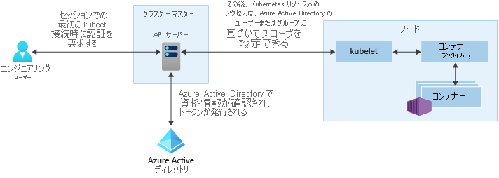

# Azure Kubernetes Service (AKS) でのアクセスと ID オプション

Kubernetes クラスターでの認証とセキュリティ保護には、さまざまな方法があります。 ロールベースのアクセス制御 (RBAC) を使用して、ユーザーまたはグループに対して、ユーザーまたはグループが必要とするリソースのみへのアクセス権を付与できます。 Azure Kubernetes Service (AKS) では、Azure Active Directory を使用して、セキュリティとアクセス許可構造をさらに強化できます。 これらの方法は、アプリケーションのワークロードと顧客データを保護するのに役立ちます。

この記事では、AKS で認証とアクセス許可の割り当てを行うために役立つ中心概念を紹介します。

- [Kubernetes サービス アカウント](#kubernetes-service-accounts)
- [Azure Active Directory の統合](#azure-active-directory-integration)
- [ロールベースのアクセス制御 (RBAC)](#role-based-access-controls-rbac)
- [ロールと ClusterRoles](#roles-and-clusterroles)
- [RoleBindings と ClusterRoleBindings](#rolebindings-and-clusterrolebindings)

## Kubernetes サービス アカウント

Kubernetes のプライマリ ユーザー タイプの 1 つは、"*サービス アカウント*" です。 サービス アカウントは、Kubernetes API 内に存在し、Kubernetes API によって管理されます。 サービス アカウントの資格情報は Kubernetes シークレットとして格納され、承認されたポッドが API サーバーと通信するために使用できます。 ほとんどの API 要求では、サービス アカウントまたは通常のユーザー アカウント用の認証トークンが提供されします。

通常のユーザー アカウントでは、人間の管理者または開発者は、サービスとプロセスだけではなく、従来のアクセスも許可されます。 Kubernetes 自体には、通常のユーザー アカウントとパスワードを格納する ID 管理ソリューションはありません。 代わりに、外部 ID ソリューションを Kubernetes に統合できます。 AKS クラスターの場合、この統合される ID ソリューションは Azure Active Directory です。

Kubernetes における ID オプションの詳細については、[Kubernetes の認証][kubernetes-authentication]に関する記事を参照してください。

## Azure Active Directory の統合

Azure Active Directory (AD) の統合によって、AKS クラスターのセキュリティを拡張できます。 数十年に及ぶエンタープライズ ID 管理の上に構築された Azure AD は、マルチテナントに対応したクラウドベースのディレクトリであり、中核となるディレクトリ サービス、アプリケーションのアクセス管理機能、および ID 保護機能が統合された ID 管理サービスです。 Azure AD を使用してオンプレミスの ID を AKS クラスターに統合することで、アカウント管理とセキュリティのための単一のソースを提供できます。

Azure AD が統合された AKS クラスターでは、名前空間内またはクラスター間での Kubernetes リソースへのアクセス権をユーザーまたはグループに付与できます。 `kubectl` 構成コンテキストを取得するには、ユーザーは、[az aks get-credentials][az-aks-get-credentials] コマンドを実行します。 その後、ユーザーが `kubectl` を使用して AKS クラスターにアクセスすると、Azure AD 資格情報でサインインするように求められます。 このアプローチでは、ユーザー アカウントの管理とパスワードの資格情報のために 1 つのソースが提供されます。 ユーザーは、クラスター管理者によって定義されているリソースにのみアクセスできます。

AKS クラスターでの Azure AD 認証では、OAuth 2.0 プロトコル上に構築された ID 層である OpenID Connect を使用します。 OAuth 2.0 が保護されたリソースにアクセスするためのアクセス トークンの取得と使用を行うメカニズムを定義し、OpenID Connect が OAuth 2.0 承認プロセスの拡張機能として認証を実装します。 OpenID Connect の詳細については、[OpenID Connect のドキュメント][openid-connect]を参照してください。 OpenID Connect を通して Azure AD から取得された認証トークンを検証するには、AKS クラスターでは Kubernetes Webhook トークン認証を使用します。 詳細については、[Webhook トークン認証のドキュメント][webhook-token-docs]を参照してください。

## ロールベースのアクセス制御

ユーザーが実行できるアクションの詳細なフィルタ処理を行うには、Kubernetes ではロールベースのアクセス制御 (RBAC) を使用します。 この制御メカニズムを使用して、ユーザーまたはユーザー グループに対して、リソースの作成または変更、実行中のアプリケーション ワークロードのログの表示などの操作を行うアクセス許可を割り当てることができます。 これらのアクセス許可は、付与するスコープを単一の名前空間にすることも、AKS クラスター全体にすることもできます。 Kubernetes の RBAC では、アクセス許可を定義する "*ロール*" を作成し、それらのロールを "*ロールのバインド*" を使用してユーザーに割り当てます。

詳細については、[RBAC 承認の使用][kubernetes-rbac]に関するページを参照してください。

### Azure のロールベースのアクセス制御
リソースへのアクセスを制御するために追加された 1 つのメカニズムが、Azure のロールベースのアクセス制御 (RBAC) です。 Kubernetes の RBAC は、AKS クラスター内のリソースに対して機能するように設計され、Azure の RBAC は、Azure サブスクリプション内のリソースに対して機能するように設計されています。 Azure の RBAC では、適用されるアクセス許可の概要を説明する*ロール定義*を作成します。 その後、ユーザーまたはグループに特定の "*スコープ*" (個々のリソース、リソース グループ、またはサブスクリプション) で有効なロール定義が割り当てられます。

詳細については、「[Azure RBAC とは][azure-rbac]」を参照してください。

## ロールと ClusterRole

Kubernetes の RBAC を使用してアクセス許可をユーザーに割り当てる前に、これらのアクセス許可を "*ロール*" として先に定義します。 Kubernetes のロールは、アクセス許可を "*付与*" します。 "*拒否*" というアクセス許可の概念はありません。

ロールは、名前空間内にアクセス許可を付与するために使用されます。 クラスター全体または特定の名前空間の外部のクラスター リソースへのアクセス許可を付与する必要がある場合は、代わりに *ClusterRole* を使用できます。

ClusterRole は、リソースへのアクセス許可を付与するのと同じように機能しますが、特定の名前空間ではなく、クラスター全体のリソースに適用できます。

## RoleBinding と ClusterRoleBinding

リソースへのアクセス許可を付与するロールを定義したら、*RoleBinding* を使用して、これらの Kubernetes の RBAC アクセス許可を割り当てます。 AKS クラスターが Azure Active Directory と統合されている場合、バインドは、Azure AD ユーザーが、クラスター内でアクションを実行するためのアクセス許可がどのように付与されるかを示します。

ロールのバインドを使用して、特定の名前空間に対してロールを割り当てます。 このアプローチによって、1 つの AKS クラスターを論理的に分離でき、ユーザーは各自に割り当てられた名前空間内のアプリケーション リソースにのみアクセスが可能になります。 クラスター全体または特定の名前空間の外部のクラスター リソースにロールをバインドする必要がある場合は、代わりに *ClusterRoleBinding* を使用できます。

ClusterRoleBinding は、ユーザーにロールをバインドするのと同じように機能しますが、特定の名前空間ではなく、クラスター全体のリソースに適用できます。 このアプローチでは、管理者またはサポートエンジニアに対して、AKS クラスター内のすべてのリソースへのアクセス許可を付与できます。

## 次のステップ

Azure AD と Kubernetes の RBAC の使用を開始するには、[Azure Active Directory と AKS の統合][aks-aad]に関する記事を参照してください。

関連するベスト プラクティスについては、[AKS の認証と認可のベスト プラクティス][operator-best-practices-identity]に関する記事を参照してください。

Kubernetes と AKS の中心概念の追加情報については、次の記事を参照してください。

- [Kubernetes/AKS クラスターとワークロード][aks-concepts-clusters-workloads]
- [Kubernetes/AKS のセキュリティ][aks-concepts-security]
- [Kubernetes/AKS の仮想ネットワーク][aks-concepts-network]
- [Kubernetes/AKS のストレージ][aks-concepts-storage]
- [Kubernetes/AKS のスケール][aks-concepts-scale]

<!-- LINKS - External -->
[kubernetes-authentication]: https://kubernetes.io/docs/reference/access-authn-authz/authentication
[webhook-token-docs]: https://kubernetes.io/docs/reference/access-authn-authz/authentication/#webhook-token-authentication
[kubernetes-rbac]: https://kubernetes.io/docs/reference/access-authn-authz/rbac/

<!-- LINKS - Internal -->
[openid-connect]: ../active-directory/develop/v2-protocols-oidc.md
[az-aks-get-credentials]: /cli/azure/aks#az-aks-get-credentials
[azure-rbac]: ../role-based-access-control/overview.md
[aks-aad]: azure-ad-integration-cli.md
[aks-concepts-clusters-workloads]: concepts-clusters-workloads.md
[aks-concepts-security]: concepts-security.md
[aks-concepts-scale]: concepts-scale.md
[aks-concepts-storage]: concepts-storage.md
[aks-concepts-network]: concepts-network.md
[operator-best-practices-identity]: operator-best-practices-identity.md
