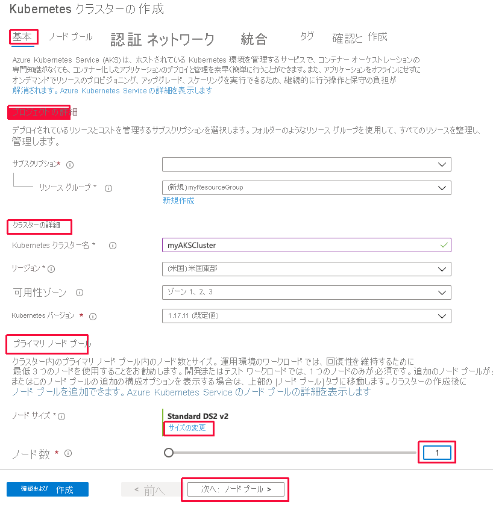
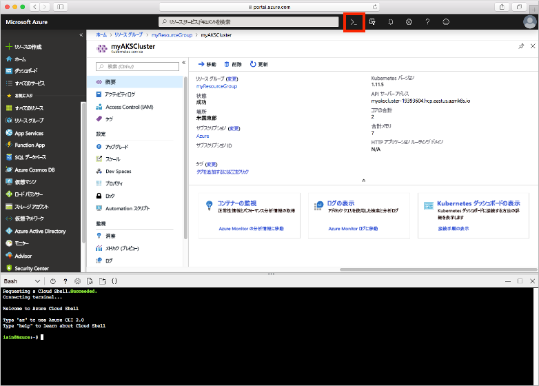

# <a name="quickstart-deploy-an-azure-kubernetes-service-aks-cluster-using-the-azure-portal"></a>クイック スタート:Azure portal を使用して Azure Kubernetes Service (AKS) クラスターをデプロイする

Azure Kubernetes Service (AKS) は、クラスターをすばやくデプロイおよび管理することができる、マネージド Kubernetes サービスです。 このクイックスタートでは、Azure Portal を使用して AKS クラスターをデプロイします。 このクラスターで、Web フロント エンドと Redis インスタンスが含まれている複数コンテナー アプリケーションが実行されます。 その後、アプリケーションを実行するクラスターとポッドの正常性を監視する方法を示します。


このクイックスタートは、Kubernetes の基本的な概念を理解していることを前提としています。 詳細については、「[Azure Kubernetes Services (AKS) における Kubernetes の中心概念][kubernetes-concepts]」を参照してください。

Azure サブスクリプションをお持ちでない場合は、開始する前に [無料アカウント](https://azure.microsoft.com/free/?WT.mc_id=A261C142F) を作成してください。

## <a name="sign-in-to-azure"></a>Azure へのサインイン

Azure Portal [https://portal.azure.com](https://portal.azure.com) にサインインします。

## <a name="create-an-aks-cluster"></a>AKS クラスターを作成する

AKS クラスターを作成するには、次の手順を実行します。

1. Azure portal メニュー上または **[ホーム]** ページから **[リソースの作成]** を選択します。

2. **コンテナー** >  **Kubernetes Service** を選択します。

3. **[基本]** ページで、次のオプションを構成します。
    - **プロジェクトの詳細**:Azure **サブスクリプション**を選択し、Azure **リソース グループ** (たとえば、*myResourceGroup*) を選択または作成します。
    - **クラスターの詳細**:**Kubernetes クラスター名** (たとえば、*myAKSCluster*) を入力します。 AKS クラスターの**リージョン**、**Kubernetes バージョン**、および **DNS 名プレフィックス**を選択します。
    - **プライマリ ノード プール**:AKS ノードの VM **ノード サイズ**を選択します。 AKS クラスターがデプロイされた後に、VM サイズを変更することは*できません*。 
            - クラスターにデプロイするノードの数を選択します。 このクイック スタートでは、 **[ノード数]** を *1* に設定します。 ノード数は、クラスターをデプロイした後に調整*できます*。
    
    

    **[Next:スケール]** を完了後に選択します。

4. **[スケール]** ページで、既定のオプションを維持します。 ページの下部にある **[Next:Authentication] (次: 認証)** をクリックします。
    > [!CAUTION]
    > 新しい AAD サービス プリンシパルの作成は、伝達されて使用可能になるまでに数分かかる場合があり、それが原因でサービス プリンシパルが見つからないエラーや検証エラーが Azure portal で生じることがあります。 そのような場合の軽減策については、[こちら](troubleshooting.md#received-an-error-saying-my-service-principal-wasnt-found-or-is-invalid-when-i-try-to-create-a-new-cluster)をご覧ください。

5. **[認証]** ページで、次のオプションを構成します。
    - **[サービス プリンシパル]** フィールドを **[(新規) 既定のサービス プリンシパル]** のままにして、新しいサービス プリンシパルを作成します。 または、 *[サービス プリンシパルを構成します]* を選択して、既存のものを使用することもできます。 既存のものを使用する場合、SPN クライアント ID とシークレットを指定する必要があります。
    - Kubernetes のロールベースのアクセス制御 (RBAC) のオプションを有効にします。 これを使用すると、自分の AKS クラスターにデプロイされた Kubernetes リソースへのアクセスをより詳細に制御できます。

    または、サービス プリンシパルの代わりに、マネージド ID を使用することもできます。 詳細については、[マネージド ID の使用](use-managed-identity.md)に関するページを参照してください。

既定では、"*基本*" ネットワークが使用され、コンテナーに対する Azure Monitor が有効になります。 検証が完了したら、 **[確認および作成]** 、 **[作成]** の順にクリックします。

AKS クラスターの作成には数分かかります。 デプロイが完了したら、 **[リソースに移動]** をクリックするか、AKS クラスター リソース グループ (*myResourceGroup* など) を参照して、AKS リソース (*myAKSCluster* など) を選択します。 この例のように、AKS クラスターのダッシュボードが表示されます。


## <a name="connect-to-the-cluster"></a>クラスターに接続する

Kubernetes クラスターを管理するには、Kubernetes のコマンドライン クライアントである [kubectl][kubectl] を使用します。 `kubectl` クライアントは Azure Cloud Shell に事前にインストールされています。

Azure portal の上部にある `>_` ボタンを使用して Cloud Shell を開きます。



Kubernetes クラスターに接続するように `kubectl` を構成するには、[az aks get-credentials][az-aks-get-credentials] コマンドを使用します。 このコマンドは、資格情報をダウンロードし、それを使用するように Kubernetes CLI を構成します。 次の例では、*myResourceGroup* という名前のリソース グループの *myAKSCluster* という名前のクラスターの資格情報を取得します。

```azurecli-interactive
az aks get-credentials --resource-group myResourceGroup --name myAKSCluster
```

クラスターへの接続を確認するには、クラスター ノードの一覧を返す [kubectl get][kubectl-get] コマンドを使用します。

```console
kubectl get nodes
```

次の出力例は、前の手順で作成した単一ノードを示しています。 ノードの状態が "*準備完了*" であることを確認します。

```output
NAME                       STATUS    ROLES     AGE       VERSION
aks-agentpool-14693408-0   Ready     agent     15m       v1.11.5
```

## <a name="run-the-application"></a>アプリケーションの実行

Kubernetes のマニフェスト ファイルでは、どのコンテナー イメージを実行するかなど、クラスターの望ましい状態を定義します。 このクイック スタートでは、マニフェストを使用して、Azure Vote アプリケーションを実行するために必要なすべてのオブジェクトを作成します。 このマニフェストには、 [Kubernetes デプロイ][kubernetes-deployment] が 2 つ含まれます。サンプル Azure Vote Python アプリケーション用と Redis インスタンス用です。 さらに、 [Kubernetes サービス][kubernetes-service] が 2 つ作成されます。Redis インスタンスに使用される内部サービスと、Azure Vote アプリケーションにインターネットからアクセスするための外部サービスです。

Cloud Shell では、`code azure-vote.yaml`、`nano azure-vote.yaml`、`vi azure-vote.yaml` のような `azure-vote.yaml` という名前のファイルをエディターを使用して作成できます。 そこに次の YAML 定義をコピーします。

```yaml
apiVersion: apps/v1
kind: Deployment
metadata:
  name: azure-vote-back
spec:
  replicas: 1
  selector:
    matchLabels:
      app: azure-vote-back
  template:
    metadata:
      labels:
        app: azure-vote-back
    spec:
      nodeSelector:
        "beta.kubernetes.io/os": linux
      containers:
      - name: azure-vote-back
        image: redis
        resources:
          requests:
            cpu: 100m
            memory: 128Mi
          limits:
            cpu: 250m
            memory: 256Mi
        ports:
        - containerPort: 6379
          name: redis
---
apiVersion: v1
kind: Service
metadata:
  name: azure-vote-back
spec:
  ports:
  - port: 6379
  selector:
    app: azure-vote-back
---
apiVersion: apps/v1
kind: Deployment
metadata:
  name: azure-vote-front
spec:
  replicas: 1
  selector:
    matchLabels:
      app: azure-vote-front
  template:
    metadata:
      labels:
        app: azure-vote-front
    spec:
      nodeSelector:
        "beta.kubernetes.io/os": linux
      containers:
      - name: azure-vote-front
        image: microsoft/azure-vote-front:v1
        resources:
          requests:
            cpu: 100m
            memory: 128Mi
          limits:
            cpu: 250m
            memory: 256Mi
        ports:
        - containerPort: 80
        env:
        - name: REDIS
          value: "azure-vote-back"
---
apiVersion: v1
kind: Service
metadata:
  name: azure-vote-front
spec:
  type: LoadBalancer
  ports:
  - port: 80
  selector:
    app: azure-vote-front
```

[kubectl apply][kubectl-apply] コマンドを使用してアプリケーションをデプロイし、ご利用の YAML マニフェストの名前を指定します。

```console
kubectl apply -f azure-vote.yaml
```

次の出力例は、正常に作成されたデプロイおよびサービスを示しています。

```output
deployment "azure-vote-back" created
service "azure-vote-back" created
deployment "azure-vote-front" created
service "azure-vote-front" created
```

## <a name="test-the-application"></a>アプリケーションをテストする

アプリケーションが実行されると、Kubernetes サービスによってアプリケーション フロント エンドがインターネットに公開されます。 このプロセスが完了するまでに数分かかることがあります。

進行状況を監視するには、[kubectl get service][kubectl-get] コマンドを `--watch` 引数と一緒に使用します。

```console
kubectl get service azure-vote-front --watch
```

最初に、*azure-vote-front* サービスの *EXTERNAL-IP* が "*保留中*" として表示されます。

```output
NAME               TYPE           CLUSTER-IP   EXTERNAL-IP   PORT(S)        AGE
azure-vote-front   LoadBalancer   10.0.37.27   <pending>     80:30572/TCP   6s
```

*EXTERNAL-IP* アドレスが "*保留中*" から実際のパブリック IP アドレスに変わったら、`CTRL-C` を使用して `kubectl` ウォッチ プロセスを停止します。 次の出力例は、サービスに割り当てられている有効なパブリック IP アドレスを示しています。

```output
azure-vote-front   LoadBalancer   10.0.37.27   52.179.23.131   80:30572/TCP   2m
```

Azure Vote アプリが動作していることを確認するには、Web ブラウザーを開いてサービスの外部 IP アドレスにアクセスします。


## <a name="monitor-health-and-logs"></a>正常性の監視とログ

クラスターを作成したときに、コンテナーに対する Azure Monitor が有効になりました。 この監視機能は、AKS クラスターとクラスター上で動作するポッドの両方の正常性メトリックを提供します。

Azure Portal にこのデータが入力されるまで、数分かかる場合があります。 Azure Vote ポッドの現在の状態、稼働時間、およびリソース使用率を確認するには、Azure portal の AKS リソース (たとえば、*myAKSCluster*) に戻ります。 その後、次のようにして、正常性状態にアクセスすることができます。

1. 左側の **[監視]** の下で、 **[Insights]** を選択します
1. 上部の **[+ フィルターの追加]** を選択します
1. プロパティとして "*名前空間*" を選択し、 *\<All but kube-system\>* を選択します。
1. **コンテナー**の表示を選択します。

次の例に示されているように、*azure-vote-back* コンテナーと *azure-vote-front* コンテナーが表示されます。


`azure-vote-front` ポッドのログを表示するには、コンテナーの一覧のドロップ ダウンから **[コンテナー ログの表示]** を選択します。 これらのログには、コンテナーからの *stdout* ストリームと *stderr* ストリームが含まれます。


## <a name="delete-cluster"></a>クラスターを削除する

クラスターが不要になったら、クラスターのリソース を削除します。削除すると、関連するすべてのリソースも削除されます。 この操作を行うには、Azure portal で、AKS クラスター ダッシュボードの **[削除]** ボタンを選択します。 または、Cloud Shell で [az aks delete][az-aks-delete] コマンドを使用することもできます。

```azurecli-interactive
az aks delete --resource-group myResourceGroup --name myAKSCluster --no-wait
```

> [!NOTE]
> クラスターを削除したとき、AKS クラスターで使用される Azure Active Directory サービス プリンシパルは削除されません。 サービス プリンシパルを削除する手順については、[AKS のサービス プリンシパルに関する考慮事項と削除][sp-delete]に関するページを参照してください。 マネージド ID を使用した場合、ID はプラットフォームによって管理されるので、削除する必要はありません。

## <a name="get-the-code"></a>コードの入手

このクイック スタートでは、Kubernetes のデプロイを作成するために、事前に作成したコンテナー イメージを使用しました。 関連するアプリケーション コード、Dockerfile、および Kubernetes マニフェスト ファイルは、GitHub で入手できます。

[https://github.com/Azure-Samples/azure-voting-app-redis][azure-vote-app]

## <a name="next-steps"></a>次のステップ

このクイック スタートでは、Kubernetes クラスターをデプロイし、そこに複数コンテナー アプリケーションをデプロイしました。

AKS の詳細を参照し、デプロイの例の完全なコードを確認するには、Kubernetes クラスター チュートリアルに進んでください。

> [!div class="nextstepaction"]
> [AKS チュートリアル][aks-tutorial]

<!-- LINKS - external -->
[azure-vote-app]: https://github.com/Azure-Samples/azure-voting-app-redis.git
[kubectl]: https://kubernetes.io/docs/user-guide/kubectl/
[kubectl-apply]: https://kubernetes.io/docs/reference/generated/kubectl/kubectl-commands#apply
[kubectl-get]: https://kubernetes.io/docs/reference/generated/kubectl/kubectl-commands#get
[kubernetes-documentation]: https://kubernetes.io/docs/home/

<!-- LINKS - internal -->
[kubernetes-concepts]: concepts-clusters-workloads.md
[az-aks-get-credentials]: /cli/azure/aks?view=azure-cli-latest#az-aks-get-credentials
[az-aks-delete]: /cli/azure/aks#az-aks-delete
[aks-monitor]: ../azure-monitor/insights/container-insights-overview.md
[aks-network]: ./concepts-network.md
[aks-tutorial]: ./tutorial-kubernetes-prepare-app.md
[http-routing]: ./http-application-routing.md
[sp-delete]: kubernetes-service-principal.md#additional-considerations
[azure-dev-spaces]: ../dev-spaces/index.yml
[kubernetes-deployment]: concepts-clusters-workloads.md#deployments-and-yaml-manifests
[kubernetes-service]: concepts-network.md#services
