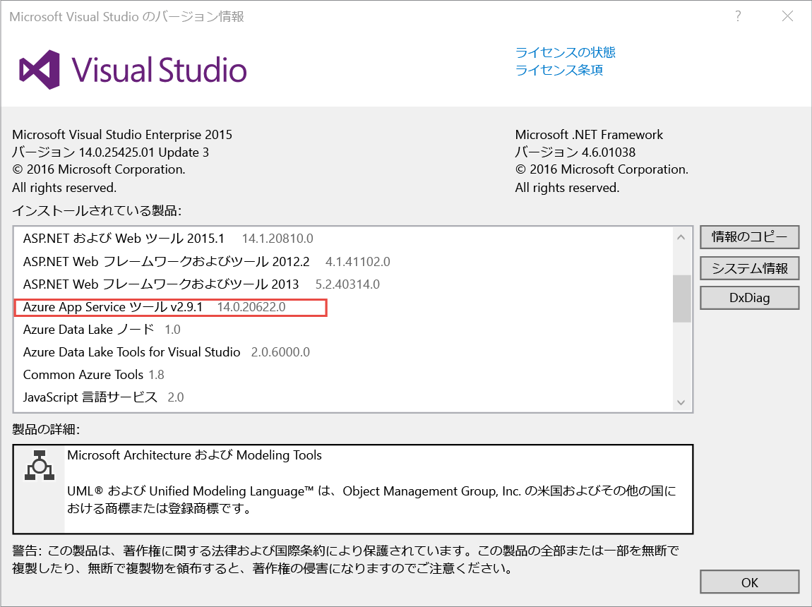
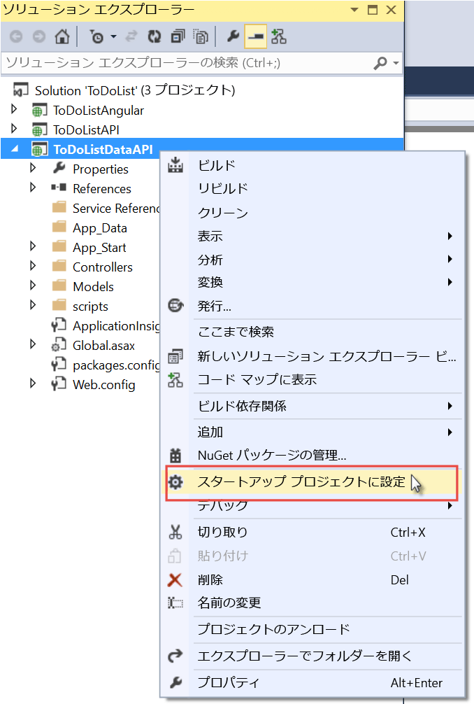

# Azure App Service で API Apps、ASP.NET、Swagger を使用する
[!INCLUDE [selector](../../includes/app-service-api-get-started-selector.md)]

この記事は、RESTful API の開発とホストに役立つ Azure App Service の各機能の使用方法を説明するチュートリアル シリーズの第 1 回です。  このチュートリアルでは、Swagger 形式での API メタデータのサポートについて説明します。

学習内容:

* Visual Studio 2015 に組み込まれたツールを利用して、Azure App Service で [API アプリ](app-service-api-apps-why-best-platform.md) を作成およびデプロイする方法。
* Swashbuckle NuGet パッケージを使用して API 検出を自動化し、Swagger API メタデータを動的に生成する方法。
* Swagger API メタデータを使用して API アプリのクライアント コードを自動的に生成する方法。

## サンプル アプリケーションの概要
このチュートリアルでは、簡単な To Do リストのサンプル アプリケーションを操作します。 このアプリケーションには、シングル ページ アプリケーション (SPA) のフロント エンド、ASP.NET Web API の中間層、ASP.NET Web API のデータ層があります。

次の画像は、 [AngularJS](https://angularjs.org/) フロント エンドのスクリーン ショットです。

この Visual Studio ソリューションには、次の 3 つのプロジェクトが含まれています。

* **ToDoListAngular** - フロントエンド: 中間層を呼び出す AngularJS SPA。
* **ToDoListAPI** - 中間層: To Do 項目に対して CRUD 操作を実行するデータ層を呼び出す ASP.NET Web API プロジェクト。
* **ToDoListDataAPI** - データ層: To Do 項目に対して CRUD 操作を実行する ASP.NET Web API プロジェクト。

この 3 層のアーキテクチャは API Apps を利用することで実装できる数多くのアーキテクチャの 1 つであり、ここではデモンストレーションのみを目的として使用しています。 各層のコードは API Apps の機能を説明するためにできる限り単純に設計されており、たとえばデータ層では永続化メカニズムとしてデータベースではなくサーバーのメモリを使用しています。

このチュートリアルを完了すると、2 つの Web API プロジェクトが完成し、クラウド上の App Service API アプリで実行できるようになります。

シリーズの次のチュートリアルでは、SPA のフロント エンドをクラウドにデプロイします。

## 前提条件
* ASP.NET Web API - このチュートリアルの手順では、Visual Studio で ASP.NET [Web API 2](http://www.asp.net/web-api/overview/getting-started-with-aspnet-web-api/tutorial-your-first-web-api) の基本的な操作方法について理解していることを前提としています。
* Azure アカウント - [無料の Azure アカウントを作成する](https://azure.microsoft.com/free/?WT.mc_id=A261C142F)か、[Visual Studio サブスクライバーの特典を有効にする](https://azure.microsoft.com/pricing/member-offers/msdn-benefits-details/?WT.mc_id=A261C142F)ことができます。
  
    Azure アカウントにサインアップする前に Azure App Service を開始する場合は、[App Service の試用](https://azure.microsoft.com/try/app-service/)に関するページにアクセスしてください。 有効期間が短いスターター アプリを App Service ですぐに作成できます。このサービスの利用にあたり、**クレジット カードは必要ありません**。契約も必要ありません。
* Visual Studio 2015 と [Azure SDK for .NET](https://azure.microsoft.com/downloads/archive-net-downloads/) - Visual Studio 2015 がない場合は、SDK によって自動的にインストールされます。
  
  * Visual Studio で、[ヘルプ]、[Microsoft Visual Studio のバージョン情報] の順にクリックし、"Azure App Service ツール v2.9.1" 以降がインストールされていることを確認します。
    
    
    
    > [!NOTE]
    > マシンに既にある SDK の依存関係の数に応じて、SDK のインストールには長時間 (数分から 30 分以上) かかる場合があります。
    > 
    > 

## サンプル アプリケーションのダウンロード
1. [Azure-Samples/app-service-api-dotnet-to-do-list](https://github.com/Azure-Samples/app-service-api-dotnet-todo-list) リポジトリをダウンロードします。
   
    **[Download ZIP (ZIP のダウンロード)]** ボタンをクリックするか、ローカル コンピューターにリポジトリを複製します。
2. Visual Studio 2015 または 2013 で ToDoList ソリューションを開きます。
   
   1. 各ソリューションを信頼する必要があります。
         
3. ソリューションをビルド (Ctrl + Shift + B) し、NuGet パッケージを復元します。
   
    デプロイ前にアプリケーションの動作を確認する場合は、ローカルで実行することができます。 ToDoListDataAPI がスタートアップ プロジェクトであることを確認し、ソリューションを実行します。 ブラウザーに HTTP 403 エラーが表示されるはずです。

## Swagger の API メタデータと UI の使用
[Swagger 2.0](http://swagger.io/) API メタデータのサポートは、Azure App Service に組み込まれています。 それぞれの API アプリで、API のメタデータを Swagger の JSON 形式で返す URL エンドポイントを指定できます。 そのエンドポイントから返されたメタデータを使用して、クライアント コードを生成できます。

Swagger のメタデータは、ASP.NET Web API プロジェクトで [Swashbuckle](https://www.nuget.org/packages/Swashbuckle) NuGet パッケージを使って動的に生成できます。 Swashbuckle NuGet パッケージは、ダウンロードした ToDoListDataAPI プロジェクトと ToDoListAPI プロジェクトにあらかじめインストールされています。

チュートリアルのこのセクションでは、生成した Swagger 2.0 メタデータを確認し、Swagger メタデータに基づいてテスト UI を試します。

1. スタートアップ プロジェクトとして (ToDoListAPI プロジェクト**ではなく** ) ToDoListDataAPI プロジェクトを設定します。
   
    
2. F5 キーを押すか、**[デバッグ]、[デバッグ開始]** の順にクリックしてデバッグ モードでプロジェクトを実行します。
   
    ブラウザーが開き、HTTP 403 エラー ページが表示されます。
3. ブラウザーのアドレス バーで、行の末尾に `swagger/docs/v1` を追加し、Return を押します。 (URL は `http://localhost:45914/swagger/docs/v1`です)。
   
    これは API の Swagger 2.0 JSON メタデータを返すために Swashbuckle で使用される既定の URL です。
   
    Internet Explorer を使用している場合、 *v1.json* ファイルをダウンロードするように求められます。
   
    
   
    Chrome、Firefox、または Microsoft Edge を使用している場合、ブラウザーのウィンドウで JSON が表示されます。 ブラウザーによって JSON の処理方法はさまざまであるため、お使いのブラウザー ウィンドウの表示は例示したものと少し異なる場合があります。
   
    
   
    次の例は、API の Swagger メタデータの最初のセクションと Get メソッドの定義です。 このメタデータに基づき、次の手順とチュートリアルの後半で使用する Swagger UI はクライアント コードを自動生成します。
   
        {
          "swagger": "2.0",
          "info": {
            "version": "v1",
            "title": "ToDoListDataAPI"
          },
          "host": "localhost:45914",
          "schemes": [ "http" ],
          "paths": {
            "/api/ToDoList": {
              "get": {
                "tags": [ "ToDoList" ],
                "operationId": "ToDoList_GetByOwner",
                "consumes": [ ],
                "produces": [ "application/json", "text/json", "application/xml", "text/xml" ],
                "parameters": [
                  {
                    "name": "owner",
                    "in": "query",
                    "required": true,
                    "type": "string"
                  }
                ],
                "responses": {
                  "200": {
                    "description": "OK",
                    "schema": {
                      "type": "array",
                      "items": { "$ref": "#/definitions/ToDoItem" }
                    }
                  }
                },
                "deprecated": false
              },
4. ブラウザーを閉じて、Visual Studio のデバッグを停止します。
5. **ソリューション エクスプローラー**の ToDoListDataAPI プロジェクトで、*App_Start\SwaggerConfig.cs* ファイルを開き、次に 174 行目まで下へスクロールし、以下のコードをコメント解除します。
   
        /*
            })
        .EnableSwaggerUi(c =>
            {
        */
   
    *SwaggerConfig.cs* ファイルは、プロジェクトに Swashbuckle パッケージをインストールするときに作成されます。 このファイルでは、さまざまな方法で Swashbuckle を構成できます。
   
    コメントを解除したコードにより、以降の手順で使用する Swagger UI が有効になります。 API アプリ プロジェクト テンプレートを使用して Web API プロジェクトを作成すると、既定では、セキュリティ対策としてこのコードはコメントアウトされています。
6. プロジェクトを再度実行します。
7. ブラウザーのアドレス バーで、行の末尾に `swagger` を追加し、Return を押します。 (URL は `http://localhost:45914/swagger`です)。
8. Swagger UI ページが表示されたら、 **[ToDoList]** をクリックし、利用できるメソッドを確認します。
   
    
9. リストの先頭にある **[Get]** ボタンをクリックします。
10. **[Parameters (パラメーター)]** セクションに `owner` パラメーターの値としてアスタリスク を入力し、**[Try it out (試してみる)]** をクリックします。
    
    今後のチュートリアルで認証を追加すると、中間層からデータ層に実際のユーザー ID が渡されます。 ここで、すべてのタスクに、所有者 ID としてアスタリスクが割り当てられ、認証が無効な状態でアプリケーションが実行されます。
    
    
    
    Swagger UI から ToDoList Get メソッドが呼び出され、応答コードと JSON 結果が表示されます。
    
    
11. **[Post (Post)]** をクリックし、**[Model Schema (モデル スキーマ)]** の下にあるボックスをクリックします。
    
    モデル スキーマをクリックすると、入力ボックスに事前入力されます。このボックスには、Post メソッドのパラメーター値を指定できます。 Internet Explorer で動作しない場合は、別のブラウザーを使用するか、次の手順でパラメーター値を手動で入力します。  
    
    
12. `todo` パラメーター入力ボックスの JSON を次の例のように変更するか、独自の説明文に書き換えます。
    
        {
          "ID": 2,
          "Description": "buy the dog a toy",
          "Owner": "*"
        }
13. **[試してみる]** をクリックします。
    
    ToDoList API から、成功を示す HTTP 204 応答コードが返されます。
14. 先頭の **[Get (Get)]** ボタンをクリックし、そのセクションにある **[Try it out (試してみる)]** ボタンをクリックします。
    
    Get メソッドの応答に、新しい to-do 項目が含まれるようになります。
15. (省略可) Put、Delete、Get by ID メソッドも試します。
16. ブラウザーを閉じて、Visual Studio のデバッグを停止します。

Swashbuckle はあらゆる ASP.NET Web API プロジェクトで利用できます。 Swagger メタデータ生成を既存のプロジェクトに追加する場合、Swashbuckle パッケージをインストールします。

> [!NOTE]
> Swagger のメタデータには、各 API 操作の一意の ID が含まれています。 既定では、Web API コントローラー メソッドに対して重複する Swagger 操作 ID が Swashbuckle によって生成される場合があります。 この現象は、コントローラーに HTTP メソッドのオーバーロード (`Get()` と `Get(id)` など) が存在すると発生します。 オーバーロードの扱い方については、「 [Swashbuckle が生成する API 定義をカスタマイズする](app-service-api-dotnet-swashbuckle-customize.md)」を参照してください。 Visual Studio から Azure API アプリ テンプレートを使って Web API プロジェクトを作成した場合、一意の操作 ID を生成するコードが *SwaggerConfig.cs* ファイルに自動的に追加されます。  
> 
> 

##  Azure で API アプリを作成し、そのアプリにコードをデプロイする
このセクションでは、Visual Studio の **Web を発行** ウィザードに統合されている Azure ツールを使用し、Azure で新しい API アプリを作成します。 次に、ToDoListDataAPI プロジェクトを新しい API アプリにデプロイし、Swagger UI を実行して API を呼び出します。

1. **ソリューション エクスプローラー**で ToDoListDataAPI プロジェクトを右クリックし、**[発行]** をクリックします。
   
    
2. **Web を発行**ウィザードの **[プロファイル]** ステップで、**[Microsoft Azure App Service]** をクリックします。
   
   
3. まだ行っていない場合は Azure アカウントにサインインし、有効期限が切れている場合は資格情報を更新します。
4. [App Service] ダイアログ ボックスで、使用する Azure **サブスクリプション**を選択して、**[新規]** をクリックします。
   
    
   
    **[App Service の作成]** ダイアログ ボックスの **[ホスティング]** タブが表示されます。
   
    デプロイの対象は、Swashbuckle がインストールされている Web API プロジェクトであるため、API アプリを作成する前提の画面になります。 **[API アプリ名]** というタイトルが表示され、**[種類の変更]** ボックスの一覧が **[API アプリ]** に設定されています。
   
    
5. **azurewebsites.net** ドメインに固有の *API アプリ名* を入力します。 Visual Studio によって提示される既定の名前をそのまま使用することもできます。
   
    既に他のユーザーによって使用されている名前を入力すると、右側に赤い感嘆符が表示されます。
   
    API アプリの URL は、 `{API app name}.azurewebsites.net`となります。
6. **[リソース グループ]** ボックスの一覧の **[新規作成]** をクリックし、「ToDoListGroup」(またはお好きな名前) を入力します。
   
    リソース グループは、API アプリ、データベース、VM など、一連の Azure リソースをひとまとめにしたものです。    このチュートリアルでは、新しいリソース グループを作成すると便利です。チュートリアルのために作成したすべての Azure リソースを 1 回の手順で簡単に削除できるからです。
   
    このボックスでは既存の[リソース グループ](../azure-resource-manager/resource-group-overview.md)を選択するか、サブスクリプションの既存のリソース グループとは異なる名前を入力し、新しいリソース グループを作成できます。
7. **[App Service プラン]** ドロップダウンの隣にある **[新規]** ボタンをクリックします。
   
    スクリーンショットの **[API アプリ名]**、**[サブスクリプション]**、**[リソース グループ]** に指定されている値はサンプルです。実際の値を使用してください。
   
    ![[App Service の作成] ダイアログ](./media/app-service-api-dotnet-get-started/createas.png)
   
    以降の手順では、新しいリソース グループの App Service プランを作成します。 App Service プランには、API アプリの実行環境となるコンピューティング リソースを指定します。 たとえば、Free レベルを選択した場合、API アプリは共有 VM 上で実行され、一部の有料レベルを選択した場合は専用 VM で実行されます。 App Service プランの詳細については、 [App Service プランの概要](../app-service/azure-web-sites-web-hosting-plans-in-depth-overview.md)に関するページを参照してください。
8. **[App Service プランの構成]** ダイアログに「ToDoListPlan」(またはお好きな名前) を入力します。
9. **[場所]** ドロップダウン リストで、現在の所在地に最も近い場所を選択します。
   
    この設定によって、アプリが実行される Azure データ センターが指定されます。 [待機時間](http://www.bing.com/search?q=web%20latency%20introduction&qs=n&form=QBRE&pq=web%20latency%20introduction&sc=1-24&sp=-1&sk=&cvid=eefff99dfc864d25a75a83740f1e0090)を最小限に抑えるため、現在の所在地に近い場所を選択してください。
10. **[サイズ]** ドロップダウンで、**[Free]** をクリックします。
    
    無料の価格レベルでこのチュートリアルに十分な性能が提供されます。
11. **[App Service プランの構成]** ダイアログで、**[OK]** をクリックします。
    
    
12. **[App Service の作成]** ダイアログ ボックスで、**[作成]** をクリックします。
    
    
    
    Visual Studio を使うと、API アプリが作成され、API アプリに必要なすべての設定が含まれる発行プロファイルが作成されます。 その後、プロジェクトのデプロイに使用する **Web を発行** ウィザードが開きます。
    
    **Web を発行**ウィザードの **[接続]** タブが開きます (下図参照)。
    
    **[接続]** タブの **[サーバー]** 設定と **[サイト名]** 設定は、API アプリを指しています。 **[ユーザー名]** と **[パスワード]** は、Azure で自動的に作成されるデプロイ資格情報です。 デプロイ後、Visual Studio によってブラウザーが開かれ、**[宛先 URL]** に指定したページが表示されます (これが **[宛先 URL]** の唯一の目的です)。  
13. ページの下部にある **[次へ]** 」を参照してください。
    
    
    
    次のタブは **[設定]** タブです (下図参照)。 ここでは、デバッグ ビルドをデプロイするようにビルド構成を変更すると、 [リモート デバッグ](../app-service-web/web-sites-dotnet-troubleshoot-visual-studio.md#remotedebug)ができるようになります。 このタブには他にも、次のようにさまざまな **ファイル発行オプション**があります。
    
    * 発行先の追加ファイルを削除する
    * 発行中にプリコンパイルする
    * App_Data フォルダーのファイルを除外する
    
    このチュートリアルでは、いずれも必要ありません。 これらの詳しい説明については、「 [How to: Deploy a Web Project Using One-Click Publish in Visual Studio (方法: Visual Studio でワンクリック発行を使用して Web プロジェクトをデプロイする)](https://msdn.microsoft.com/library/dd465337.aspx)」を参照してください。
14. **[次へ]** をクリックします。
    
    
    
    次は **[プレビュー]** タブです (下図参照)。ここではプロジェクトから API アプリにコピーされるファイルを確認できます。 既にデプロイ済みの API アプリにプロジェクトをデプロイした場合は、変更されたファイルだけがコピーされます。 コピーされるファイルの一覧を確認するには、 **[プレビューの開始]** ボタンをクリックしてください。
15. **[発行]** をクリックします。
    
    
    
    ToDoListDataAPI プロジェクトが新しい API アプリにデプロイされます。 デプロイが成功したことを示すログが **[出力]** ウィンドウに表示され、"正常に作成されました" というページがブラウザー ウィンドウ (API アプリの URL) に表示されます。
    
    
    
    
16. ブラウザーのアドレス バーの URL に「swagger」を追加し、Enter キーを押します。 (URL は `http://{apiappname}.azurewebsites.net/swagger`です)。
    
    ブラウザーに前に見た Swagger UI が表示されますが、今度はクラウドで実行しています。 Get メソッドを実行すると、既定である 2 つの to-do 項目に戻ることがわかります。 以前行った変更は、ローカル コンピューターのメモリに保存されています。
17. [Azure ポータル](https://portal.azure.com/)を開きます。
    
    Azure ポータルは、Azure のリソース (API アプリなど) を管理するための Web インターフェイスです。
18. **[その他のサービス]、[App Services]** の順にクリックします。
    
    
19. **[App Services]** ブレードで、新しい API アプリを探してクリックします (Azure Portal では、右側に表示されるウィンドウを "*ブレード*" と呼びます)。
    
    
    
    2 つのブレードが開きます。 1 つは、API アプリの概要を表示するブレードで、もう 1 つは、閲覧と変更が許可されている一連の設定を表示するブレードです。
20. **[設定]** ブレードの **[API]** セクションにある **[API 定義]** をクリックします。
    
    
    
    **[API 定義]** ブレードでは、JSON 形式で Swagger 2.0 メタデータを返す URL を指定できます。 Visual Studio によって API アプリが作成されるとき、前述の Swashbuckle によって生成されるメタデータの既定値 (API アプリのベース URL + `/swagger/docs/v1`) に API 定義 URL が設定されます。
    
    
    
    クライアント コードを生成する API アプリを選択するとき、Visual Studio はこの URL からメタデータを取得します。

##  データ層のクライアント コードを生成する
Azure API アプリと Swagger の統合の利点の 1 つは、自動コード生成です。 生成されたクライアント クラスにより、API アプリを呼び出すコードの記述が容易になります。

ToDoListAPI プロジェクトには既に生成済みのクライアント コードがありますが、次に示す手順では、コードの生成方法を確認するために、いったんそれを削除してから生成し直します。

1. Visual Studio の **ソリューション エクスプローラー**で、ToDoListAPI プロジェクトの *ToDoListDataAPI* フォルダーを削除します。 **注意: ToDoListDataAPI プロジェクトではなく、対象のフォルダーのみを削除してください。**
   
    
   
    このフォルダーは、今まさに行おうとしているコード生成プロセスを使って作成されたものです。
2. ToDoListAPI プロジェクトを右クリックし、**[追加]、[REST API クライアント]** の順にクリックします。
   
    
3. **[REST API クライアントの追加]** ダイアログ ボックスの **[Swagger URL]** をクリックし、**[Azure アセットの選択]** をクリックします。
   
    ![[Select Azure Asset (Azure 資産の選択)]](./media/app-service-api-dotnet-get-started/codegenbrowse.png)
4. **[App Service]** ダイアログ ボックスで、このチュートリアルで使用しているリソース グループを展開し、API アプリを選択して、**[OK]** をクリックします。
   
    
   
    **[REST API クライアントの追加]** に戻ると、ポータルで先に見た API 定義 URL 値がテキスト ボックスに入力されていることに注意してください。
   
    
   
   > [!TIP]
   > コード生成のためにメタデータを取得する代替方法は、参照ダイアログを利用する代わりに URL を直接入力します。 また、クライアント コードを生成してから Azure にデプロイする場合は、Web API プロジェクトをローカルで実行し、Swagger JSON ファイルの配信元となる URL に移動して JSON ファイルを保存し、 **[既存の Swagger メタデータ ファイルを選択]** オプションを使用します。
   > 
   > 
5. **[REST API クライアントの追加]** ダイアログ ボックスで **[OK]** をクリックします。
   
    Visual Studio が API アプリを元に命名したフォルダーを作成し、クライアント クラスを生成します。
   
    
6. ToDoListAPI プロジェクトで *Controllers\ToDoListController.cs* を開き、生成されたクライアントを使用して API を呼び出す 40 行目のコードを確認します。
   
    次のスニペットは、クライアント オブジェクトをインスタンス化し、Get メソッドを呼び出す方法を示しています。
   
        private static ToDoListDataAPI NewDataAPIClient()
        {
            var client = new ToDoListDataAPI(new Uri(ConfigurationManager.AppSettings["toDoListDataAPIURL"]));
            return client;
        }
   
        public async Task<IEnumerable<ToDoItem>> Get()
        {
            using (var client = NewDataAPIClient())
            {
                var results = await client.ToDoList.GetByOwnerAsync(owner);
                return results.Select(m => new ToDoItem
                {
                    Description = m.Description,
                    ID = (int)m.ID,
                    Owner = m.Owner
                });
            }
        }
   
    コンストラクターのパラメーターでは、`toDoListDataAPIURL` アプリ設定からエンドポイント URL を取得しています。 アプリケーションをローカルで実行できるようにするため、Web.config ファイルで、その値を API プロジェクトのローカル IIS Express URL に設定します。 コンストラクター パラメーターを省略した場合、既定のエンドポイントはコードの生成元の URL です。
7. クライアント クラスは、API アプリ名に基づいて別の名前で生成されます。プロジェクトで生成された型名と同じになるように、*Controllers\ToDoListController.cs* のコードに変更を加えます。 たとえば、API アプリに ToDoListDataAPI071316 という名前を付けた場合は、次のコードに変更を加え、
   
        private static ToDoListDataAPI NewDataAPIClient()
        {
            var client = new ToDoListDataAPI(new Uri(ConfigurationManager.AppSettings["toDoListDataAPIURL"]));

次のようにします。

        private static ToDoListDataAPI071316 NewDataAPIClient()
        {
            var client = new ToDoListDataAPI071316(new Uri(ConfigurationManager.AppSettings["toDoListDataAPIURL"]));

## 中間層をホストする API アプリを作成する
前の手順では、 [データ層の API アプリを作成して、それにコードをデプロイ](#createapiapp)しました。  次は、中間層の API アプリに対して同じ手順を実行します。

1. **ソリューション エクスプローラー**で (データ層の ToDoListDataAPI ではなく) 中間層の ToDoListAPI プロジェクトを右クリックし、**[発行]** をクリックします。
   
    
2. **Web を発行**ウィザードの **[プロファイル]** タブで、**[Microsoft Azure App Service]** をクリックします。
3. **[App Service]** ダイアログ ボックスで、**[新規]** をクリックします。
4. **[App Service の作成]** ダイアログ ボックスの **[ホスティング]** タブで、既定の **API アプリ名**をそのまま使用するか、*azurewebsites.net* ドメインでの一意の名前を入力します。
5. 使用している Azure **サブスクリプション** を選択します。
6. **[リソース グループ]** ドロップダウンで、先に作成したものと同じリソース グループを選択します。
7. **[App Service プラン]** ドロップダウンで、先に作成した同じプランを選択します。 その値が既定値となります。
8. **[作成]** をクリックします。
   
    Visual Studio によって API アプリとその発行プロファイルが作成され、**Web を発行**ウィザードの **[接続]** ステップが表示されます。
9. **Web を発行**ウィザードの **[接続]** ステップで、**[発行]** をクリックします。
   
   Visual Studio によって ToDoListAPI プロジェクトは新しい API アプリにデプロイされ、ブラウザーで API アプリの URL が開きます。 "正常に作成されました" ページが表示されます。

## データ層を呼び出すように中間層を構成する
仮にこの時点で中間層 API アプリを呼び出した場合、依然として Web.config ファイルに定義されている localhost の URL を使ってデータ層の呼び出しが試行されます。 このセクションでは、中間層 API アプリの環境設定にデータ層 API アプリの URL を入力します。 中間層 API アプリのコードでデータ層の URL 設定を取得すると、Web.config ファイル内の設定よりも、環境設定の方が優先されます。

1. [Azure ポータル](https://portal.azure.com/)を開き、TodoListAPI (中間層) プロジェクトをホストするために作成した API アプリの **[API アプリ]** ブレードに移動します。
2. API アプリの **[設定]** ブレードで **[アプリケーションの設定]** をクリックします。
3. API アプリの **[アプリケーションの設定]** ブレードで **[アプリの設定]** セクションが表示されるまで下へスクロールし、次のキーと値を追加します。 値は、このチュートリアルで発行した最初の API アプリの URL です。
   
   | **キー** | toDoListDataAPIURL |
   | --- | --- |
   | **値** |https:// {データ層 API アプリ名}.azurewebsites.net |
   | **例** |https://todolistdataapi.azurewebsites.net |
4. [ **Save**] をクリックします。
   
    
   
    Azure でコードを実行すると、Web.config ファイルにある localhost の URL がこの値で上書きされます。

## テスト
1. ブラウザーのウィンドウで、ToDoListAPI 用に作成した新しい中間層の API アプリの URL に移動します。 ポータルで API アプリのメイン ブレードにある URL をクリックすると、この URL に移動できます。
2. ブラウザーのアドレス バーの URL に「swagger」を追加し、Enter キーを押します。 (URL は `http://{apiappname}.azurewebsites.net/swagger`です)。
   
    ブラウザーには、ToDoListDataAPI の場合と同じ Swagger UI が表示されますが、今回 `owner` は、Get 操作の必須フィールドではありません。 これは、中間層 API アプリからデータ層 API アプリに値が送信されているためです (認証のチュートリアルでは、 `owner` パラメーター用に実際のユーザー ID を中間層から送信しますが、ここではアスタリスクをハードコーディングしています)。
3. Get メソッドや他のメソッドを試して、中間層 API アプリからデータ層 API アプリが正常に呼び出されていることを確認します。
   
    

## トラブルシューティング
このチュートリアルの途中で問題が発生した場合に備えて、ここではトラブルシューティングの方法をいくつか紹介します。

* 最新バージョンの [Azure SDK for .NET](http://go.microsoft.com/fwlink/?linkid=518003)を使用していることを確認します。
* ToDoListAPI と ToDoListDataAPI の 2 つのプロジェクトは名前が似ています。 プロジェクトに対する作業中、記載されている手順の説明と何かが違うと感じたら、正しいプロジェクトを開いていることを確認してください。
* 企業ネットワークを使用しており、ファイアウォールを介して Azure App Service にデプロイしようとしている場合は、Web デプロイのためにポート 443 と 8172 を開いてください。 これらのポートを開くことができない場合は、他のデプロイ方法を使用することができます。  「 [Azure App Service へのアプリのデプロイ](../app-service-web/web-sites-deploy.md)」を参照してください。
* "ルート名は一意でなければなりません" というエラー -- 間違ったプロジェクトを誤って API アプリにデプロイした後、正しいプロジェクトをデプロイすると、このようなエラーが表示される場合があります。 これを修正するには、API アプリに正しいプロジェクトを再デプロイし、**Web を発行**ウィザードの **[設定]** タブで、**[発行先の追加ファイルを削除する]** を選択します。

ASP.NET API アプリが Azure App Service で動作するようになったら、トラブルシューティングを容易にする Visual Studio の機能についてさらに学習できます。 ログ記録、リモート デバッグなどの詳細については、[Visual Studio での Azure App Service アプリのトラブルシューティング](../app-service-web/web-sites-dotnet-troubleshoot-visual-studio.md)に関するページを参照してください。

## 次のステップ
ここでは、既存の Web API プロジェクトを API アプリにデプロイし、API アプリのクライアント コードを生成して、.NET クライアントから API アプリを使用する方法について説明しました。 このシリーズの次のチュートリアルでは、 [CORS を利用して、JavaScript クライアントから API アプリを使用する](app-service-api-cors-consume-javascript.md)方法について説明します。

クライアント コードの生成方法の詳細については、GitHub.com の [Azure/AutoRest](https://github.com/azure/autorest) リポジトリを参照してください。 生成されたクライアントを使用するうえで問題が発生した場合は、 [AutoRest リポジトリで issue を投稿](https://github.com/azure/autorest/issues)してください。

新しい API アプリ プロジェクトを最初から作成する場合は、 **[Azure API APP]** テンプレートを使用してください。

**[Azure API App]** プロジェクト テンプレートは、**[空]** の ASP.NET 4.5.2 テンプレートを選択し、Web API サポートを追加するためのチェック ボックスをオンにして、Swashbuckle NuGet パッケージをインストールしたものに相当します。 加えて、Swagger の操作 ID が重複して作成されるのを防ぐための Swashbuckle 構成コードが追加されます。 API アプリ プロジェクトを作成したら、それをこのチュートリアルで説明した手順と同じ方法で API アプリにデプロイすることができます。

