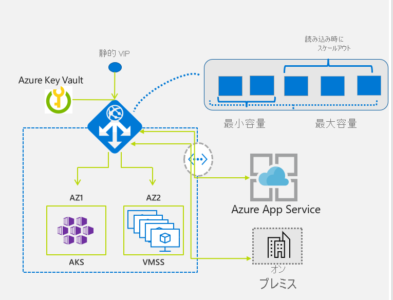

# 自動スケーリングとゾーン冗長 Application Gateway v2 

Application Gateway は、Standard_v2 SKU で利用できます。 Web アプリケーション ファイアウォール (WAF) は、WAF_v2 SKU で利用できます。 v2 SKU では、パフォーマンスが強化され、自動スケールダウン、ゾーン冗長、静的 VIP のサポートなどの重要な新機能のサポートが追加されます。 Standard SKU と WAF SKU の既存機能は、[比較](#differences-from-v1-sku)セクションで示されているいくつかの例外を除き、新しい v2 SKU でも引き続きサポートされます。

新しい v2 SKU には、次の拡張機能が含まれます。

- **自動スケール**:自動スケーリング SKU での Application Gateway または WAF のデプロイは、トラフィック負荷パターンの変化に基づいて、スケールアウトまたはスケールインできます。 また、自動スケールにより、プロビジョニングの間にデプロイのサイズまたはインスタンスの数を選択する必要がなくなります。 この SKU では真のエラスティック性が提供されます。 Standard_v2 および WAF_v2 SKU では、Application Gateway は固定容量モード (自動スケーリング無効) と自動スケーリング有効モードの両方で動作できます。 固定容量モードは、ワークロードが一定で予測可能なシナリオに便利です。 自動スケールダウン モードは、アプリケーション トラフィックが変動するアプリケーションで役に立ちます。
- **ゾーン冗長性**: Application Gateway または WAF のデプロイは複数の可用性ゾーンを対象にできるため、Traffic Manager を使ってゾーンごとに個別に Application Gateway のインスタンスをプロビジョニングする必要はありません。 Application Gateway のインスタンスをデプロイする単一のゾーンまたは複数のゾーンを選択できるので、ゾーンの障害の回復性が向上します。 アプリケーションのバックエンド プールも、複数の可用性ゾーンに同様に分散できます。

  ゾーン冗長性は、Azure ゾーンが使用可能な場所でのみ使用できます。 他のリージョンでは、その他のすべての機能がサポートされます。 詳細については、「[Azure のリージョンと Availability Zones](../availability-zones/az-overview.md)」を参照してください
- **静的 VIP**: Application Gateway v2 SKU では、静的 VIP の種類だけがサポートされます。 これにより、アプリケーション ゲートウェイに関連付けられた VIP は、デプロイのライフサイクルの間は、再起動後であっても変化しません。  v1 には静的 VIP がないため、アプリケーション ゲートウェイを経由して App Services にルーティングするドメイン名の IP アドレスの代わりに、アプリケーション ゲートウェイの URL を使用する必要があります。
- **ヘッダーの書き換え**: Application Gateway では、HTTP 要求と応答のヘッダーを v2 SKU で追加、削除、更新することができます。 詳しくは、「[Application Gateway で HTTP ヘッダーを書き換える](rewrite-http-headers.md)」をご覧ください
- **Key Vault の統合**: Application Gateway v2 では、HTTPS 対応リスナーにアタッチされているサーバー証明書用の Key Vault との統合をサポートします。 詳細については、「[Key Vault 証明書での SSL 終了](key-vault-certs.md)」 を参照してください。
- **Azure Kubernetes Service のイングレス コントローラー**: Application Gateway v2 のイングレス コントローラーを使うと、AKS クラスターと呼ばれる Azure Kubernetes Service (AKS) に対するイングレスとして Azure Application Gateway を使用できます。 詳細については、「[Application Gateway イングレス コントローラーとは](ingress-controller-overview.md)」を参照してください。
- **パフォーマンスの向上**: v2 SKU では、Standard/WAF SKU と比較して、TLS オフロードのパフォーマンスが最大で 5 倍になります。
- **デプロイと更新の時間の短縮**: v2 SKU では、Standard/WAF SKU と比較して、デプロイと更新の時間が短縮されます。 これには、WAF の構成の変更も含まれます。

## サポートされているリージョン

Standard_v2 および WAF_v2 SKU は、次のリージョンで利用できます: 米国中北部、米国中南部、米国西部、米国西部 2、米国東部、米国東部 2、米国中部、北ヨーロッパ、西ヨーロッパ、東南アジア、フランス中部、英国西部、東日本、西日本、オーストラリア東部、オーストラリア南東部、ブラジル南部、カナダ中部、カナダ東部、東アジア、韓国中部、韓国南部、インド南部、英国南部、インド中部、インド西部、インド南部。

## 価格

v2 SKU では、価格モデルは従量課金方式であり、インスタンス数やサイズには関連付けられません。 v2 SKU の価格には 2 つのコンポーネントがあります。

- **固定価格** - これは、Standard_v2 または WAF_v2 ゲートウェイをプロビジョニングするための 1 時間 (または 1 時間未満) 単位の価格です。 0 個以上の追加インスタンスにより、固定価格に常に含まれるサービスの高可用性が保証されることに注意してください。
- **容量ユニット価格** - これは固定コストに追加して課金される使用量ベースの料金です。 容量ユニットの料金も、1 時間または 1 時間未満の単位で計算されます。 容量ユニットには、コンピューティング ユニット、永続的接続、スループットの 3 つのディメンションがあります。 コンピューティング ユニットは、使用されたプロセッサの容量のメジャーです。 コンピューティング ユニットに影響する要因は、1 秒あたりの TLS 接続数、URL 書き換え計算、WAF ルールの処理です。 永続的接続は、特定の請求期間にアプリケーション ゲートウェイに対して確立された TCP 接続のメジャーです。 スループットは、特定の請求期間にシステムによって処理された平均メガビット数/秒です。  予約インスタンス数を超えた場合、容量ユニット レベルで課金されます。

各容量ユニットは最大で次のものにより構成されます: 1 つのコンピューティング ユニット、2,500 の永続的接続、および 2.22 Mbps のスループット。

詳細については、[価格の理解](understanding-pricing.md)に関するページを参照してください。

## Application Gateway と WAF v2 のスケーリング

Application Gateway と WAF は、2 つのモードでスケーリングするように構成できます。

- **自動スケーリング** - 自動スケーリングを有効にすると、Application Gateway と WAF v2 SKU は、アプリケーションのトラフィック要件に基づいて、スケールアップまたはスケールダウンします。 このモードでは、アプリケーションに対して優れた柔軟性が提供され、アプリケーション ゲートウェイのサイズまたはインスタンスの数を推測する必要がなくなります。 また、このモードでは、予想される最大トラフィック負荷に対するピーク時のプロビジョニング容量でゲートウェイを実行する必要がないので、コストを節約することもできます。 最小のインスタンス数と、必要に応じて最大のインスタンス数を、指定する必要があります。 最小容量により、トラフィックがない場合であっても、Application Gateway と WAF v2 が、指定された最小インスタンス数を下回らないことが保証されます。 各インスタンスは 10 の追加予約容量ユニットに大体等しくなります。 0 は予約容量なしを意味し、事実上、純粋な自動スケールが行われます。 また、必要に応じて最大インスタンス数を指定することができ、これにより、Application Gateway が指定したインスタンスを超えてスケーリングしないことが保証されます。 ゲートウェイによって処理されるトラフィックの量に対してのみ課金されます。 インスタンス数の範囲は 0 から 125 です。 最大インスタンス数を指定しない場合の既定値は 20 です。
- **手動** - 代わりに手動モードを選択でき、ゲートウェイは自動的にスケーリングされません。 このモードでは、Application Gateway または WAF が処理できる量をトラフィックが超えた場合、トラフィックが失われる可能性があります。 手動モードでは、インスタンス数の指定が必須です。 指定できるインスタンスの数は 1 から 125 までです。

## 自動スケーリングと高可用性

Azure Application Gateways は常に可用性が高くなるようにデプロイされます。 このサービスは、構成に基づいて作成されるか (自動スケーリングが無効になっている場合)、アプリケーションの負荷によって必要になることから作成される (自動スケーリングが有効になっている場合) 複数のインスタンスから行われます。 ユーザーの観点からは、個々のインスタンスは必ずしも表示されず、全体としての Application Gateway サービスだけが表示されることにご留意ください。 特定のインスタンスに問題があり、機能しなくなった場合、Azure Application Gateway によって新しいインスタンスが透過的に作成されます。

最小インスタンス数のゼロで自動スケーリングを構成した場合でも、サービスの可用性が高く、それは常に固定価格に含まれることにご留意ください。

ただし、新しいインスタンスの作成には時間がかかります (約 6、7 分)。 そのため、このダウンタイムを許容できないなら、最小インスタンス数 2 を構成できます。可用性ゾーン サポートを利用することが理想です。 この方法では、通常の状況で、Azure Application Gateway 内にインスタンスが少なくとも 2 つ与えられます。そのため、いずれかに問題が発生した場合、新しいインスタンスが作成されている間、他方がトラフィックに対処します。 1 つの Azure Application Gateway インスタンスで約 10 の容量ユニットをサポートできることにご留意ください。そのため、一般的に与えられるトラフィックの量によっては、自動スケーリング設定の最小インスタンスを 2 より上の値に構成することがあります。

## v1 SKU と v2 SKU の機能比較

次の表では、各 SKU で使用できる機能を比較しています。

| 特徴量                                           | v1 SKU   | v2 SKU   |
| ------------------------------------------------- | -------- | -------- |
| 自動スケール                                       |          | &#x2713; |
| ゾーン冗長性                                   |          | &#x2713; |
| 静的 VIP                                        |          | &#x2713; |
| Azure Kubernetes Service (AKS) のイングレス コントローラー |          | &#x2713; |
| Azure Key Vault の統合                       |          | &#x2713; |
| HTTP ヘッダーを書き換える                           |          | &#x2713; |
| URL ベースのルーティング                                 | &#x2713; | &#x2713; |
| 複数サイトのホスティング                             | &#x2713; | &#x2713; |
| トラフィック リダイレクト                               | &#x2713; | &#x2713; |
| Web アプリケーション ファイアウォール (WAF)                    | &#x2713; | &#x2713; |
| WAF カスタム規則                                  |          | &#x2713; |
| トランスポート層セキュリティ (TLS) または Secure Sockets Layer (SSL) の終了            | &#x2713; | &#x2713; |
| エンド ツー エンド TLS 暗号化                         | &#x2713; | &#x2713; |
| セッション アフィニティ                                  | &#x2713; | &#x2713; |
| カスタム エラー ページ                                | &#x2713; | &#x2713; |
| WebSocket のサポート                                 | &#x2713; | &#x2713; |
| HTTP/2 のサポート                                    | &#x2713; | &#x2713; |
| 接続のドレイン                               | &#x2713; | &#x2713; |

> [!NOTE]
> 自動スケーリングの v2 SKU では、[既定の正常性プローブ](application-gateway-probe-overview.md#default-health-probe)がサポートされるようになりました。これにより、そのバックエンド プール内のすべてのリソースの正常性が自動的に監視され、異常と見なされたバックエンド メンバーは強調表示されます。 カスタム プローブの構成がないバックエンドに対しては、既定の正常性プローブが自動的に構成されます。 詳細については、[アプリケーション ゲートウェイの正常性プローブ](application-gateway-probe-overview.md)に関するページを参照してください。

## v1 SKU との相違点

このセクションでは、v1 SKU とは異なる v2 SKU の機能と制限について説明します。

|相違点|詳細|
|--|--|
|認証証明書|サポートされていません。 詳細については、「[Application Gateway でのエンド ツー エンド TLS の概要](ssl-overview.md#end-to-end-tls-with-the-v2-sku)」を参照してください。|
|同じサブネット上の Standard_v2 と Standard Application Gateway の混在|サポートされていません|
|Application Gateway サブネット上のユーザー定義ルート (UDR)|サポートされています (特定のシナリオ)。 プレビュー段階です。  サポートされているシステムの詳細については、「[アプリケーション ゲートウェイ構成の概要](configuration-infrastructure.md#supported-user-defined-routes)」を参照してください。|
|受信ポート範囲の NSG| - Standard_v2 SKU では 65200 ～ 65535 - Standard SKU では 65503 ～ 65534 詳細については、[FAQ](application-gateway-faq.yml#are-network-security-groups-supported-on-the-application-gateway-subnet) をご覧ください。|
|Azure Diagnostics でのパフォーマンス ログ|サポートされていません。 Azure メトリックを使用する必要があります。|
|課金|課金は、2019 年 7 月 1 日に開始される予定です。|
|FIPS モード|現在はサポートされていません。|
|ILB のみモード|現在これはサポートされていません。 パブリック モードと ILB モードがまとめてサポートされます。|
|Net Watcher の統合|サポートされていません。|
|Azure Security Center の統合|まだ使用できません。

## v1 から v2 への移行

Azure PowerShell スクリプトは PowerShell ギャラリー内で利用でき、v1 Application Gateway/WAF から v2 Autoscaling SKU への移行に役立ちます。 このスクリプトを利用して、v1 ゲートウェイから構成をコピーできます。 トラフィックの移行は引き続き、お客様の責任です。 詳しくは、[v1 から v2 への Azure Application Gateway の移行](migrate-v1-v2.md)に関するページをご覧ください。

## 次のステップ

- [クイック スタート: Azure Application Gateway による Web トラフィックのルーティング - Azure portal](quick-create-portal.md)
- [Azure PowerShell を使用して、自動スケーリングの予約済み IP アドレスを持つゾーン冗長アプリケーション ゲートウェイを作成します](tutorial-autoscale-ps.md)
- [Application Gateway](overview.md) の詳細を参照します。
- [Azure Firewall](../firewall/overview.md) の詳細を参照します。
