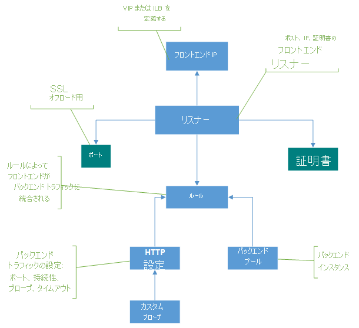

# アプリケーション ゲートウェイのコンポーネント

 アプリケーション ゲートウェイは、クライアントからの単一接続点として機能します。 アプリケーション ゲートウェイは、着信したアプリケーション トラフィックを複数のバックエンド プールに配信します (Azure VM、仮想マシン スケール セット、App Services、オンプレミス/外部サーバーなど)。 これを行うために、アプリケーション ゲートウェイでは、この記事で説明されているいくつかのコンポーネントが使用されます。

## フロントエンド IP アドレス

フロントエンド IP アドレスとは、アプリケーション ゲートウェイに関連付けられた IP アドレスのことです。 アプリケーション ゲートウェイは、パブリック IP アドレスまたはプライベート IP アドレス (あるいは両方) を持つように構成できます。 1 つのパブリック IP アドレスまたは 1 つのプライベート IP アドレスしかサポートされません。 仮想ネットワークとパブリック IP アドレスは、アプリケーション ゲートウェイと同じ場所に存在する必要があります。

フロントエンド IP アドレスは、作成された後、*リスナー*に関連付けられます。 

### 静的パブリック IP アドレスと動的パブリック IP アドレス

v1 SKU では、静的内部 IP アドレスがサポートされていますが、静的パブリック IP アドレスはサポートされていません。 アプリケーション ゲートウェイが停止され起動されると、VIP が変更される可能性があります。 アプリケーション ゲートウェイに関連付けられた DNS は、そのゲートウェイのライフサイクル全体を通して変更されません。 そのため、CNAME エイリアスを使用してアプリケーション ゲートウェイの DNS アドレスを参照することをお勧めします。

Application Gateway v2 SKU では、静的内部 IP アドレスに加え、静的パブリック IP アドレスもサポートされています。 

## リスナー

アプリケーション ゲートウェイの使用を開始する前に、リスナーを 1 つ以上追加する必要があります。 リスナーは、着信した接続要求をチェックする論理エンティティです。要求に関連付けられたプロトコル、ポート、ホスト、および IP アドレスが、リスナー構成に関連付けられたプロトコル、ポート、ホスト、および IP アドレスと一致していれば、その要求を受け入れます。 アプリケーション ゲートウェイには複数のリスナーをアタッチすることができ、それらは同じプロトコルに使用できます。 クライアントから着信した要求をリスナーが検出すると、アプリケーション ゲートウェイは、その要求を受信したリスナー用に定義された要求ルーティング規則を使用して、それらの要求をバックエンド プール内のメンバーにルーティングします。

リスナーでは、次のポートとプロトコルがサポートされます。

### ポート

これは、リスナーがクライアント要求をリッスンするポートです。 V1 SKU については 1 から 65502 まで、V2 SKU については 1 から 65199 までのポートを構成できます。

### プロトコル

アプリケーション ゲートウェイでは、次の 4 つのプロトコルがサポートされます:HTTP、HTTPS、HTTP/2、および WebSocket

HTTP プロトコルと HTTPS プロトコルについては、いずれを選択するかをリスナー構成で明示的に指定します。 [WebSocket と HTTP/2 プロトコルのサポート](https://docs.microsoft.com/azure/application-gateway/overview#websocket-and-http2-traffic)はネイティブに提供されます。 [WebSocket のサポート](https://docs.microsoft.com/azure/application-gateway/application-gateway-websocket)は既定で有効になります。 ユーザーが構成可能な、WebSocket のサポートを選択的に有効または無効にするための設定はありません。 WebSocket は HTTP リスナーと HTTPS リスナーの両方で使用できます。 HTTP/2 プロトコルのサポートを利用できるのは、アプリケーション ゲートウェイ リスナーに接続しているクライアントだけです。 バックエンド サーバー プールへの通信は、HTTP/1.1 で行われます。 既定では、HTTP/2 のサポートは無効になっています。 必要であれば、有効にすることもできます。

HTTPS リスナーは SSL 終了に使用できます。 HTTPS リスナーでは、暗号化と復号化の操作がアプリケーション ゲートウェイにオフロードされるので、Web サーバーをそれらのオーバーヘッドから開放することができます。 これにより、アプリケーションを自身のビジネス ロジックに集中させることができます。

### カスタム エラー ページ

アプリケーション ゲートウェイでは、既定のエラー ページを表示する代わりに、カスタム エラー ページを作成することができます。 カスタム エラー ページでは、独自のブランディングとレイアウトを使用することができます。 要求がバックエンドに到達できない場合に、Application Gateway はカスタム エラー ページを表示できます。 詳しくは、「[Create Application Gateway custom error pages (Application Gateway のカスタム エラー ページを作成する)](https://docs.microsoft.com/azure/application-gateway/custom-error)」をご覧ください。

### リスナーの種類

リスナーには、次の 2 つの種類があります:

- **Basic**:このタイプのリスナーは、1 つのドメイン サイトをリッスンします。この構成では、アプリケーション ゲートウェイの IP アドレスに対して 1 つの DNS マッピングが 適用されます。 アプリケーション ゲートウェイの背後に 1 つのサイトをホストする場合は、このリスナー構成が必要になります。
- **マルチサイト**:このリスナー構成は、同じアプリケーション ゲートウェイ インスタンスで複数の Web アプリケーションを構成する場合に必要になります。 これを使用すると、最大で 100 個の Web サイトを 1 つのアプリケーション ゲートウェイに追加することによって、デプロイに効率的なトポロジを構成できます。 各 Web サイトは、独自のバックエンド プールに送られるようにすることができます。 例: abc.contoso.com、xyz.contoso.com、および pqr.contoso.com という 3 つのサブドメインが、アプリケーション ゲートウェイの IP アドレスを指しているとします。 その場合は、*マルチサイト* タイプのリスナーを 3 つ作成し、各リスナーを、それぞれ対応するポートとプロトコル設定用に構成します。 詳しくは、[マルチサイト ホスティング](https://docs.microsoft.com/azure/application-gateway/application-gateway-web-app-overview)に関するページをご覧ください。

リスナーを作成したら、それを要求のルーティング規則に関連付けます。これにより、リスナーで受信された要求がバックエンドにどのようにルーティングされるかが決まります。

リスナーは、表示される順序で処理されます。 そのため、基本リスナーが着信要求と一致する場合は、基本リスナーが要求を最初に処理します。 トラフィックが正しいバックエンドにルーティングされるようにするには、基本リスナーの前にマルチサイト リスナーを構成する必要があります。

## 要求のルーティング規則

これはアプリケーション ゲートウェイの最も重要なコンポーネントです。リスナーでトラフィックがどのようにルーティングされるかは、そのリスナーに関連付けられたルーティング規則によって決まります。 この規則では、リスナー、バックエンド サーバー プール、およびバックエンド HTTP の各設定がバインドされます。 要求がリスナーによって受け入れられると、要求のルーティング規則によって、その要求がバックエンドに転送されるのか、それとも別の場所にリダイレクトされるのかが決定されます。 要求がバックエンドに転送される場合は、要求ルーティング規則により、転送先となるバックエンド サーバー プールが決定されます。 また、要求ルーティング規則では、要求のヘッダーを書き直すかどうかも決定されます。 リスナーは、1 つの規則に 1 つだけアタッチできます。

要求ルーティング規則には、次の 2 つの種類があります。

- **Basic:** 関連付けられたリスナー (例: blog.contoso.com/*) 上のすべての要求が、関連付けられた HTTP 設定を使用して、関連付けられたバックエンド プールに転送されます。
- **パスベース:** このタイプの規則では、関連付けられたリスナー上の要求を、要求内の URL に基づいて、特定のバックエンド プールにルーティングできます。 要求内の URL のパスがパスベース規則内のパス パターンと一致した場合は、その規則を使用して要求がルーティングされます。 パスのパターンは URL のパスのみに適用され、クエリ パラメーターには適用されません。 リスナー上にある要求の URL のパスが、いずれのパスベース規則とも一致しなかった場合、要求は*既定の*バックエンド プールと*既定の* HTTP 設定にルーティングされます。 詳しくは、[URL ベースのルーティング](https://docs.microsoft.com/azure/application-gateway/url-route-overview)に関する記事をご覧ください。

### リダイレクトのサポート

要求ルーティング規則では、アプリケーション ゲートウェイ上でトラフィックをリダイレクトすることもできます。 これは一般的なリダイレクト メカニズムなので、規則を使用して定義した任意のポート間とリダイレクトできます。 リダイレクトでは、別のリスナーをターゲットにする (HTTP から HTTPS への自動リダイレクトを有効化するのに便利です) か、外部サイトをターゲットにするかを選択できます。また、一時的リダイレクトか永続的リダイレクトかを選択したり、リダイレクト先の URL に URI パスとクエリ文字列を追加したりすることもできます。 詳しくは、[アプリケーション ゲートウェイでのトラフィックのリダイレクト](https://docs.microsoft.com/azure/application-gateway/redirect-overview)に関する記事をご覧ください。

#### HTTP ヘッダーを書き換える

要求ルーティング規則を使用すると、要求/応答パケットがクライアントとバックエンド プールの間を移動する間に、アプリケーション ゲートウェイを通じて、HTTP(S) 要求および応答ヘッダーを追加、削除、または更新することができます。 ヘッダーは、静的な値に設定できるだけでなく、その他のヘッダーや重要なサーバー変数に設定することもできます。 これは、いくつかの重要なユースケースを達成するのに役立ちます。たとえば、クライアントの IP アドレスを抽出したり、バックエンドに関する機密情報を削除したり、補足的なセキュリティ対策を追加したりすることができます。詳しくは、[アプリケーション ゲートウェイでの HTTP ヘッダーの書き換え](https://docs.microsoft.com/azure/application-gateway/rewrite-http-headers)に関する記事をご覧ください。

## HTTP 設定

アプリケーション ゲートウェイは、このコンポーネントで指定されたポート番号、プロトコル、およびその他の設定を使用して、(HTTP 設定がアタッチされている要求ルーティング規則で指定された) バックエンド サーバーにトラフィックをルーティングします。 アプリケーション ゲートウェイとバックエンド サーバーの間でトラフィックが暗号化されるかどうか (またそれによって、エンド ツー エンドの SSL が達成されるかどうか) は、HTTP 設定で使用されているポートやプロトコルによって決定されます。 このコンポーネントは、次の目的にも使用できます: [Cookie ベースのセッション アフィニティ](https://docs.microsoft.com/azure/application-gateway/overview#session-affinity)を使用して、ユーザー セッションを同じサーバー上に保持する。[接続のドレイン](https://docs.microsoft.com/azure/application-gateway/overview#connection-draining)を使用して、バックエンド プールのメンバーを正常に削除する。バックエンドの正常性を監視するためのカスタム プローブを関連付ける。要求のタイムアウト間隔を設定する。要求内のホスト名とパスをオーバーライドする。App Service バックエンド用のバックエンド設定をワンクリックで簡単に指定できるようにする。 

## バックエンド プール

バックエンドプールは、要求を処理するバックエンド サーバーに要求をルーティングするために使用されます。 バックエンド プールは、NIC、仮想マシン スケール セット、パブリック IP アドレス、内部 IP アドレス、FQDN、およびマルチテナント バックエンド (Azure App Service など) で構成できます。 アプリケーション ゲートウェイのバックエンド プールのメンバーは、可用性セットには関連付けられません。 アプリケーション ゲートウェイは、自身が配置されている仮想ネットワークの外部にあるインスタンスと通信できます。そのため、バックエンド プールのメンバーは、クラスターやデータ センター間をまたいでいたり、Azure の外部に存在していても、IP 接続が確立されていれば問題ありません。 内部 IP をバックエンド プールのメンバーとして使用する場合は、[VNET ピアリング](https://docs.microsoft.com/azure/virtual-network/virtual-network-peering-overview)または [VPN Gateway](https://docs.microsoft.com/azure/vpn-gateway/vpn-gateway-about-vpngateways) が必要です。 VNET ピアリングはサポート対象であり、他の仮想ネットワークにおけるトラフィックの負荷分散に適しています。 アプリケーション ゲートウェイは、ExpressRoute や VPN トンネルによって接続されていて、トラフィックが許可されていれば、オンプレミスのサーバーとも通信できます。

要求の種類ごとに、異なるバックエンド プールを作成することもできます。 たとえば、一般的な要求用のバックエンド プールを 1 つ作成したうえで、アプリケーションのマイクロ サービスに対する要求については、別のバックエンド プールを作成することもできます。

## 正常性プローブ

既定では、アプリケーション ゲートウェイはバック エンド プールにあるすべてのリソースの状態を監視して、異常とみなしたリソースをプールから自動的に削除します。 また、異常なインスタンスを継続的に監視し、それらのインスタンスが利用可能になって、正常性プローブに応答するようになった場合には、それらを正常なバックエンド プールに戻します。 既定の正常性プローブによる監視を行うだけでなく、アプリケーションの要件に合わせて正常性プローブをカスタマイズすることもできます。 カスタム プローブを使用すると、正常性監視をより細かく制御できます。 カスタム プローブを使用する場合は、プローブの間隔や、テスト対象となる URL とパスを構成することができます。また、バックエンド プール インスタンスが応答に何回失敗したら、それらを「異常」とマークするかを構成することもできます。 カスタム プローブでは、各バックエンド プールの正常性を監視するように構成することを強くお勧めします。 詳しくは、[アプリケーション ゲートウェイの正常性の監視](https://docs.microsoft.com/azure/application-gateway/application-gateway-probe-overview)に関する記事をご覧ください。

## 次の手順

アプリケーション ゲートウェイのコンポーネントについて学習した後は、次を行うことができます。
* [Azure portal を使用してアプリケーション ゲートウェイを作成する](quick-create-portal.md)
* [Azure PowerShell を使用してアプリケーション ゲートウェイを作成する](quick-create-powershell.md)
* [Azure CLI を使用してアプリケーション ゲートウェイを作成する](quick-create-cli.md)
