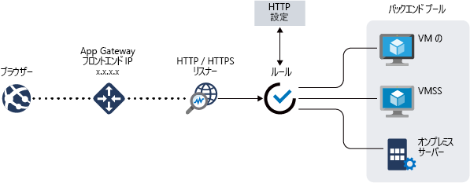

# Azure Application Gateway とは

Azure Application Gateway は、Web アプリケーションに対するトラフィックを管理できる Web トラフィック ロード バランサーです。 従来のロード バランサーはトランスポート レイヤー (OSI レイヤー 4 - TCP と UDP) で動作し、送信元 IP アドレスとポートに基づくトラフィックを送信先 IP アドレスとポートにルーティングします。

Application Gateway では、URI パスやホスト ヘッダーなど、HTTP 要求の追加属性に基づいてルーティングを決定できます。 たとえば、着信 URL に基づいてトラフィックをルーティングできます。 そのため、`/images` が着信 URL にある場合、画像用に構成された特定のサーバー セット (プールと呼ばれます) にトラフィックをルーティングできます。 `/video` が URL にある場合、そのトラフィックはビデオ用に最適化された別のプールにルーティングされます。

この種類のルーティングは、アプリケーション レイヤー (OSI レイヤー 7) の負荷分散と呼ばれます。 Azure Application Gateway は URL ベースのルーティングなどを行うことができます。

>[!NOTE]
> Azure では、ユーザーのシナリオのためにフル マネージドの負荷分散ソリューションのスイートが提供されます。 高パフォーマンス、低待ち時間のレイヤー 4 負荷分散機能が必要な場合は、「[Azure Load Balancer の概要](../load-balancer/load-balancer-overview.md)」をご覧ください グローバル DNS の負荷分散が必要な場合は、「[Traffic Manager とは](../traffic-manager/traffic-manager-overview.md)」を参照してください。 実際のエンド ツー エンドのシナリオでは、これらのソリューションを組み合わせると役に立つことがあります。
>
> Azure の負荷分散オプションの比較については、「[Azure の負荷分散オプションの概要](https://docs.microsoft.com/azure/architecture/guide/technology-choices/load-balancing-overview)」を参照してください。

Azure Application Gateway には、次の機能があります。

## Secure Sockets Layer (SSL/TLS) 終了

Application Gateway は、ゲートウェイの SSL 終了をサポートします。その後、通常、トラフィックは、暗号化されないままバックエンド サーバーに渡されます。 この機能により、Web サーバーは、負荷の大きい暗号化と復号化のオーバーヘッドから開放されます。 ただし、サーバーに対する暗号化されていない通信を利用できない場合があります。 これは、セキュリティ要件やコンプライアンス要件が理由であったり、セキュリティで保護された接続以外はアプリケーションで受け入れられないためであったりします。 このようなアプリケーションのために、Application Gateway では、エンド ツー エンドの SSL/TLS 暗号化がサポートされています。

## 自動スケール

Standard_v2 または WAF_v2 SKU の Application Gateway または WAF デプロイでは、自動スケーリングがサポートされており、トラフィック負荷パターンの変化に基づいてスケールアップまたはスケールダウンできます。 また、自動スケールにより、プロビジョニングの間にデプロイのサイズまたはインスタンスの数を選択する必要がなくなります。 Application Gateway Standard_v2 および WAF_v2 の機能の詳細については、[自動スケーリング v2 SKU](application-gateway-autoscaling-zone-redundant.md) に関するページを参照してください。

## ゾーン冗長性

Standard_v2 または WAF_v2 SKU の Application Gateway または WAF のデプロイは、複数の可用性ゾーンを対象にできるため、障害回復性が高く、ゾーンごとに個別の Application Gateway をプロビジョニングする必要がありません。

## 静的 VIP

Standard_v2 または WAF_v2 SKU のアプリケーション ゲートウェイの VIP は、静的な VIP の種類だけをサポートします。 これにより、アプリケーション ゲートウェイに関連付けられた VIP は、Application Gateway の有効期間を過ぎても変化しません。

## Web アプリケーション ファイアウォール

Web アプリケーション ファイアウォール (WAF) は、一般的な悪用や脆弱性から Web アプリケーションを一元的に保護するサービスです。 WAF は、[OWASP (Open Web Application Security Project) コア ルール セット](https://www.owasp.org/index.php/Category:OWASP_ModSecurity_Core_Rule_Set_Project) 3.1 (WAF_v2 のみ)、3.0、2.2.9 の規則に基づいています。 

Web アプリケーションが、一般的な既知の脆弱性を悪用した悪意のある攻撃の的になるケースが増えています。 よくある攻撃の例として、SQL インジェクション攻撃やクロス サイト スクリプティング攻撃が挙げられます。 アプリケーション コードでこのような攻撃を防ぐことは困難な場合があり、厳格な保守、パッチの適用、アプリケーション トポロジの多数のレイヤーの監視が必要になることもあります。 Web アプリケーション ファイアウォールを一元化することで、セキュリティの管理がはるかに簡単になり、アプリケーション管理者にとっては侵入の脅威からより確実に保護されるようになります。 また、WAF のソリューションは、1 か所に既知の脆弱性の修正プログラムを適用することで、個々の Web アプリケーションをセキュリティで保護する場合と比較して、さらに迅速にセキュリティの脅威に対応できます。 既存のアプリケーション ゲートウェイは、Web アプリケーション ファイアウォールに対応したアプリケーション ゲートウェイに簡単に変換できます。

詳細については、「[Azure Web アプリケーション ファイアウォールとは](../web-application-firewall/overview.md)」を参照してください。

## AKS のイングレス コントローラー
Application Gateway イングレス コントローラー (AGIC) を使うと、[Azure Kubernetes Service (AKS)](https://azure.microsoft.com/services/kubernetes-service/) クラスターに対するイングレスとして Application Gateway を使用できます。 

イングレス コントローラーは AKS クラスター内でポッドとして実行され、[Kubernetes イングレス リソース](https://kubernetes.io/docs/concepts/services-networking/ingress/)を消費し、そのリソースを Application Gateway 構成に変換します。これにより、ゲートウェイは、Kubernetes ポッドへのトラフィックを負荷分散できます。 イングレス コントローラーでは、Application Gateway Standard_v2 SKU および WAF_v2 SKU のみがサポートされています。 

詳細については、[Application Gateway イングレス コントローラー (AGIC)](ingress-controller-overview.md) に関するページをご覧ください。

## URL ベースのルーティング

URL パス ベースのルーティングを使用すると、要求の URL パスに基づいてバックエンド サーバー プールにトラフィックをルーティングできます。 シナリオの 1 つとして、さまざまなコンテンツ タイプの要求を異なるプールにルーティングする場合があります。

たとえば、`http://contoso.com/video/*` の要求は VideoServerPool にルーティングされ、`http://contoso.com/images/*` は ImageServerPool にルーティングされます。 一致するパス パターンがない場合は、DefaultServerPool が選択されます。

詳細については、[Application Gateway による URL ベースのルーティング](https://docs.microsoft.com/azure/application-gateway/url-route-overview)に関するページを参照してください。

## 複数サイトのホスティング

複数サイトのホストにより、同じアプリケーション ゲートウェイ インスタンスで複数の Web サイトを構成することができます。 この機能を使用すると、最大で 100 の Web サイトを 1 つのアプリケーション ゲートウェイまたは 40 を WAF (最適なパフォーマンスのため) に追加することによって、デプロイに効率的なトポロジを構成できます。 各 Web サイトは、独自のプールに送られるようにすることができます。 たとえば、アプリケーション ゲートウェイは、ContosoServerPool と FabrikamServerPool という 2 つのサーバー プールから `contoso.com` と `fabrikam.com` のトラフィックを処理できます。

`http://contoso.com` の要求は ContosoServerPool にルーティングされ、`http://fabrikam.com` は FabrikamServerPool にルーティングされます。

同様に、同じ親ドメインの 2 つのサブドメインも、同じアプリケーション ゲートウェイ デプロイでホストすることができます。 サブドメインを使用する例としては、単一のアプリケーション ゲートウェイ デプロイ上でホストされる `http://blog.contoso.com` 、 `http://app.contoso.com` などがあります。

詳細については、[Application Gateway による複数サイトのホスト](https://docs.microsoft.com/azure/application-gateway/multiple-site-overview)に関するページを参照してください。

## リダイレクト

HTTP を HTTPS に自動的にリダイレクトして、アプリケーションとユーザーの間のすべての通信が暗号化されたパスで行われるようにすることは、多くの Web アプリケーションでよくあるシナリオです。

これまでは、HTTP で受信した要求を HTTPS にリダイレクトすることが唯一の目的である専用のプールを作成する手法を使う場合がありました。 Application Gateway は、Application Gateway 上でトラフィックをリダイレクトする機能をサポートしています。 これにより、アプリケーションの構成が簡単になり、リソースの使用が最適化され、グローバルなリダイレクトやパスに基づくリダイレクトなどの新しいリダイレクト シナリオがサポートされるようになります。 Application Gateway のリダイレクトのサポートは、HTTP から HTTPS へのリダイレクトだけではありません。 これは一般的なリダイレクト メカニズムなので、規則を使用して定義した任意のポート間とリダイレクトできます。 同様に、外部サイトへのリダイレクトもサポートします。

Application Gateway のリダイレクトのサポートでは、次の機能が提供されます。

- Gateway 上のあるポートから別のポートへのグローバルなリダイレクト。 これにより、サイトでの HTTP から HTTPS へのリダイレクトが可能になります。
- パスに基づくリダイレクト。 このタイプのリダイレクトを使うと、特定のサイト領域でのみ HTTP から HTTPS へのリダイレクトが可能になります (たとえば、`/cart/*` で示されたショッピング カート領域など)。
- 外部サイトへのリダイレクト

詳細については、Application Gateway による[トラフィックのリダイレクト](https://docs.microsoft.com/azure/application-gateway/redirect-overview)に関するページを参照してください。

## セッション アフィニティ

Cookie ベースのセッション アフィニティ機能は、同じサーバー上にユーザー セッションを保持する場合に便利です。 ゲートウェイで管理される Cookie を使用すると、Application Gateway は、ユーザー セッションの後続のトラフィックを、処理のために同じサーバーに送ることができます。 この機能は、ユーザー セッションのためにセッションの状態をサーバー上でローカルに保存する場合に重要です。

## Websocket と HTTP/2 トラフィック

Application Gateway は、WebSocket および HTTP/2 プロトコルをネイティブにサポートしています。 ユーザーが構成可能な、WebSocket のサポートを選択的に有効または無効にするための設定はありません。

WebSocket および HTTP/2 プロトコルによって、長時間実行されている TCP 接続上でサーバーとクライアント間の全二重通信が可能になります。 この機能により、HTTP ベースの実装では必須だったポーリングを使用することなく、Web サーバーとクライアントの間により対話的な双方向通信が可能になります。 これらのプロトコルは、HTTP とは異なってオーバーヘッドが少なく、複数の要求や応答で同じ TCP 接続を再利用できるため、リソースをより効率的に使用できます。 これらのプロトコルは、従来の HTTP ポート 80 および 443 上で動作するよう設計されています。

詳細については、[WebSocket のサポート](https://docs.microsoft.com/azure/application-gateway/application-gateway-websocket)と [HTTP/2 のサポート](https://docs.microsoft.com/azure/application-gateway/configuration-overview#http2-support)に関するページを参照してください。

## 接続のドレイン

接続のドレインを使用すると、計画的なサービスの更新中にバックエンド プール メンバーを正常に削除することができます。 この設定は、バックエンド http 設定を通じて有効にされ、ルールの作成中にバックエンド プールのすべてのメンバーに適用することができます。 Application Gateway が有効になると、バックエンド プールのすべての登録解除インスタンスが新しい要求を受け取らなくなり、既存の要求は構成された制限時間内に完了するようになります。 これは、ユーザーの構成変更によってバックエンド プールから明示的に削除されたバックエンド インスタンスと、正常性プローブの判断によって異常であるとレポートされたバックエンド インスタンスの両方に適用されます。 これに対する唯一の例外は、ゲートウェイによって管理されるセッション アフィニティのために登録を解除するインスタンス (明示的に登録が解除されています) 宛ての要求です。これらは、登録を解除するインスタンスによって引き続きプロキシ処理されます。

詳細については、「[アプリケーション ゲートウェイ構成の概要](https://docs.microsoft.com/azure/application-gateway/configuration-overview#connection-draining)」の「接続のドレイン」セクションを参照してください。

## カスタム エラー ページ

Application Gateway では、既定のエラー ページを表示する代わりに、カスタム エラー ページを作成することができます。 カスタム エラー ページでは、独自のブランディングとレイアウトを使用することができます。

詳細については、[カスタム エラー](custom-error.md)に関するページを参照してください。

## HTTP ヘッダーを書き換える

クライアントとサーバーは、HTTP ヘッダーを使用して、要求または応答に追加の情報を渡すことができます。 これらの HTTP ヘッダーの書き換えによって、次のようないくつかの重要なシナリオを実現できます。

- HSTS/ X-XSS-Protection などのセキュリティ関連ヘッダー フィールドを追加する。
- 機密情報が漏れる可能性がある応答ヘッダー フィールドを削除する。
- X-Forwarded-For ヘッダーからポート情報を削除する。

Application Gateway では、要求/応答パケットがクライアントとバックエンド プールの間を移動する間に、HTTP 要求および応答ヘッダーを追加、削除、または更新する機能をサポートします。 また、条件を追加して、特定の条件が満たされた場合にのみ特定のヘッダーが書き換えられるようにする機能も提供されます。

詳細については、[HTTP ヘッダーの書き換え](rewrite-http-headers.md)に関するページを参照してください。

## サイズ変更

Application Gateway Standard_v2 および WAF_v2 SKU は、自動スケーリング用、または固定サイズ デプロイ用に構成できます。 これらの SKU では、異なるインスタンスのサイズは提供されません。 v2 のパフォーマンスと料金の詳細については、[v2 SKU の自動スケーリング](https://docs.microsoft.com/azure/application-gateway/application-gateway-autoscaling-zone-redundant#pricing)に関するページをご覧ください。

現在、Application Gateway の Standard および WAF SKU は、次の 3 つのサイズで提供されています。**Small**、**Medium**、**Large** の 3 つのサイズで提供されています。 Small サイズのインスタンスは、開発用およびシナリオのテスト用です。

アプリケーション ゲートウェイの制限の詳細な一覧については、[Application Gateway サービスの制限](../azure-resource-manager/management/azure-subscription-service-limits.md?toc=%2fazure%2fapplication-gateway%2ftoc.json#application-gateway-limits)に関するページをご覧ください。

次の表では、SSL オフロードが有効になっているアプリケーション ゲートウェイ v1 インスタンスごとにパフォーマンス スループットの平均値を示します。

| バックエンド ページの平均応答サイズ | Small | Medium | Large |
| --- | --- | --- | --- |
| 6 KB |7.5 Mbps |13 Mbps |50 Mbps |
| 100 KB |35 Mbps |100 Mbps |200 Mbps |

> [!NOTE]
> これらの値は、アプリケーション ゲートウェイ スループットのおおよその値です。 実際のスループットは、平均ページ サイズ、バックエンド インスタンスの場所、ページの処理時間など、さまざまな環境の違いによって異なります。 パフォーマンス面の正確な数値は、ご自身でテストを実施のうえご確認ください。 ここに挙げた数値は、容量計画の参考とすることを目的として記載したものにすぎません。

## 次のステップ

要件と環境に応じて、Azure Portal、Azure PowerShell、または Azure CLI のいずれかを使用してテスト Application Gateway を作成できます。

- [クイック スタート: Azure Application Gateway による Web トラフィックのルーティング - Azure portal](quick-create-portal.md)
- [クイック スタート: Azure Application Gateway による Web トラフィックのルーティング - Azure PowerShell](quick-create-powershell.md)
- [クイック スタート: Azure Application Gateway による Web トラフィックのルーティング - Azure CLI](quick-create-cli.md)
