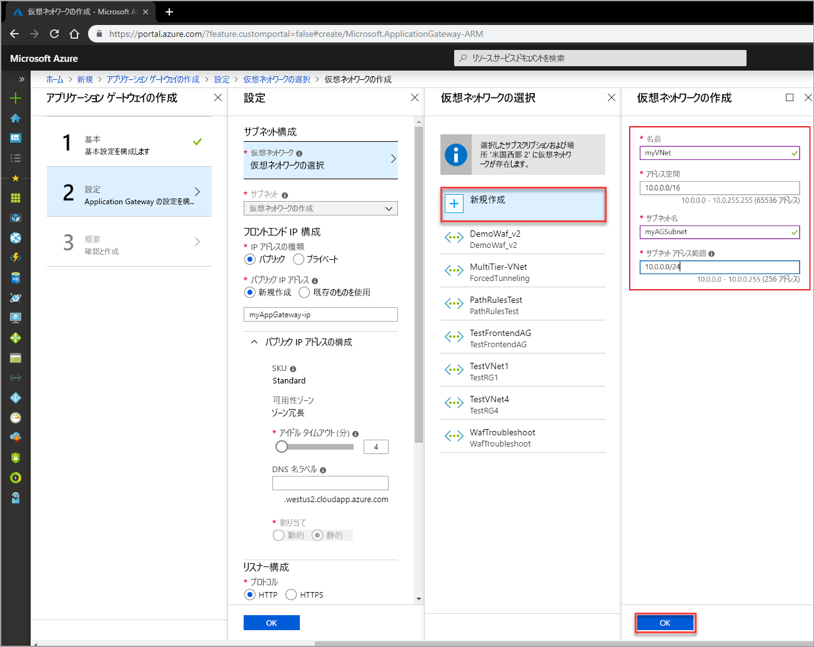

# <a name="quickstart-direct-web-traffic-with-azure-application-gateway---azure-portal"></a>クイック スタート: Azure Application Gateway による Web トラフィックのルーティング - Azure portal

このクイック スタートでは、Azure portal を使用して、アプリケーション ゲートウェイを作成する方法を示します。  アプリケーション ゲートウェイを作成してから、それをテストして正しく動作していることを確認します。 Azure Application Gateway では、ポートにリスナーを割り当て、ルールを作成し、バックエンド プールにリソースを追加することによって、お客様のアプリケーション Web トラフィックを特定のリソースに転送します。 わかりやすくするために、この記事では、パブリック フロントエンド IP、このアプリケーション ゲートウェイで単一サイトをホストするための基本リスナー、バックエンド プールに使用される 2 つの仮想マシン、および基本要求ルーティング規則を使用する簡単な設定を使用します。

Azure サブスクリプションをお持ちでない場合は、開始する前に [無料アカウント](https://azure.microsoft.com/free/?WT.mc_id=A261C142F) を作成してください。


[!INCLUDE [updated-for-az](../../includes/updated-for-az.md)]

## <a name="sign-in-to-azure"></a>Azure へのサインイン

Azure アカウントで [Azure Portal](https://portal.azure.com) にサインインします。

## <a name="create-an-application-gateway"></a>アプリケーション ゲートウェイの作成

お客様が作成するリソースの間で Azure による通信が行われるには、仮想ネットワークが必要です。 新しい仮想ネットワークを作成することも、既存の仮想ネットワークを使用することもできます。 この例では、新しい仮想ネットワークを作成します。 仮想ネットワークは、アプリケーション ゲートウェイを作成するときに同時に作成できます。 Application Gateway インスタンスは、個別のサブネットに作成されます。 この例では 2 つのサブネットを作成します。1 つはアプリケーション ゲートウェイ用で、もう 1 つはバックエンド サーバー用です。

1. Azure portal の左側のメニューにある **[リソースの作成]** を選択します。 **[新規作成]** ウィンドウが表示されます。

2. **[ネットワーク]** を選択し、**おすすめ**のリストで **[Application Gateway]** を選択します。

### <a name="basics-page"></a>基本ページ

1. **[基本]** ページで、次のアプリケーション ゲートウェイの設定に以下の値を入力します。

   - **[名前]**:アプリケーション ゲートウェイの名前として「*myAppGateway*」と入力します。
   - **[リソース グループ]**:リソース グループには、**myResourceGroupAG** を選択します。 存在しない場合は、**[新規作成]** を選択して作成します。

     

2. 他の設定は既定値をそのまま使用し、**[OK]** を選択します。

### <a name="settings-page"></a>[設定] ページ

1. **[設定]** ページの **[サブネット構成]** で、**[仮想ネットワークの選択]** を選択します。 <br>

2. **[仮想ネットワークの選択]** ページで、**[新規作成]** を選択してから、次の仮想ネットワークの設定に値を入力します。

   - **[名前]**:仮想ネットワークの名前として「*myVNet*」と入力します。

   - **[アドレス空間]**: 仮想ネットワークのアドレス空間として「*10.0.0.0/16*」と入力します。

   - **[サブネット名]**: サブネットの名前として「*myAGSubnet*」と入力します。<br>アプリケーション ゲートウェイ サブネットには、アプリケーション ゲートウェイのみを含めることができます。 その他のリソースは許可されません。

   - **[サブネットのアドレス範囲]**: サブネットのアドレス範囲として「*10.0.0.0/24*」と入力します。

     

3. **[OK]** を選択して、**[設定]** ページに戻ります。

4. **[フロントエンド IP 構成の削除]** を選択します。 **[フロントエンド IP 構成]** で、**[IP アドレスの種類]** が **[パブリック]** に設定されていることを確認します。 **[パブリック IP アドレス]** で、**[新規作成]** が選択されていることを確認します｡ <br>ユース ケースに従って、フロントエンド IP を [パブリック] または [プライベート] に設定できます。 この例では、パブリック フロントエンド IP を選択します。 

5. パブリック IP アドレス名として「*myAGPublicIPAddress*」と入力します。 

6. 他の設定は既定値をそのまま使用し、**[OK]** を選択します。<br>この記事ではわかりやすくするために既定値を選択しますが、ユース ケースに応じて他の設定でカスタム値を構成することができます 

### <a name="summary-page"></a>概要ページ

**[概要]** ページで設定を確認し、**[OK]** を選択して、仮想ネットワーク、パブリック IP アドレス、アプリケーション ゲートウェイを作成します。 Azure によるアプリケーション ゲートウェイの作成には数分かかる場合があります。 次のセクションに進む前に、デプロイが正常に完了するまで待機します。

## <a name="add-backend-pool"></a>バックエンド プールを追加する

バックエンドプールは、要求を処理するバックエンド サーバーに要求をルーティングするために使用されます。 バックエンド プールは、NIC、仮想マシン スケール セット、パブリック IP、内部 IP、完全修飾ドメイン名 (FQDN)、および Azure App Service などのマルチテナント バックエンドで構成できます。 バックエンド プールにバックエンド ターゲットを追加する必要があります。

この例では、ターゲットのバックエンドとして仮想マシンを使用します。 既存の仮想マシンを使用することも、新しい仮想マシンを作成することもできます。 この例では、Azure によってアプリケーション ゲートウェイのバックエンド サーバーとして使用される 2 つの仮想マシンを作成します。 そのためには、以下の手順を実行します。

1. 新しいサブネット *myBackendSubnet* を作成します。ここに、新しい VM が作成されます。 
2. 2 つの新しい VM、*myVM* と *myVM2* を作成し、バックエンド サーバーとして使用します。
3. IIS を仮想マシンにインストールして、アプリケーション ゲートウェイが正常に作成されたことを確認します。
4. バックエンド サーバーをバックエンド プールに追加します。

### <a name="add-a-subnet"></a>サブネットの追加

以下の作業に従って、お客様が作成した仮想ネットワークにサブネットを追加します。

1. Azure portal の左側のメニューにある **[すべてのリソース]** を選択し、検索ボックスに「*myVNet*」と入力して、検索結果から **[myVNet]** を選択します。

2. 左側のメニューから **[サブネット]** を選択し、**+ [サブネット]** を選択します。 

   

3. **[サブネットの追加]** ページで、サブネットの**名前**として「*myBackendSubnet*」と入力し、**[OK]** を選択します。

### <a name="create-a-virtual-machine"></a>仮想マシンの作成

1. Azure portal で、**[リソースの作成]** を選択します。 **[新規作成]** ウィンドウが表示されます。
2. **[コンピューティング]** を選択し、**おすすめ**のリストで **[Windows Server 2016 Datacenter]** を選択します。 **[仮想マシンの作成]** ページが表示されます。<br>Application Gateway は、バックエンド プールで使用されているあらゆる種類の仮想マシンにトラフィックをルートできます。 この例では、Windows Server 2016 Datacenter を使用します。
3. **[基本]** タブで、次の仮想マシンの設定に以下の値を入力します。

    - **[リソース グループ]**:リソース グループ名には、**myResourceGroupAG** を選択します。
    - **[仮想マシン名]**: 仮想マシンの名前として「*myVM*」と入力します。
    - **[ユーザー名]**: 管理者のユーザー名として「*azureuser*」と入力します。
    - **Password**:管理者パスワードとして「*Azure123456!*」と入力します 。
4. 他の既定値をそのまま使用し、**[Next: ディスク]** を選択します。  
5. **[ディスク]** タブの既定値をそのまま使用し、**[Next: Networking]\(次へ : ネットワーク\)** を選択します。
6. **[ネットワーク]** タブで、**[仮想ネットワーク]** に **myVNet** が選択されていること、および **[サブネット]** が **myBackendSubnet** に設定されていることを確認します。 他の既定値をそのまま使用し、**[Next: 管理]** を選択します。<br>Application Gateway は仮想ネットワークの外部にあるインスタンスと通信できますが、IP 接続があることを確認する必要があります。 
7. **[管理]** タブで、**[ブート診断]** を **[オフ]** に設定します。 他の既定値をそのまま使用し、**[確認および作成]** を選択します。
8. **[確認および作成]** タブで、設定を確認し、検証エラーを修正してから、**[作成]** を選択します。
9. 仮想マシンの作成が完了するのを待って先に進みます。

### <a name="install-iis-for-testing"></a>テスト用の IIS のインストール

この例では、Azure がアプリケーションゲートウェイを正常に作成したことを確認する目的でのみ、仮想マシンに IIS をインストールします。 

1. [Azure PowerShell](https://docs.microsoft.com/azure/cloud-shell/quickstart-powershell)を開きます。 そのためには、Azure portal の上部のナビゲーション バーで **[Cloud Shell]** を選択して、ドロップダウン リストで **[PowerShell]** を選択します。 

    

2. 次のコマンドを実行して、IIS を仮想マシンにインストールします。 

    ```azurepowershell-interactive
    Set-AzVMExtension `
      -ResourceGroupName myResourceGroupAG `
      -ExtensionName IIS `
      -VMName myVM `
      -Publisher Microsoft.Compute `
      -ExtensionType CustomScriptExtension `
      -TypeHandlerVersion 1.4 `
      -SettingString '{"commandToExecute":"powershell Add-WindowsFeature Web-Server; powershell Add-Content -Path \"C:\\inetpub\\wwwroot\\Default.htm\" -Value $($env:computername)"}' `
      -Location EastUS
    ```

3. 2 番目の仮想マシンを作成し、お客様が先ほど完了した手順を使用して IIS をインストールします。 仮想マシンの名前と、**Set-AzVMExtension** コマンドレットの **VMName** 設定には、*myVM2* を使用します。

### <a name="add-backend-servers-to-backend-pool"></a>バックエンド プールヘのバックエンド サーバーの追加

1. **[すべてのリソース]** を選択し、**myAppGateway** を選択します。

2. 左側のメニューで **[バックエンド プール]** を選択します。 アプリケーション ゲートウェイを作成したときに、既定のプール **appGatewayBackendPool** が Azure によって自動的に作成されました。 

3. **[appGatewayBackendPool]** を選択します。

4. **[ターゲット]** の下のドロップダウン リストで **[仮想マシン]** を選択します。

5. **[仮想マシン]** と **[ネットワーク インターフェイス]** で、**myVM** 仮想マシンおよび **myVM2** 仮想マシンとそれらの関連するネットワーク インターフェイスをドロップダウン リストから選択します。

    

6. **[保存]** を選択します。

## <a name="test-the-application-gateway"></a>アプリケーション ゲートウェイのテスト

IIS はアプリケーション ゲートウェイを作成するのに必要ではありませんが、このクイック スタートでは、Azure によってアプリケーション ゲートウェイが正常に作成されたかどうかを確認するためにインストールしました。 IIS を使用してアプリケーション ゲートウェイをテストします。

1. **[概要]** ページでアプリケーション ゲートウェイのパブリック IP アドレスを見つけます。または、**[すべてのリソース]** を選択して、検索ボックスに *myAGPublicIPAddress* と入力し、検索結果でそれを選択することができます。 Azure によって、**[概要]** ページにパブリック IP アドレスが表示されます。
2. そのパブリック IP アドレスをコピーし、ブラウザーのアドレス バーに貼り付けます。
3. 応答を確認します。 応答が有効であれば、アプリケーション ゲートウェイが正常に作成され、バックエンドと正常に接続できることが保証されます。


## <a name="clean-up-resources"></a>リソースのクリーンアップ

アプリケーション ゲートウェイと共に作成したリソースが不要になったら、リソース グループを削除します。 リソース グループを削除することで、アプリケーション ゲートウェイとそのすべての関連リソースも削除します。 

リソース グループを削除するには:
1. Azure portal の左側のメニューにある **[リソース グループ]** を選択します。
2. **[リソース グループ]** ページで、リストの **myResourceGroupAG** を探して選択します。
3. **[リソース グループ] ページ**で、**[リソース グループの削除]** を選択します。
4. **[TYPE THE RESOURCE GROUP NAME]\(リソース グループ名を入力してください\)** に「*myResourceGroupAG*」と入力し、**[削除]** を選択します。

## <a name="next-steps"></a>次の手順

> [!div class="nextstepaction"]
> [Azure CLI を使用してアプリケーション ゲートウェイで Web トラフィックを管理する](./tutorial-manage-web-traffic-cli.md)
