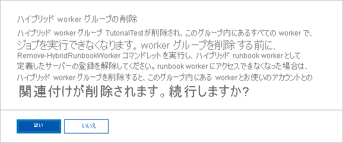

# <a name="automate-resources-in-your-datacenter-or-cloud-by-using-hybrid-runbook-worker"></a>Hybrid Runbook Worker を使用してデータ センターまたはクラウドのリソースを自動化する

Azure Automation の Runbook は Azure クラウド プラットフォームで実行されるため、他のクラウドやオンプレミス環境のリソースにはアクセスできないことがあります。 Azure Automation の Hybrid Runbook Worker 機能を使う、ロールをホスティングしているコンピューター上で環境内のリソースに対して Runbook を直接実行して、これらのローカル リソースを管理できます。 Runbook は Azure Automation で格納および管理された後、1 つ以上の割り当て済みコンピューターに配信されます。

次の図にこの機能を示します。


各 Hybrid Runbook Worker は、エージェントのインストール時に指定する Hybrid Runbook Worker グループのメンバーです。 グループには単一のエージェントを含めることができますが、高可用性グループに複数のエージェントをインストールすることができます。

Hybrid Runbook Worker で Runbook を開始する場合は、実行されるグループを指定します。 グループの各ワーカーは、実行可能なジョブがあるかどうかを確認するために Azure Automation をポーリングします。 ジョブが実行可能な場合、ジョブに最初に到達した worker がこれを実行します。 ジョブ キューの処理時間は、Hybrid Worker のハードウェア プロファイルと負荷によって異なります。 特定の worker を指定することはできません。 Hybrid Runbook Worker では、Azure サンドボックスが持つ制限の多くが共有されません。 ディスク領域、メモリ、ネットワーク ソケットに関する制限が異なります。 Hybrid Runbook Worker の動作は、Hybrid Runbook Worker 自体のリソースによってのみ制限されます。 また、Hybrid Runbook Worker では、Azure サンドボックスが持つ 180 分の [fair share](automation-runbook-execution.md#fair-share) 時間制限は共有されません。 Azure サンドボックスと Hybrid Runbook Worker のサービス制限について詳しくは、ジョブ[制限](../azure-subscription-service-limits.md#automation-limits)に関するページをご覧ください。

> [!NOTE]
> Hybrid Runbook Worker は、Azure China ではサポートされていません。

## <a name="install-a-hybrid-runbook-worker"></a>Hybrid Runbook Worker をインストールする

Hybrid Runbook worker をインストールするプロセスは OS によって異なります。 次の表には、インストールで使用できる方法のリンクが含まれています。

Windows Hybrid Runbook Worker をインストールして構成するには、2 つの方法を使用できます。 Automation Runbook を使用して、Windows コンピューターを構成するプロセスを完全に自動化する方法をお勧めします。 2 番目の方法は、ロールを手動でインストールして構成する手順を段階的に追うものです。 Linux マシンでは、コンピューターにエージェントをインストールする Python スクリプトを実行します。

|OS  |デプロイのタイプ  |
|---------|---------|
|Windows     | [PowerShell](automation-windows-hrw-install.md#automated-deployment)<br>[手動](automation-windows-hrw-install.md#manual-deployment)        |
|Linux     | [Python](automation-linux-hrw-install.md#installing-a-linux-hybrid-runbook-worker)        |

> [!NOTE]
> Hybrid Runbook Worker ロールをサポートするサーバーの構成を Desired State Configuration (DSC) を使用して管理するには、サーバーを DSC ノードとして追加する必要があります。 DSC による管理のためのサーバーのオンボードの詳細については、「[Azure Automation DSC による管理のためのマシンのオンボード](automation-dsc-onboarding.md)」を参照してください。
>
>[[更新管理ソリューション]](automation-update-management.md) を有効にすると、このソリューションに含まれている Runbook をサポートするために、Azure Log Analytics ワークスペースに接続されたコンピューターはすべて Hybrid Runbook Worker として自動的に構成されます。 ただし、このコンピューターは、Automation アカウントで既に定義した可能性のあるハイブリッド worker グループには登録されません。 このソリューションと Hybrid Runbook Worker グループ メンバーシップの両方に同じアカウントを使用していれば、このコンピューターを Automation アカウントの Hybrid Runbook Worker に追加して Automation Runbook をサポートできます。 この機能は、Hybrid Runbook Worker のバージョン 7.2.12024.0 に追加されました。

Hybrid Runbook Worker のデプロイを開始する前に、[ネットワークの計画に関する情報](#network-planning)を確認してください。 worker が正常にデプロイされたら、「[Hybrid Runbook Worker での Runbook の実行](automation-hrw-run-runbooks.md)」を参照して、オンプレミスのデータセンターや他のクラウド環境のプロセスを自動化するように Runbook を構成する方法を確認します。

## <a name="remove-a-hybrid-runbook-worker"></a>Hybrid Runbook Worker を削除する

要件に応じて、グループから 1 つ以上の Hybrid Runbook Worker を削除したり、グループを削除することができます。 オンプレミス コンピューターから Hybrid Runbook Worker を削除するには、次の手順を使用します。

1. Azure Portal で、Automation アカウントに移動します。
2. **[アカウント設定]** で、**[キー]** を選択し、**[URL]** と **[プライマリ アクセス キー]** の値をメモします。 この情報は、次の手順に必要です。

### <a name="windows"></a>Windows

管理者モードで PowerShell セッションを開き、次のコマンドを実行します。 削除処理の詳細なログを取得するには、 **-Verbose** スイッチを使用します。

```powershell-interactive
Remove-HybridRunbookWorker -url <URL> -key <PrimaryAccessKey>
```

ハイブリッド Worker グループから古いコンピューターを削除するには、省略可能な `machineName` パラメーターを使用します。

```powershell-interactive
Remove-HybridRunbookWorker -url <URL> -key <PrimaryAccessKey> -machineName <ComputerName>
```

### <a name="linux"></a>Linux

Hybrid Runbook Worker で `ls /var/opt/microsoft/omsagent` コマンドを使用して、ワークスペース ID を取得できます。 ディレクトリ内に、名前がワークスペース ID であるフォルダーがあります。

```bash
sudo python onboarding.py --deregister --endpoint="<URL>" --key="<PrimaryAccessKey>" --groupname="Example" --workspaceid="<workspaceId>"
```

> [!NOTE]
> このコードによってコンピューターから Microsoft Monitoring Agent が削除されることはありません。Hybrid Runbook Worker ロールの機能と構成のみが削除されます。

## <a name="remove-a-hybrid-worker-group"></a>ハイブリッド worker グループを削除する

グループを削除するには、まず、先ほどの手順を使用して、グループのメンバーであるすべてのコンピューターから Hybrid Runbook Worker を削除する必要があります。 その後、次の手順を使用してグループを削除します。

1. Azure ポータルで Automation アカウントを開きます。
2. **[プロセス オートメーション]** で **[ハイブリッド Worker グループ]** を選択します。 削除するグループを選択します。 そのグループの [プロパティ] ページが表示されます。

   ![[プロパティ] ページ](media/automation-hybrid-runbook-worker/automation-hybrid-runbook-worker-group-properties.png)

3. 選択したグループの [プロパティ] ページで、**[削除]** を選択します。 メッセージによって、この操作の確認が求められます。 操作を続行する場合は、**[はい]** を選択します。

   

   このプロセスが完了するまでに数秒かかる場合があります。 進行状況は、メニューの **[通知]** で追跡できます。

## <a name="network-planning"></a>ネットワークを構成する

### <a name="hybrid-worker-role"></a>Hybrid Worker ロール

Hybrid Runbook Worker が Azure Automation に接続して登録するには、このセクションで説明されているポート番号と URL へのアクセスが必要です。 このアクセスは、Azure Monitor ログに接続するために [Microsoft Monitoring Agent に必要なポートと URL](../azure-monitor/platform/agent-windows.md) に加えて必要です。

[!INCLUDE [azure-monitor-log-analytics-rebrand](../../includes/azure-monitor-log-analytics-rebrand.md)]

エージェントと Azure Automation サービスの間の通信にプロキシ サーバーを使用する場合は、適切なリソースにアクセスできることを確認してください。 Hybrid Runbook Worker および Automation サービスからの要求のタイムアウトは 30 秒です。 3 回試行した後の要求は失敗します。 ファイアウォールを使用してインターネットへのアクセスを制限する場合は、アクセスを許可するようにファイアウォールを構成する必要があります。 Log Analytics ゲートウェイをプロキシとして使用した場合、ハイブリッド worker 用に構成されていることを確認してください。 これを行う方法の詳細については、[Automation Hybrid Worker に向けた Log Analytics ゲートウェイの構成](https://docs.microsoft.com/azure/log-analytics/log-analytics-oms-gateway)に関するセクションを参照してください。

Hybrid Runbook Worker ロールが Automation と通信するには、次のポートと URL が必要です。

* ポート: 送信インターネット アクセスには TCP 443 のみが必要です。
* グローバル URL: *.azure-automation.net
* 米国バージニア州 (政府機関向け) のグローバル URL: *.azure automation.us
* エージェント サービス: https://\<workspaceId\>.agentsvc.azure-automation.net

例外を定義するときは、一覧に示されているアドレスを使用することをお勧めします。 [Microsoft Azure データセンターの IP 範囲](https://www.microsoft.com/download/details.aspx?id=41653)の IP アドレスをダウンロードできます。 このファイルは毎週更新され、現在デプロイされている範囲と今後変更される IP 範囲が反映されます。

特定のリージョンに対して定義された Automation アカウントがある場合は、そのリージョン データセンターへの通信を制限できます。 次の表は、リージョンごとの DNS レコードを示しています。

| **[リージョン]** | **DNS レコード** |
| --- | --- |
| 米国中西部 | wcus-jobruntimedata-prod-su1.azure-automation.net</br>wcus-agentservice-prod-1.azure-automation.net |
| 米国中南部 |scus-jobruntimedata-prod-su1.azure-automation.net</br>scus-agentservice-prod-1.azure-automation.net |
| 米国東部 2 |eus2-jobruntimedata-prod-su1.azure-automation.net</br>eus2-agentservice-prod-1.azure-automation.net |
| 米国西部 2 |wus2-jobruntimedata-prod-su1.azure-automation.net</br>wus2-agentservice-prod-1.azure-automation.net |
| カナダ中部 |cc-jobruntimedata-prod-su1.azure-automation.net</br>cc-agentservice-prod-1.azure-automation.net |
| 西ヨーロッパ |we-jobruntimedata-prod-su1.azure-automation.net</br>we-agentservice-prod-1.azure-automation.net |
| 北ヨーロッパ |ne-jobruntimedata-prod-su1.azure-automation.net</br>ne-agentservice-prod-1.azure-automation.net |
| 東南アジア |sea-jobruntimedata-prod-su1.azure-automation.net</br>sea-agentservice-prod-1.azure-automation.net|
| インド中部 |cid-jobruntimedata-prod-su1.azure-automation.net</br>cid-agentservice-prod-1.azure-automation.net |
| 東日本 |jpe-jobruntimedata-prod-su1.azure-automation.net</br>jpe-agentservice-prod-1.azure-automation.net |
| オーストラリア東部 |ae-jobruntimedata-prod-su1.azure-automation.net</br>ae-agentservice-prod-1.azure-automation.net |
| オーストラリア東南部 |ase-jobruntimedata-prod-su1.azure-automation.net</br>ase-agentservice-prod-1.azure-automation.net |
| 英国南部 | uks-jobruntimedata-prod-su1.azure-automation.net</br>uks-agentservice-prod-1.azure-automation.net |
| 米国政府バージニア州 | usge-jobruntimedata-prod-su1.azure-automation.us<br>usge-agentservice-prod-1.azure-automation.us |

リージョン名の代わりにリージョン IP アドレスの一覧を入手するには、Microsoft ダウンロード センターから [Azure データセンター IP アドレス](https://www.microsoft.com/download/details.aspx?id=41653) XML ファイルをダウンロードします。

> [!NOTE]
> Azure データセンター IP アドレス XML ファイルには、Microsoft Azure データセンターで使用されている IP アドレス範囲が一覧表示されています。 このファイルには、計算、SQL、およびストレージの範囲が含まれています。
>
>更新されたファイルが毎週投稿されます。 このファイルには、現在デプロイされている範囲と、次に予定されている IP 範囲の変更が反映されています。 このファイルに現れる新しい範囲は、少なくとも 1 週間はデータセンターで使用されません。
>
> 新しい XML ファイルを毎週ダウンロードすることをお勧めします。 その後、Azure で実行されているサービスを正しく識別するようにサイトを更新します。 Azure ExpressRoute ユーザーは、このファイルが、毎月第 1 週に Azure 領域の Border Gateway Protocol (BGP) アドバタイズを更新するために使用されることに注意してください。

### <a name="update-management"></a>更新管理

更新管理には、Hybrid Runbook Worker に必要となる標準アドレスとポートに加えて、次のアドレスが特に必要となります。 このアドレスへの通信は、ポート 443 を使用して行われます。

|Azure Public  |Azure Government  |
|---------|---------|
|*.ods.opinsights.azure.com     |*.ods.opinsights.azure.us         |
|*.oms.opinsights.azure.com     | *.oms.opinsights.azure.us        |
|*.blob.core.windows.net|*.blob.core.usgovcloudapi.net|

## <a name="next-steps"></a>次の手順

* オンプレミスのデータセンターや他のクラウド環境のプロセスを自動化するように Runbook を構成する方法を学習するには、「[Hybrid Runbook Worker での Runbook の実行](automation-hrw-run-runbooks.md)」をご覧ください。
* Hybrid Runbook Worker をトラブルシューティングする方法については、[Hybrid Runbook Worker のトラブルシューティング](troubleshoot/hybrid-runbook-worker.md#general)に関する記事を参照してください。

