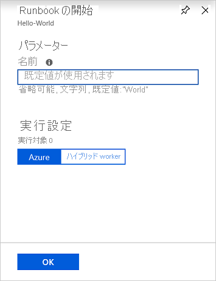

# <a name="create-an-azure-automation-runbook"></a>Azure Automation Runbook を作成する

Azure を使用して Azure Automation Runbook を作成することができます。 この方法では、ブラウザーベースのユーザー インターフェイスで Automation Runbook を作成できます。 このクイックスタートでは、Automation PowerShell Runbook の作成、編集、テスト、公開の手順について説明します。

Azure サブスクリプションをお持ちでない場合は、開始する前に[無料の Azure アカウント](https://azure.microsoft.com/free/?WT.mc_id=A261C142F)を作成してください。

## <a name="sign-in-to-azure"></a>Azure へのサインイン

[https://portal.azure.com](https://portal.azure.com ) で Azure にサインインします

## <a name="create-runbook"></a>Runbook を作成する

まず Runbook を作成します。 このクイックスタートで作成されるサンプル Runbook は、既定で `Hello World` を出力します。

1. Automation アカウントを開きます。

1. **[プロセス オートメーション]** の **[Runbook]** をクリックします。 Runbook の一覧が表示されます。

1. 一覧の上部にある **[Runbook の作成]** ボタンをクリックします。

1. Runbook の **[名前]** に「Hello-World」と入力し、 **[Runbook の種類]** に **[PowerShell]** を選択します。 **Create** をクリックしてください。

   

1. Runbook が作成され、 **[PowerShell Runbook の編集]** ページが開きます。

    

1. 以下のコードを編集ウィンドウに入力するか貼り付けます。 その結果、既定値が "World" の Name というオプションの入力パラメーターが作成され、その入力値を使用する文字列が出力されます。

   ```powershell-interactive
   param
   (
       [Parameter(Mandatory=$false)]
       [String] $Name = "World"
   )

   "Hello $Name!"
   ```

1. **[保存]** をクリックして、Runbook の下書きのコピーを保存します。

    

## <a name="test-the-runbook"></a>Runbook をテストする

Runbook が作成されたら、Runbook をテストして動作することを確認します。

1. **[テスト ウィンドウ]** をクリックして、 **[テスト]** ページを開きます。

1. **[名前]** の値を入力し、 **[開始]** をクリックします。 テスト ジョブが開始され、ジョブの状態と出力が表示されます。

    

1. 右上の **[X]** をクリックして、 **[テスト]** ページを閉じます。 表示されるポップアップで **[OK]** を選択します。

1. **[PowerShell Runbook の編集]** ページで **[発行]** をクリックして、アカウントの Runbook の公式バージョンとして Runbook を発行します。

   

## <a name="run-the-runbook"></a>Runbook を実行する

Runbook が公開されると、概要ページが表示されます。

1. Runbook の概要ページで、 **[開始]** をクリックしてこの Runbook の **[Runbook の開始]** 構成ページを開きます。

   

1. 既定値が使用されるように **[名前]** を空白のままにして、 **[OK]** をクリックします。 Runbook ジョブが送信され、ジョブ ページが表示されます。

   

1. **[ジョブの状態]** が **[実行中]** または **[完了]** に変わったら、 **[出力]** をクリックして **[出力]** ウィンドウを開き、Runbook の出力を確認します。

   

## <a name="clean-up-resources"></a>リソースのクリーンアップ

不要になったら、Runbook を削除します。 削除するには、Runbook 一覧で Runbook を選択し、 **[削除]** をクリックします。

## <a name="next-steps"></a>次の手順

このクイックスタートでは、Runbook を作成、編集、テスト、および公開し、Runbook ジョブを開始しました。 Automation Runbook の詳細については、Automation で作成および使用できるさまざまな Runbook の種類に関する記事を参照してください。

> [!div class="nextstepaction"]
> [Automation の方法 - Runbook の種類](./automation-runbook-types.md)
