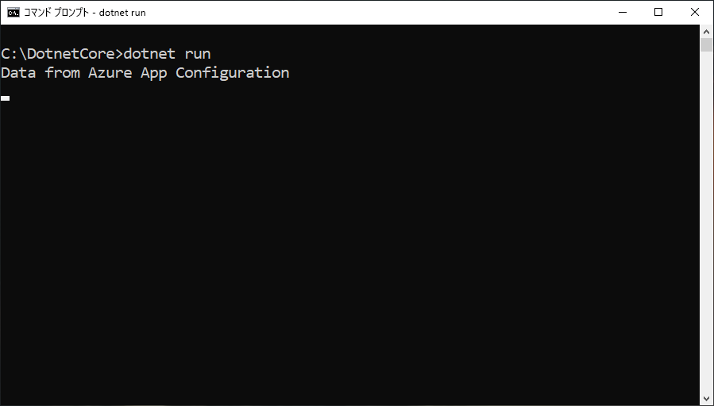

# <a name="quickstart-create-a-net-core-app-with-app-configuration"></a>クイック スタート:App Configuration を使用して .NET Core アプリを作成する

Azure App Configuration は、Azure 内にあるマネージド構成サービスです。 これを使用すると、すべてのアプリケーション設定を、コードとは別の 1 つの場所に簡単に保存して管理することができます。 このクイック スタートでは、.NET Core コンソール アプリにサービスを組み込む方法を示します。

このクイック スタートの手順は、任意のコード エディターを使用して実行できます。 推奨のエディターは [Visual Studio Code](https://code.visualstudio.com/) です (Windows、macOS、および Linux プラットフォームで使用できます)。



## <a name="prerequisites"></a>前提条件

このクイック スタートを実行するには、[.NET Core SDK](https://dotnet.microsoft.com/download) をインストールします。

[!INCLUDE [quickstarts-free-trial-note](../../includes/quickstarts-free-trial-note.md)]

## <a name="create-an-app-configuration-store"></a>アプリ構成ストアを作成する

[!INCLUDE [azure-app-configuration-create](../../includes/azure-app-configuration-create.md)]

6. **[Configuration Explorer]\(構成エクスプローラー)**  >  **[+ 作成]** の順に選択して、次のキーと値のペアを追加します。

    | キー | 値 |
    |---|---|
    | TestApp:Settings:Message | Azure App Configuration からのデータ |

    **[ラベル]** と **[コンテンツの種類]** は、現時点では空にしておきます。

## <a name="create-a-net-core-console-app"></a>.NET Core コンソール アプリを作成する

[.NET Core コマンド ライン インターフェイス (CLI)](https://docs.microsoft.com/dotnet/core/tools/) を使用して、新しい .NET Core コンソール アプリ プロジェクトを作成します。 Visual Studio ではなく .NET Core CLI を使用する利点は、Windows、macOS、および Linux プラットフォームで使用できることです。

1. プロジェクト用の新規フォルダーを作成します。

2. 新しいフォルダーで次のコマンドを実行して、新しい ASP.NET Core コンソール アプリ プロジェクトを作成します。

        dotnet new console

## <a name="connect-to-an-app-configuration-store"></a>アプリ構成ストアに接続する

1. 次のコマンドを実行して、`Microsoft.Azure.AppConfiguration.AspNetCore` NuGet パッケージへの参照を追加します。

        dotnet add package Microsoft.Azure.AppConfiguration.AspNetCore --version 2.0.0-preview-009200001-7

2. 次のコマンドを実行して、プロジェクトのパッケージを復元します。

        dotnet restore

3. *Program.cs* を開き、.NET Core App Configuration プロバイダーへの参照を追加します。

    ```csharp
    using Microsoft.Extensions.Configuration;
    using Microsoft.Extensions.Configuration.AzureAppConfiguration;
    ```

4. `builder.AddAzureAppConfiguration()` メソッドを呼び出して App Configuration を使用するように、`Main` メソッドを更新します。

    ```csharp
    static void Main(string[] args)
    {
        var builder = new ConfigurationBuilder();
        builder.AddAzureAppConfiguration(Environment.GetEnvironmentVariable("ConnectionString"));

        var config = builder.Build();
        Console.WriteLine(config["TestApp:Settings:Message"] ?? "Hello world!");
    }
    ```

## <a name="build-and-run-the-app-locally"></a>アプリをビルドしてローカルで実行する

1. **ConnectionString** という名前の環境変数に、アプリ構成ストアへのアクセス キーを設定します。 Windows コマンド プロンプトを使用する場合は、次のコマンドを実行してコマンド プロンプトを再起動し、変更が反映されるようにします。

        setx ConnectionString "connection-string-of-your-app-configuration-store"

    Windows PowerShell を使用する場合は、次のコマンドを実行します。

        $Env:ConnectionString = "connection-string-of-your-app-configuration-store"

    macOS または Linux を使用する場合は、次のコマンドを実行します。

        export ConnectionString='connection-string-of-your-app-configuration-store'

2. 次のコマンドを実行して、コンソール アプリをビルドします。

        dotnet build

3. ビルドが正常に完了したら、次のコマンドを実行して、アプリをローカルで実行します。

        dotnet run

## <a name="clean-up-resources"></a>リソースのクリーンアップ

[!INCLUDE [azure-app-configuration-cleanup](../../includes/azure-app-configuration-cleanup.md)]

## <a name="next-steps"></a>次の手順

このクイック スタートでは、新しいアプリ構成ストアを作成して、[App Configuration プロバイダー](https://go.microsoft.com/fwlink/?linkid=2074664)から .NET Core コンソール アプリと共に使用しました。 App Configuration の使用方法についてさらに学習するには、認証について示した次のチュートリアルに進んでください。

> [!div class="nextstepaction"]
> [マネージド ID の統合](./howto-integrate-azure-managed-service-identity.md)
