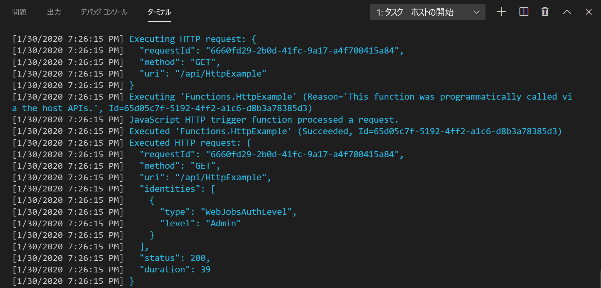
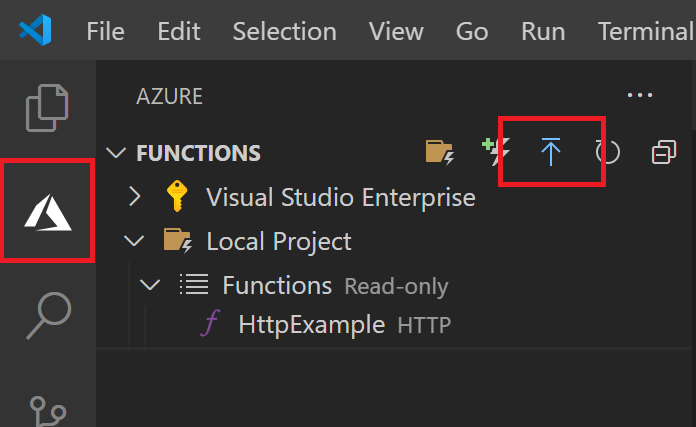

# <a name="quickstart-create-a-go-or-rust-function-in-azure-using-visual-studio-code"></a>クイックスタート: Visual Studio Code を使用して Azure に Go または Rust の関数を作成する

[!INCLUDE [functions-language-selector-quickstart-vs-code](../../includes/functions-language-selector-quickstart-vs-code.md)]

この記事では、HTTP 要求に応答する[カスタム ハンドラー](functions-custom-handlers.md)関数を、Visual Studio Code を使用して作成します。 コードをローカルでテストした後、Azure Functions のサーバーレス環境にデプロイします。

カスタム ハンドラーを使用すると、HTTP サーバー プロセスを実行することによって任意の言語またはランタイムで関数を作成できます。 この記事は、[Go](create-first-function-vs-code-other.md?tabs=go) と [Rust](create-first-function-vs-code-other.md?tabs=rust) の両方に対応しています。

このクイックスタートを完了すると、ご利用の Azure アカウントでわずかな (数セント未満の) コストが発生します。

## <a name="configure-your-environment"></a>環境を構成する

作業を開始する前に、次の要件が満たされていることを確認します。

# <a name="go"></a>[Go](#tab/go)

+ アクティブなサブスクリプションが含まれる Azure アカウント。 [無料でアカウントを作成できます](https://azure.microsoft.com/free/?ref=microsoft.com&utm_source=microsoft.com&utm_medium=docs&utm_campaign=visualstudio)。

+ [サポートされているプラットフォーム](https://code.visualstudio.com/docs/supporting/requirements#_platforms)のいずれかにインストールされた [Visual Studio Code](https://code.visualstudio.com/)。

+ Visual Studio Code 用 [Azure Functions 拡張機能](https://marketplace.visualstudio.com/items?itemName=ms-azuretools.vscode-azurefunctions)。

+ [Azure Functions Core Tools](./functions-run-local.md#v2) バージョン 3.x。 `func --version` コマンドを使用して、正しくインストールされていることを確認してください。

+ [Go](https://golang.org/doc/install)。最新バージョンをお勧めします。 `go version` コマンドを使用して、現在のバージョンを確認してください。

# <a name="rust"></a>[Rust](#tab/rust)

+ アクティブなサブスクリプションが含まれる Azure アカウント。 [無料でアカウントを作成できます](https://azure.microsoft.com/free/?ref=microsoft.com&utm_source=microsoft.com&utm_medium=docs&utm_campaign=visualstudio)。

+ [サポートされているプラットフォーム](https://code.visualstudio.com/docs/supporting/requirements#_platforms)のいずれかにインストールされた [Visual Studio Code](https://code.visualstudio.com/)。

+ Visual Studio Code 用 [Azure Functions 拡張機能](https://marketplace.visualstudio.com/items?itemName=ms-azuretools.vscode-azurefunctions)。

+ [Azure Functions Core Tools](./functions-run-local.md#v2) バージョン 3.x。 `func --version` コマンドを使用して、正しくインストールされていることを確認してください。

+ Rust ツールチェーン ([rustup](https://www.rust-lang.org/tools/install) を使用)。 `rustc --version` コマンドを使用して、現在のバージョンを確認してください。

---

## <a name="create-your-local-project"></a><a name="create-an-azure-functions-project"></a>ローカル プロジェクトを作成する

このセクションでは、Visual Studio Code を使用して、ローカルの Azure Functions カスタム ハンドラー プロジェクトを作成します。 後からこの記事の中で、関数コードを Azure に発行します。

1. アクティビティ バーの Azure アイコンを選択し、 **[Azure: Functions]** 領域で **[新しいプロジェクトの作成]** アイコンを選択します。

    ![[新しいプロジェクトの作成] を選択する](./media/functions-create-first-function-vs-code/create-new-project.png)

1. プロジェクト ワークスペースのディレクトリの場所を選択し、 **[選択]** をクリックします。

    > [!NOTE]
    > これらの手順は、ワークスペースの外部で実行するように設計されています。 ここでは、ワークスペースに含まれるプロジェクト フォルダーは選択しないでください。

1. プロンプトで、次の情報を入力します。

    + **Select a language for your function project (関数プロジェクトの言語を選択してください)** : [`Custom`] を選択します。

    + **Select a template for your project's first function (プロジェクトの最初の関数のテンプレートを選択してください)** : [`HTTP trigger`] を選択します。

    + **Provide a function name (関数名を指定してください):** 「`HttpExample`.

    + **承認レベル**: `Anonymous` を選択します。この場合、すべてのユーザーが関数のエンドポイントを呼び出すことができます。 承認レベルについては、「[承認キー](functions-bindings-http-webhook-trigger.md#authorization-keys)」を参照してください。

    + **Select how you would like to open your project (プロジェクトを開く方法を選択してください)** : [`Add to workspace`] を選択します。

1. Visual Studio Code では、この情報を使用して、HTTP トリガー関数を含む Azure Functions プロジェクトが生成されます。 ローカル プロジェクト ファイルは、エクスプローラーで表示できます。 作成されるファイルの詳細については、「[生成されるプロジェクト ファイル](functions-develop-vs-code.md#generated-project-files)」を参照してください。 

## <a name="create-and-build-your-function"></a>関数を作成してビルドする

HTTP トリガー関数は、*HttpExample* フォルダー内の *function.json* ファイルで宣言されています。 この関数を完成させるには、ハンドラーを追加し、実行可能ファイルにコンパイルします。

# <a name="go"></a>[Go](#tab/go)

1. <kbd>Ctrl + N</kbd> (macOS の場合は <kbd>Cmd + N</kbd>) キーを押して新しいファイルを作成します。 それを関数アプリのルート (*host.json* と同じフォルダー) に *handler.go* として保存します。

1. *handler.go* に次のコードを追加して、ファイルを保存します。 これが Go のカスタム ハンドラーです。

    ```go
    package main

    import (
        "fmt"
        "log"
        "net/http"
        "os"
    )

    func helloHandler(w http.ResponseWriter, r *http.Request) {
        message := "This HTTP triggered function executed successfully. Pass a name in the query string for a personalized response.\n"
        name := r.URL.Query().Get("name")
        if name != "" {
            message = fmt.Sprintf("Hello, %s. This HTTP triggered function executed successfully.\n", name)
        }
        fmt.Fprint(w, message)
    }

    func main() {
        listenAddr := ":8080"
        if val, ok := os.LookupEnv("FUNCTIONS_CUSTOMHANDLER_PORT"); ok {
            listenAddr = ":" + val
        }
        http.HandleFunc("/api/HttpExample", helloHandler)
        log.Printf("About to listen on %s. Go to https://127.0.0.1%s/", listenAddr, listenAddr)
        log.Fatal(http.ListenAndServe(listenAddr, nil))
    }
    ```

1. <kbd>Ctrl + Shift + `</kbd> キーを押すか、 *[ターミナル]* メニューの *[新しいターミナル]* を選択して、新しい統合ターミナルを VS Code で開きます。

1. 次のコマンドを使用してカスタム ハンドラーをコンパイルします。 関数アプリのルート フォルダーに、`handler` (Windows の場合は `handler.exe`) という名前の実行可能ファイルが出力されます。

    ```bash
    go build handler.go
    ```

    

# <a name="rust"></a>[Rust](#tab/rust)

1. <kbd>Ctrl + Shift + `</kbd> キーを押すか、 *[ターミナル]* メニューの *[新しいターミナル]* を選択して、新しい統合ターミナルを VS Code で開きます。

1. 関数アプリのルート (*host.json* と同じフォルダー) で、`handler` という名前の Rust プロジェクトを初期化します。

    ```bash
    cargo init --name handler
    ```

1. *Cargo.toml* に、このクイックスタートを完了するために必要な次の依存関係を追加します。 この例では、[warp](https://docs.rs/warp/) Web サーバー フレームワークを使用します。

    ```toml
    [dependencies]
    warp = "0.2"
    tokio = { version = "0.2", features = ["full"] }
    ```

1. *src/main.rs* に次のコードを追加して、ファイルを保存します。 これが Rust のカスタム ハンドラーです。

    ```rust
    use std::collections::HashMap;
    use std::env;
    use std::net::Ipv4Addr;
    use warp::{http::Response, Filter};

    #[tokio::main]
    async fn main() {
        let example1 = warp::get()
            .and(warp::path("api"))
            .and(warp::path("HttpExample"))
            .and(warp::query::<HashMap<String, String>>())
            .map(|p: HashMap<String, String>| match p.get("name") {
                Some(name) => Response::builder().body(format!("Hello, {}. This HTTP triggered function executed successfully.", name)),
                None => Response::builder().body(String::from("This HTTP triggered function executed successfully. Pass a name in the query string for a personalized response.")),
            });

        let port_key = "FUNCTIONS_CUSTOMHANDLER_PORT";
        let port: u16 = match env::var(port_key) {
            Ok(val) => val.parse().expect("Custom Handler port is not a number!"),
            Err(_) => 3000,
        };

        warp::serve(example1).run((Ipv4Addr::UNSPECIFIED, port)).await
    }
    ```

1. カスタム ハンドラーのバイナリをコンパイルします。 関数アプリのルート フォルダーに、`handler` (Windows の場合は `handler.exe`) という名前の実行可能ファイルが出力されます。

    ```bash
    cargo build --release
    cp target/release/handler .
    ```

    

---

## <a name="configure-your-function-app"></a>関数アプリを構成する

関数のホストは、起動時にカスタム ハンドラーのバイナリを実行するよう構成する必要があります。

1. *host.json* を開きます。

1. `customHandler.description` セクションで、`defaultExecutablePath` の値を `handler` に設定します (Windows の場合は `handler.exe` に設定します)。

1. `customHandler` セクションで、`enableForwardingHttpRequest` という名前のプロパティを追加し、その値を `true` に設定します。 HTTP トリガーのみで構成される関数の場合、この設定により、カスタム ハンドラーの[要求ペイロード](functions-custom-handlers.md#request-payload)ではなく、標準的な HTTP 要求を使用できるようになるため、プログラミングが容易になります。

1. `customHandler` セクションが次の例のようになっていることを確認します。 ファイルを保存します。

    ```
    "customHandler": {
      "description": {
        "defaultExecutablePath": "handler",
        "workingDirectory": "",
        "arguments": []
      },
      "enableForwardingHttpRequest": true
    }
    ```

この関数アプリは、カスタム ハンドラーの実行可能ファイルを起動するように構成されました。

## <a name="run-the-function-locally"></a>関数をローカルで実行する

このプロジェクトは、Azure に発行する前に、ローカルの開発用コンピューターで実行することができます。

1. 統合ターミナルで、Azure Functions Core Tools を使用して関数アプリを起動します。

    ```bash
    func start
    ```

1. Core Tools が実行されている状態で、次の URL に移動して、`?name=Functions` クエリ文字列を含む GET 要求を実行します。

    `http://localhost:7071/api/HttpExample?name=Functions`

1. 応答が返され、ブラウザーに次のように表示されます。

    

1. 要求に関する情報が **[ターミナル]** パネルに表示されます。

    

1. <kbd>Ctrl + C</kbd> キーを押して Core Tools を停止します。

関数がローカル コンピューター上で正常に動作することを確認したら、Visual Studio Code を使用してプロジェクトを直接 Azure に発行します。

[!INCLUDE [functions-sign-in-vs-code](../../includes/functions-sign-in-vs-code.md)]

## <a name="compile-the-custom-handler-for-azure"></a>Azure 用にカスタム ハンドラーをコンパイルする

このセクションでは、Linux を実行する関数アプリで Azure にプロジェクトを発行します。 ほとんどの場合、バイナリは、事前にターゲット プラットフォームに合わせて再コンパイルして構成を調整してから Azure に発行する必要があります。

# <a name="go"></a>[Go](#tab/go)

1. 統合ターミナルで、ハンドラーを Linux/x64 にコンパイルします。 関数アプリのルートに、`handler` という名前のバイナリが作成されます。

    # <a name="macos"></a>[macOS](#tab/macos)

    ```bash
    GOOS=linux GOARCH=amd64 go build handler.go
    ```

    # <a name="linux"></a>[Linux](#tab/linux)

    ```bash
    GOOS=linux GOARCH=amd64 go build handler.go
    ```

    # <a name="windows"></a>[Windows](#tab/windows)
    ```cmd
    set GOOS=linux
    set GOARCH=amd64
    go build hello.go
    ```

    *host.json* の `defaultExecutablePath` を `handler.exe` から `handler` に変更します。 この指示により、関数アプリは Linux バイナリを実行するようになります。
    
    ---

# <a name="rust"></a>[Rust](#tab/rust)

1. *.cargo/config* にファイルを作成します。次の内容を追加し、ファイルを保存します。

    ```
    [target.x86_64-unknown-linux-musl]
    linker = "rust-lld"
    ```

1. 統合ターミナルで、ハンドラーを Linux/x64 にコンパイルします。 `handler` という名前のバイナリが作成されます。 それを関数アプリのルートにコピーします。

    ```bash
    rustup target add x86_64-unknown-linux-musl
    cargo build --release --target=x86_64-unknown-linux-musl
    cp target/x86_64-unknown-linux-musl/release/handler .
    ```

1. Windows を使用している場合は、*host.json* の `defaultExecutablePath` を `handler.exe` から `handler` に変更します。 この指示により、関数アプリは Linux バイナリを実行するようになります。

1. *.funcignore* ファイルに次の行を追加します。

    ```
    target
    ```

    これにより、*target* フォルダーの内容が発行されなくなります。

---

## <a name="publish-the-project-to-azure"></a>Azure にプロジェクトを発行する

このセクションでは、ご利用の Azure サブスクリプションに関数アプリと関連リソースを作成し、コードをデプロイします。 

> [!IMPORTANT]
> 既存の関数アプリに発行すると、Azure のそのアプリのコンテンツが上書きされます。 


1. アクティビティ バーの Azure アイコンを選択し、 **[Azure: Functions]** 領域で、 **[Deploy to function app]\(関数アプリにデプロイ\)** ボタンを選択します。

    

1. プロンプトで、次の情報を入力します。

    + **Select folder (フォルダーを選択してください)** : ワークスペースのフォルダーを選択するか、関数アプリが格納されているフォルダーを参照します。 既に有効な関数アプリが開いている場合には、このプロンプトは表示されません。

    + **Select subscription (サブスクリプションを選択してください)** : 使用するサブスクリプションを選択します。 サブスクリプションが 1 つのみの場合、このプロンプトは表示されません。

    + **Select function app in Azure (Azure で関数アプリを選択してください)** : [`+ Create new Function App (advanced)`] を選択します。 
    
        > [!IMPORTANT]
        > `advanced` オプションを使用すると、Azure の関数アプリが実行される特定のオペレーティング システム (この場合は Linux) を選択できます。

        ![VS Code - 新しい関数アプリの作成で [Advanced]\(詳細\) を選択する](./media/functions-create-first-function-vs-code/functions-vscode-create-azure-advanced.png)

    + **Enter a globally unique name for the function app (関数アプリのグローバルに一意の名前を入力します)** : URL パスに有効な名前を入力します。 入力した名前は、Azure Functions 内での一意性を確保するために検証されます。

    + **ランタイム スタックを選択してください**: [`Custom Handler`] を選択します。

    + **Select an OS (OS を選択する)** : [`Linux`] を選択します。

    + **Select a hosting plan (ホスティング プランを選択する)** : [`Consumption`] を選択します。

    + **Select a resource group (リソース グループの選択)** : [`+ Create new resource group`] を選択します。 リソース グループの名前を入力します。 この名前は、Azure サブスクリプション内で一意である必要があります。 プロンプトで提示された名前を使用してもかまいません。

    + **ストレージ アカウントの選択**: [`+ Create new storage account`] を選択します。 この名前は Azure 内でグローバルに一意である必要があります。 プロンプトで提示された名前を使用してもかまいません。

    + **Application Insights Resource の選択**: [`+ Create Application Insights resource`] を選択します。 この名前は Azure 内でグローバルに一意である必要があります。 プロンプトで提示された名前を使用してもかまいません。

    + **Select a location for new resources (新しいリソースの場所を選択してください)** : パフォーマンスを向上させるために、お近くの[リージョン](https://azure.microsoft.com/regions/)を選択してください。この拡張機能は、Azure に作成されている個々のリソースの状態を通知領域に表示します。

    :::image type="content" source="../../includes/media/functions-publish-project-vscode/resource-notification.png" alt-text="Azure リソース作成の通知":::

1. 完了すると、次の Azure リソースがサブスクリプションに作成されます。

    [!INCLUDE [functions-vs-code-created-resources](../../includes/functions-vs-code-created-resources.md)]

    関数アプリが作成され、展開パッケージが適用されると、通知が表示されます。 

4. この通知の **[View Output]\(出力の表示\)** を選択すると、作成済みの Azure リソースなど、作成とデプロイの結果が表示されます。 通知を見逃した場合は、右下隅にあるベル アイコンを選択して、再度確認します。

    

[!INCLUDE [functions-vs-code-run-remote](../../includes/functions-vs-code-run-remote.md)]

[!INCLUDE [functions-cleanup-resources-vs-code.md](../../includes/functions-cleanup-resources-vs-code.md)]

## <a name="next-steps"></a>次のステップ

> [!div class="nextstepaction"]
> [Azure Functions のカスタム ハンドラーについて](functions-custom-handlers.md)
