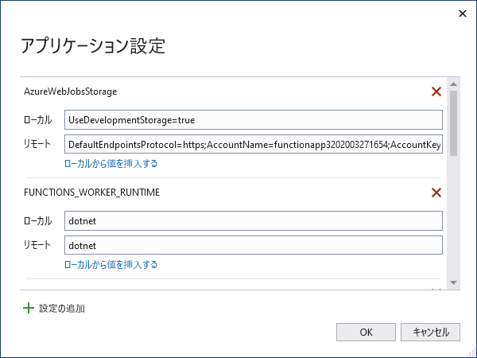

# <a name="develop-azure-functions-using-visual-studio"></a>Visual Studio を使用する Azure Functions の開発  

Visual Studio で、C# クラス ライブラリ関数を開発して、テストし、Azure にデプロイすることができます。 Azure Functions を初めて使用する場合は、「[Azure Functions の概要](functions-overview.md)」を参照してください。

Visual Studio には、関数の開発時の利点として次のようなことがあります。 

* ローカル開発用コンピューターで関数を編集、作成、および実行できます。 
* Azure Functions プロジェクトを Azure に直接発行し、必要に応じて Azure リソースを作成します。 
* C# 属性を使用して、C# コードで直接、関数のバインドを宣言できます。
* コンパイル済み C# 関数を開発およびデプロイできます。 コンパイル済み関数では、C# スクリプト ベースの関数より優れたコールド スタート パフォーマンスが得られます。 
* Visual Studio 開発のすべての利点を得ながら、C# で関数をコーディングできます。 

この記事では、Visual Studio を使って C# クラス ライブラリ関数を開発して Azure に発行する方法に関する詳細情報を提供します。 この記事を読む前に、[Visual Studio 用の関数のクイックスタート](functions-create-your-first-function-visual-studio.md)に関するページを完了することをお勧めします。 

特に明記されていない限り、ここで示す手順と例は Visual Studio 2019 のものです。 

## <a name="prerequisites"></a>前提条件

- Azure Functions Tools。 Azure Function Tools を追加するには、Visual Studio のインストールに **Azure 開発**ワークロードを含めます。 Azure Functions Tools は、Visual Studio 2017 以降の Azure 開発ワークロードで使用できます。

- Azure Storage アカウントなど、他の必要なリソースは、発行プロセス中にサブスクリプションに作成されます。

- [!INCLUDE [quickstarts-free-trial-note](../../includes/quickstarts-free-trial-note.md)]

> [!NOTE]
> Visual Studio 2017 では、Azure 開発ワークロードによって Azure Functions Tools が別個の拡張機能としてインストールされます。 Visual Studio 2017 のインストールを更新する場合、Azure Functions Tools の[最新バージョン](#check-your-tools-version)を使用していることを確認してください。 以下のセクションでは、Visual Studio 2017 の Azure Functions Tools 拡張機能を確認し、必要に応じて更新する方法について説明します。 
>
> Visual Studio 2019 を使用している場合は、これらのセクションをスキップします。

### <a name="check-your-tools-version-in-visual-studio-2017"></a><a name="check-your-tools-version"></a>Visual Studio 2017 でツールのバージョンを確認する

1. **[ツール]** メニューの **[拡張機能と更新プログラム]** を選択します。 **[インストール済み]**  >  **[ツール]** メニューを展開し、 **[Azure Functions と Web ジョブ ツール]** を選択します。

    

1. インストールされている **[バージョン]** をメモし、このバージョンを[リリース ノート](https://github.com/Azure/Azure-Functions/blob/master/VS-AzureTools-ReleaseNotes.md)に記載されている最新バージョンと比較します。 

1. インストールされているバージョンが古い場合は、次のセクションの説明に従って Visual Studio でツールを更新します。

### <a name="update-your-tools-in-visual-studio-2017"></a>Visual Studio 2017 のツールを更新する

1. **[拡張機能と更新プログラム]** ダイアログで、 **[更新プログラム]**  >  **[Visual Studio Marketplace]** を展開し、 **[Azure Functions と Web ジョブ ツール]** 、 **[更新]** の順に選択します。

       

1. ツールの更新プログラムがダウンロードされたら、 **[閉じる]** を選択し、Visual Studio を閉じて、VSIX インストーラーを使用してツールの更新をトリガーします。

1. VSIX インストーラーで、 **[変更]** を選択してツールを更新します。 

1. 更新が完了したら、 **[閉じる]** を選択して Visual Studio を再起動します。

> [!NOTE]  
> Visual Studio 2019 以降では、Azure Functions ツールの拡張機能が Visual Studio の一部として更新されます。  

## <a name="create-an-azure-functions-project"></a>Azure Functions プロジェクトを作成する

[!INCLUDE [Create a project using the Azure Functions](../../includes/functions-vstools-create.md)]

Azure Functions プロジェクトを作成した後、プロジェクト テンプレートを使用して C# プロジェクトを作成し、`Microsoft.NET.Sdk.Functions` NuGet パッケージをインストールし、ターゲット フレームワークを設定します。 新しいプロジェクトには次のファイルが含まれます。

* **host.json**:Functions のホストを構成できます。 これらの設定は、ローカルでの実行時と Azure での実行時の両方に適用されます。 詳細については、[host.json](functions-host-json.md) のリファレンスを参照してください。

* **local.settings.json**:関数をローカルで実行するときに使用される設定を保持します。 Azure で実行している場合、これらの設定は使用されません。 詳細については、「[ローカル設定ファイル](#local-settings-file)」を参照してください。

    >[!IMPORTANT]
    >local.settings.json ファイルにはシークレットを含めることができるため、それをプロジェクト ソース管理から除外する必要があります。 このファイルの **[出力ディレクトリにコピー]** 設定が **[新しい場合はコピーする]** に設定されていることを確認します。 

詳細については、「[関数クラス ライブラリ プロジェクト](functions-dotnet-class-library.md#functions-class-library-project)」を参照してください。

[!INCLUDE [functions-local-settings-file](../../includes/functions-local-settings-file.md)]

プロジェクトを発行しても、Visual Studio では local.settings.json の設定が自動的にアップロードされません。 これらの設定が Azure の関数アプリにも確実に存在するようにするには、プロジェクトを発行した後にそれらをアップロードします。 詳細については、「[Function App の設定](#function-app-settings)」を参照してください。 `ConnectionStrings` コレクション内の値は発行されません。

コードを使用して、関数アプリの設定値を環境変数として読み取ることもできます。 詳細については、「[環境変数](functions-dotnet-class-library.md#environment-variables)」を参照してください。

## <a name="configure-the-project-for-local-development"></a>ローカル開発用のプロジェクトを構成する

Functions ランタイムでは内部的に Azure Storage アカウントを使用します。 HTTP と Webhook 以外のすべてのトリガーの種類について、`Values.AzureWebJobsStorage` キーを有効な Azure Storage アカウントの接続文字列に設定します。 関数アプリでは、プロジェクトに必要な `AzureWebJobsStorage` 接続設定に [Azure ストレージ エミュレーター](../storage/common/storage-use-emulator.md)を使用することもできます。 エミュレーターを使用するには、`AzureWebJobsStorage` の値を `UseDevelopmentStorage=true` に設定します。 この設定は、デプロイ前に実際のストレージ アカウント接続文字列に変更します。

ストレージ アカウントの接続文字列を設定するには、次のようにします。

1. Visual Studio で、 **[表示]**  >  **[Cloud Explorer]** を選択します。

2. **Cloud Explorer** で **[ストレージ アカウント]** を展開し、お使いのストレージ アカウントを選択します。 **[プロパティ]** タブで、 **[プライマリ接続文字列]** の値をコピーします。

2. プロジェクトで、local.settings.json ファイルを開き、コピーした接続文字列に `AzureWebJobsStorage` キーの値を設定します。

3. 前の手順を繰り返し、関数に必要なその他のすべての接続について、`Values` 配列に一意のキーを追加します。 

## <a name="add-a-function-to-your-project"></a>プロジェクトに関数を追加する

C# クラス ライブラリ関数では、関数で使用されるバインドはコードで属性を適用することで定義されます。 提供されているテンプレートから関数トリガーを作成する場合は、トリガー属性が適用されます。 

1. **ソリューション エクスプローラー**で、プロジェクト ノードを右クリックし、 **[追加]**  >  **[新しいアイテム]** の順に選択します。 

2. **[Azure 関数]** を選択し、クラスの **[名前]** を入力して **[追加]** を選択します。

3. トリガーを選択し、バインドのプロパティを設定して、 **[OK]** を選択します。 次の例は、Queue storage トリガー関数を作成する場合の設定を示しています。 

    

    このトリガーの例では、`QueueStorage` という名前のキーと共に接続文字列を使用します。 この接続文字列の設定は、[local.settings.json ファイル](functions-run-local.md#local-settings-file)で定義します。

4. 新しく追加されたクラスを確認します。 `FunctionName` 属性で属性が指定された静的 `Run()` メソッドを確認します。 この属性は、メソッドが関数のエントリ ポイントであることを示します。

    たとえば、次の C# クラスは基本的な Queue storage トリガー関数を表します。

    ```csharp
    using System;
    using Microsoft.Azure.WebJobs;
    using Microsoft.Azure.WebJobs.Host;
    using Microsoft.Extensions.Logging;

    namespace FunctionApp1
    {
        public static class Function1
        {
            [FunctionName("QueueTriggerCSharp")]
            public static void Run([QueueTrigger("myqueue-items", 
                Connection = "QueueStorage")]string myQueueItem, ILogger log)
            {
                log.LogInformation($"C# Queue trigger function processed: {myQueueItem}");
            }
        }
    }
    ```

バインド固有の属性は、エントリ ポイント メソッドに指定された各バインド パラメーターに適用されます。 属性ではパラメーターとしてバインド情報を取ります。 前の例では、Queue storage トリガー関数を示す `QueueTrigger` 属性が最初のパラメーターに適用されています。 キュー名および接続文字列の設定名は、パラメーターとして `QueueTrigger` 属性に渡されます。 詳細については、[Azure Functions での Azure Queue ストレージのバインド](functions-bindings-storage-queue-trigger.md)に関する記事を参照してください。

上記の手順を使用して、複数の関数を関数アプリ プロジェクトに追加します。 プロジェクト内の各関数で異なるトリガーを使用できますが、1 つの関数には 1 つのトリガーのみを使用する必要があります。 詳しくは、「[Azure Functions でのトリガーとバインドの概念](functions-triggers-bindings.md)」をご覧ください。

## <a name="add-bindings"></a>バインドの追加

トリガーと同じように、入力バインドと出力バインドも、バインド属性として関数に追加されます。 以下のように、関数にバインドを追加します。

1. [プロジェクトをローカル開発用に構成](#configure-the-project-for-local-development)したことを確認します。

2. 特定のバインディングに適した NuGet 拡張機能パッケージを追加します。 

   詳細については、「[Visual Studio を使用する C# クラス ライブラリ](./functions-bindings-register.md#local-csharp)」を参照してください。 バインド固有の NuGet パッケージの要件については、バインドの参照記事で確認します。 たとえば、Event Hubs トリガーのパッケージ要件については、[Event Hubs のバインドの参照記事](functions-bindings-event-hubs.md)を参照してください。

3. バインドが必要なアプリ設定がある場合は、[ローカル設定ファイル](functions-run-local.md#local-settings-file)の `Values` コレクションに追加します。 

   この関数では、ローカルで実行するときにこれらの値を使用します。 関数が Azure の関数アプリ で実行される場合は、[関数アプリの設定](#function-app-settings)が使用されます。

4. 適切なバインド属性をメソッド シグネチャに追加します。 次の例では、キュー メッセージによって関数がトリガーされ、出力バインドによって、同じテキストの新しいキュー メッセージが別のキューに作成されます。

    ```csharp
    public static class SimpleExampleWithOutput
    {
        [FunctionName("CopyQueueMessage")]
        public static void Run(
            [QueueTrigger("myqueue-items-source", Connection = "AzureWebJobsStorage")] string myQueueItem, 
            [Queue("myqueue-items-destination", Connection = "AzureWebJobsStorage")] out string myQueueItemCopy,
            ILogger log)
        {
            log.LogInformation($"CopyQueueMessage function processed: {myQueueItem}");
            myQueueItemCopy = myQueueItem;
        }
    }
    ```
   Queue Storage への接続は、`AzureWebJobsStorage` 設定から取得されます。 詳しくは、特定のバインドの参照記事をご覧ください。 

[!INCLUDE [Supported triggers and bindings](../../includes/functions-bindings.md)]

## <a name="testing-functions"></a>関数のテスト

Azure Functions Core Tools を使用すると、ローカルの開発用コンピューター上で Azure Functions プロジェクトを実行できます。 詳細については、「[Azure Functions Core Tools の操作](functions-run-local.md)」を参照してください。 Visual Studio から初めて関数を起動すると、これらのツールをインストールするよう求めるメッセージが表示されます。 

Visual Studio で関数をテストするには:

1. F5 キーを押す。 メッセージが表示されたら、Visual Studio からの要求に同意し、Azure Functions Core (CLI) ツールをダウンロードしてインストールします。 また、ツールで HTTP 要求を処理できるように、ファイアウォールの例外を有効にすることが必要になる場合もあります。

2. プロジェクトを実行して、デプロイ済みの関数をテストする場合と同じようにコードをテストします。 

   詳細については、「[Azure Functions のコードをテストするための戦略](functions-test-a-function.md)」を参照してください。 Visual Studio をデバッグ モードで実行すると、想定どおりにブレークポイントにヒットします。

<!---
For an example of how to test a queue triggered function, see the [queue triggered function quickstart tutorial](functions-create-storage-queue-triggered-function.md#test-the-function).  
-->


## <a name="publish-to-azure"></a>Azure に発行する

Visual Studio から発行する場合、次の 2 つのデプロイ方法のいずれかを使用します。

* [Web 配置](functions-deployment-technologies.md#web-deploy-msdeploy):Windows アプリをパッケージ化して任意の IIS サーバーに配置します。
* [run-From-package を有効にした Zip デプロイ](functions-deployment-technologies.md#zip-deploy):Azure Functions のデプロイに推奨されます。

次の手順を使用して、プロジェクトを Azure 内の関数アプリに発行します。

[!INCLUDE [Publish the project to Azure](../../includes/functions-vstools-publish.md)]

## <a name="function-app-settings"></a>Function App の設定

プロジェクトを発行しても、Visual Studio ではこれらの設定が自動的にアップロードされないため、local.settings.json に追加したすべての設定は、Azure の関数アプリにも追加する必要があります。

Azure の関数アプリに必要な設定をアップロードする最も簡単な方法は、プロジェクトが正常に発行された後に表示される **[Azure App Service の設定を管理する]** リンクを選択することです。

:::image type="content" source="./media/functions-develop-vs/functions-vstools-app-settings.png" alt-text="[発行] ウィンドウの設定":::

このリンクを選択すると、関数アプリの **[アプリケーションの設定]** ダイアログが表示され、ここで新しいアプリケーション設定を追加したり、既存の設定を変更したりできます。



**[ローカル]** には local.settings.json ファイルの設定値が表示され、 **[リモート]** には Azure の関数アプリの現在の設定値が表示されます。 新しいアプリ設定を作成するには、 **[設定の追加]** を選択します。 **[ローカルから値を挿入する]** リンクを使用して、設定値を **[リモート]** フィールドにコピーします。 **[OK]** を選択すると、保留中の変更がローカル設定ファイルと関数アプリに書き込まれます。

> [!NOTE]
> 既定では、local.settings.json ファイルはソース管理にチェックインされません。 これは、ソース管理からローカル関数プロジェクトを複製するときに、プロジェクトに local.settings.json ファイルがないことを意味します。 この場合、 **[アプリケーション設定]** ダイアログが期待どおりに動作するように、プロジェクトのルートに local.settings.json ファイルを手動で作成する必要があります。 

以下のいずれかの方法を使用して、アプリケーション設定を管理することもできます。

* [Azure portal を使用する](functions-how-to-use-azure-function-app-settings.md#settings)。
* [Azure Functions Core Tools の `--publish-local-settings` 発行オプションを使用する](functions-run-local.md#publish)。
* [Azure CLI を使用する](/cli/azure/functionapp/config/appsettings#az-functionapp-config-appsettings-set)

## <a name="monitoring-functions"></a>Functions の監視

関数の実行を監視するための推奨される方法は、関数アプリを Azure Application Insights と統合することです。 Azure Portal で関数アプリを作成する場合、この統合は、既定で自動的に行われます。 ただし、Visual Studio の発行中に関数アプリを作成する場合は、Azure で関数アプリの統合は実行されません。

[!INCLUDE [functions-connect-new-app-insights.md](../../includes/functions-connect-new-app-insights.md)]

詳細については、「[Azure Functions を監視する](functions-monitoring.md)」を参照してください。

## <a name="next-steps"></a>次のステップ

Azure Functions Core Tools の詳細については、「[Azure Functions Core Tools の操作](functions-run-local.md)」を参照してください。

.NET クラス ライブラリとしての関数の開発の詳細については、「[Azure Functions C# 開発者向けリファレンス](functions-dotnet-class-library.md)」を参照してください。 この記事は、Azure Functions でサポートされる各種バインドを宣言するための属性の使用例にもリンクしています。    
