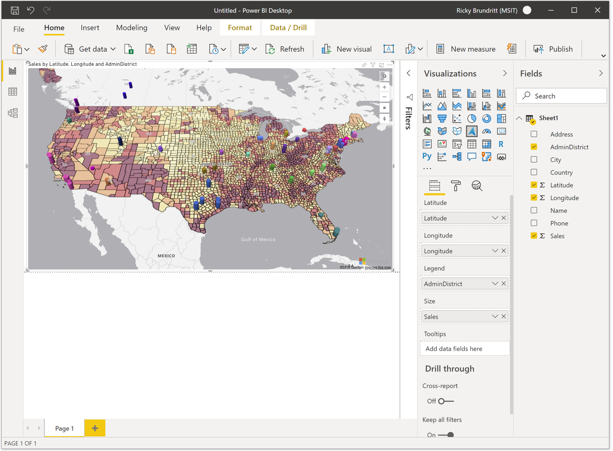

# Azure Maps Power BI ビジュアルの概要

<Token>**適用対象:** Power BI サービス * *(_コンシューマー_)* _Power BI サービス (デザイナーおよび開発者) Power BI Desktop X Pro または Premium ライセンスが必要</Token>

この記事では、Power BI で Microsoft Azure Maps ビジュアルを使用する方法を示します。

> [!NOTE]
> このビジュアルは、Power BI Desktop と Power BI サービスのどちらでも作成および表示できます。 この記事の手順と図は Power BI Desktop のものです。

Power BI 用の Azure Maps ビジュアルを使用すると、さまざまな空間データを地図上に視覚化できます。 80% を超えるビジネス データに位置情報コンテキストがあると推定されています。 Azure Maps ビジュアルを使用して、この位置情報コンテキストがビジネス データにどのように関連し、どのような影響を及ぼすかについて分析情報を得ることができます。

## Azure に送信されるものは?

Azure Maps ビジュアルは、Azure でホストされているクラウド サービスに接続して、地図の視覚化の作成に使われる地図画像や座標などの位置情報データを取得します。 

-   地図がフォーカスされている領域の詳細が Azure に送信され、地図キャンバス (地図タイルとも呼ばれます) の描画に必要な画像が取得されます。 
-   [Location] (場所)、[緯度]、[経度] の各バケット内のデータを Azure に送信して地図座標を取得できます (ジオコーディングと呼ばれるプロセス)。 
-   Power BI のテレメトリ オプションが有効になっている場合は、ビジュアルの正常性 (クラッシュ レポートなど) に関するテレメトリ データを収集できます。

上記のシナリオ以外では、マップにオーバーレイされた他のデータが Azure Maps サーバーに送信されることはありません。 データのすべてのレンダリングは、クライアント内でローカルに行われます。

次の URL を使用する Azure Maps プラットフォームへのアクセスを許可するために、開発者または管理者がファイアウォールを更新することが必要な場合があります。

> `https://atlas.microsoft.com`

Azure Maps ビジュアルに関連するプライバシーと使用条件の詳細については、「[Microsoft Azure の法的情報](https://azure.microsoft.com/support/legal/)」を参照してください。

## Azure Maps ビジュアル (プレビュー) の動作と要件

_ *Azure Maps** ビジュアルには、いくつかの考慮事項と要件があります。 :

-   **Azure Maps** ビジュアル (プレビュー) は、Power BI Desktop で有効にする必要があります。 **Azure Maps** ビジュアルを有効にするには、 **[ファイル]** &gt; **[オプションと設定]** &gt; **[オプション]** &gt; **[プレビュー機能]** の順に選択してから、 **[Azure Maps Visual]** チェック ボックスをオンにします。 この操作を行っても Azure Maps ビジュアルが使用できない場合は、おそらく、管理ポータルでテナント管理者スイッチを有効にする必要があります。
-   **緯度** と **経度** の情報を含むフィールドがデータセットに必要です。 位置情報フィールドのジオコーディングは、将来の更新で追加される予定です。
-   Power BI 用の組み込みの凡例コントロールは、このプレビューの時点では表示されません。 将来の更新で追加される予定です。

## Azure Maps ビジュアル (プレビュー) を使用する

**Azure Maps** ビジュアルが有効になったら、 **[視覚化]** ウィンドウから **[Azure Maps]** アイコンを選択します。

![[視覚化] ウィンドウの Azure Maps ビジュアルのボタン](media/power-bi-visual/azure-maps-in-visualizations-pane.png)

Power BI によって、空の Azure Maps ビジュアル デザイン キャンバスが作成されます。 プレビュー段階では、追加の免責事項が表示されます。

Azure Maps ビジュアルを読み込むには、次の手順を実行します。

1.  **[フィールド]** ウィンドウで、緯度と経度の座標情報を含むデータ フィールドを **[緯度]** バケットと **[経度]** バケットのどちらかまたは両方にドラッグします。 これは、Azure Maps ビジュアルを読み込むために必要な最小限のデータです。
    
    > [!div class="mx-imgBorder"]
    > 

2.  分類に基づいてデータの色を設定するには、カテゴリ別フィールドを **[フィールド]** ウィンドウの **[凡例]** バケットにドラッグします。 この例では、(州または省を表す) **AdminDistrict** 列を使用しています。  
    
    > [!div class="mx-imgBorder"]
    > 

    > [!NOTE]
    > Power BI 用の組み込みの凡例コントロールは、このプレビューの時点では表示されません。 将来の更新で追加される予定です。

3.  データを相対的にスケーリングするには、 **[フィールド]** ウィンドウの **[サイズ]** バケットにメジャーをドラッグします。 この例では、 **[Sales]\(売上\)** 列を使用しています。  
    
    > [!div class="mx-imgBorder"]
    > 

4.  **[Format]\(形式\)** ウィンドウのオプションを使用して、データの描画方法をカスタマイズします。 次の画像は上のものと同じ地図ですが、バブル レイヤーの塗りつぶし透明度オプションを 50% に設定し、ハイ コントラスト輪郭線オプションを有効にしています。  
    
    > [!div class="mx-imgBorder"]
    > 

## [フィールド] ウィンドウのバケット

Azure Maps ビジュアルの **[フィールド]** ウィンドウでは、次のデータ バケットが使用できます。

| フィールド     | 説明  |
|-----------|--------------|
| Latitude  | データ ポイントの緯度値の指定に使われるフィールド。 緯度の値は、-90 から 90 までの範囲で、小数表記の度数形式で指定する必要があります。  |
| Longitude | データ ポイントの経度値の指定に使われるフィールド。 経度の値は、-180 から 180 までの範囲で、小数表記の度数形式で指定する必要があります。  |
| 凡例    | データを分類し、各カテゴリのデータ ポイントに一意の色を割り当てるために使われるフィールド。 このバケットがいっぱいになると、 **[データの色]** セクションが **[Format]\(形式\)** ウィンドウに表示され、色を調整できます。 |
| サイズ      | 地図上のデータ ポイントの相対的なサイズ変更に使われるメジャー。   |
| ツールヒント  | 図形にマウス カーソルを合わせたときにヒントに表示される追加のデータ フィールド。 |

## 地図の設定

[Format] (形式) ウィンドウの **[Map settings]\(地図の設定\)** セクションには、地図の表示方法をカスタマイズしたり、更新に反応したりするためのオプションがあります。

| 設定             | 説明  |
|---------------------|--------------|
| [自動ズーム]           | ビジュアルの **[フィールド]** ウィンドウから読み込まれたデータに地図を自動的にズームします。 データを変更すると、それに応じて地図の位置が更新されます。 スライダーが **[オフ]** の位置にあるときは、既定の地図ビュー用の追加の地図ビュー設定が表示されます。 |
| [World wrap] (ワールドの折り返し)          | ユーザーが地図を水平方向に無限にパンできるようにします。 |
| [Style picker] (スタイルの選択)        | 地図にボタンを追加して、レポートの閲覧者が地図のスタイルを変更できるようにします。 |
| [ナビゲーション コントロール] | 別の方法としてボタンを地図に追加して、レポートの閲覧者が地図をズーム、回転したり、地図の傾斜を変更したりできるようにします。 詳細については、[地図の操作](map-accessibility.md#navigating-the-map)に関するドキュメントの、ユーザーが地図を操作するすべての方法の説明を参照してください。 |
| [Map style] (地図のスタイル)           | 地図のスタイル。 詳細については、[サポートされている地図のスタイル](supported-map-styles.md)に関するドキュメントを参照してください。 |

### 地図の表示設定

**[自動ズーム]** スライダーが **[オフ]** の位置にある場合、次の設定が表示され、ユーザーは既定の地図ビュー情報を指定できます。

| 設定          | 説明   |
|------------------|---------------|
| Zoom             | 地図の既定のズーム レベル。 0 から 22 までの範囲の数値を指定できます。 |
| [Center latitude] (中心の緯度)  | 地図中心の既定の緯度。 |
| [Center longitude] (中心の経度) | 地図中心の既定の経度。 |
| [Heading] (方向)          | 地図の既定の方向 (角度)。0 は北、90 は東、180 は南、270 は西を表します。 0 から 360 までの任意の数値を指定できます。 |
| [Pitch] (傾斜)            | 地図の既定の傾き (角度)。使用できるのは 0 から 60 までの値で、0 は地図の下方向を表します。 |

## 注意点と制限事項

Azure Maps ビジュアルは、次のサービスとアプリケーションで利用できます。

| サービス/アプリ                              | 可用性 |
|------------------------------------------|--------------|
| Power BI Desktop                         | はい          |
| Power BI サービス (app.powerbi.com)       | はい          |
| Power BI モバイル アプリケーション             | はい          |
| Power BI (Web に公開)                  | いいえ           |
| Power BI Embedded                        | いいえ           |
| Power BI サービス埋め込み (PowerBI.com) | はい          |

その他の Power BI サービス/アプリのサポートは、将来の更新で追加されます。

**Azure Maps はどの地域で利用できますか?**

Azure Maps は現在、以下を除くすべての国と地域で利用できます。

- 中国
- 韓国

このビジュアルを強化するさまざまな Azure Maps サービスの提供地域の詳細については、「[地理的範囲情報](geographic-coverage.md)」のドキュメントを参照してください。

**Azure Maps ビジュアルではどの Web ブラウザーがサポートされていますか?**

[Azure Maps Web SDK でサポートされているブラウザー](supported-browsers.md)に関するドキュメントを参照してください。

**何個のデータ ポイントを視覚化できますか?**

このビジュアルでは、最大 30,000 のデータ ポイントがサポートされています。

**住所やその他の位置情報文字列はこのビジュアルで使用できますか?**

このビジュアルの初期プレビューでは、小数表記の度数で表した緯度と経度の値のみがサポートされています。 将来の更新で、住所やその他の位置情報文字列のサポートが追加される予定です。

## 次のステップ

Azure Maps Power BI ビジュアルについて詳しく確認します。

> [!div class="nextstepaction"]
> [Azure Maps Power BI ビジュアルのレイヤーの概要](power-bi-visual-understanding-layers.md)

> [!div class="nextstepaction"]
> [組織内で Azure Maps ビジュアルを管理する](power-bi-visual-manage-access.md)

ビジュアルのカスタマイズ:

> [!div class="nextstepaction"]
> [Power BI における色の書式設定に関するヒントとコツ](/power-bi/visuals/service-tips-and-tricks-for-color-formatting)

> [!div class="nextstepaction"]
> [視覚エフェクトのタイトル、背景、および凡例をカスタマイズする](/power-bi/visuals/power-bi-visualization-customize-title-background-and-legend)