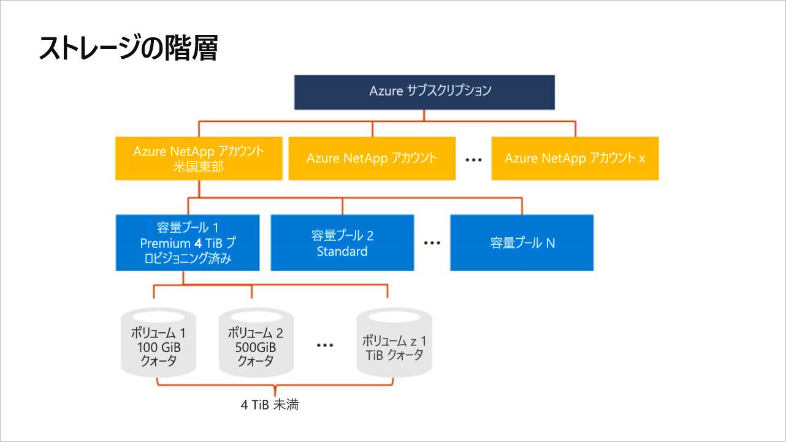

# Azure NetApp Files のストレージ階層

Azure NetApp Files のボリュームを作成する前に、プロビジョニング容量のプールを購入して設定する必要があります。  容量プールを設定するには、NetApp アカウントが必要です。 ストレージ階層についての理解は、Azure NetApp Files のリソースを設定および管理するうえで役立ちます。

> [!IMPORTANT] 
> Azure NetApp Files は現在、サブスクリプション間でのリソースの移行をサポートしていません。

## NetApp アカウント

- NetApp アカウントは、構成容量プールの管理グループとしての役割を果たします。  
- NetApp アカウントは、一般的な Azure Storage アカウントとは異なります。 
- NetApp アカウントは、範囲がリージョン単位となります。   
- 1 つのリージョンで複数の NetApp アカウントを持つことはできますが、個々の NetApp アカウントが関連付けられるリージョンは 1 つだけです。

## 容量プール

容量プールのしくみを理解することは、ストレージのニーズに適した容量プールの種類の選択に役立ちます。 

### 容量プールの一般的な規則

- 容量プールは、そのプロビジョニング容量で測定されます。   
    追加情報については、[QoS の種類](#qos_types)に関する記事を参照してください。  
- 容量は、購入した固定 SKU 単位でプロビジョニングされます (4 TiB 容量など)。
- 容量プールに割り当てることができるサービス レベルは 1 つだけです。  
- 各容量プールが属することができる NetApp アカウントは 1 つだけです。 ただし、1 つの NetApp アカウント内に複数の容量プールを持つことができます。  
- 1 つの容量プールを複数の NetApp アカウントにまたがって移動することはできません。   
  たとえば、下の「[ストレージ階層の概念図](#conceptual_diagram_of_storage_hierarchy)」で、容量プール 1 を米国東部の NetApp アカウントから米国西部 2 の NetApp アカウントへ移動することはできません。  
- 容量プール内のすべてのボリュームが削除されるまで、容量プールを削除できません。

### 容量プールのサービス品質 (QoS) の種類

QoS の種類は容量プールの属性です。 Azure NetApp Files は、2 種類の容量プールの QoS を提供しています。 

- "*自動*" の種類の QoS  

    容量プールを作成する場合、既定の QoS の種類は [自動] になります。

    自動 QoS 容量プールでは、ボリュームに割り当てられたサイズ クォータに比例して、スループットがプール内のボリュームに自動的に割り当てられます。 

    ボリュームに割り当てられる最大スループットは、容量プールのサービス レベルとボリュームのサイズ クォータによって異なります。 計算例については、「[Azure NetApp Files のサービス レベル](azure-netapp-files-service-levels.md)」を参照してください。

- "*手動*" の種類の QoS  

     > [!IMPORTANT] 
     > 容量プールに手動の種類の QoS を使用するには、登録が必要です。  「[手動 QoS 容量プールを管理する](manage-manual-qos-capacity-pool.md)」を参照してください。  

    容量プールには、手動の種類の QoS を使用するオプションがあります。

    手動 QoS 容量プールでは、ボリュームの容量とスループットを個別に割り当てることができます。 手動 QoS 容量プールで作成されたすべてのボリュームの合計スループットは、プールの合計スループットによって制限されます。  プール サイズとサービス レベルのスループットの組み合わせによって決まります。 

    たとえば、Ultra サービス レベルの 4 TiB の容量プールで、ボリュームに対して使用可能な合計スループット容量は 512 MiB/秒 (4 TiB x 128 MiB/秒/TiB) です。

## ボリューム

- ボリュームは、論理容量消費で測定され、スケーラブルです。 
- ボリュームの容量消費は、そのプールのプロビジョニング容量を前提としてカウントされます。
- ボリュームのスループット消費量は、そのプールで使用可能なスループットに対してカウントされます。 「["手動" の種類の QoS](#manual_qos_type)」を参照してください。
- 各ボリュームが従属するプールは 1 つだけですが、1 つのプールは複数のボリュームを含むことができます。 

## ストレージ階層の概念図 
次の例は、Azure サブスクリプション、NetApp アカウント、容量プール、ボリュームの関係を示したものです。   

## 次のステップ

- [Azure NetApp Files のリソース制限](azure-netapp-files-resource-limits.md)
- [Azure NetApp Files に登録する](azure-netapp-files-register.md)
- [Azure NetApp Files のサービス レベル](azure-netapp-files-service-levels.md)
- [Azure NetApp Files のパフォーマンスに関する考慮事項](azure-netapp-files-performance-considerations.md)
- [容量プールを設定する](azure-netapp-files-set-up-capacity-pool.md)
- [手動 QoS 容量プールを管理する](manage-manual-qos-capacity-pool.md)
