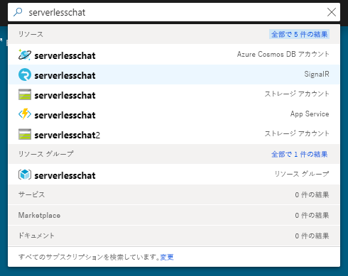

# <a name="quickstart-create-a-chat-room-with-azure-functions-and-signalr-service-using-java"></a>クイック スタート:Java を使用した Azure Functions と SignalR Service によるチャット ルームの作成

Azure SignalR Service を使用すると、アプリケーションにリアルタイム機能を簡単に追加できます。 Azure Functions は、インフラストラクチャを管理することなくコードを実行できるサーバーレス プラットフォームです。 このクイック スタートでは、SignalR Service および Functions を使用して、サーバーレスかつリアルタイムのチャット アプリケーションを構築する方法を説明します。

## <a name="prerequisites"></a>前提条件

このクイック スタートは、macOS、Windows、または Linux で実行できます。

[Visual Studio Code](https://code.visualstudio.com/) などのコード エディターがインストールされていることを確認してください。

Azure Functions アプリをローカルで実行するために、[Azure Functions Core Tools (v2)](https://github.com/Azure/azure-functions-core-tools#installing) をインストールします。

> [!NOTE]
> Java で SignalR Service バインディングを使用するには、Azure Functions Core Tools のバージョン 2.4.419 (ホストのバージョン 2.0.12332) を使用していることを確認してください。

現在の Azure Functions Core Tools では、拡張機能をインストールするために [.NET Core SDK](https://www.microsoft.com/net/download) をインストールする必要があります。 ただし、JavaScript Azure Functions アプリの構築には、.NET の知識は必要ありません。

Java で関数アプリを開発するには、以下のものがインストールされている必要があります。

* [Java Developer Kit](https://www.azul.com/downloads/zulu/) バージョン 8。
* [Apache Maven](https://maven.apache.org) バージョン 3.0 以降。

[!INCLUDE [quickstarts-free-trial-note](../../includes/quickstarts-free-trial-note.md)]

## <a name="log-in-to-azure"></a>Azure にログインする

Azure アカウントで Azure Portal (<https://portal.azure.com/>) にサインインします。

[!INCLUDE [Create instance](includes/signalr-quickstart-create-instance.md)]

[!INCLUDE [Clone application](includes/signalr-quickstart-clone-application.md)]

## <a name="configure-and-run-the-azure-function-app"></a>Azure Function アプリを構成して実行する

1. Azure portal を開いているブラウザーのポータルの上部にある検索ボックスから、以前にデプロイした SignalR Service インスタンスの名前で検索し、インスタンスが正常に作成されたことを確認します。 インスタンスを選択して開きます。

    

1. **[Key]\(キー\)** を選択し、SignalR Service インスタンスの接続文字列を表示します。

1. プライマリ接続文字列を選択してコピーします。

    

1. コード エディターで、複製したリポジトリの *src/chat/java* フォルダーを開きます。

1. *local.settings.sample.json* を *local.settings.json* に変更します。

1. **local.settings.json** で、**AzureSignalRConnectionString** 設定に接続文字列の値を貼り付けます。 ファイルを保存します。

1. 関数を含むメイン ファイルは *src/chat/java/src/main/java/com/function/Functions.java* にあります。

    - **negotiate** - *SignalRConnectionInfo* 入力バインディングを使用し、有効な接続情報を生成して返却します。
    - **SendMessage** - 要求本文でチャット メッセージを受信し、*SignalR* 出力バインディングを使用して接続されているすべてのクライアント アプリケーションにメッセージをブロードキャストします。

1. ターミナルで、*src/chat/java* フォルダーにいることを確認します。 関数アプリを構築します。

    ```bash
    mvn clean package
    ```

1. 関数アプリをローカルで実行します。

    ```bash
    mvn azure-functions:run
    ```

[!INCLUDE [Run web application](includes/signalr-quickstart-run-web-application.md)]

[!INCLUDE [Cleanup](includes/signalr-quickstart-cleanup.md)]

## <a name="next-steps"></a>次の手順

このクイック スタートでは、Maven を使ってリアルタイムのサーバーレス アプリケーションを構築して実行しました。 次に、Java Azure Functions を一から作成する方法について説明します。

> [!div class="nextstepaction"]
> [Java と Maven を使用して初めての関数を作成する](../azure-functions/functions-create-first-java-maven.md)