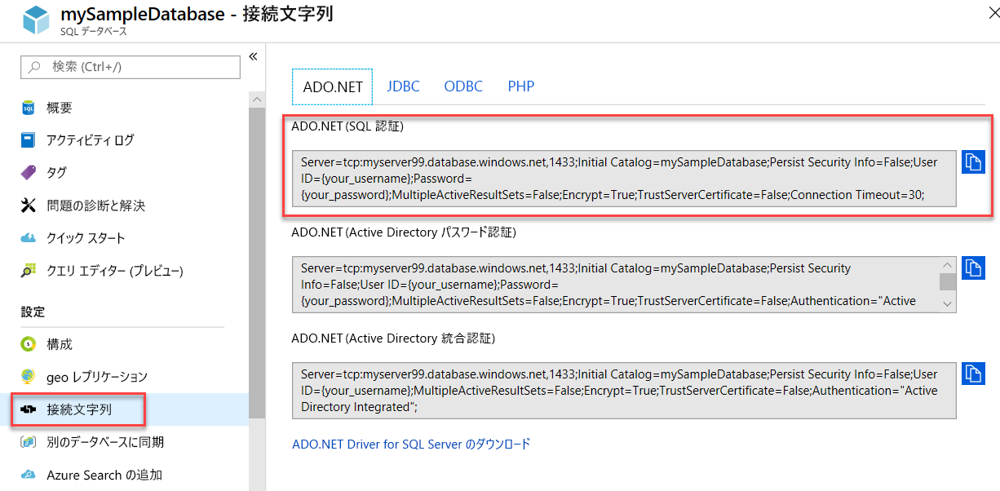

# Azure SQL Database と Azure SQL Managed Instance の接続とクエリに関する記事
[!INCLUDE[appliesto-sqldb-sqlmi](../includes/appliesto-sqldb-sqlmi.md)]

次のドキュメントには、Azure SQL Database と Azure SQL Managed Instance に接続してクエリを実行する方法を示す Azure の例へのリンクが含まれています。 トランスポート層セキュリティのいくつかの関連する推奨事項については、「[データベース接続に関する TLS の考慮事項](#tls-considerations-for-database-connectivity)」を参照してください。

## クイックスタート

| クイック スタート | 説明 |
|---|---|
|[SQL Server Management Studio](connect-query-ssms.md)|このクイック スタートでは、SSMS を使用してデータベースに接続し、Transact-SQL ステートメントを使用してデータベース内のデータに対してクエリ、挿入、更新、削除を実行する方法について説明します。|
|[Azure Data Studio](/sql/azure-data-studio/quickstart-sql-database?toc=%2fazure%2fsql-database%2ftoc.json)|このクイック スタートでは、Azure Data Studio を使用してデータベースに接続した後、Transact-SQL (T-SQL) ステートメントを使用して、Azure Data Studio チュートリアルで使用される TutorialDB を作成する方法を示します。|
|[Azure Portal](connect-query-portal.md)|このクイック スタートでは、クエリ エディターを使用してデータベース (Azure SQL Database のみ) に接続し、Transact-SQL ステートメントを使用してデータベース内のデータに対してクエリ、挿入、更新、および削除を実行する方法について説明します。|
|[Visual Studio Code](connect-query-vscode.md)|このクイック スタートでは、Visual Studio Code を使ってデータベースに接続し、Transact-SQL ステートメントを使ってデータベース内のデータに対してクエリ、挿入、更新、削除を実行する方法について説明します。|
|[Visual Studio での .NET](connect-query-dotnet-visual-studio.md)|このクイックスタートでは、Visual Studio で .NET Framework を使って C# プログラムを作成してデータベースに接続し、Transact-SQL ステートメントを使用してデータに対してクエリを実行する方法について説明します。|
|[.NET core](connect-query-dotnet-core.md)|このクイック スタートでは、Windows/Linux/macOS で .NET Core を使って C# プログラムを作成してデータベースに接続し、Transact-SQL ステートメントを使用してデータに対してクエリを実行する方法について説明します。|
|[Go](connect-query-go.md)|このクイック スタートでは、Go を使用してデータベースに接続する方法を紹介します。 Transact-SQL ステートメントを使用してデータを照会および変更する方法についても説明します。|
|[Java](connect-query-java.md)|このクイック スタートでは、Java を使ってデータベースに接続した後、Transact-SQL ステートメントを使ってデータに対してクエリを実行する方法について説明します。|
|[Node.js](connect-query-nodejs.md)|このクイック スタートでは、Node.js を使ってプログラムを作成してデータベースに接続し、Transact-SQL ステートメントを使ってデータに対してクエリを実行する方法について説明します。|
|[PHP](connect-query-php.md)|このクイック スタートでは、PHP を使ってプログラムを作成してデータベースに接続し、Transact-SQL ステートメントを使ってデータに対してクエリを実行する方法について説明します。|
|[Python](connect-query-python.md)|このクイック スタートでは、Python を使ってデータベースに接続し、Transact-SQL ステートメントを使ってデータに対してクエリを実行する方法について説明します。 |
|[Ruby](connect-query-ruby.md)|このクイック スタートでは、Ruby を使ってプログラムを作成してデータベースに接続し、Transact-SQL ステートメントを使ってデータに対してクエリを実行する方法について説明します。|
|[R](connect-query-r.md)|このクイック スタートでは、Azure SQL Database Machine Learning Services で R を使用して、Azure SQL Database のデータベースに接続するためのプログラムを作成し、Transact-SQL ステートメントを使用してデータに対してクエリを実行する方法について説明します。|
|||

## サーバーの接続情報を取得する

Azure SQL Database のデータベースに接続するために必要な接続情報を取得します。 後の手順で、完全修飾サーバー名またはホスト名、データベース名、およびログイン情報が必要になります。

1. [Azure portal](https://portal.azure.com/) にサインインします。

2. **[SQL データベース]** または **[SQL マネージド インスタンス]** ページに移動します。

3. **[概要]** ページで、Azure SQL Database のデータベースの場合は **[サーバー名]** の横の完全修飾サーバー名を確認し、Azure SQL マネージド インスタンスまたは Azure VM 上の SQL Server の場合は **[ホスト]** の横の完全修飾サーバー名 (または IP アドレス) を確認します。 サーバー名またはホスト名をコピーするには、名前をポイントして **[コピー]** アイコンを選択します。

> [!NOTE]
> Azure VM 上の SQL Server の接続情報については、[SQL Server インスタンスへの接続](../virtual-machines/windows/sql-vm-create-portal-quickstart.md#connect-to-sql-server)に関するページをご覧ください。

## ADO.NET の接続情報を取得する (省略可能 - SQL Database のみ)

1. Azure portal のデータベース ブレードに移動し、 **[設定]** の **[接続文字列]** を選択します。

2. 完全な **ADO.NET** 接続文字列を確認します。

    

3. 使用する場合は、**ADO.NET** の接続文字列をコピーします。

## データベース接続に関する TLS の考慮事項

トランスポート層セキュリティ (TLS) は、Azure SQL Database または Azure SQL Managed Instance 内のデータベースへの接続のために Microsoft で提供またはサポートされているすべてのドライバーで使用されています。 特別な構成は必要ありません。 SQL Server インスタンス、Azure SQL Database 内のデータベース、または Azure SQL Managed Instance のインスタンスへのすべての接続について、すべてのアプリケーションで次の構成またはそれと同等の構成を設定することをお勧めします。

- **Encrypt = On**
- **TrustServerCertificate = Off**

一部のシステムでは、これらの構成キーワードとは異なりますが同等のキーワードが使われています。 これらの構成を指定すると、サーバーから受信した TLS 証明書の ID をクライアント ドライバーが確認することが保証されます。

また、Payment Card Industry - データ セキュリティ基準 (PCI-DSS) に準拠する必要がある場合は、クライアントにおいて TLS 1.1 および 1.0 を無効にすることをお勧めします。

Microsoft 以外のドライバーは、既定では TLS を使用しない場合があります。 これは Azure SQL Database または Azure SQL Managed Instance に接続するときに問題になる可能性があります。 埋め込みドライバーを使用するアプリケーションでは、これらの接続設定を制御できない場合があります。 このようなドライバーおよびアプリケーションについては、機密データを操作するシステムで使う前に、そのセキュリティを調べることをお勧めします。

## ライブラリ

さまざまなライブラリとフレームワークを使用して、Azure SQL Database または Azure SQL Managed Instance に接続できます。 C#、Java、Node.js、PHP、Python などのプログラミング言語を手軽に始めるには、[開始にあたってのチュートリアル](https://aka.ms/sqldev)をご覧ください。 次に Linux、Windows、または macOS 上の Docker で SQL Server を使用してアプリを構築します。

次の表は、クライアント アプリケーションがさまざまな言語から SQL Server への接続に使用できる接続ライブラリや *ドライバー* を示しています。クライアント アプリケーションはオンプレミスおよびクラウドで実行される SQL Server と共にこれらを使用できます。 Linux、Windows、または Docker でこれらを使用して、Azure SQL Database、Azure SQL Managed Instance、および Azure Synapse Analytics に接続できます。

| Language | プラットフォーム | その他のリソース | ダウンロード | はじめに |
| :-- | :-- | :-- | :-- | :-- |
| C# | Windows、Linux、macOS | [Microsoft ADO.NET for SQL Server](/sql/connect/ado-net/microsoft-ado-net-sql-server) | [ダウンロード](https://www.microsoft.com/net/download/) | [開始するには](https://www.microsoft.com/sql-server/developer-get-started/csharp/ubuntu)
| Java | Windows、Linux、macOS | [SQL Server 用 Microsoft JDBC ドライバー](/sql/connect/jdbc/microsoft-jdbc-driver-for-sql-server/) | [ダウンロード](https://go.microsoft.com/fwlink/?linkid=852460) |  [開始するには](https://www.microsoft.com/sql-server/developer-get-started/java/ubuntu)
| PHP | Windows、Linux、macOS| [SQL Server 用 PHP SQL ドライバー](/sql/connect/php/microsoft-php-driver-for-sql-server) | [ダウンロード](/sql/connect/php/download-drivers-php-sql-server) | [開始するには](https://www.microsoft.com/sql-server/developer-get-started/php/ubuntu/)
| Node.js | Windows、Linux、macOS | [SQL Server 用 Node.js ドライバー](/sql/connect/node-js/node-js-driver-for-sql-server/) | [インストール](/sql/connect/node-js/step-1-configure-development-environment-for-node-js-development/) |  [開始するには](https://www.microsoft.com/sql-server/developer-get-started/node/ubuntu)
| Python | Windows、Linux、macOS | [Python SQL ドライバー](/sql/connect/python/python-driver-for-sql-server/) | インストール オプション:   \* [pymssql](/sql/connect/python/pymssql/step-1-configure-development-environment-for-pymssql-python-development/)   \* [pyodbc](/sql/connect/python/pyodbc/step-1-configure-development-environment-for-pyodbc-python-development/) |  [開始するには](https://www.microsoft.com/sql-server/developer-get-started/python/ubuntu)
| Ruby | Windows、Linux、macOS | [SQL Server 用 Ruby ドライバー](/sql/connect/ruby/ruby-driver-for-sql-server/) | [インストール](/sql/connect/ruby/step-1-configure-development-environment-for-ruby-development/) | [開始するには](https://www.microsoft.com/sql-server/developer-get-started/ruby/ubuntu)
| C++ | Windows、Linux、macOS | [Microsoft ODBC Driver for SQL Server](/sql/connect/odbc/microsoft-odbc-driver-for-sql-server/) | [ダウンロード](/sql/connect/odbc/microsoft-odbc-driver-for-sql-server/) |  

次の表に、クライアント アプリケーションが SQL Server、Azure SQL Database、Azure SQL Managed Instance、または Azure Synapse Analytics で使用できるオブジェクト リレーショナル マッピング (ORM) フレームワークと Web フレームワークの例を示します。 これらのフレームワークは、Linux、Windows、または Docker で使用できます。

| Language | プラットフォーム | ORM |
| :-- | :-- | :-- |
| C# | Windows、Linux、macOS | [Entity Framework](/ef) [Entity Framework Core](/ef/core/index) |
| Java | Windows、Linux、macOS |[Hibernate ORM](https://hibernate.org/orm)|
| PHP | Windows、Linux、macOS | [Laravel (Eloquent)](https://laravel.com/docs/eloquent) [Doctrine](https://www.doctrine-project.org/projects/orm.html) |
| Node.js | Windows、Linux、macOS | [Sequelize ORM](https://sequelize.org/) |
| Python | Windows、Linux、macOS |[Django](https://www.djangoproject.com/) |
| Ruby | Windows、Linux、macOS | [Ruby on Rails](https://rubyonrails.org/) |
||||

## 次のステップ

- 接続アーキテクチャについては、「[Azure SQL Database 接続アーキテクチャ](connectivity-architecture.md)」をご覧ください。
- クライアント アプリケーションからの接続に使用する [SQL Server 用ドライバー](/sql/connect/sql-connection-libraries/)を探します
- Azure SQL Database または Azure SQL Managed Instance に接続します。
  - [.NET (C#) を使用した接続とクエリ](connect-query-dotnet-core.md)
  - [PHP を使用した接続とクエリ](connect-query-php.md)
  - [Node.js を使用した接続とクエリ](connect-query-nodejs.md)
  - [Java を使用した接続とクエリ](connect-query-java.md)
  - [Python を使用した接続とクエリ](connect-query-python.md)
  - [Ruby を使用した接続とクエリ](connect-query-ruby.md)
- 再試行ロジックのコード例:
  - [ADO.NET を使用して弾性的に接続する][step-4-connect-resiliently-to-sql-with-ado-net-a78n]
  - [PHP を使用して弾性的に接続する][step-4-connect-resiliently-to-sql-with-php-p42h]

<!-- Link references. -->

[step-4-connect-resiliently-to-sql-with-ado-net-a78n]: /sql/connect/ado-net/step-4-connect-resiliently-sql-ado-net

[step-4-connect-resiliently-to-sql-with-php-p42h]: /sql/connect/php/step-4-connect-resiliently-to-sql-with-php
