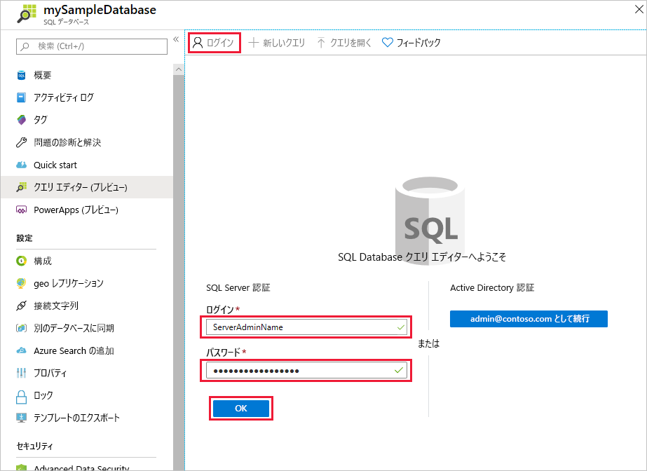
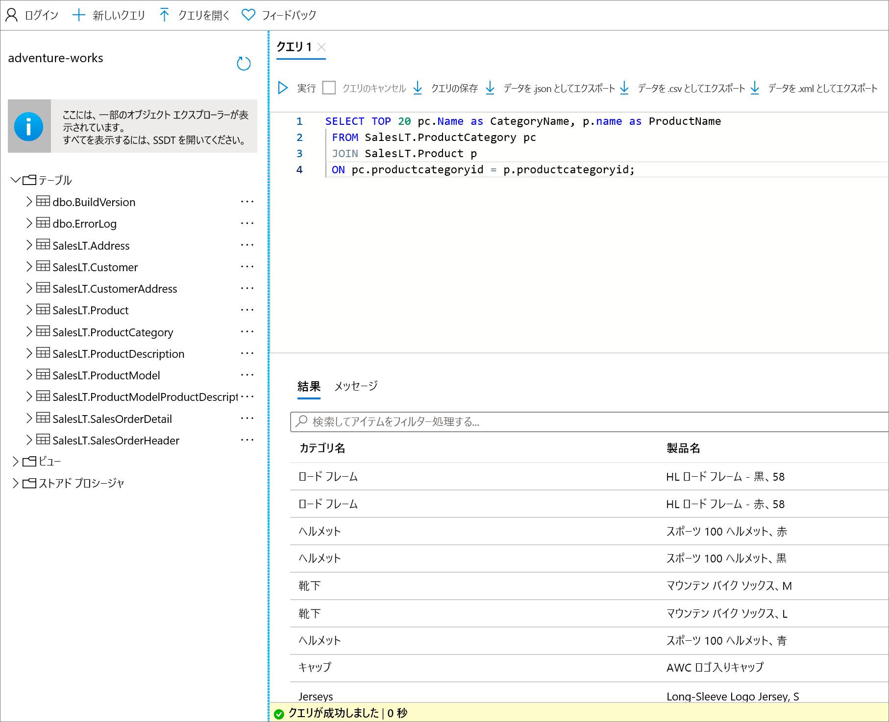

# <a name="quickstart-use-the-azure-portals-query-editor-preview-to-query-an-azure-sql-database"></a>クイック スタート:Azure portal のクエリ エディター (プレビュー) を使用して、Azure SQL Database のクエリを実行します
[!INCLUDE[appliesto-sqldb](../includes/appliesto-sqldb.md)]

クエリ エディターは、Azure SQL Database のデータベース、または Azure Synapse Analytics のデータ ウェアハウスに対して SQL クエリを実行するための Azure portal のツールです。 

このクイック スタートでは、クエリ エディターを使用して、データベースに対して Transact-SQL (T-SQL) クエリを実行する方法について説明します。

## <a name="prerequisites"></a>前提条件

このチュートリアルを完了するには、AdventureWorksLT サンプル データベースが必要です。 SQL Database に AdventureWorksLT サンプル データベースの作業コピーがない場合は、次のクイックスタートで簡単に作成できます。

- [クイック スタート: Azure portal、PowerShell、Azure CLI を使用して Azure SQL Database にデータベースを作成する](single-database-create-quickstart.md) 

### <a name="configure-network-settings"></a>ネットワーク設定の構成

クエリ エディターで、[*ローカル ネットワーク設定が原因で、クエリ エディターでクエリを発行できない可能性があります。ネットワーク設定の構成方法の手順については、こちらをクリックしてください。* ]、または [*サーバーへの接続を確立できませんでした。ローカル ファイアウォールの構成またはネットワーク プロキシの設定に問題がある可能性があります。* ] のいずれかが発生した場合、次の重要な情報が解決に役立ちます。

> [!IMPORTANT]
> クエリ エディターでは、通信にポート 443 と 1443 が使用されます。 これらのポートで、確実にアウトバウンド HTTPS トラフィックを有効にしておいてください。 また、お使いのデータベースおよびデータ ウェアハウスにアクセスできるようにするには、[サーバーの許可されたファイアウォール規則に、アウトバウンド IP アドレスを追加する](firewall-create-server-level-portal-quickstart.md)必要があります。


## <a name="open-the-sql-database-query-editor"></a>SQL Database クエリ エディターを開く

1. [Azure portal](https://portal.azure.com/) にサインインして、クエリを実行するデータベースを選択します。

2. **[SQL データベース]** メニューで、 **[クエリ エディター (プレビュー)]** を選択します。

    


## <a name="establish-a-connection-to-the-database"></a>データベースへの接続を確立する

ポータルにサインインしている場合でも、データベースにアクセスするために資格情報を入力する必要があります。 お使いのデータベースに接続するには、SQL 認証または Azure Active Directory を使用できます。

### <a name="connect-using-sql-authentication"></a>SQL 認証を使用して接続する

1. **[ログイン]** ページの **[SQL Server 認証]** で、データベースへのアクセス権を持つユーザーの **[ログイン]** と **[パスワード]** を入力します。 わからない場合は、データベース サーバーのサーバー管理者のログインとパスワードを使用します。

    

2. **[OK]** を選択します。


### <a name="connect-using-azure-active-directory"></a>Azure Active Directory への接続

Azure Active Directory (Azure AD) 管理者を構成すると、単一の ID を使用して Azure portal とデータベースにサインインできます。 Azure AD を使用してデータベースに接続するには、次の手順に従って、SQL Server インスタンスの Azure AD 管理者を構成します。

> [!NOTE]
> * 電子メール アカウント (たとえば、outlook.com、gmail.com、yahoo.com など) は、Azure AD 管理者としてはまだサポートされていません。 Azure AD でネイティブに作成されたユーザーか、Azure AD にフェデレーションされたユーザーのどちらかを必ず選択してください。
> * Azure AD 管理者のサインインは、2 要素認証が有効になっているアカウントでは機能しません。

#### <a name="set-an-active-directory-admin-for-the-server"></a>サーバーの Active Directory 管理者を設定する

1. Azure portal で、お使いの SQL Server インスタンスを選択します。

2. **[SQL Server]** メニューで、 **[Active Directory 管理者]** を選択します。

3. SQL Server の **[Active Directory 管理者]** ページのツールバーで **[管理者の設定]** を選択し、ユーザーまたはグループを Azure AD 管理者として選択します。

    

4. **[管理者の追加]** ページで、検索ボックスにユーザーまたはグループを入力して検索し、それを管理者として選択した後、 **[選択]** ボタンを選択します。

5. SQL Server の **[Active Directory 管理者]** ページのツールバーに戻り、 **[保存]** を選択します。

### <a name="connect-to-the-database"></a>データベースに接続する

6. **[SQL Server]** メニューで、 **[SQL データベース]** を選択し、データベースを選択します。

7. **[SQL データベース]** メニューで、 **[クエリ エディター (プレビュー)]** を選択します。 **[ログイン]** ページで、 **[Active Directory 認証]** ラベルの下に、サインインしたことを示すメッセージが表示されます (Azure AD 管理者の場合)。次に、[ *\<your user or group ID>* **として続行**] ボタンを選択します。 ページに、ログインが成功しなかったことが表示された場合、ページを更新する必要がある場合があります。

## <a name="query-a-database-in-sql-database"></a>SQL Database のデータベースに対してクエリを実行する

次の例のクエリは、AdventureWorksLT サンプル データベースに対して正常に実行されます。

### <a name="run-a-select-query"></a>SELECT クエリを実行する

1. 次のクエリをクエリ エディターに貼り付けます。

   ```sql
    SELECT TOP 20 pc.Name as CategoryName, p.name as ProductName
    FROM SalesLT.ProductCategory pc
    JOIN SalesLT.Product p
    ON pc.productcategoryid = p.productcategoryid;
   ```

2. **[実行]** を選択して、 **[結果]** ウィンドウで出力を確認します。

   

3. 必要に応じて、クエリを .sql ファイルとして保存するか、返されたデータを .json、.csv、または .xml ファイルとしてエクスポートします。

### <a name="run-an-insert-query"></a>INSERT クエリを実行する

[INSERT](/sql/t-sql/statements/insert-transact-sql/) T-SQL ステートメントを実行して、`SalesLT.Product` テーブルに新しい製品を追加します。

1. 前のクエリを次のクエリに置き換えます。

    ```sql
    INSERT INTO [SalesLT].[Product]
           ( [Name]
           , [ProductNumber]
           , [Color]
           , [ProductCategoryID]
           , [StandardCost]
           , [ListPrice]
           , [SellStartDate]
           )
    VALUES
           ('myNewProduct'
           ,123456789
           ,'NewColor'
           ,1
           ,100
           ,100
           ,GETDATE() );
   ```


2. **[実行]** を選択して、新しい行を `Product` テーブルに挿入します。 **メッセージ** ペインに、 **[クエリが成功しました: 影響を受ける行: 1]** と表示されます。


### <a name="run-an-update-query"></a>UPDATE クエリを実行する

次の [UPDATE](/sql/t-sql/queries/update-transact-sql/) T-SQL ステートメントを実行して、新しい製品を変更します。

1. 前のクエリを次のクエリに置き換えます。

   ```sql
   UPDATE [SalesLT].[Product]
   SET [ListPrice] = 125
   WHERE Name = 'myNewProduct';
   ```

2. **[実行]** を選択して、`Product` テーブルの指定した行を更新します。 **メッセージ** ペインに、 **[クエリが成功しました: 影響を受ける行: 1]** と表示されます。

### <a name="run-a-delete-query"></a>DELETE クエリを実行する

次の [DELETE](/sql/t-sql/statements/delete-transact-sql/) T-SQL ステートメントを実行して、新しい製品を削除します。

1. 前のクエリを次のクエリに置き換えます。

   ```sql
   DELETE FROM [SalesLT].[Product]
   WHERE Name = 'myNewProduct';
   ```

2. **[実行]** を選択して、`Product` テーブルの指定した行を削除します。 **メッセージ** ペインに、 **[クエリが成功しました: 影響を受ける行: 1]** と表示されます。


## <a name="query-editor-considerations"></a>クエリ エディターに関する考慮事項

クエリ エディターを操作するときは次の点に注意してください。

* クエリ エディターでは、通信にポート 443 と 1443 が使用されます。 これらのポートで、確実にアウトバウンド HTTPS トラフィックを有効にしておいてください。 また、お使いのデータベースとデータ ウェアハウスにアクセスできるようにするには、サーバーの許可されたファイアウォール規則に、送信 IP アドレスを追加する必要があります。

* Private Link 接続を使用している場合、クエリ エディターは、SQL Database ファイアウォールにクライアント IP アドレスを追加しなくても機能します。

* **F5** キーを押してクエリ エディター ページを更新すると、操作中のクエリは失われます。

* クエリ エディターは、`master` データベースへの接続をサポートしません。

* クエリの実行には、5 分のタイムアウトがあります。

* geography データ型に関してクエリ エディターでサポートされるのは円柱投影のみです。

* データベース テーブルおよびビューに対して IntelliSense はサポートされていませんが、エディターでは、既に入力された名前のオートコンプリートがサポートされています。


## <a name="next-steps"></a>次のステップ

Azure SQL Database でサポートされる Transact-SQL (T-SQL) の詳細については、「[SQL Database への移行時に Transact-SQL の相違点を解決する](transact-sql-tsql-differences-sql-server.md)」を参照してください。
