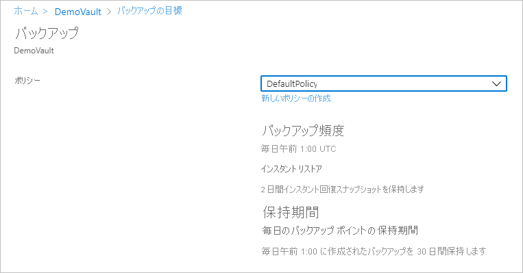

# Recovery Services コンテナーに Azure VM をバックアップする

この記事では、[Azure Backup](backup-overview.md) サービスを使用して Recovery Services コンテナーに Azure VM をバックアップする方法について説明します。

この記事では、次のことについて説明します。

> [!div class="checklist"]
>
> * Azure VM を準備する。
> * コンテナーを作成する。
> * VM を検出し、バックアップ ポリシーを構成する。
> * Azure VM のバックアップを有効にする。
> * 初回バックアップを実行する。

> [!NOTE]
> この記事では、コンテナーの設定方法およびバックアップする VM の選択方法について説明します。 これは複数の VM をバックアップする場合に便利です。 また、VM の設定から直接 [1 つの Azure VM をバックアップする](backup-azure-vms-first-look-arm.md)こともできます。

## 開始する前に

* Azure VM のバックアップ アーキテクチャを[確認する](backup-architecture.md#architecture-built-in-azure-vm-backup)。
* Azure VM のバックアップとバックアップ拡張機能の[詳細を確認](backup-azure-vms-introduction.md)する。
* バックアップを構成する前に、[サポート マトリックスを確認](backup-support-matrix-iaas.md)する。

さらに、状況によっては、いくつか行う必要があることがあります。

* **VM に VM エージェントをインストールする**: Azure Backup では、マシンで実行されている Azure VM エージェントに拡張機能をインストールすることで、Azure VM がバックアップされます。 VM が Azure Marketplace のイメージから作成されている場合は、エージェントがインストールされ、実行されます。 カスタム VM を作成する場合、またはオンプレミスのマシンを移行する場合は、[手動でのエージェントのインストール](#install-the-vm-agent)が必要な場合があります。

[!INCLUDE [How to create a Recovery Services vault](../../includes/backup-create-rs-vault.md)]

### ストレージ レプリケーションを変更する

既定では、コンテナーには [geo 冗長ストレージ (GRS)](../storage/common/storage-redundancy.md) が使用されます。

* コンテナーをプライマリ バックアップ メカニズムとする場合は、GRS を使用することをお勧めします。
* コストを抑えるオプションとして[ローカル冗長ストレージ (LRS)](../storage/common/storage-redundancy.md?toc=/azure/storage/blobs/toc.json) を使用できます。

ストレージ レプリケーションの種類を変更にするには、次の手順に従います。

1. 新しいコンテナーで、 **[設定]** セクションの **[プロパティ]** を選択します。
2. **[プロパティ]** で、 **[バックアップ構成]** の **[更新]** を選択します。
3. ストレージのレプリケーションの種類を選択し、 **[保存]** を選択します。

      

> [!NOTE]
   > コンテナーを設定してバックアップ項目を格納した後で、ストレージ レプリケーションの種類を変更することはできません。 これを行う場合は、コンテナーを再作成する必要があります。

## バックアップ ポリシーを適用する

コンテナー用のバックアップ ポリシーを構成します。

1. コンテナーで、 **[概要]** セクションの **[+バックアップ]** を選択します。

   ![[バックアップ] ボタン](./media/backup-azure-arm-vms-prepare/backup-button.png)

1. **[バックアップの目標]**  >  **[ワークロードはどこで実行されていますか?]** で **[Azure]** を選択します。 **[バックアップの対象]** で、 **[仮想マシン]**  >   **[OK]** を選択します。 これにより、VM 拡張機能がコンテナーに登録されます。

   ![[バックアップ] ウィンドウと [バックアップの目標] ウィンドウ](./media/backup-azure-arm-vms-prepare/select-backup-goal-1.png)

1. **[バックアップ ポリシー]** で、コンテナーに関連付けるポリシーを選択します。
    * 既定のポリシーでは、1 日に 1 回、VM がバックアップされます。 毎日のバックアップは 30 日間保持されます。 インスタント回復スナップショットは 2 日間保持されます。

      

    * 既定のポリシーを使用する必要がない場合は、 **[新規作成]** を選択し、次の手順に従ってカスタム ポリシーを作成します。

1. **[仮想マシン]** で、 **[追加]** を選択します。

      ![[仮想マシンの追加]](./media/backup-azure-arm-vms-prepare/add-virtual-machines.png)

1. **[仮想マシンの選択]** ペインが開きます。 ポリシーを使用してバックアップを作成する VM を選択します。 **[OK]** をクリックします。

   * 選択した VM が検証されます。
   * コンテナーと同じリージョンにある VM のみを選択できます。
   * VM は、1 つのコンテナーでのみバックアップできます。

     ![[仮想マシンの選択] ウィンドウ](./media/backup-azure-arm-vms-prepare/select-vms-to-backup.png)

    >[!NOTE]
    > コンテナーと同じリージョンおよびサブスクリプション内のすべての VM をバックアップの構成に使用できます。 バックアップを構成するときに、それらの VM に対して必要なアクセス許可がなくても、仮想マシン名とそのリソース グループを参照できます。 VM が論理的に削除された状態の場合、この一覧には表示されません。 VM を再度保護する必要がある場合は、論理的な削除の期間が経過するまで待つか、または論理的に削除されたものの一覧から VM の削除を取り消す必要があります。 詳細については、[VM に対する論理的な削除に関する記事](soft-delete-virtual-machines.md#soft-delete-for-vms-using-azure-portal)を参照してください。

1. **[バックアップ]** で、 **[バックアップの有効化]** を選択します。 これにより、ポリシーがコンテナーと VM にデプロイされ、Azure VM で実行されている VM エージェントにバックアップ拡張機能がインストールされます。

バックアップの有効化後:

* バックアップ拡張機能は、VM が実行されているかどうかにかかわらず、Backup サービスによってインストールされます。
* バックアップ スケジュールに従って初回バックアップが実行されます。
* バックアップの実行時には、次の点に注意してください。
  * 実行されている VM では、アプリケーション整合性復旧ポイントが取り込まれる可能性が最も高くなります。
  * ただし、VM がオフになっている場合でも、VM はバックアップされます。 このような VM はオフライン VM と呼ばれます。 この場合、復旧ポイントは、クラッシュ整合性復旧ポイントになります。
* Azure VM のバックアップを許可するために、明示的な送信接続は必須ではありません。

### カスタム ポリシーの作成

新しいバックアップ ポリシーを作成するように選択した場合は、ポリシー設定を入力します。

1. **[ポリシー名]** で、わかりやすい名前を指定します。
2. **[バックアップ スケジュール]** で、バックアップを作成するタイミングを指定します。 Azure VM について毎日または毎週のバックアップを作成できます。
3. **[インスタント リストア]** で、インスタント リストアに備えてスナップショットをローカルで保持する期間を指定します。
    * 復元の際は、バックアップされた VM ディスクが、ストレージからネットワーク経由で復旧ストレージの場所にコピーされます。 インスタント リストアを使用すれば、バックアップ ジョブ中に作成されローカルに格納されたスナップショットを活用できるので、バックアップ データがコンテナーに転送されるのを待たずに済みます。
    * インスタント リストア用のスナップショットは、1 日から 5 日間、保持することができます。 既定値は 2 日間です。
4. **[保有期間の範囲]** で、毎日または毎週のバックアップのポイントを保持する期間を指定します。
5. **[毎月のバックアップ ポイントの保持期間]** と **[毎年のバックアップ ポイントの保持期間]** で、毎日または毎週のバックアップの毎月または毎年のバックアップを保持するかどうかを指定します。
6. **[OK]** を選択してポリシーを保存します。

    

> [!NOTE]
   > Azure Backup では、Azure VM バックアップの夏時間変更に対する時計の自動調整はサポートされていません。 時間の変更が行われたら、必要に応じて手動でバックアップ ポリシーを変更します。

## 初回バックアップをトリガーする

初回バックアップはスケジュールに従って実行されますが、次のようにすぐに実行することもできます。

1. コンテナー メニューで **[バックアップ項目]** を選択します。
2. **[バックアップ項目]** で、 **[Azure Virtual Machine]** を選択します。
3. **[バックアップ項目]** の一覧で、省略記号 [...] を選択します。
4. **[今すぐバックアップ]** を選択します。
5. **[今すぐバックアップ]** で、カレンダー コントロールを使用して復旧ポイントを保持する最終日を選択します。 **[OK]** をクリックします。
6. ポータルの通知を監視します。 コンテナー ダッシュボードの **[バックアップ ジョブ]**  >  **[進行中]** でジョブの進行状況を監視できます。 VM のサイズによっては、最初のバックアップの作成に時間がかかる場合があります。

## バックアップ ジョブの状態を確認する

各 VM バックアップのバックアップ ジョブの詳細は、**スナップショット** フェーズとその後の**コンテナーへのデータ転送**フェーズの 2 つのフェーズで構成されます。 
スナップショット フェーズは、**インスタント リストア**用のディスクと共に格納される復旧ポイントの可用性を保証し、ユーザーによって構成されるスナップショットの保持期間に応じて最大 5 日間使用できます。 コンテナーへのデータ転送では、長期の保持期間のためにコンテナー内に復旧ポイントを作成します。 コンテナーへのデータ転送は、スナップショット フェーズが完了した後でのみ開始されます。

  

バックエンドで実行されている 2 つの**サブタスク**があり、1 つは、下に示すように **[バックアップ ジョブ]** 詳細ウィンドウから確認できるフロント エンド バックアップ ジョブ用です。

  

**コンテナーへのデータ転送**フェーズは、ディスクのサイズ、ディスクごとのチャーン、その他のいくつかの要因に応じて、完了するまでに数日かかる場合があります。

ジョブの状態は、次のシナリオによって異なることがあります。

**スナップショット** | **コンテナーへのデータ転送** | **ジョブの状態**
--- | --- | ---
完了 | 進行中 | 進行中
完了 | スキップ | 完了
完了 | 完了 | 完了
完了 | 失敗 | 警告で完了
失敗 | 失敗 | 失敗

この機能により、同じ VM に対して 2 つのバックアップを並列に実行できるようになりましたが、どちらのフェーズ (スナップショット、コンテナーへのデータ転送) でも実行できるのは 1 つのサブタスクだけです。 この分離機能により、進行中のバックアップ ジョブが翌日のバックアップになって失敗するシナリオは回避されます。 次の日のバックアップは、前の日のバックアップ ジョブが進行中の状態にある場合、**コンテナーへのデータ転送**がスキップされた状態でスナップショットを完了できます。
コンテナーで作成された増分型の復旧ポイントは、コンテナーで作成された最後の復旧ポイントからのすべてのチャーンをキャプチャします。 ユーザーへのコストの影響はありません。

## 省略可能な手順

### VM エージェントのインストール

Azure Backup では、マシンで実行されている Azure VM エージェントに拡張機能をインストールすることで、Azure VM がバックアップされます。 VM が Azure Marketplace のイメージから作成されている場合は、エージェントがインストールされ、実行されます。 カスタム VM を作成する場合、またはオンプレミスのマシンを移行する場合は、表に示すように、エージェントを手動でインストールする必要があります。

**VM** | **詳細**
--- | ---
**Windows** | 1.エージェント MSI ファイルを[ダウンロードしてインストール](https://go.microsoft.com/fwlink/?LinkID=394789&clcid=0x409)します。   2.マシンでの管理者権限でインストールします。   3.インストールを確認します。 VM 上の *C:\WindowsAzure\Packages* で、**WaAppAgent.exe** >  を右クリックして、 **[プロパティ]** を選択します。 **[詳細]** タブで、 **[製品バージョン]** が 2.6.1198.718 以降であることを確認します。   エージェントを更新する場合は、バックアップ操作が実行されていないことを確認し、[エージェントを再インストール](https://go.microsoft.com/fwlink/?LinkID=394789&clcid=0x409)します。
**Linux** | ディストリビューションのパッケージのリポジトリから、RPM または DEB パッケージを使用してインストールします。 これは、Azure Linux エージェントのインストールおよびアップグレードとしてお勧めする方法です。 すべての[動作保証済みディストリビューション プロバイダー](../virtual-machines/linux/endorsed-distros.md)Azure Linux エージェント パッケージをイメージとリポジトリに統合します。 エージェントは [GitHub](https://github.com/Azure/WALinuxAgent) から入手できますが、そこからインストールすることはお勧めできません。   エージェントを更新する場合は、バックアップ操作が実行されていないことを確認し、バイナリを更新します。

## 次のステップ

* [Azure VM エージェント](backup-azure-troubleshoot-vm-backup-fails-snapshot-timeout.md)または [Azure VM バックアップ](backup-azure-vms-troubleshoot.md)で発生する問題のトラブルシューティング。
* Azure VM の[復元](backup-azure-arm-restore-vms.md)。
