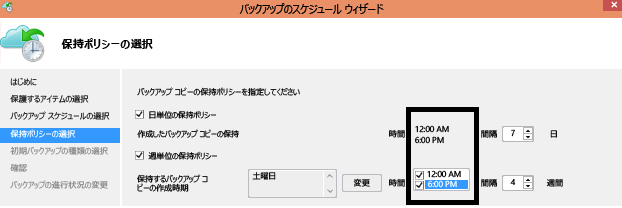

# Azure Backup - よく寄せられる質問
この記事では、Azure Backup サービスについてよく寄せられる質問への回答を示します。

## Recovery Services コンテナー

### 各 Azure サブスクリプションで作成できるコンテナーの数に制限はありますか。
はい。 サブスクリプションあたり、Azure Backup のサポートされているリージョンごとに最大 500 の Recovery Services コンテナーを作成できます。 コンテナーがさらに必要な場合は、追加のサブスクリプションを作成してください。

### 各コンテナーに登録できるサーバーやマシンの数に制限はありますか。
コンテナーあたり最大 1000 の Azure 仮想マシンを登録できます。 Microsoft Azure Backup エージェントを使用している場合は、コンテナーあたり最大 50 の MAB エージェントを登録できます。 1 つのコンテナーには、50 の MAB サーバー/DPM サーバーを登録できます。

### コンテナーで保護できるデータソース/項目の数はいくつですか。 
すべてのワークロード (IaaS VM、SQL、AFS など) にわたる最大 2000 のデータソース/項目をコンテナーで保護することができます。   
たとえば、既に 500 個の VM と 400 個の Azure Files 共有がコンテナーで保護されている場合、そこで保護できる SQL データベースの数は最大 1100 個だけです。 

### コンテナーごとに作成できるポリシーはいくつですか。 
作成できるポリシーはコンテナーあたり最大 200 に限られます。

### 組織で所有しているコンテナーが 1 つの場合、データを復元する際にコンテナー内の他のサーバーのデータを分離するには、どうすればよいですか。
まとめて復旧するサーバー データには、バックアップをセットアップするときに、同じパスフレーズを使用してください。 1 つ以上の特定のサーバーを分離して復旧する場合は、該当するサーバー専用のパスフレーズを使用します。 たとえば、人事部門のサーバーで特定の暗号化パスフレーズを使用し、経理部門のサーバーで 2 番目、ストレージ サーバーで 3 番目の暗号化パスフレーズを使用することができます。

### サブスクリプション間でコンテナーを移動することはできますか。
はい。 Recovery Services コンテナーの移動については、こちらの[記事](backup-azure-move-recovery-services-vault.md)をご覧ください

### バックアップ データを別のコンテナーに移動することはできますか。
いいえ。 コンテナーに保存されているバックアップ データを別のコンテナーに移行することはできません。

### バックアップ後に GRS から LRS へ変更することはできますか?
いいえ。 Recovery Services コンテナーでは、バックアップが保存される前にしか、ストレージ オプションを変更できません。

### Recovery Services コンテナーにバックアップした VM でアイテム レベルの復元 (ILR) を行うことはできますか。
- ILR は、Azure VM バックアップによってバックアップされている Azure VM に対してサポートされています。 詳しくは、[こちらの記事](backup-azure-restore-files-from-vm.md)をご覧ください
- ILR は、Azure Backup Server または System Center DPM によってバックアップされているオンプレミスの VM のオンライン復旧ポイントに対してはサポートされていません。

## Azure Backup エージェント

### Azure VM のバックアップに使用される Azure Backup エージェントについてよく寄せられる質問は、どこで確認できますか。

- Azure VM 上で実行されるエージェントについては、この [FAQ](backup-azure-vm-backup-faq.md) をご覧ください。
- Azure ファイル フォルダーのバックアップに使用されるエージェントについては、こちらの [FAQ](backup-azure-file-folder-backup-faq.md) をご覧ください。

## 一般的なバックアップ

### バックアップのスケジュール設定に制限はありますか。
はい。
- Windows Server または Windows マシンをバックアップできるのは、1 日 3 回までです。 スケジューリング ポリシーは、毎日または毎週のスケジュールに設定できます。
- DPM をバックアップできるのは、1 日 2 回までです。 スケジューリング ポリシーは、毎日、毎週、毎月、および毎年のスケジュールに設定できます。
- Azure VM のバックアップは 1 日 1 回に限られます。

### バックアップでサポートされているオペレーティング システムはどれですか。
ファイルとフォルダーのほか、Azure Backup Server と DPM を使用して保護されたアプリのバックアップについて、Azure Backup では次のオペレーティング システムをサポートしています。

**OS** | **SKU** | **詳細**
--- | --- | ---
ワークステーション | |
Windows 10 64 ビット | Enterprise、Pro、Home | マシンで最新の Service Pack および更新プログラムが実行されている必要があります。
Windows 8.1 64 ビット | Enterprise、Pro | マシンで最新の Service Pack および更新プログラムが実行されている必要があります。
Windows 8 64 ビット | Enterprise、Pro | マシンで最新の Service Pack および更新プログラムが実行されている必要があります。
Windows 7 64 ビット | Ultimate、Enterprise、Professional、Home Premium、Home Basic、Starter | マシンで最新の Service Pack および更新プログラムが実行されている必要があります。
サーバー | |
Windows Server 2019 64 ビット | Standard、Datacenter、Essentials | 最新の Service Pack/更新プログラムが適用されていること。
Windows Server 2016 64 ビット | Standard、Datacenter、Essentials | 最新の Service Pack/更新プログラムが適用されていること。
Windows Server 2012 R2 64 ビット | Standard、Datacenter、Foundation | 最新の Service Pack/更新プログラムが適用されていること。
Windows Server 2012 64 ビット | Datacenter、Foundation、Standard | 最新の Service Pack/更新プログラムが適用されていること。
Windows Storage Server 2016 64 ビット | Standard、Workgroup | 最新の Service Pack/更新プログラムが適用されていること。
Windows Storage Server 2012 R2 64 ビット | Standard、Workgroup、Essential | 最新の Service Pack/更新プログラムが適用されていること。
Windows Storage Server 2012 64 ビット | Standard、Workgroup | 最新の Service Pack/更新プログラムが適用されていること。
Windows Server 2008 R2 SP1 64 ビット | Standard、Enterprise、Datacenter、Foundation | 最新の更新プログラムが適用されていること。
Windows Server 2008 64 ビット | Standard、Enterprise、Datacenter | 最新の更新プログラムが適用されていること。

Azure VM Linux のバックアップについては、Azure Backup は [Azure で承認されている一連のディストリビューション](../virtual-machines/linux/endorsed-distros.md)をサポートしています。ただし、Core OS Linux と 32 ビットオペレーティング システムは除きます。 他の個人所有の Linux ディストリビューションは、VM 上で VM エージェントが動作し、かつ Python がサポートされていれば使用できます。

### データのバックアップにサイズ制限はありますか。
次のサイズ制限が適用されます。

OS/マシン | データ ソースのサイズ制限
--- | ---
Windows 8 以降 | 54,400 GB
Windows 7 |1,700 GB
Windows Server 2012 またはそれ以降 | 54,400 GB
Windows Server 2008、Windows Server 2008 R2 | 1,700 GB
Azure VM | 16 個のデータ ディスク   最大 4095 GB のデータ ディスク

### データ ソースのサイズはどのように決定されますか。
次の表では、各データ ソースのサイズが決定される方法について説明しています。

**データ ソース** | **詳細**
--- | ---
ボリューム |バックアップ対象の VM の 1 つのボリュームからバックアップされるデータの量。
SQL Server データベース |バックアップされる 1 つの SQL データベースのサイズ。
SharePoint | バックアップ対象の SharePoint ファーム内のコンテンツと構成データベースの合計。
Exchange |バックアップ対象の Exchange サーバー内のすべての Exchange データベースの合計。
BMR/システム状態 |バックアップ対象のコンピューターの BMR またはシステム状態の個々のコピー。

### Recovery Services コンテナーを使用してバックアップできるデータ量に制限はありますか。
Recovery Services コンテナーを使用してバックアップできるデータ量に制限はありません。

### Recovery Services コンテナーに転送されたデータのサイズが、バックアップ対象として選択したデータよりも小さいのはなぜでしょうか。
Azure Backup エージェント、DPM、または Azure Backup Server からバックアップしたデータは、圧縮および暗号化されてから転送されます。 圧縮と暗号化が適用されると、コンテナー内のデータのサイズは 30 から 40% 小さくなります。

### コンテナー内の復旧ポイントから個々のファイルを削除できますか。
いいえ。Azure Backup では、保存されているバックアップからの個々の項目の削除または消去はサポートしていません。

### バックアップを開始した後でバックアップ ジョブを取り消すと、転送されたバックアップ データは削除されますか。
いいえ。 バックアップ ジョブを取り消す前にコンテナーに転送されたすべてのデータは、コンテナー内に残ります。

- Azure Backup では、チェックポイント メカニズムを使用して、バックアップ中に随時バックアップ データにチェックポイントを追加します。
- バックアップ データにチェックポイントがあることで、次回のバックアップ処理でファイルの整合性を検証できます。
- 次のバックアップ ジョブは、これまでバックアップしたデータの増分になります。 増分バックアップでは、新しいデータまたは変更されたデータのみが転送され、帯域幅の使用状況が向上します。

Azure VM のバックアップ ジョブを取り消した場合、転送済みのデータは無視されます。 次のバックアップ ジョブでは、最後に成功したバックアップ ジョブから増分データが転送されます。

## 保有期間と復元

### DPM での保有ポリシーと DPM を使用しない Windows マシンでの保有ポリシーは同じですか。
はい。どちらとも、保有ポリシーとして毎日、毎週、毎月、毎年を指定できます。

### 保有ポリシーをカスタマイズできますか。
はい、ポリシーをカスタマイズして使用できます。 たとえば、保有期間の要件を毎週および毎日として構成し、毎年や毎月の保有期間の要件を構成しないこともできます。

### バックアップ スケジュールと保有ポリシーを別々の期間に使用できますか。
いいえ。 保有ポリシーは、バックアップ ポイントにのみ適用できます。 一例として、この図には午前 12 時と午後 6 時に作成されたバックアップの保有ポリシーが示されています。

### バックアップを長期にわたって保持した場合、データ ポイントが古いほど復元に時間がかかるのでしょうか。  
いいえ。 最古のデータ ポイントも最新のデータ ポイントも復元に要する時間は同じです。 それぞれの回復ポイントは、完全なポイントと同じように動作します。

### それぞれの回復ポイントが完全なポイントと同じように機能する場合、それは課金対象のバックアップ ストレージの合計に影響するのでしょうか。
一般的に、回復ポイントのリテンション期間が長い製品では、バックアップ データが完全なポイントとして格納されます。

- 完全なポイントは、ストレージ効率は *悪く* なりますが、簡単かつ迅速に復元できます。
- 一方、増分コピーはストレージ効率が*向上*しますが、データのチェーンを復元する必要があり、復旧時間に影響します。

Azure Backup のストレージ アーキテクチャを使用すると、高速に復元するためにデータの格納を最適化し、ストレージ コストを低く抑えることで、両方の長所を生かすことができます。 これにより、送受信の帯域幅が効率的に使用されるようになります。 データ ストレージの量とデータ回復にかかる時間がどちらも最小限に抑えられます。 詳細については、[増分バックアップ](https://azure.microsoft.com/blog/microsoft-azure-backup-save-on-long-term-storage/)を参照してください。

### 作成できる回復ポイント数に制限はありますか。
保護されているインスタンスごとに作成できる復旧ポイントは最大 9,999 個です。 保護されたインスタンスとは、Azure へのバックアップを行うコンピューター、サーバー (物理または仮想)、またはワークロードです。

- 詳細については、[バックアップと保有期間](./backup-overview.md#backup-and-retention)を参照してください。

### Azure にバックアップされたデータを回復できる回数に制限はありますか。
Azure Backup からの回復の数に制限はありません。

### データを復元している間に発生する Azure からのエグレス トラフィックには料金が発生するのでしょうか。
いいえ。 データ回復は無料ですので、送信トラフィックに対しては課金されません。

### バックアップ ポリシーを変更した場合どうなりますか。
新しいポリシーが適用されると、新しいポリシーのスケジュールとリテンション期間が適用されます。

- リテンション期間が延長された場合、既にある復旧ポイントは、新しいポリシーに従って保存するようにマーキングされます。
- リテンション期間が短縮された場合、次回のクリーンアップ ジョブで排除対象としてマーキングされて、その後削除されます。

## 暗号化

### Azure に送信されるデータは暗号化されますか。
はい。 データはオンプレミスのマシン上で AES256 を使用して暗号化されます。 データは、セキュリティで保護された HTTPS リンク上で送信されます。 クラウド内で送信されたデータは、ストレージと復旧サービス間の HTTPS リンクのみで保護されています。 iSCSI プロトコルは、復旧サービスとユーザー マシン間で送信されるデータをセキュリティで保護します。 iSCSI チャネルの保護には、セキュリティで保護されたトンネリングが使用されます。

### Azure 上のバックアップ データも暗号化されますか。
はい。 Azure 内ではデータが暗号化されて保存されます。

- オンプレミスのバックアップでは、Azure にバックアップする際に指定するパスフレーズを使用して保存時の暗号化が行われます。
- Azure VM の場合、データは Storage Service Encryption (SSE) を使用して暗号化された上で保存されます。

マイクロソフトは、どの時点でもバックアップ データの暗号化を解除しません。

### バックアップ データの暗号化に使用される暗号化キーの最小の長さはどれくらいですか。
Azure Backup エージェントを使用する場合、暗号化キーは 16 文字以上である必要があります。 Azure VM に関しては、Azure Key Vault で使用されるキーの長さに制限はありません。

### 暗号化キーを紛失した場合はどうなりますか? データを回復できますか。 マイクロソフトがデータを回復することはできますか。
バックアップ データの暗号化に使用されるキーは、ユーザーのサイトにだけ存在します。 マイクロソフトは Azure にコピーを保持していませんし、キーにもアクセスできません。 ユーザーがキーを紛失した場合、マイクロソフトはバックアップ データを回復できません。

## 次の手順

その他のよく寄せられる質問をお読みください。

- Azure VM バックアップについて[よく寄せられる質問](backup-azure-vm-backup-faq.md)
- Azure Backup エージェントについて[よく寄せられる質問](backup-azure-file-folder-backup-faq.md)
