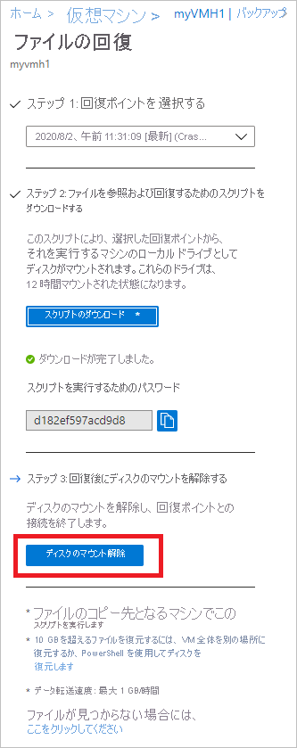

# <a name="recover-files-from-azure-virtual-machine-backup"></a>Azure 仮想マシンのバックアップからファイルを回復する

Azure Backup は、[Azure 仮想マシン (VM) とディスク](./backup-azure-arm-restore-vms.md)を Azure VM のバックアップ (復旧ポイントとも呼ばれる) から復元する機能を提供します。 この記事では、Azure VM のバックアップからファイルやフォルダーを回復する方法について説明します。 ファイルやフォルダーを回復する機能は、Resource Manager モデルを使用してデプロイされ、Recovery Services コンテナーに保護されている Azure VM に対してのみ使用できます。


> [!NOTE]
> この機能は、Resource Manager モデルを使用してデプロイされ、Recovery Services コンテナーに保護されている Azure VM に対して使用できます。
> 暗号化された VM バックアップからのファイルの回復はサポートされていません。
>


## <a name="step-1-generate-and-download-script-to-browse-and-recover-files"></a>手順 1:ファイルを参照して回復するためのスクリプトを生成してダウンロードする

回復ポイントからファイルまたはフォルダーを回復するには、仮想マシンに移動し、次の手順を実行します。

1. [Azure portal](https://portal.Azure.com) にサインインし、左側のペインで **[仮想マシン]** を選択します。 仮想マシンの一覧から、仮想マシンを選択して、その仮想マシンのダッシュボードを開きます。

2. 仮想マシンのメニューで、 **[バックアップ]** を選択し、[バックアップ] ダッシュボードを開きます。

    

3. [バックアップ] ダッシュボード メニューで、 **[ファイルの回復]** を選択します。

    ![[ファイルの回復] を選択する](./media/backup-azure-restore-files-from-vm/vm-backup-menu-file-recovery-button.png)

    **[ファイルの回復]** メニューが開きます。

    ![[ファイルの回復] メニュー](./media/backup-azure-restore-files-from-vm/file-recovery-blade.png)

4. **[回復ポイントの選択]** ドロップダウン メニューで、目的のファイルを保持する回復ポイントを選択します。 既定では、最新の回復ポイントが既に選択されています。

5. **[実行可能ファイルのダウンロード]** (Windows Azure VM の場合) または **[スクリプトのダウンロード]** (Linux Azure VM の場合: Python スクリプトが生成される) を選択して、回復ポイントからファイルをコピーするために使用するソフトウェアをダウンロードします。

    

    Azure は、実行可能ファイルまたはスクリプトをローカル コンピューターにダウンロードします。

    

    実行可能ファイルまたはスクリプトを管理者として実行するには、ダウンロードしたファイルをコンピューターに保存することをお勧めします。

6. 実行可能ファイルまたはスクリプトは、パスワードで保護されているため、パスワードが必要です。 **[ファイルの回復]** メニューで、コピー ボタンを選択してパスワードをメモリに読み込みます。

    


## <a name="step-2-ensure-the-machine-meets-the-requirements-before-executing-the-script"></a>手順 2:スクリプトを実行する前にマシンが要件を満たしていることを確認する

スクリプトが正常にダウンロードされたら、このスクリプトを実行するための適切なマシンがあることを確認します。 スクリプトを実行する予定の VM には、次のサポートされていない構成が含まれていてはなりません。 含まれている場合、できれば同じリージョンの、要件を満たす別のマシンを選択します。  

### <a name="dynamic-disks"></a>ダイナミック ディスク

次のいずれかの特性がある VM では、実行可能スクリプトは実行できません。

- 複数のディスクにまたがるボリューム (スパン ボリュームおよびストライプ ボリューム)。
- ダイナミック ディスク上のフォールト トレラント ボリューム (ミラー化ボリュームおよび RAID 5 ボリューム)。

### <a name="windows-storage-spaces"></a>Windows 記憶域スペース

Windows 記憶域スペース用に構成されている VM では、ダウンロードした実行可能ファイルは実行できません。

### <a name="virtual-machine-backups-having-large-disks"></a>大容量ディスクを含む仮想マシンのバックアップ

バックアップ対象のマシンに多数のディスク (16 個超) または大容量ディスク (それぞれ 4 TB 超) がある場合は、復元のために同じマシンでスクリプトを実行することはお勧めしません。これは、VM に大きな影響が及ぶためです。 代わりに、ファイルの回復専用の個別 VM (Azure VM D2v3 VM) を使用することをお勧めします。使用後、この VM が不要になったら、シャットダウンします。 

大きなディスクがあるバックアップ VM からファイルを復元するための要件を参照してください。<br>
[Windows OS](#for-backed-up-vms-with-large-disks-windows)<br>
[Linux OS](#for-backed-up-vms-with-large-disks-linux)


## <a name="step-3-os-requirements-to-successfully-run-the-script"></a>手順 3:スクリプトを正常に実行するための OS の要件

ダウンロードしたスクリプトを実行する VM は、次の要件を満たしている必要があります。

### <a name="for-windows-os"></a>Windows OS の場合

次の表は、サーバーとコンピューターのオペレーティング システムの互換性を示しています。 ファイルを回復する場合、オペレーティング システムの以前のバージョンまたは以降のバージョンにファイルを復元することはできません。 たとえば、Windows Server 2016 VM から Windows Server 2012 または Windows 8 コンピューターにファイルを復元することはできません。 VM からは、同じサーバー オペレーティング システムへ、または互換性のあるクライアント オペレーティング システムへファイルを復元できます。

|サーバー OS | 互換性のあるクライアント OS  |
| --------------- | ---- |
| Windows Server 2019    | Windows 10 |
| Windows Server 2016    | Windows 10 |
| Windows Server 2012 R2 | Windows 8.1 |
| Windows Server 2012    | Windows 8  |
| Windows Server 2008 R2 | Windows 7   |

### <a name="for-linux-os"></a>Linux OS の場合

Linux では、ファイルの復元に使用するコンピューターの OS が、保護された仮想マシンのファイル システムをサポートしている必要があります。 スクリプトを実行するコンピューターを選択する場合は、コンピューターに互換性のある OS がインストールされていること、かつ、次の表に示すバージョンのいずれかが使用されていることを確認します。

|Linux OS | バージョン  |
| --------------- | ---- |
| Ubuntu | 12.04 以降 |
| CentOS | 6.5 以降  |
| RHEL | 6.7 以降 |
| Debian | 7 以降 |
| Oracle Linux | 6.4 以降 |
| SLES | 12 以降 |
| openSUSE | 42.2 以降 |

> [!NOTE]
> SLES 12 SP4 OS のマシンでファイルの回復スクリプトを実行中に、いくつかの問題が発生することがわかりました。SLES チームと調査中です。
> 現在、ファイルの回復スクリプトの実行は、SLES 12 SP2 および SP3 の OS のバージョンのマシンで動作します。
>

スクリプトを実行し、復旧ポイントに安全に接続するには、Python および Bash コンポーネントも必要となります。

|コンポーネント | Version  |
| --------------- | ---- |
| Bash | 4 以降 |
| Python | 2.6.6 以降  |
| .NET | 4.6.2 以降 |
| TLS | 1.2 がサポートされている必要があります。  |

## <a name="step-4-access-requirements-to-successfully-run-the-script"></a>手順 4:スクリプトを正常に実行するためのアクセスの要件

アクセスが制限されたコンピューターでスクリプトを実行する場合は、次にアクセスできることを確認してください。

- `download.microsoft.com`
- Recovery Service の URL (GEO-NAME は Recovery Services コンテナーが存在するリージョンを表します)
  - `https://pod01-rec2.GEO-NAME.backup.windowsazure.com` (すべての Azure パブリック リージョン)
  - `https://pod01-rec2.GEO-NAME.backup.windowsazure.cn` (Azure China 21Vianet 用)
  - `https://pod01-rec2.GEO-NAME.backup.windowsazure.us` (Azure US Government 用)
  - `https://pod01-rec2.GEO-NAME.backup.windowsazure.de` (Azure Germany 用)
- 送信ポート 53 (DNS)、443、3260

> [!NOTE]
>
> [上記](#step-1-generate-and-download-script-to-browse-and-recover-files)の手順 1 でダウンロードしたスクリプト ファイルには、ファイルの名前に **geo-name** が含まれています。 その **geo-name** を使用して、URL を置き換えます。 ダウンロードしたスクリプトの名前は次で始まります:\'VMname\'\_\'geoname\'_\'GUID\'。<br><br>
> そのため、たとえば、スクリプト ファイル名が *ContosoVM_wcus_12345678* の場合、**geo-name** は *wcus* であるため、URL は次のようになります:<br> <https://pod01-rec2.wcus.backup.windowsazure.com>
>

Linux の場合、スクリプトによって復旧ポイントに接続するには "open-iscsi" および "lshw" コンポーネントが必要です。 スクリプトを実行するコンピューターに目的のコンポーネントが存在しない場合は、コンポーネントをインストールするためのアクセス許可をスクリプトから求められます。 同意して、必要なコンポーネントをインストールします。

スクリプトを実行するコンピューターと復旧ポイントのデータの間にセキュリティで保護されたチャネルを構築するために使われるコンポーネントをダウンロードするには、`download.microsoft.com` へのアクセスが必要です。


## <a name="step-5-running-the-script-and-identifying-volumes"></a>手順 5:スクリプトを実行してボリュームを識別する

### <a name="for-windows"></a>Windows の場合

手順 2、手順 3、および手順 4 で示されているすべての要件を満たした後、ダウンロードした場所 (通常は [ダウンロード] フォルダー) からスクリプトをコピーし、実行可能ファイルまたはスクリプトを右クリックして、管理者の資格情報を使用して実行します。 メッセージが表示されたら、パスワードを入力するか、またはメモリからのパスワードを貼り付けて、Enter キーを押します。 有効なパスワードが入力されると、スクリプトが復旧ポイントに接続されます。

  


実行可能ファイルを実行すると、オペレーティング システムは新しいボリュームをマウントし、ドライブ文字を割り当てます。 Windows エクスプローラーまたはファイル エクスプローラーを使用してそれらのドライブを参照できます。 ボリュームに割り当てられるドライブ文字は、元の仮想マシンと同じ文字にならない可能性があります。 ただし、ボリューム名は保持されます。 たとえば、元の仮想マシン上のボリュームが "データ ディスク (E:`\`)" であった場合、そのボリュームは、ローカル コンピューターに "データ ディスク ('任意のドライブ文字':`\`)" としてアタッチされる可能性があります。 ファイルまたはフォルダーが表示されるまで、スクリプトの出力に示されているすべてのボリュームを参照します。  

   

#### <a name="for-backed-up-vms-with-large-disks-windows"></a>大容量ディスクを含むバックアップ対象 VM (Windows)

ファイル復元スクリプトを実行した後、ファイルの回復プロセスがハングする場合 (たとえば、ディスクがマウントされない、またはマウントされてもボリュームが表示されない場合)、次の手順を実行します。
  
1. OS が WS 2012 以上であることを確認します。
2. 復元サーバーでレジストリ キーが次の推奨のとおりに設定されていることを確認し、サーバーを確実に再起動します。 GUID のそばにある番号は 0001 から 0005 までの範囲にあります。 次の例では、0004 になっています。 レジストリ キーのパスをパラメーターのセクションまで移動します。

    

```registry
- HKEY_LOCAL_MACHINE\SYSTEM\CurrentControlSet\Services\Disk\TimeOutValue – change this from 60 to 1200
- HKEY_LOCAL_MACHINE\SYSTEM\ControlSet001\Control\Class\{4d36e97b-e325-11ce-bfc1-08002be10318}\0003\Parameters\SrbTimeoutDelta – change this from 15 to 1200
- HKEY_LOCAL_MACHINE\SYSTEM\ControlSet001\Control\Class\{4d36e97b-e325-11ce-bfc1-08002be10318}\0003\Parameters\EnableNOPOut – change this from 0 to 1
- HKEY_LOCAL_MACHINE\SYSTEM\ControlSet001\Control\Class\{4d36e97b-e325-11ce-bfc1-08002be10318}\0003\Parameters\MaxRequestHoldTime - change this from 60 to 1200
```

### <a name="for-linux"></a>Linux の場合

Linux マシンの場合は Python スクリプトが生成されます。 このスクリプトをダウンロードして、適切な (対応している) Linux サーバーにコピーします。 それを実行するためには、```chmod +x <python file name>``` でアクセス許可を変更しなければならない場合があります。 そのうえで、```./<python file name>``` を使用し、Python ファイルを実行します。


Linux では、復旧ポイントのボリュームはスクリプトが実行されるフォルダーにマウントされます。 それに応じて、接続されたディスク、ボリューム、対応するマウント パスが示されます。 これらのマウント パスは、ルート レベルのアクセス権を持つユーザーに表示されます。 スクリプトの出力に示されたボリュームを参照します。

  ![Linux の [ファイルの回復] メニュー](./media/backup-azure-restore-files-from-vm/linux-mount-paths.png)


#### <a name="for-backed-up-vms-with-large-disks-linux"></a>大容量ディスクを含むバックアップ対象 VM (Linux)**

ファイル復元スクリプトを実行した後、ファイルの回復プロセスがハングする場合 (たとえば、ディスクがマウントされない、またはマウントされてもボリュームが表示されない場合)、次の手順を実行します。

1. ファイル /etc/iscsi/iscsid.conf で、設定を次のように変更します。
    - `node.conn[0].timeo.noop_out_timeout = 5`  から `node.conn[0].timeo.noop_out_timeout = 120`
2. 上記の変更を行った後、スクリプトを再実行します。 一時的な障害が発生した場合は、要求が連続して何度も実行されることでターゲットの準備に影響しないようにするために、再実行の間隔が 20 分から 30 分あることを確認します。 この間隔で再実行すると、ターゲットはスクリプトからの接続に対して準備を行うことができます。
3. ファイルの回復後、必ずポータルに戻り、ボリュームをマウントできなかった回復ポイントに対して **[ディスクのマウント解除]** を選択してください。 基本的には、この手順によって既存のプロセス/セッションがすべて消去され、回復の可能性が向上します。


#### <a name="lvmraid-arrays-for-linux-vms"></a>LVM/RAID アレイ (Linux VM の場合)

Linux では、論理ボリューム マネージャー (LVM) やソフトウェア RAID アレイを使用して、複数のディスクの論理ボリュームを管理します。 保護された Linux VM で LVM/RAID アレイを使用している場合、その VM でスクリプトを実行することはできません。<br>
代わりに、保護された VM のファイル システムをサポートする、互換性のある OS を使用し、任意の他のマシンでスクリプトを実行します。<br>
次のスクリプトの出力には、LVM/RAID アレイのディスク、ボリューム、パーティションの種類が表示されます。

   

これらのパーティションをオンラインにするには、次のセクションにあるコマンドを実行します。

#### <a name="for-lvm-partitions"></a>LVM パーティションの場合

スクリプトが実行されると、LVM パーティションが、スクリプトの出力に指定された物理ボリューム/ディスクにマウントされます。 このプロセスで次のことが実行されます。

1. 物理ボリュームまたはディスクからボリューム グループ名の一意のリストを取得する
2. 次に、それらのボリューム グループ内の論理ボリュームを一覧表示する
3. 次に、必要なパスに論理ボリュームをマウントする

##### <a name="listing-volume-group-names-from-physical-volumes"></a>物理ボリュームのボリューム グループ名の一覧表示

ボリュームグループ名を一覧表示するには、次を実行します。

```bash
pvs -o +vguuid
```

このコマンドは、すべての物理ボリューム (スクリプトを実行する前に存在するものを含む)、対応するボリューム グループ名、ボリューム グループの一意のユーザー ID (UUID) を一覧表示します。 コマンドの出力例を次に示します。

```bash
PV         VG        Fmt  Attr PSize   PFree    VG UUID

  /dev/sda4  rootvg    lvm2 a--  138.71g  113.71g EtBn0y-RlXA-pK8g-de2S-mq9K-9syx-B29OL6

  /dev/sdc   APPvg_new lvm2 a--  <75.00g   <7.50g njdUWm-6ytR-8oAm-8eN1-jiss-eQ3p-HRIhq5

  /dev/sde   APPvg_new lvm2 a--  <75.00g   <7.50g njdUWm-6ytR-8oAm-8eN1-jiss-eQ3p-HRIhq5

  /dev/sdf   datavg_db lvm2 a--   <1.50t <396.50g dhWL1i-lcZS-KPLI-o7qP-AN2n-y2f8-A1fWqN

  /dev/sdd   datavg_db lvm2 a--   <1.50t <396.50g dhWL1i-lcZS-KPLI-o7qP-AN2n-y2f8-A1fWqN
```

最初の列 (PV) は物理ボリュームを示しており、それ以降の列は、関連するボリューム グループ名、形式、属性、サイズ、空き領域、ボリューム グループの一意の ID を示しています。 コマンドの出力には、すべての物理ボリュームが表示されます。 スクリプトの出力を参照して、バックアップに関連するボリュームを特定します。 上記の例では、スクリプトの出力に、/dev/sdf と /dev/sdd が表示されています。 そして、*datavg_db* ボリューム グループはスクリプトに属し、*Appvg_new* ボリューム グループはマシンに属しています。 最終的な目的は、1 つの一意のボリューム グループ名が 1 つの一意の ID を持つようにすることです。

###### <a name="duplicate-volume-groups"></a>重複するボリューム グループ

スクリプトの実行後に、ボリューム グループ名が 2 つの UUID を持つという状況になる場合があります。 これは、スクリプトが実行されるマシンとバックアップされた VM 内のボリューム グループ名が同じであることを意味します。 この場合、バックアップされた VM のボリューム グループの名前を変更する必要があります。 次の例をご覧ください。

```bash
PV         VG        Fmt  Attr PSize   PFree    VG UUID

  /dev/sda4  rootvg    lvm2 a--  138.71g  113.71g EtBn0y-RlXA-pK8g-de2S-mq9K-9syx-B29OL6

  /dev/sdc   APPvg_new lvm2 a--  <75.00g   <7.50g njdUWm-6ytR-8oAm-8eN1-jiss-eQ3p-HRIhq5

  /dev/sde   APPvg_new lvm2 a--  <75.00g   <7.50g njdUWm-6ytR-8oAm-8eN1-jiss-eQ3p-HRIhq5

  /dev/sdg   APPvg_new lvm2 a--  <75.00g  508.00m lCAisz-wTeJ-eqdj-S4HY-108f-b8Xh-607IuC

  /dev/sdh   APPvg_new lvm2 a--  <75.00g  508.00m lCAisz-wTeJ-eqdj-S4HY-108f-b8Xh-607IuC

  /dev/sdm2  rootvg    lvm2 a--  194.57g  127.57g efohjX-KUGB-ETaH-4JKB-MieG-EGOc-XcfLCt
```

スクリプトの出力には、/dev/sdg、/dev/sdh、/dev/sdm2 が接続済みと表示されています。 対応する VG 名は Appvg_new と rootvg です。 しかし、同じ名前がマシンの VG リストにも存在します。 1 つの VG 名に 2 つの UUID があることを確認できます。

ここで、スクリプトベースのボリュームの VG 名を変更する必要があります (例: /dev/sdg、/dev/sdh、/dev/sdm2)。 ボリューム グループの名前を変更するには、次のコマンドを使用します。

```bash
vgimportclone -n rootvg_new /dev/sdm2
vgimportclone -n APPVg_2 /dev/sdg /dev/sdh
```

これで、すべての VG 名が固有の ID を持つようになりました。

###### <a name="active-volume-groups"></a>アクティブ ボリューム グループ

スクリプトのボリュームに対応するボリューム グループがアクティブであることを確認します。 次のコマンドは、アクティブなボリューム グループを表示するために使用します。 スクリプトの関連するボリューム グループがこの一覧にあるかどうかを確認します。

```bash
vgdisplay -a
```  

または、次のコマンドを使用して、そのボリューム グループをアクティブにします。

```bash
#!/bin/bash
vgchange –a y  <volume-group-name>
```

##### <a name="listing-logical-volumes-within-volume-groups"></a>ボリューム グループ内の論理ボリュームの一覧表示

スクリプトに関連する VG の一意でアクティブな一覧を取得したら、次のコマンドを使用して、これらのボリューム グループに存在する論理ボリュームを一覧表示できます。

```bash
#!/bin/bash
lvdisplay <volume-group-name>
```

このコマンドは、各論理ボリュームのパスを 'LV Path' として表示します。

##### <a name="mounting-logical-volumes"></a>論理ボリュームのマウント

論理ボリュームを任意のパスにマウントするには、次のようにします。

```bash
#!/bin/bash
mount <LV path from the lvdisplay cmd results> </mountpath>
```

> [!WARNING]
> 'mount -a' は使用しないでください。 このコマンドは、'/etc/fstab' に記述されているすべてのデバイスをマウントします。 これは、重複するデバイスがマウントされる可能性があることを意味します。 スクリプトによって作成された、データが保存されないデバイスにデータがリダイレクトされる可能性があるため、データが失われることがあります。

#### <a name="for-raid-arrays"></a>RAID アレイの場合

次のコマンドにより、すべての RAID ディスクの詳細が表示されます。

```bash
#!/bin/bash
mdadm –detail –scan
```

 関連する RAID ディスクは `/dev/mdm/<RAID array name in the protected VM>` と表示されます。

RAID ディスクに物理ボリュームがある場合は、mount コマンドを使用します。

```bash
#!/bin/bash
mount [RAID Disk Path] [/mountpath]
```

RAID ディスクに別の LVM が構成されている場合は、前に説明した手順を LVM パーティションにも使用します。ただし、RAID ディスク名の代わりに、ボリューム名を使用します。

## <a name="step-6-closing-the-connection"></a>手順 6:接続を閉じる

ファイルを識別してローカル ストレージの場所にコピーした後、追加ドライブを削除 (またはマウント解除) します。 ドライブをマウント解除するには、Azure portal の **[ファイルの回復]** メニューで **[ディスクのマウント解除]** を選択します。



ディスクがマウント解除されると、メッセージが表示されます。 接続を更新してディスクを解除できるようになるまで数分かかることがあります。

Linux では、復旧ポイントへの接続が切断された後、OS によって対応するマウント パスが自動的に削除されるわけではありません。 マウント パスは "孤立" ボリュームとして存在し、表示されていますが、ファイルへのアクセスや書き込みを行うと、エラーがスローされます。 マウント パスは手動で削除できます。 実行時に、スクリプトは以前の復旧ポイントから存在するこのようなボリュームを特定し、同意を得たうえでクリーンアップします。

> [!NOTE]
> 必要なファイルを復元した後は、接続が閉じられていることを確認します。 これは、スクリプトが実行されているマシンがバックアップ用に構成されている場合に特に重要です。 接続がまだ開いている場合、後続のバックアップが失敗し、"UserErrorUnableToOpenMount" というエラーが表示されることがあります。 これは、マウントされたドライブまたはボリュームが利用可能であると見なされているため発生します。また、アクセスされると、基となるストレージ (iSCSI ターゲット サーバーなど) が利用できない場合に失敗する可能性があります。 接続をクリーンアップすると、これらのドライブとボリュームが削除されるため、バックアップ中に使用できなくなります。

## <a name="security"></a>セキュリティ

このセクションでは、Azure VM バックアップからのファイル回復を実装するために講じるさまざまなセキュリティ対策について説明します。

### <a name="feature-flow"></a>機能のフロー

この機能は、VM 全体または VM ディスクを復元することなく、最小限の数の手順で VM データにアクセスするために構築されました。 VM データへのアクセスは、(次に示すように、実行時に回復ボリュームをマウントする) スクリプトによって提供されるため、これがすべてのセキュリティ実装の基盤を形成しています。

  

### <a name="security-implementations"></a>セキュリティの実装

#### <a name="select-recovery-point-who-can-generate-script"></a>回復ポイントを選択する (スクリプトを生成できるユーザー)

スクリプトは VM データへのアクセスを提供するため、最初に誰がスクリプトを生成できるかを制限することが重要です。 スクリプトを生成するには、Azure portal にサインインし、[Azure RBAC で認可](backup-rbac-rs-vault.md#mapping-backup-built-in-roles-to-backup-management-actions)される必要があります。

ファイルの回復には、VM の復元とディスクの復元に必要な承認レベルと同じレベルが必要です。 つまり、承認されたユーザーのみが VM データを表示してスクリプトを生成できます。

生成されたスクリプトは、Azure Backup サービス用の Microsoft の公式な証明書で署名されます。 スクリプトの改ざんは署名が壊れることを意味し、スクリプトを実行するあらゆる試みは潜在的なリスクとして OS で強調表示されます。

#### <a name="mount-recovery-volume-who-can-run-script"></a>回復ボリュームをマウントする (スクリプトを実行できるユーザー)

管理者だけがスクリプトを実行できます。管理者特権モードで実行する必要があります。 スクリプトは、事前生成済みの一連の手順のみを実行し、いかなる外部ソースからの入力も受け入れません。

スクリプトを実行するには、Azure portal、PowerShell、または CLI でスクリプトの生成時に、許可されているユーザーに対してのみ表示されるパスワードが必要です。 これは、承認されたユーザーがスクリプトのダウンロードと、スクリプトの実行の責任も負うようにするためです。

#### <a name="browse-files-and-folders"></a>ファイルとフォルダーを参照する

ファイルとフォルダーを参照するために、マシン内の iSCSI イニシエーターをスクリプトで使用して、iSCSI ターゲットとして構成されている復旧ポイントに接続します。 ここで、いずれかまたはすべてのコンポーネントを誰かが模倣、なりすましをしようとしているシナリオが想定できます。

Microsoft では、各コンポーネントの相互の認証ができるように、相互の CHAP 認証メカニズムを使用しています。 つまり、偽のイニシエーターが iSCSI ターゲットに接続したり、偽のターゲットがスクリプトを実行するマシンに接続するのは非常に困難です。

回復サービスとマシン間のデータ フローは、TCP 経由でセキュリティで保護された TLS トンネルを構築することで保護されます (スクリプトを実行するマシンでは、[TLS 1.2 がサポートされている必要があります](#step-3-os-requirements-to-successfully-run-the-script))。

親/バックアップされた VM に存在するすべてのファイル アクセス制御リスト (ACL) は、マウントされているファイル システムにも保持されます。

スクリプトにより回復ポイントへの読み取り専用アクセスが提供されます。有効期間は 12 時間だけです。 それより前にアクセスを削除したい場合は、Azure portal、PowerShell、または CLI にサインインして、その特定の回復ポイントに対して **ディスクのマウント解除** を実行します。 スクリプトはすぐに無効になります。


## <a name="next-steps"></a>次のステップ

- [PowerShell を使用してファイルを復元する](./backup-azure-vms-automation.md#restore-files-from-an-azure-vm-backup)方法を確認します
- [Azure CLI を使用してファイルを復元する](./tutorial-restore-files.md)方法を確認します。
- VM が復元された後、[バックアップを管理する](./backup-azure-manage-vms.md)方法について説明します。
