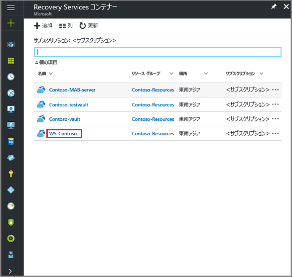
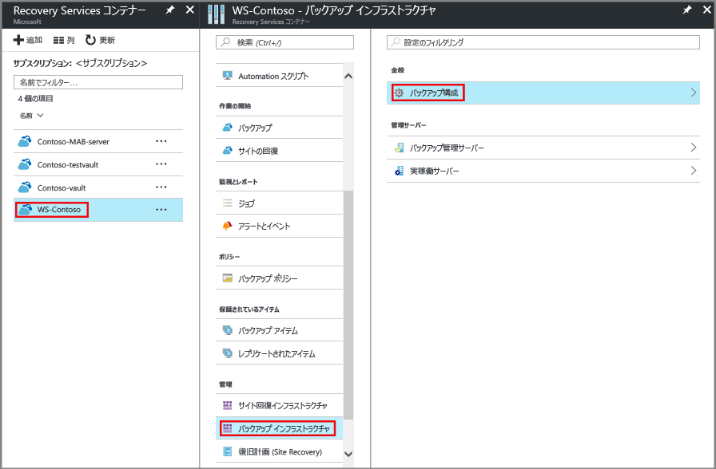
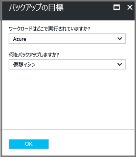
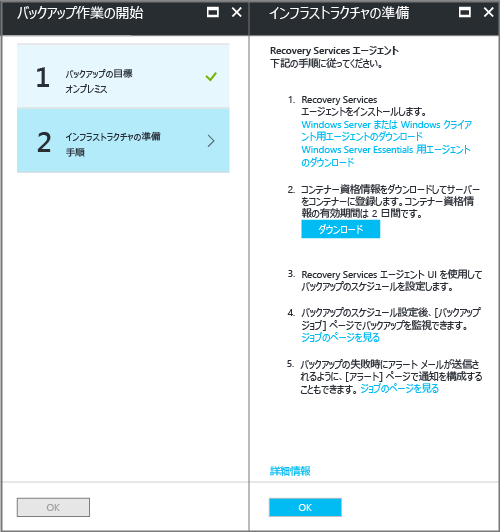
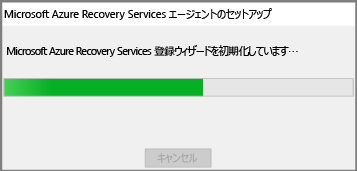
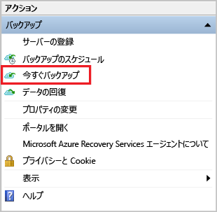

# Windows のシステム状態を Azure にバックアップする

この記事では、Windows Server のシステム状態を Azure にバックアップする方法について説明します。 ここでは基本事項について説明します。

Azure Backup の詳細については、こちらの [概要記事](backup-overview.md)を参照してください。

Azure サブスクリプションがない場合は、すべての Azure サービスにアクセスできる [無料アカウント](https://azure.microsoft.com/free/) を作成します。

[!INCLUDE [How to create a Recovery Services vault](../../includes/backup-create-rs-vault.md)]

## コンテナーのストレージ冗長性を設定する

Recovery Services コンテナーを作成する際は、必要に応じてストレージの冗長性が構成されるようにしてください。

1. **[Recovery Services コンテナー]** ウィンドウで、新しいコンテナーを選択します。

    

    コンテナーを選択すると、 **[Recovery Services コンテナー]** ウィンドウが縮小され、設定ウィンドウ ("*上部にコンテナー名が表示されています*") とコンテナーの詳細ウィンドウが開きます。

    
2. 新しいコンテナーの設定ウィンドウで、垂直スライドを使って下へスクロールして [管理] セクションに移動し、 **[バックアップ インフラストラクチャ]** を選択します。
    [バックアップ インフラストラクチャ] ペインが開きます。
3. [バックアップ インフラストラクチャ] ウィンドウで、 **[バックアップ構成]** を選択して **[バックアップ構成]** ウィンドウを開きます。

    
4. コンテナーの適切なストレージ レプリケーション オプションを選択します。

    

    既定では、コンテナーには geo 冗長ストレージがあります。 プライマリ バックアップ ストレージ エンドポイントとして Azure を使用する場合は、引き続き **[geo 冗長]** を使用します。 プライマリ バックアップ ストレージ エンドポイントとして Azure を使用しない場合、 **[ローカル冗長]** を選択します。これにより、Azure Storage のコストを削減できます。 [geo 冗長](../storage/common/storage-redundancy.md#geo-redundant-storage)ストレージ、[ローカル冗長](../storage/common/storage-redundancy.md#locally-redundant-storage)ストレージ、[ゾーン冗長](../storage/common/storage-redundancy.md#zone-redundant-storage)ストレージの各オプションの詳細については、[ストレージ冗長性の概要](../storage/common/storage-redundancy.md)に関するこちらの記事を参照してください。

コンテナーを作成したら、Windows のシステム状態をバックアップするための構成を行います。

## コンテナーの構成

1. Recovery Services コンテナー (先ほど作成したコンテナー) のウィンドウの [作業の開始] セクションで **[バックアップ]** を選択し、 **[バックアップ作業の開始]** ウィンドウで、 **[バックアップの目標]** を選択します。

    

    **[バックアップの目標]** ウィンドウが開きます。

    

2. **[ワークロードはどこで実行されていますか?]** ボックスの一覧の **[オンプレミス]** を選択します。

    Windows Server または Windows コンピューターが Azure にない物理マシンであるため、 **[オンプレミス]** を選択します。

3. **[何をバックアップしますか?]** メニューの **[システム状態]** を選択し、 **[OK]** を選択します。

    

    **[OK]** を選択すると、 **[バックアップの目標]** の横にチェックマークが表示され、 **[インフラストラクチャの準備]** ウィンドウが開きます。

    

4. **[インフラストラクチャの準備]** ウィンドウで、 **[Windows Server または Windows クライアント用エージェントのダウンロード]** を選択します。

    

    Windows Server Essentials を使用している場合は、Windows Server Essentials 用エージェントのダウンロードを選択します。 MARSAgentInstaller.exe を実行するか、保存するかをたずねるポップアップ メニューが表示されます。

    

5. ダウンロードのポップアップ メニューで、 **[保存]** を選択します。

    既定では、 **MARSagentinstaller.exe** ファイルがダウンロード フォルダーに保存されます。 インストーラーのダウンロードが完了すると、インストーラーを実行するかフォルダーを開くかをたずねるポップアップが表示されます。

    

    まだ、エージェントをインストールする必要はありません。 エージェントは、コンテナー資格情報をダウンロードした後にインストールできます。

6. **[インフラストラクチャの準備]** ウィンドウで、 **[ダウンロード]** を選択します。

    

    コンテナー資格情報は、**ダウンロード** フォルダーにダウンロードされます。 コンテナー資格情報のダウンロードが完了すると、資格情報を開くか保存するかをたずねるポップアップが表示されます。 **[保存]** を選択します。 誤って **[開く]** を選択すると、コンテナー資格情報を開こうとして失敗します。 コンテナー資格情報を開くことはできません。 次の手順に進みます。 コンテナー資格情報は **ダウンロード** フォルダーにあります。

    
   > [!NOTE]
   > コンテナー資格情報は、エージェントを使用しようとしている Windows Server に対してローカルな場所にのみ保存する必要があります。
   >

[!INCLUDE [backup-upgrade-mars-agent.md](../../includes/backup-upgrade-mars-agent.md)]

## エージェントをインストールして登録する

> [!NOTE]
> Azure portal を使用してバックアップを有効にすることはできません。 Microsoft Azure Recovery Services エージェントを使用して、Windows Server のシステム状態をバックアップしてください。
>

1. ダウンロード フォルダー (または他の保存場所) で **MARSagentinstaller.exe** を見つけて、ダブルクリックします。

    インストーラーは一連のメッセージを表示しながら、Recovery Services エージェントの抽出、インストール、登録を実行します。

    

2. Microsoft Azure Recovery Services エージェント セットアップ ウィザードを実行します。 ウィザードでは以下のことを行う必要があります。

   * インストールとキャッシュ フォルダーの場所を選択します。
   * プロキシ サーバーを使用してインターネットに接続する場合は、プロキシ サーバーの情報を指定します。
   * 認証済みのプロキシを使用する場合は、ユーザー名とパスワードの詳細を入力します。
   * ダウンロードしたコンテナーの資格情報を指定します。
   * 暗号化パスフレーズを安全な場所に保存します。

     > [!NOTE]
     > パスフレーズを紛失または忘れた場合、Microsoft がバックアップ データの回復を支援することはできません。 安全な場所にファイルを保存してください。 バックアップを復元するために必要です。
     >
     >

エージェントがインストールされ、コンピューターがコンテナーに登録されました。 バックアップを構成してスケジュールする準備ができました。

## Windows Server のシステム状態のバックアップ

初回バックアップには、次の 2 つのタスクが含まれています。

* バックアップのスケジュール
* 初めてのシステム状態のバックアップ

初回バックアップを実行するには、Microsoft Azure Recovery Services エージェントを使用します。

> [!NOTE]
> Windows Server 2016 を使用して、Windows Server 2008 R2 のシステム状態をバックアップできます。 クライアント SKU では、システム状態のバックアップはサポートされていません。 システム状態は、Windows クライアント、または Windows Server 2008 SP2 マシンのオプションとしては表示されません。
>
>

### バックアップ ジョブのスケジュールを設定するには

1. Microsoft Azure Recovery Services エージェントを開きます。 エージェントは、コンピューターで **Microsoft Azure Backup** を検索すると見つかります。

    

2. Recovery Services エージェントで、 **[バックアップのスケジュール]** を選択します。

    

3. バックアップのスケジュール ウィザードの **[作業の開始]** ページで、 **[次へ]** を選択します。

4. **[バックアップする項目の選択]** ページで、 **[項目の追加]** を選択します。

5. **[システム状態]** を選択し、 **[OK]** を選択します。

6. **[次へ]** を選択します。

7. 後続のページで、必要なバックアップの頻度およびシステム状態のバックアップの保持ポリシーを選択します。

8. [確認] ページで情報を確認し、 **[完了]** を選択します。

9. ウィザードでバックアップ スケジュールの作成が完了したら、 **[閉じる]** を選択します。

### 初めて Windows Server のシステム状態をバックアップするには

1. Windows Server に、再起動を伴う保留中の更新が存在しないことを確認します。

2. Recovery Services エージェントで **[今すぐバックアップ]** を選択して、ネットワーク経由での最初のシード処理を完了します。

    

3. 表示される **[Select Backup Item]\(バックアップ項目の選択)** 画面で **[システム状態]** を選択し、 **[次へ]** を選択します。

4. [確認] ページで、今すぐバックアップ ウィザードによってコンピューターのバックアップに使用される設定を確認します。 次に、 **[バックアップ]** を選択します。

5. **[閉じる]** を選択してウィザードを閉じます。 バックアップ プロセスが完了する前にウィザードを閉じても、ウィザードはバックグラウンドで引き続き実行されます。
    > [!NOTE]
    > MARS エージェントは、各システム状態のバックアップの前に、事前チェックの一部として `SFC /verifyonly` をトリガーします。 これは、システム状態の一部としてバックアップされるファイルが、Windows のバージョンに対応する正しいバージョンを持つことを確認するためのものです。 システム ファイル チェッカー (SFC) の詳細については [こちらの記事](/windows-server/administration/windows-commands/sfc)を参照してください。
    >

初回バックアップが完了すると、 **[ジョブは完了しました]** 状態が Backup コンソールに表示されます。

  

## 疑問がある場合

ご質問がある場合は、[フィードバックをお送り](https://feedback.azure.com/forums/258995-azure-backup)ください。

## 次のステップ

* [Windows コンピューターのバックアップ](backup-windows-with-mars-agent.md)の詳細を参照してください。
* Windows Server のシステム状態をバックアップしたので、[コンテナーとサーバーを管理](backup-azure-manage-windows-server.md)できます。
* バックアップを復元する必要がある場合は、 [Windows コンピューターへのファイルの復元](backup-azure-restore-windows-server.md)に関する記事を参照してください。
