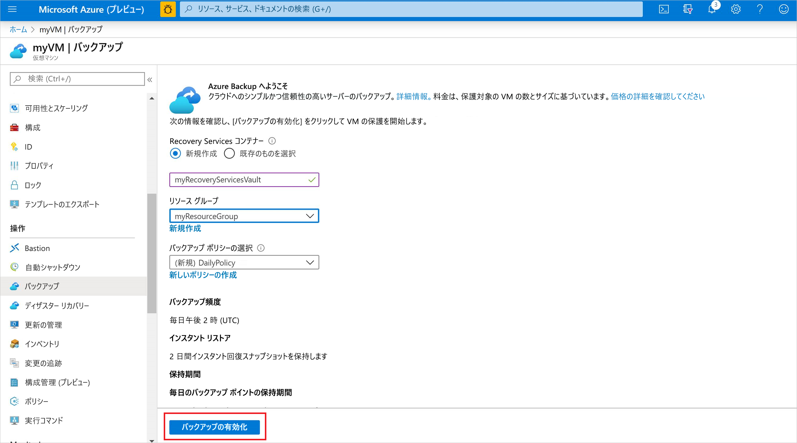
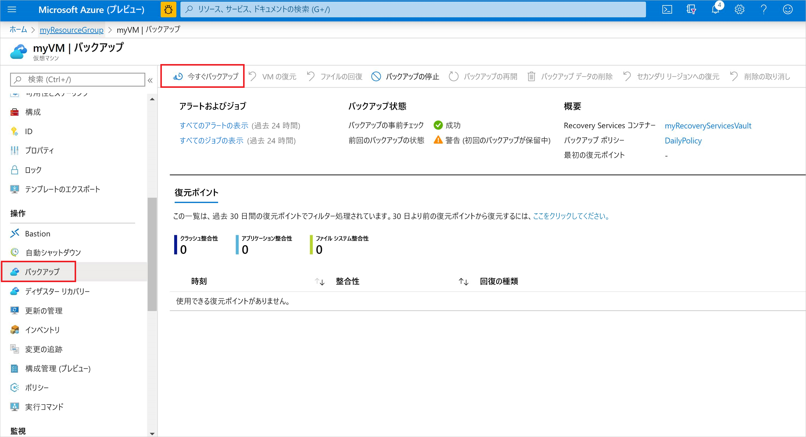
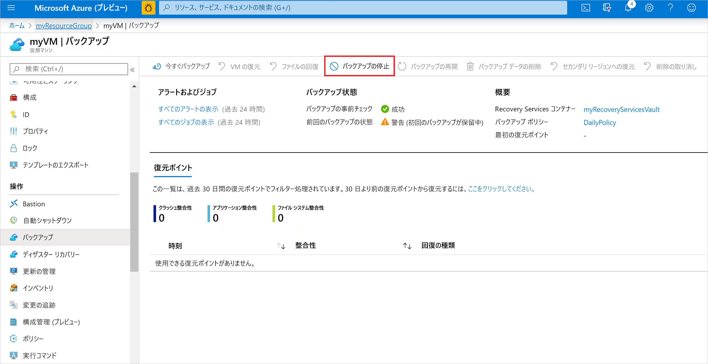

# Azure で仮想マシンをバックアップする

Azure Portal で Azure のバックアップを作成できます。 この方法では、ブラウザー ベースのユーザー インターフェイスで Azure のバックアップを作成し、すべての関連リソースを構成できます。 データは、定期的にバックアップすることで保護することができます。 Azure Backup によって、geo 冗長 Recovery コンテナーに保存できる復元ポイントが作成されます。 この記事では、Azure Portal を使用して仮想マシン (VM) をバックアップする方法を説明します。

このクイック スタートでは、既存の Azure VM のバックアップを実行できます。 VM を作成する必要がある場合は、[Azure Portal を使用して VM を作成](../virtual-machines/windows/quick-create-portal.md)できます。

## Azure へのサインイン

[Azure Portal](https://portal.azure.com) にサインインします。

## バックアップする VM を選択する

Recovery Services コンテナーに対するバックアップを 1 日 1 回の単純なスケジュールで作成します。

1. 左側のメニューから **[仮想マシン]** を選択します。
2. バックアップする VM を一覧から選択します。 サンプルの VM クイック スタート コマンドを使用する場合、VM は *myVM* という名前で、*myResourceGroup* リソース グループ内にあります。
3. **[操作]** セクションで **[バックアップ]** をクリックします。 **[バックアップの有効化]** ウィンドウが開きます。

## VM のバックアップを有効化する

Recovery Services コンテナーは、Azure VM などの保護された各リソースのバックアップ データを格納する論理コンテナーです。 保護されたリソースのバックアップ ジョブを実行すると、Recovery Services コンテナー内に復元ポイントが作成されます。 この復元ポイントのいずれかを使用して、データを特定の時点に復元できます。

1. **[新規作成]** を選択し、新しいコンテナーの名前を指定します (*myRecoveryServicesVault* など)。
2. まだ選択していない場合は、 **[Use existing]\(既存を使用\)** を選択し、ドロップ ダウン メニューから VM のリソース グループを選択します。

    

    既定では、コンテナーは geo 冗長ストレージ用に設定されています。 さらにデータを保護するために、このストレージの冗長性レベルでは、プライマリ リージョンから数百マイル離れたセカンダリ Azure リージョンにバックアップ データがレプリケートされます。

    バックアップ ジョブがいつ実行され、復元ポイントをどのくらいの期間格納するかを定義するポリシーを作成して使用します。 既定の保護ポリシーでは、毎日バックアップ ジョブが実行され、復元ポイントは 30 日間保持されます。 ポリシーのこれらの既定値を使用して、VM をすぐに保護できます。

3. バックアップ ポリシーの既定値をそのまま使用するには、 **[バックアップの有効化]** を選択します。

Recovery Services コンテナーが作成されるまでしばらく待ちます。

## バックアップ ジョブを開始する

バックアップは、既定のポリシーによってスケジュールされた時刻にジョブが実行されるまで待たずに今すぐ開始できます。 この初回のバックアップ ジョブによって、完全な復元ポイントが作成されます。 初回のバックアップ後のバックアップ ジョブでは、増分復元ポイントが作成されます。 増分復元ポイントでは、前回のバックアップ以降に行われた変更のみを転送対象とすることで、高い保存効率と時間効率を実現します。

1. 目的の VM の **[バックアップ]** ウィンドウで、 **[今すぐバックアップ]** を選択します。

    

2. 30 日間のバックアップの保持ポリシーを受け入れるには、 **[バックアップの保持期間]** の既定の日数のままにします。 ジョブを開始するには、 **[バックアップ]** を選択します。

## バックアップ ジョブを監視する

目的の VM の **[バックアップ]** ウィンドウに、バックアップの状態と完了した復元ポイントの数が表示されます。 VM バックアップ ジョブが完了すると、 **[前回のバックアップ時刻]** 、 **[最新の復元ポイント]** および **[最も前の復元ポイント]** が **[概要]** ウィンドウの右側に表示されます。

## デプロイのクリーンアップ

VM が不要になったら、VM の保護を無効にし、復元ポイントと Recovery Services コンテナーを削除した後、リソース グループと関連付けられている VM リソースを削除できます。

VM のデータを復元する方法を説明するバックアップ チュートリアルに進む場合は、このセクションの手順を省略して、[次のステップ](#next-steps)に進んでください。

1. 目的の VM の **[バックアップ]** オプションを選択します。

2. **[バックアップの停止]** を選択します。

    

3. ドロップ ダウン メニューから **[バックアップ データを削除]** を選択します。

4. **[Type the name of the Backup item]\(バックアップ項目の名前を入力してください\)** ダイアログで、VM 名を入力します (*myVM* など)。 **[バックアップの停止]** を選択します。

    VM のバックアップが停止し、復元ポイントが削除された後リソース グループを削除できます。 既存の VM を使用していた場合は、リソース グループと VM はそのまま残します。

5. 左側のメニューで **[リソース グループ]** を選択します。
6. 一覧からリソース グループを選択します。 サンプルの VM クイック スタート コマンドを使用していた場合、リソース グループの名前は *myResourceGroup* です。
7. **[リソース グループの削除]** を選択します。 確認のために、リソース グループ名を入力し、 **[削除]** を選択します。

    

## 次のステップ

このクイック スタートでは、Recovery Services コンテナーを作成し、VM の保護を有効にし、最初の復元ポイントを作成しました。 Azure Backup と Recovery Services についてさらに学ぶには、次のチュートリアルに進んでください。

> [!div class="nextstepaction"]
> [複数の Azure VM をバックアップする](./tutorial-backup-vm-at-scale.md)
