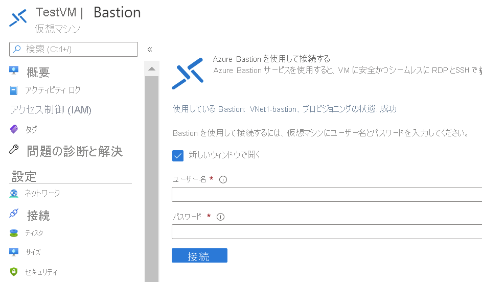

# クイック スタート:プライベート IP アドレスと Azure Bastion を使用して仮想マシンに接続する

このクイックスタートの記事では、プライベート IP アドレスを使用して仮想マシンに接続する方法について説明します。 Bastion 経由で接続する場合、仮想マシンにパブリック IP アドレスは必要ありません。 この記事の手順は、ポータルで仮想マシンを使用して仮想ネットワークに Bastion をデプロイする際に役立ちます。 サービスがプロビジョニングされると、同じ仮想ネットワーク内のすべての仮想マシンで RDP/SSH エクスペリエンスを使用できるようになります。

## 前提条件

* Azure 仮想ネットワーク。
* ポート 3389 が開いている仮想ネットワークに配置されている Azure 仮想マシン。

### 値の例

|**名前** | **Value** |
| --- | --- |
| 名前 |  VNet1Bastion |
| リージョン | eastus |
| 仮想ネットワーク |  VNet1 |
| + サブネット名 | AzureBastionSubnet |
| AzureBastionSubnet アドレス |  10.1.254.0/27 |
| パブリック IP アドレス |  新規作成 |
| パブリック IP アドレス名 | VNet1BastionPIP  |
| パブリック IP アドレスの SKU |  Standard  |
| 割り当て  | 静的 |

## Bastion ホストの作成

既存の仮想マシンを使用してポータルで要塞ホストを作成する場合、お使いの仮想マシンまたは仮想ネットワークに対応する既定値がさまざまな設定に自動的に設定されます。

1. [Azure Portal](https://portal.azure.com)を開きます。 お使いの仮想マシンに移動し、 **[接続]** をクリックします。

   
1. ドロップダウンから **[Bastion]** を選択します。
1. [接続] ページで、 **[Bastion を使用]** を選択します。

   ![[Bastion] を選択する](./media/quickstart-host-portal/select-bastion.png)

1. [Bastion] ページで、次の設定フィールドを入力します。

   * **Name**:要塞ホストに名前を付ける
   * **サブネット**:Bastion リソースがデプロイされる仮想ネットワーク内のサブネットです。 このサブネットは **AzureBastionSubnet** という名前で作成される必要があります。 この名前により、Bastion リソースをデプロイするサブネットが Azure で認識されます。 これはゲートウェイ サブネットとは異なります。 /27 かそれより大きいサブネットを使用する必要があります (/27、/26、/25 など)。
   
      * **[サブネット構成の管理]** を選択し、 **[+ サブネット]** を選択します。
      * [サブネットの追加] ページで、「**AzureBastionSubnet**」と入力します。
      * アドレス範囲を CIDR 表記で指定します。 (例: 10.1.254.0/27)。
      * **[OK]** を選択してサブネットを作成します。 ページの上部で、Bastion に戻って残りの設定を完了します。

         
   * **[パブリック IP アドレス]** : これは、RDP/SSH が (ポート 443 経由で) アクセスされる Bastion リソースのパブリック IP です。 新しいパブリック IP を作成するか、既存のものを使用します。 パブリック IP アドレスは、作成している Bastion リソースと同じリージョン内にある必要があります。
   * **パブリック IP アドレス名**:パブリック IP アドレス リソースの名前です。
1. 検証画面で、 **[作成]** をクリックします。 Bastion リソースが作成され、デプロイされるまで、約 5 分お待ちください。

   

## 接続

Bastion が仮想ネットワークにデプロイされると、画面が [接続] ページに変わります。

1. 仮想マシン用のユーザー名とパスワードを入力します。 次に、 **[接続]** を選択します。

   
1. Bastion を使用したこの仮想マシンへの RDP 接続は、ポート 443 と Bastion サービスを使用して (HTML5 を介して) Azure portal で直接開きます。

   

## リソースをクリーンアップする

仮想ネットワークと仮想マシンを使い終えたら、リソース グループとそれに含まれるすべてのリソースを削除します。

1. ポータルの上部にある **[検索]** ボックスに「*TestRG1*」と入力し、検索結果から **[TestRG1]** を選択します。

2. **[リソース グループの削除]** を選択します。

3. **[リソース グループ名を入力してください]** に「*TestRG1*」と入力し、 **[削除]** を選択します。

## 次のステップ

このクイックスタートでは、仮想ネットワーク用の Bastion ホストを作成し、その Bastion ホストを介して安全に仮想マシンに接続しました。

* Azure Bastion の詳細については、[Bastion の概要](bastion-overview.md)と [Bastion の FAQ](bastion-faq.md) に関する記事を参照してください。
* Azure Bastion サブネットでネットワーク セキュリティ グループを使用する方法については、[NSG の使用](bastion-nsg.md)に関するページを参照してください。
* Azure Bastion ホスト設定の説明が記載されている手順については、[チュートリアル](bastion-create-host-portal.md)を参照してください。
* 仮想マシン スケール セットに接続する方法については、「[Azure Bastion を使用して仮想マシン スケール セットに接続する](bastion-connect-vm-scale-set.md)」を参照してください。