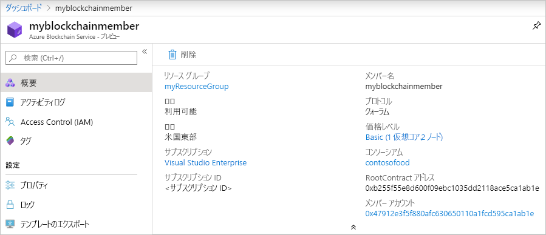

# クイック スタート:Azure portal を使用して Azure Blockchain Service ブロックチェーン メンバーを作成する

このクイックスタートでは、Azure portal を使用して Azure Blockchain Service 内にブロックチェーンの新しいメンバーとコンソーシアムをデプロイします。

[!INCLUDE [quickstarts-free-trial-note](../../../includes/quickstarts-free-trial-note.md)]

## 前提条件

[なし] :

## ブロックチェーン メンバーを作成する

Azure Blockchain Service メンバーは、プライベート コンソーシアム ブロックチェーン ネットワーク内のブロックチェーン ノードです。 メンバーをプロビジョニングするときは、コンソーシアム ネットワークを作成するか、またはコンソーシアム ネットワークに参加することができます。 コンソーシアム ネットワークには少なくとも 1 つのメンバーが必要です。 参加者が必要とするブロックチェーン メンバーの数は、シナリオによって異なります。 コンソーシアムの参加者は、1 つまたは複数のブロックチェーン メンバーを有するか、または他の参加者との間でメンバーを共有することができます。 コンソーシアムの詳細については、「[Azure Blockchain Service のコンソーシアム](consortium.md)」を参照してください。

1. [Azure portal](https://portal.azure.com) にサインインします。
1. Azure Portal の左上隅にある **[リソースの作成]** を選択します。
1. **[ブロックチェーン]**  >  **[Azure Blockchain Service (プレビュー)]** の順に選択します。

    

    設定 | 説明
    --------|------------
    サブスクリプション | サービスに使用する Azure サブスクリプションを選択します。 複数のサブスクリプションをお持ちの場合は、リソースの課金対象となるサブスクリプションを選択してください。
    Resource group | 新しいリソース グループ名を作成するか、サブスクリプションの既存のリソース グループ名を選択します。
    リージョン | メンバーを作成するリージョンを選択します。 コンソーシアムのメンバーの場所は全員同じにする必要があります。 一部のリージョンでは、機能が利用できない場合があります。 Azure Blockchain Data Manager は、米国東部と西ヨーロッパの Azure リージョンで利用できます。
    Protocol | プレビュー版の Azure Blockchain Service は現在、Quorum プロトコルをサポートしています。
    コンソーシアム | 新しいコンソーシアムの一意の名前を入力します。 招待状を介してコンソーシアムに参加する場合には、参加しようとしているコンソーシアムを選択します。 コンソーシアムの詳細については、「[Azure Blockchain Service のコンソーシアム](consortium.md)」を参照してください。
    名前 | Azure Blockchain Service のメンバーの一意の名前を選択します。 ブロックチェーン メンバー名に使用できるのは、小文字と数字のみです。 先頭の文字は英字にする必要があります。 値の長さは 2 から 20 文字にする必要があります。
    メンバー アカウントのパスワード | メンバー アカウントのパスワードは、メンバー用に作成される Ethereum アカウントの秘密キーの暗号化に使用されます。 メンバー アカウントとメンバー アカウントのパスワードをコンソーシアムの管理に使用します。
    価格 | 新しいサービスのノード構成とコスト。 **[変更]** リンクを選択して **[Standard]** と **[Basic]** のいずれかのレベルを選択します。 開発、テスト、概念実証には、*Basic* レベルを使用します。 運用グレードのデプロイには、*Standard* レベルを使用します。 また、Blockchain Data Manager を使用している場合や大量のプライベート トランザクションを送信する場合にも、*Standard* レベルを使用する必要があります。 メンバーの作成後に価格レベルを Basic と Standard の間で変更することはできません。
    ノードのパスワード | メンバーの既定のトランザクション ノードのパスワード。 このパスワードは、ブロックチェーン メンバーの既定のトランザクション ノード パブリック エンドポイントに接続する際の基本認証に使用します。

1. **[確認および作成]** を選択して設定を検証します。 **[作成]** を選択して、サービスをプロビジョニングします。 プロビジョニングには約 10 分かかります。
1. デプロイ プロセスを監視するには、ツール バーの **[通知]** を選択します。
1. デプロイ後、ブロックチェーン メンバーに移動します。

**[概要]** を選択すると、RootContract アドレスやメンバー アカウントなど、サービスに関する基本情報を確認できます。

## リソースをクリーンアップする

作成したメンバーは、次のクイックスタートまたはチュートリアルに使用できます。 必要なくなったら、このクイックスタートのために作成した `myResourceGroup` リソース グループを削除することによって、リソースを削除できます。

リソース グループを削除するには:

1. Azure Portal で、左側のナビゲーション ウィンドウの **[リソース グループ]** に移動し、削除するリソース グループを選択します。
2. **[リソース グループの削除]** を選択します。 リソース グループ名を入力して削除を確認し、 **[削除]** を選択します。

## 次のステップ

このクイックスタートでは、Azure Blockchain Service のメンバーと新しいコンソーシアムをデプロイしました。 次は、Azure Blockchain Development Kit for Ethereum を使用して Azure Blockchain Service のメンバーに接続するクイックスタートに挑戦してみてください。

> [!div class="nextstepaction"]
> [Visual Studio Code を使用して Azure Blockchain Service に接続する](connect-vscode.md)
