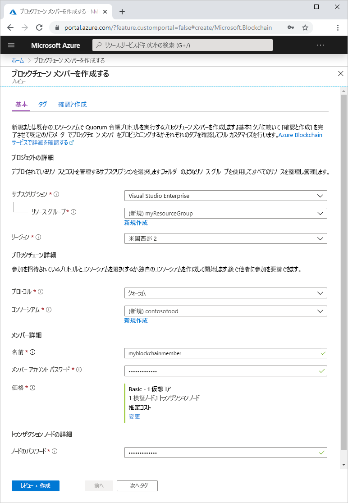

# クイック スタート:Azure portal を使用して Azure Blockchain Service ブロックチェーン メンバーを作成する

Azure Blockchain Service は、スマート コントラクト内でビジネス ロジックを実行できるブロックチェーン プラットフォームです。 このクイックスタートでは、Azure portal を使用してブロックチェーン メンバーを作成することから始める方法について説明します。

[!INCLUDE [quickstarts-free-trial-note](../../../includes/quickstarts-free-trial-note.md)]

## ブロックチェーン メンバーを作成する

新規または既存のコンソーシアムで Quorum 台帳プロトコルを実行するブロックチェーン メンバーを作成します。

1. [Azure Portal](https://portal.azure.com) にサインインします。
1. Azure Portal の左上隅にある **[リソースの作成]** を選択します。
1. **[ブロックチェーン]**  >  **[Azure Blockchain Service]\(Azure Blockchain Service \)** を選択します。
1. テンプレートを編集して完成させます。

    

    Setting | 説明
    --------|------------
    ブロックチェーン メンバー | Azure Blockchain Service のブロックチェーン メンバーを識別する一意の名前を選択します。 ブロックチェーン メンバー名に使用できるのは、小文字と数字のみです。 先頭の文字は英字にする必要があります。 値の長さは 2 から 20 文字にする必要があります。
    Subscription | サービスに使用する Azure サブスクリプションを選択します。 複数のサブスクリプションをお持ちの場合は、リソースの課金対象となるサブスクリプションを選択してください。
    Resource group | 新しいリソース グループ名、またはサブスクリプションの既存のリソース グループ名。
    Region | コンソーシアムの全メンバーの場所は同じにする必要があります。
    メンバー アカウントのパスワード | メンバー アカウントのパスワードは、メンバー用に作成される Ethereum アカウントの秘密キーの暗号化に使用されます。 メンバー アカウントとメンバー アカウントのパスワードをコンソーシアムの管理に使用します。
    コンソーシアム名 | 新しいコンソーシアムの一意の名前を入力します。 招待状を介してコンソーシアムに参加する場合、この値は参加しているコンソーシアムです。
    説明 | コンソーシアムの説明。
    Protocol |  プレビューは Quorum プロトコルをサポートしています。
    価格 | 新しいサービスのノード構成。 **[Standard]** を選択します。 2 つの検証ノードと 1 つのトランザクション ノードが既定の設定です。
    トランザクション ノードのパスワード | メンバーの既定のトランザクション ノードのパスワード。 このパスワードは、ブロックチェーン メンバーの既定のトランザクション ノード パブリック エンドポイントに接続する際の基本認証に使用します。

1. **[作成]** を選択して、サービスをプロビジョニングします。 プロビジョニングには約 10 分かかります。
1. デプロイ プロセスを監視するには、ツール バーの **[通知]** を選択します。
1. デプロイ後、ブロックチェーン メンバーに移動します。

**[概要]** を選択すると、RootContract アドレスやメンバー アカウントなど、サービスに関する基本情報を確認できます。

## リソースのクリーンアップ

作成したメンバーは、次のクイックスタートまたはチュートリアルに使用できます。 必要なくなったら、Azure Blockchain Service で作成した `myResourceGroup` リソース グループを削除することによって、リソースを削除できます。

リソース グループを削除するには:

1. Azure Portal で、左側のナビゲーション ウィンドウの **[リソース グループ]** に移動し、削除するリソース グループを選択します。
2. **[リソース グループの削除]** を選択します。 リソース グループ名を入力して削除を確認し、 **[削除]** を選択します。

## 次の手順

> [!div class="nextstepaction"]
> [MetaMask を使用してスマート コントラクトを接続およびデプロイする](connect-metamask.md)