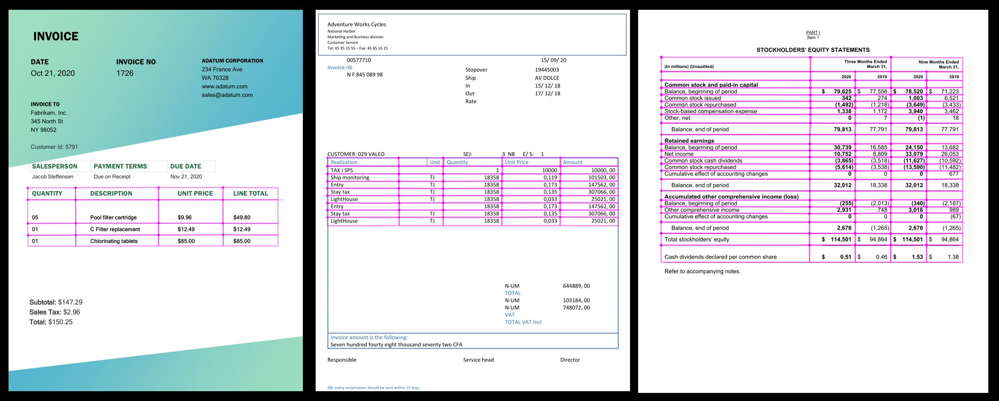

# Form Recognizer レイアウト サービス

Azure Form Recognizer を使用すると、レイアウト サービスを使用して、ドキュメントからテキスト、テーブル、選択マーク、構造情報を抽出できます。 Layout API を使用すると、お客様はさまざまな形式のドキュメントを受け取り、ドキュメントの構造化されたデータ表現を返すことができます。 これは、Microsoft の強力な[光学式文字認識 (OCR)](../computer-vision/overview-ocr.md) 機能と、ディープ ラーニング モデルを組み合わせ、テキスト、テーブル、選択マーク、ドキュメント構造を抽出します。 

## レイアウト サービスの機能

Layout API を使用すると、非常に優れた精度でドキュメントからテキスト、テーブル、選択マーク、構造の情報が抽出され、構造化された JSON 応答に整理されて返されます。 ドキュメントは、携帯電話でキャプチャされた画像、スキャンされたドキュメント、デジタル PDF など、さまざまな形式や品質のものを利用できます。 Layout API により、そのようなドキュメントのいずれからも、構造化された出力が正確に抽出されます。

## 試してみる

Form Recognizer のレイアウト サービスを試してみるには、オンラインのサンプル UI ツールにアクセスしてください。

> [!div class="nextstepaction"]
> [Form Recognizer を試す](https://fott-preview.azurewebsites.net)

Form Recognizer Layout API を試すには、Azure サブスクリプション ([無料で作成](https://azure.microsoft.com/free/cognitive-services)) と [Form Recognizer リソース](https://ms.portal.azure.com/#create/Microsoft.CognitiveServicesFormRecognizer) エンドポイントおよびキーが必要です。 

### 入力の要件 

[!INCLUDE [input requirements](./includes/input-requirements-receipts.md)]

## レイアウト分析操作

まず、[レイアウト分析](https://westcentralus.dev.cognitive.microsoft.com/docs/services/form-recognizer-api-v2-1-preview-3/operations/AnalyzeLayoutAsync)操作を呼び出します。 レイアウト分析を使用すると、ドキュメント (画像、TIFF、または PDF ファイル) が入力として取得されて、ドキュメントのテキスト、テーブル、選択マーク、構造が抽出されます。 この呼び出しにより、`Operation-Location` という応答ヘッダー フィールドが返されます。 `Operation-Location` 値は、次の手順で使用される結果 ID を含む URL です。

|応答ヘッダー| 結果の URL |
|:-----|:----|
|Operation-Location | `https://cognitiveservice/formrecognizer/v2.1-preview.3/layout/analyzeResults/44a436324-fc4b-4387-aa06-090cfbf0064f` |

### 自然な読み取り順序の出力 (ラテンのみ)

`readingOrder` クエリ パラメーターを使用し、テキスト行の出力順序を指定できます。 次の例に示すように、`natural` を使用して、よりわかりやすい読み取り順序の出力を行います。 この機能は、ラテン語系の言語でのみサポートされています。

:::image type="content" source="../Computer-vision/Images/ocr-reading-order-example.png" alt-text="レイアウトの読み取り順序の例" lightbox="../Computer-vision/Images/ocr-reading-order-example.png":::

### テキスト抽出のページ番号または範囲の選択

ページが複数にわたる大きなドキュメントの場合、`pages` クエリ パラメーターを使用し、テキスト抽出対象として特定のページ番号またはページ範囲を示します。 次の例は、10 ページを含むドキュメントを示しています。ここには、すべてのページ (1 から 10) と選択したページ (3 から 6) の両方に対して抽出されたテキストがあります。

:::image type="content" source="../Computer-vision/Images/ocr-select-pages.png" alt-text="レイアウトが選択されたページの出力":::

## レイアウト分析結果取得操作

2 番目の手順では、[レイアウト分析結果取得](https://westcentralus.dev.cognitive.microsoft.com/docs/services/form-recognizer-api-v2-1-preview-3/operations/GetAnalyzeLayoutResult)操作を呼び出します。 この操作には、レイアウト分析操作によって作成された結果 ID を入力として渡します。 これにより、次の設定可能な値を持つ **status** フィールドが含まれた JSON 応答が返されます。 

|フィールド| 型 | 設定可能な値 |
|:-----|:----:|:----|
|status | string | `notStarted`:分析操作は開始されていません。  `running`:分析操作が進行中です。  `failed`:分析操作は失敗しました。  `succeeded`:分析操作は成功しました。|

`succeeded` 値が返されるまで、この操作を繰り返し呼び出します。 1 秒あたりの要求数 (RPS) を超えないようにするために、間隔は 3 - 5 秒あけてください。

**status** フィールドの値が `succeeded` である場合、JSON の応答には、抽出されたレイアウト、テキスト、テーブル、選択マークが含まれます。 抽出されるデータには、抽出されたテキスト行と単語、境界ボックス、手書きの指示があるテキスト外観、テーブル、選択マークと選択または非選択の指示が含まれます。 

### テキスト行の手書き分類 (ラテンのみ)

応答では、各テキスト行が手書きスタイルであるかどうかと、信頼度スコアが分類されます。 この機能は、ラテン語系の言語でのみサポートされています。 次の例は、画像内のテキストの手書き分類を示しています。

:::image type="content" source="../Computer-vision/Images/ocr-handwriting-classification.png" alt-text="手書きの分類の例":::

### サンプル JSON 出力

"*レイアウト分析結果取得*" 操作への応答は、抽出されたすべての情報が含まれるドキュメントの構造化表現になります。 [サンプルのドキュメント ファイル](https://github.com/Azure-Samples/cognitive-services-REST-api-samples/tree/master/curl/form-recognizer/sample-layout.pdf)と、その構造化された出力である[サンプルのレイアウト出力](https://github.com/Azure-Samples/cognitive-services-REST-api-samples/tree/master/curl/form-recognizer/sample-layout-output.json)を参照してください。

JSON 出力には次の 2 つの部分があります。

* `readResults` ノードには、認識されたすべてのテキストと選択マークが格納されます。 テキストは、まずページごとに整理され、そのうえで行ごと、さらに個々の単語ごとに整理されます。 
* `pageResults` ノードには、境界ボックスで抽出されたテーブルとセル、信頼度、および "readResults" 内の行と単語への参照が格納されます。

## 出力例

### テキスト

Layout API により、ドキュメント (PDF、TIFF) と画像 (JPG、PNG、BMP) から、複数のテキストの角度や色でテキストが抽出されます。 この対象になるのは、ドキュメント、FAX、印刷および手書きのテキスト (英語のみ)、混合モードの写真です。 テキストは、行、単語、境界ボックス、信頼度スコア、スタイル (手書きなど) に関して提供される情報と共に抽出されます。 すべてのテキスト情報は、JSON 出力の `readResults` セクションに含まれています。 

### テーブル

Layout API により、ドキュメント (PDF、TIFF) と画像 (JPG、PNG、BMP) からテーブルが抽出されます。 ドキュメントは、スキャンされたもの、写真、またはデジタル化されたもののいずれでもかまいません。 テーブルは、セルまたは列が結合されている複雑なものや、罫線があるもの、またはないもの、不規則な角度のものも含まれます。 抽出されるテーブル情報には、列と行の数、行の範囲、列の範囲が含まれます。 各セルと共に、その境界ボックスと、`readResults` セクションに抽出されたテキストへの参照が抽出されます。 テーブルの情報は、JSON 出力の `pageResults` セクションにあります。 

### 選択マーク

Layout API により、ドキュメントから選択マークも抽出されます。 抽出される選択マークには、境界ボックス、信頼度、状態 (選択または非選択) が含まれます。 選択マークの情報は、JSON 出力の `readResults` セクションに抽出されます。 

## 次のステップ

* [Form Recognizer のサンプル UI ツール](https://fott-preview.azurewebsites.net/)を使用し、独自のレイアウト抽出を試してみてください
* 選択した開発言語でのレイアウト抽出を始めるには、[Form Recognizer のクイックスタート](quickstarts/client-library.md)を行います。

## 関連項目

* [Form Recognizer とは](./overview.md)
* [REST API リファレンス ドキュメント](https://westcentralus.dev.cognitive.microsoft.com/docs/services/form-recognizer-api-v2-1-preview-3/operations/AnalyzeLayoutAsync)
