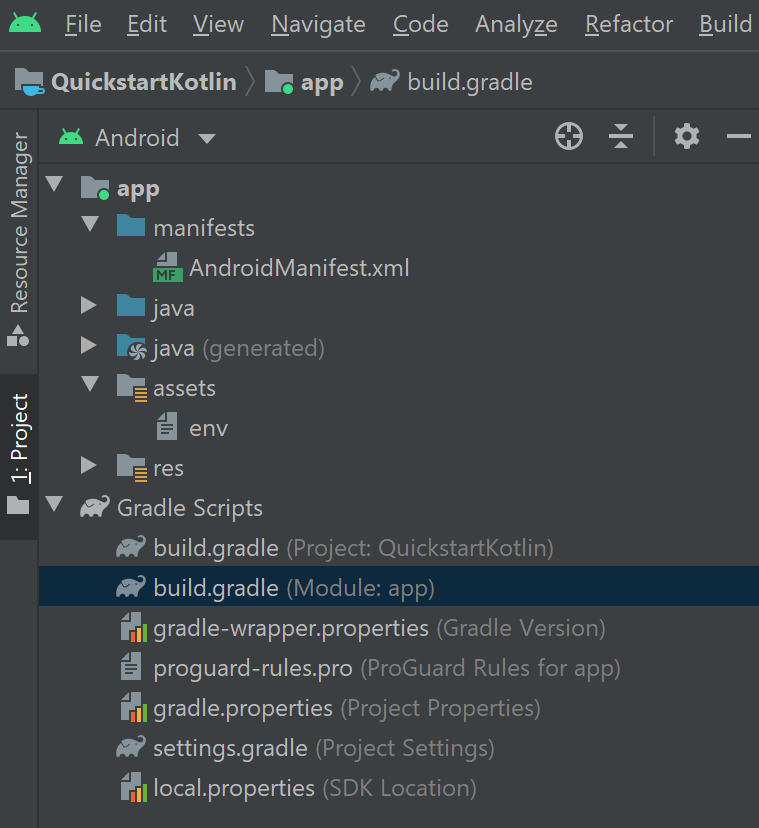
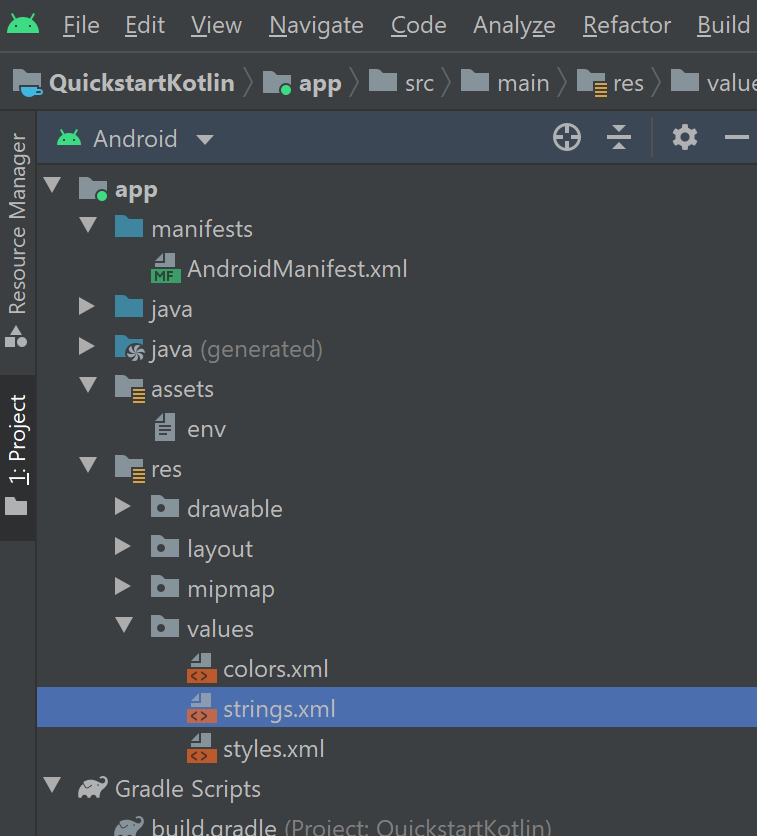
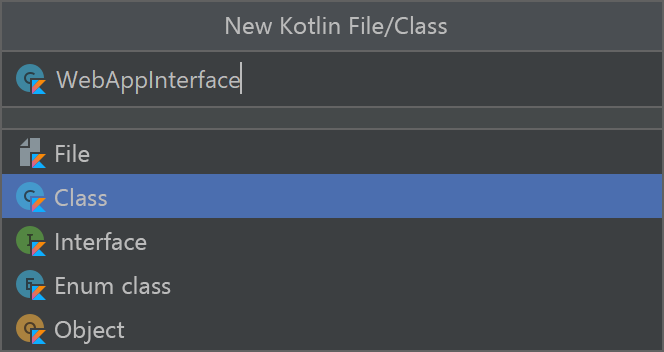
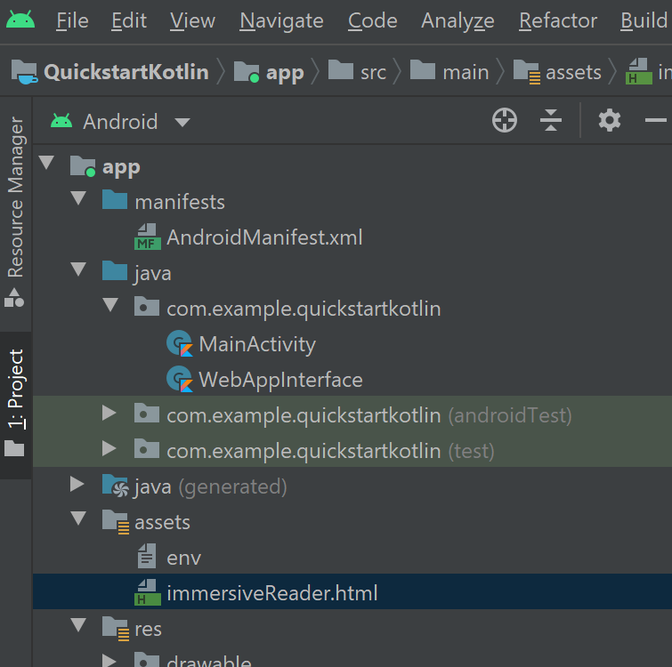
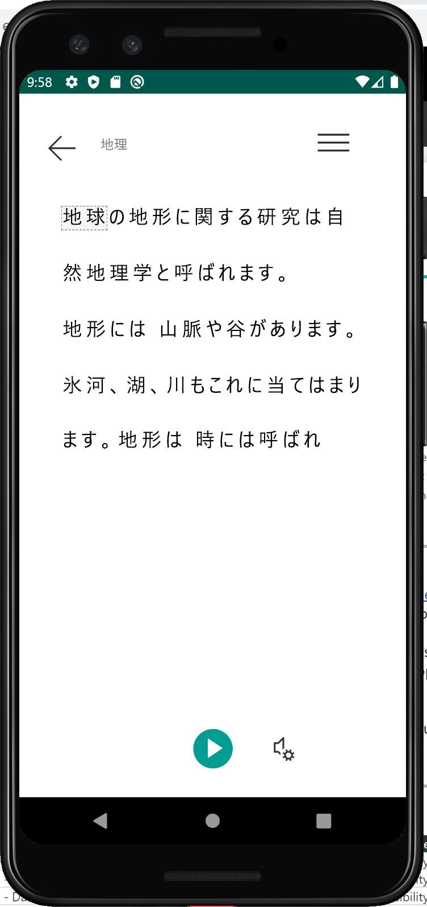

[Immersive Reader](https://www.onenote.com/learningtools) は、新しい読者、言語学習者、ディスレクシア (失読症) などの学習障碍者の読解力向上のために実証済みの手法を実装する、包括的に設計されたツールです。 アプリケーションに Immersive Reader を使用すると、テキストを分離することによって、集中しやすくする、よく用いられる単語に画像を表示する、品詞を強調表示する、選択テキストを読み上げる、単語や文章をリアルタイムで翻訳する、といったことができます。

このクイックスタートでは、Android アプリを一から作成してイマーシブ リーダーを統合します。 このクイックスタートの完全なサンプルは [GitHub](https://github.com/microsoft/immersive-reader-sdk/tree/master/js/samples/quickstart-kotlin) で入手できます。

## <a name="prerequisites"></a>前提条件

* Azure サブスクリプション - [無料アカウントを作成します](https://azure.microsoft.com/free/cognitive-services)
* Azure Active Directory 認証用に構成されたイマーシブ リーダー リソース。 設定するには、[これらの手順](../../how-to-create-immersive-reader.md)に従ってください。 環境のプロパティを構成する際に、ここで作成した値のいくつかが必要になります。 後で参照するために、実際のセッションの出力をテキスト ファイルに保存します。
* [Git](https://git-scm.com/).
* [イマーシブ リーダー SDK](https://github.com/microsoft/immersive-reader-sdk)。
* [Android Studio](https://developer.android.com/studio)。

## <a name="create-an-android-project"></a>Android プロジェクトの作成

Android Studio で新しいプロジェクトを開始する この例のソース コードは、[イマーシブ リーダー SDK](https://github.com/microsoft/immersive-reader-sdk/tree/master/js/samples/quickstart-kotlin) の一部として提供されています。


**[Choose your project]\(プロジェクトの選択\)** ページで **[Empty Activity]\(空のアクティビティ\)** を選択し、 **[Next]\(次へ\)** を選択します。

![[Empty Activity]\(空のアクティビティ\) プロジェクト - Kotlin](../../media/android/kotlin/android-studio-empty-activity.png)

## <a name="configure-the-project"></a>プロジェクトを構成する

プロジェクトに「**QuickstartKotlin**」という名前を付け、保存する場所を選択します。 プログラミング言語として **[Kotlin]** を選択し、 **[完了]** を選択します。


## <a name="set-up-assets-and-authentication"></a>資産と認証を設定する

新しい **/assets** フォルダーを作成します。


 Assets フォルダー内に **env** という名前のファイルを作成します。 次の名前と値を追加し、適切な値を指定します。 この env ファイルには公開してはいけないシークレットが含まれているので、ソース管理にコミットしないでください。


```text
TENANT_ID=<YOUR_TENANT_ID>
CLIENT_ID=<YOUR_CLIENT_ID>
CLIENT_SECRET=<YOUR_CLIENT_SECRET>
SUBDOMAIN=<YOUR_SUBDOMAIN>
```


## <a name="add-dependencies"></a>依存関係を追加する

**build.gradle** ファイル内の既存の依存関係を以下の実装で置き換えます。これにより、env ファイル内に定義されている変数を coroutines (非同期プログラミング)、gson (JSON 解析およびシリアル化)、dotenv で参照することができます。 このクイックスタートの後の手順で MainActivity.kt を実装するとき、プロジェクトを再度同期することが必要になる場合があります。

```build.gradle
dependencies {
    implementation fileTree(dir: 'libs', include: ['*.jar'])
    implementation"org.jetbrains.kotlin:kotlin-stdlib-jdk7:$kotlin_version"
    implementation 'androidx.appcompat:appcompat:1.0.2'
    implementation 'androidx.core:core-ktx:1.0.2'
    implementation 'androidx.constraintlayout:constraintlayout:1.1.3'
    implementation "org.jetbrains.kotlinx:kotlinx-coroutines-core:1.1.1"
    implementation "org.jetbrains.kotlinx:kotlinx-coroutines-android:1.1.1"
    implementation 'com.google.code.gson:gson:2.8.6'
    implementation 'io.github.cdimascio:java-dotenv:5.1.3'
    testImplementation 'junit:junit:4.12'
    androidTestImplementation 'androidx.test.ext:junit:1.1.0'
    androidTestImplementation 'androidx.test.espresso:espresso-core:3.1.1'
}
```



## <a name="update-app-strings-and-layout-resources"></a>アプリ文字列とレイアウト リソースを更新する

**res/strings/strings.xml** の内容を、アプリで使用される以下の文字列で置き換えます。



```strings.xml
<resources>

    <!-- Copyright (c) Microsoft Corporation. All rights reserved. -->
    <!-- Licensed under the MIT License. -->

    <string name="app_name">ImmersiveReaderSDK</string>
    <string name="geographyTitle">Geography</string>
    <string name="geographyTextEn">The study of Earth's landforms is called physical geography. Landforms can be mountains and valleys. They can also be glaciers, lakes or rivers. Landforms are sometimes called physical features. It is important for students to know about the physical geography of Earth. The seasons, the atmosphere and all the natural processes of Earth affect where people are able to live. Geography is one of a combination of factors that people use to decide where they want to live.The physical features of a region are often rich in resources. Within a nation, mountain ranges become natural borders for settlement areas. In the U.S., major mountain ranges are the Sierra Nevada, the Rocky Mountains, and the Appalachians. Fresh water sources also influence where people settle. People need water to drink. They also need it for washing. Throughout history, people have settled near fresh water. Living near a water source helps ensure that people have the water they need. There was an added bonus, too. Water could be used as a travel route for people and goods. Many Americans live near popular water sources, such as the Mississippi River, the Colorado River and the Great Lakes.Mountains and deserts have been settled by fewer people than the plains areas. However, they have valuable resources of their own.</string>
    <string name="geographyTextFr">L\'étude des reliefs de la Terre est appelée géographie physique. Les reliefs peuvent être des montagnes et des vallées. Il peut aussi s\'agira de glaciers, delacs ou de rivières. Les reliefs sont parfois appelés caractéristiques physiques. Il est important que les élèves connaissent la géographie physique de laTerre. Les saisons, l\'atmosphère et tous les processus naturels de la Terre affectent l\'endroit où les gens sont capables de vivre. La géographie est l\'un desfacteurs que les gens utilisent pour décider où ils veulent vivre. Les caractéristiques physiques d\'une région sont souvent riches en ressources. Àl\'intérieur d\'une nation, les chaînes de montagnes deviennent des frontières naturelles pour les zones de peuplement. Aux États-Unis, les principaleschaînes de montagnes sont la Sierra Nevada, les montagnes Rocheuses et les Appalaches.Les sources d\'eau douce influencent également l\'endroit où lesgens s\'installent. Les gens ont besoin d\'eau pour boire. Ils en ont aussi besoin pour se laver. Tout au long de l\'histoire, les gens se sont installés près del\'eau douce. Vivre près d\'une source d\'eau permet de s\'assurer que les gens ont l\'eau dont ils ont besoin. Il y avait un bonus supplémentaire, aussi. L\'eaupourrait être utilisée comme voie de voyage pour les personnes et les marchandises. Beaucoup d\'Américains vivent près des sources d\'eau populaires,telles que le fleuve Mississippi, le fleuve Colorado et les Grands Lacs.Mountains et les déserts ont été installés par moins de gens que les zones desplaines. Cependant, ils disposent de ressources précieuses.Les gens ont une réponse.</string>
    <string name="immersiveReaderButtonText">Immersive Reader</string>
</resources>
```

**res/layout/activity_main.xml** の内容を、アプリで使用される以下の XML で置き換えます。 この XML はアプリの UI レイアウトです。


```activity_main.xml
<?xml version="1.0" encoding="utf-8"?>

<!-- Copyright (c) Microsoft Corporation. All rights reserved. -->
<!-- Licensed under the MIT License. -->

<androidx.constraintlayout.widget.ConstraintLayout xmlns:android="http://schemas.android.com/apk/res/android"
    xmlns:app="http://schemas.android.com/apk/res-auto"
    xmlns:tools="http://schemas.android.com/tools"
    android:layout_width="match_parent"
    android:layout_height="match_parent"
    android:background="#FFFFFF"
    tools:context=".MainActivity">

    <LinearLayout
        android:id="@+id/linearLayout"
        android:layout_width="match_parent"
        android:layout_height="0dp"
        android:background="#FFFFFF"
        android:orientation="vertical"
        app:layout_constraintBottom_toBottomOf="parent"
        app:layout_constraintEnd_toEndOf="parent"
        app:layout_constraintHorizontal_bias="0.0"
        app:layout_constraintStart_toStartOf="parent"
        app:layout_constraintTop_toTopOf="parent"
        app:layout_constraintVertical_bias="0.0">

        <TextView
            android:id="@+id/Title"
            android:layout_width="match_parent"
            android:layout_height="wrap_content"
            android:layout_marginLeft="48dp"
            android:layout_marginTop="24dp"
            android:layout_marginRight="48dp"
            android:layout_marginBottom="24dp"
            android:text="@string/geographyTitle"
            android:textSize="24sp"
            android:textStyle="bold" />

        <ScrollView
            android:id="@+id/ContentPane"
            android:layout_width="match_parent"
            android:layout_height="480dp"
            android:layout_marginBottom="48dp"
            android:clipToPadding="false"
            android:fillViewport="false"
            android:paddingLeft="48dp"
            android:paddingRight="48dp"
            android:scrollbarStyle="outsideInset"
            android:visibility="visible"
            tools:visibility="visible">

            <LinearLayout
                android:layout_width="match_parent"
                android:layout_height="match_parent"
                android:orientation="vertical">

                <TextView
                    android:id="@+id/Content1"
                    android:layout_width="match_parent"
                    android:layout_height="wrap_content"
                    android:background="#00FFFFFF"
                    android:text="@string/geographyTextEn"
                    android:textSize="18sp" />

                <TextView
                    android:id="@+id/Content2"
                    android:layout_width="match_parent"
                    android:layout_height="wrap_content"
                    android:background="#00FFFFFF"
                    android:text="@string/geographyTextFr"
                    android:textSize="18sp" />

            </LinearLayout>

        </ScrollView>

        <Button
            android:id="@+id/LaunchImmersiveReaderButton"
            android:layout_width="match_parent"
            android:layout_height="60dp"
            android:layout_marginLeft="40dp"
            android:layout_marginRight="40dp"
            android:layout_marginBottom="80dp"
            android:text="@string/immersiveReaderButtonText"
            android:textAllCaps="false"
            android:textSize="24sp"
            android:visibility="visible"
            tools:visibility="visible" />

    </LinearLayout>

</androidx.constraintlayout.widget.ConstraintLayout>
```

## <a name="set-up-the-app-kotlin-code-javascript-interface"></a>アプリ Kotlin コード JavaScript インターフェイスを設定する

**/Java/com.example.quickstartkotlin** フォルダーで、新しい Kotlin クラスを作成し、「**WebAppInterface**」という名前を付けます。 次に、これに以下のコードを追加します。 このコードにより、アプリでは、後の手順で追加する HTML で、JavaScript 関数とのインターフェイスが可能になります。




```WebAppInterface.kt
// Copyright (c) Microsoft Corporation. All rights reserved.
// Licensed under the MIT License.

package com.example.quickstartkotlin

import android.content.Context
import android.webkit.JavascriptInterface
import android.webkit.WebView
import android.widget.LinearLayout
import android.widget.Toast

class WebAppInterface(private val mContext: Context, var parentLayout: LinearLayout, var webView: WebView) {

    // Show a toast from html.
    @JavascriptInterface
    fun showToast(toast: String) {
        Toast.makeText(mContext, toast, Toast.LENGTH_SHORT).show()
    }

    // Exit the Immersive Reader.
    @JavascriptInterface
    fun immersiveReaderExit() {
        webView.post(Runnable { destroyWebView(parentLayout, webView) })

        // Any additional functionality may be added here.
        Toast.makeText(mContext, "The Immersive Reader has been closed!", Toast.LENGTH_SHORT).show()
    }

    // Disposes of the WebView when the back arrow is tapped.
    private fun destroyWebView(parentLayout: LinearLayout, webView: WebView) {

        // Removes the WebView from its parent view before doing anything.
        parentLayout.removeView(webView)

        // Cleans things up before destroying the WebView.
        webView.clearHistory()
        webView.clearCache(true)
        webView.loadUrl("about:blank")
        webView.onPause()
        webView.removeAllViews()
        webView.pauseTimers()
        webView.destroy()
    }
}
```

## <a name="set-up-the-app-kotlin-code-main-activity"></a>アプリ Kotlin コードのメイン アクティビティを設定する

**/Java/com.example.quickstartkotlin** フォルダーで、既存の **MainActivity.kt** Kotlin クラス ファイルを確認できるようになります。 このファイルで、アプリ ロジックが作成されます。 その内容を次のコードに置き換えます。

```MainActivity.kt
// Copyright (c) Microsoft Corporation. All rights reserved.
// Licensed under the MIT License.

package com.example.quickstartkotlin

import android.app.Activity
import androidx.appcompat.app.AppCompatActivity
import android.os.Bundle
import android.webkit.CookieManager
import android.webkit.WebView
import android.widget.Button
import android.webkit.WebViewClient
import android.widget.LinearLayout
import android.widget.TextView
import com.google.gson.*
import io.github.cdimascio.dotenv.dotenv
import java.io.IOException
import java.io.*
import java.net.HttpURLConnection
import java.net.HttpURLConnection.HTTP_OK
import java.net.URL
import kotlinx.coroutines.*
import org.json.JSONObject
import java.util.*

// This sample app uses the Dotenv. It's a module that loads environment variables from a .env file to better manage secrets.
// https://github.com/cdimascio/java-dotenv
// Be sure to add a "env" file to the /assets folder.
// Instead of '.env', use 'env'.

class MainActivity : AppCompatActivity() {
    private val dotEnv = dotenv {
        directory = "/assets"
        filename = "env"
        ignoreIfMalformed = true
        ignoreIfMissing = true
    }

    private lateinit var contextualWebView: WebView

    override fun onCreate(savedInstanceState: Bundle?) {
        super.onCreate(savedInstanceState)
        this.supportActionBar!!.hide()
        setContentView(R.layout.activity_main)
        val immersiveReaderButton = findViewById<Button>(R.id.LaunchImmersiveReaderButton)
        immersiveReaderButton.setOnClickListener { GlobalScope.launch { handleLoadImmersiveReaderWebView() } }
    }

    // Assigns values to the objects sent to the Immersive Reader SDK,
    // acquires the token and authorizes the app, then launches
    // the Web View to get the response and load the Immersive Reader
    // when the button is clicked in HTML.
    private suspend fun handleLoadImmersiveReaderWebView() {
        val exampleActivity = this
        val subdomain = dotEnv["SUBDOMAIN"]
        val irTitle = findViewById<TextView>(R.id.Title)
        val irText1 = findViewById<TextView>(R.id.Content1)
        val irText2 = findViewById<TextView>(R.id.Content2)

        // The content of the request that's shown in the Immersive Reader.
        // This basic example contains chunks of two different languages.
        val chunk1 = Chunk()
        chunk1.content = irText1.text.toString()
        chunk1.lang = "en"
        chunk1.mimeType = "text/plain"

        val chunk2 = Chunk()
        chunk2.content = irText2.text.toString()
        chunk2.lang = "fr"
        chunk2.mimeType = "text/plain"

        val chunks = ArrayList<Chunk>()
        chunks.add(chunk1)
        chunks.add(chunk2)

        val content = Content()
        content.title = irTitle.text.toString()
        content.chunks = chunks

        // Options may be assigned values here (e.g. options.uiLang = "en").
        val options = Options()

        var token: String

        runBlocking{
            val resp = async { getImmersiveReaderTokenAsync() }
            token = resp.await()
            val jsonResp = JSONObject(token)
            loadImmersiveReaderWebView(exampleActivity, jsonResp.getString("access_token"), subdomain, content, options)
        }
    }

    // The next two functions get the token from the Immersive Reader SDK
    // and authorize the app.
    private suspend fun getImmersiveReaderTokenAsync(): String {
        return getToken()
    }

    @Throws(IOException::class)
    fun getToken(): String {
        val clientId = dotEnv["CLIENT_ID"]
        val clientSecret = dotEnv["CLIENT_SECRET"]
        val tenantId = dotEnv["TENANT_ID"]
        val tokenUrl = URL("https://login.windows.net/$tenantId/oauth2/token")
        val form = "grant_type=client_credentials&resource=https://cognitiveservices.azure.com/&client_id=$clientId&client_secret=$clientSecret"

        val connection = tokenUrl.openConnection() as HttpURLConnection
        connection.requestMethod = "POST"
        connection.setRequestProperty("content-type", "application/x-www-form-urlencoded")
        connection.doOutput = true

        val writer = DataOutputStream(connection.outputStream)
        writer.writeBytes(form)
        writer.flush()
        writer.close()

        val responseCode = connection.responseCode

        if (responseCode == HTTP_OK) {
            val readerIn = BufferedReader(InputStreamReader(connection.inputStream))
            var inputLine = readerIn.readLine()
            val response = StringBuffer()

            do {
                response.append(inputLine)
            } while (inputLine.length < 0)
            readerIn.close()

            // Return token
            return response.toString()
        } else {
            val responseError = Error(code = "BadRequest", message = "There was an error getting the token.")
            throw IOException(responseError.toString())
        }
    }

    // To be assigned values and sent to the Immersive Reader SDK
    class Chunk(var content: String? = null,
                var lang: String? = null,
                var mimeType: String? = null)

    class Content(var title: String? = null,
                  var chunks: List<Chunk>? = null)

    class Message(var cogSvcsAccessToken: String? = null,
                  var cogSvcsSubdomain: String? = null,
                  var content: Content? = null,
                  var launchToPostMessageSentDurationInMs: Int? = null,
                  var options: Options? = null)

    // Only includes Immersive Reader options relevant to Android apps.
    // For a complete list, visit https://docs.microsoft.com/azure/cognitive-services/immersive-reader/reference
    class Options(var uiLang: String? = null, // Language of the UI, e.g. en, es-ES (optional). Defaults to browser language if not specified.
                  var timeout: Int? = null, // Duration (in milliseconds) before launchAsync fails with a timeout error (default is 15000 ms).
                  var uiZIndex: Int? = null, // Z-index of the iframe that will be created (default is 1000)
                  var onExit: (() -> Any)? = null, // Executes a callback function when the Immersive Reader exits
                  var customDomain: String? = null, // Reserved for internal use. Custom domain where the Immersive Reader webapp is hosted (default is null).
                  var allowFullscreen: Boolean? = null, // The ability to toggle fullscreen (default is true).
                  var hideExitButton: Boolean? = null // Whether or not to hide the Immersive Reader's exit button arrow (default is false). This should only be true if there is an alternative mechanism provided to exit the Immersive Reader (e.g a mobile toolbar's back arrow).
    )

    class Error(var code: String? = null,
                var message: String? = null)

    // A custom Web View component that launches inside the app
    @Throws(IOException::class)
    fun loadImmersiveReaderWebView(
        exampleActivity: Activity,
        token: String,
        subdomain: String?,
        content: Content,
        options: Options
    ) {
        val startPostMessageSentDurationInMs = Date()

        // Populate the message
        val messageData = Message()
        messageData.cogSvcsAccessToken = token
        messageData.cogSvcsSubdomain = subdomain
        messageData.content = content
        messageData.options = options

        GlobalScope.launch {
            withContext(Dispatchers.Main) {
                contextualWebView = WebView(exampleActivity)
                val parentLayout = findViewById<LinearLayout>(R.id.linearLayout)
                val contextualWebViewSettings = contextualWebView.settings

                contextualWebViewSettings.allowContentAccess = true
                contextualWebViewSettings.builtInZoomControls = true
                contextualWebViewSettings.javaScriptEnabled = true
                contextualWebViewSettings.loadsImagesAutomatically = true
                contextualWebViewSettings.loadWithOverviewMode = true
                contextualWebViewSettings.useWideViewPort = true
                contextualWebViewSettings.userAgentString = "Android"
                contextualWebViewSettings.domStorageEnabled = true

                contextualWebViewSettings.setAppCacheEnabled(false)
                contextualWebViewSettings.setSupportZoom(true)
                contextualWebView.setInitialScale(1)

                // Enables WebView Cookies
                if (android.os.Build.VERSION.SDK_INT >= android.os.Build.VERSION_CODES.LOLLIPOP) {
                    CookieManager.getInstance().setAcceptThirdPartyCookies(contextualWebView, true)
                } else {
                    CookieManager.getInstance().setAcceptCookie(true)
                }

                val contextualWebViewLayout = LinearLayout.LayoutParams(LinearLayout.LayoutParams.MATCH_PARENT, LinearLayout.LayoutParams.MATCH_PARENT)
                parentLayout.addView(contextualWebView, 0, contextualWebViewLayout)

                // This is required to launch the WebView *inside* the host application.
                contextualWebView.webViewClient = object : WebViewClient() {
                    override fun shouldOverrideUrlLoading(view: WebView, url: String): Boolean {
                        view.loadUrl(url)
                        return true
                    }

                    // Send message JSON object to Immersive Reader html
                    override fun onPageFinished(view: WebView, url: String) {
                        val endPostMessageSentDurationInMs = Date()
                        val postMessageSentDurationInMs = (endPostMessageSentDurationInMs.time - startPostMessageSentDurationInMs.time).toInt()

                        // Updates launchToPostMessageSentDurationInMs
                        messageData.launchToPostMessageSentDurationInMs = postMessageSentDurationInMs

                        // Serializes message data class to JSON
                        val gson = Gson()
                        val message = gson.toJson(messageData)

                        // Calls the handleLaunchImmersiveReader function in HTML
                        if (android.os.Build.VERSION.SDK_INT >= android.os.Build.VERSION_CODES.KITKAT) {
                            view.evaluateJavascript("handleLaunchImmersiveReader($message)", null)
                        } else {
                            view.loadUrl("javascript:handleLaunchImmersiveReader($message)")
                        }

                        // Sets the visibility of the WebView after the function has been called.
                        view.visibility = WebView.VISIBLE
                    }
                }

                // This is where the WebAppInterface Class is used.
                // Affords a way for JavaScript to work with the app directly from
                // the Web View's HTML.
                val jsInterface = WebAppInterface(exampleActivity, parentLayout, contextualWebView)
                contextualWebView.addJavascriptInterface(jsInterface, "Android")
                contextualWebView.loadUrl("file:///android_asset/immersiveReader.html")
            }
        }
    }
}
```

## <a name="add-the-app-html-to-the-web-view"></a>Web ビューにアプリ HTML を追加する

Web ビューの実装では、HTML が機能する必要があります。 **/assets** フォルダーを右クリックし、新しいファイルを作成して、「**immersiveReader.html**」という名前を付けます。




次の HTML と JavaScript を追加します。 このコードにより、イマーシブ リーダー SDK がアプリに追加されます。そして、作成済みのアプリ コードを使用してイマーシブ リーダーを開くために使用されます。

```immersiveReader.html
<!-- Copyright (c) Microsoft Corporation. All rights reserved.
Licensed under the MIT License. -->

<!DOCTYPE html>
<html>
<head>
    <meta charset="utf-8">
    <meta name="viewport" content="width=device-width, initial-scale=1, shrink-to-fit=no">
    <script type="text/javascript" src="https://contentstorage.onenote.office.net/onenoteltir/immersivereadersdk/immersive-reader-sdk.1.0.0.js"></script>
</head>
<body>
<script type="text/javascript">
        function handleLaunchImmersiveReader(message) {
            if (!message) {
                Android.showToast('Message is null or undefined!');
            } else {
                // Learn more about chunk usage and supported MIME types https://docs.microsoft.com/azure/cognitive-services/immersive-reader/reference#chunk
                var data = {
                    title: message.content.title,
                    chunks: message.content.chunks
                };

                // A simple declarative function used to close the Immersive Reader WebView via @JavaScriptInterface
                var exitCallback = function() {
                    Android.immersiveReaderExit();
                }

                // Learn more about options https://docs.microsoft.com/azure/cognitive-services/immersive-reader/reference#options
                var options = {
                    onExit: exitCallback,
                    uiZIndex: 2000
                };

                // Use the JavaScript SDK to launch the Immersive Reader.
                ImmersiveReader.launchAsync(message.cogSvcsAccessToken, message.cogSvcsSubdomain, data, options);
            }
        }
    </script>
</body>
</html>
```

## <a name="set-up-app-permissions"></a>アプリのアクセス許可を設定する


アプリケーションが機能するためには、イマーシブ リーダー SDK へのネットワーク呼び出しを行う必要があるので、ネットワーク アクセスを許可するようにアプリのアクセス許可が構成されていることを確認する必要があります。 **/manifests/AndroidManifest.xml** の内容を次の XML で置き換えます。

```AndroidManifest.xml
<?xml version="1.0" encoding="utf-8"?>
<manifest xmlns:android="http://schemas.android.com/apk/res/android"
    package="com.example.quickstartkotlin">

    <uses-permission android:name="android.permission.INTERNET" />

    <application
        android:allowBackup="true"
        android:icon="@mipmap/ic_launcher"
        android:label="@string/app_name"
        android:roundIcon="@mipmap/ic_launcher_round"
        android:supportsRtl="true"
        android:theme="@style/AppTheme">
        <activity android:name=".MainActivity">
            <intent-filter>
                <action android:name="android.intent.action.MAIN" />

                <category android:name="android.intent.category.LAUNCHER" />
            </intent-filter>
        </activity>
    </application>

</manifest>
```

## <a name="run-the-app"></a>アプリを実行する

デバイス エミュレーター上でアプリを実行するには、Android Studio を使用します。 **[イマーシブ リーダー]** を選択すると、アプリのコンテンツがイマーシブ リーダーで開きます。



## <a name="next-steps"></a>次のステップ

[イマーシブ リーダー SDK](https://github.com/microsoft/immersive-reader-sdk) と[イマーシブ リーダー SDK リファレンス](../../reference.md)を確認します。