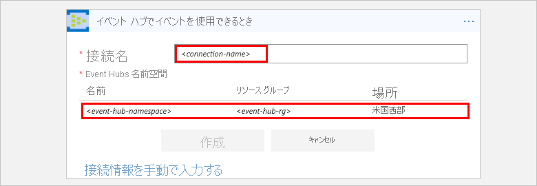
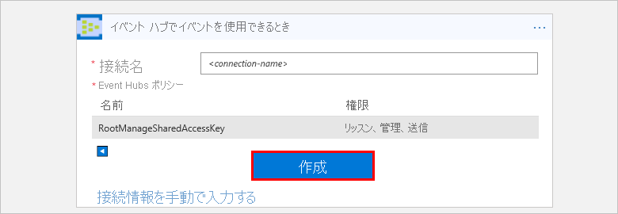

# Azure Event Hubs および Azure Logic Apps でイベントを監視および送受信する

この記事では、Azure Event Hubs コネクタを使用してロジック アプリの中から [Azure Event Hubs](../event-hubs/event-hubs-what-is-event-hubs.md) に送信されたイベントを監視および管理する方法を示します。 このようにして、イベント ハブからイベントを確認および送受信するためのタスクとワークフローを自動化するロジック アプリを作成できます。 コネクタ固有の技術情報については、[Azure Event Hubs コネクタ リファレンス](https://docs.microsoft.com/connectors/eventhubs/)に関する記事を参照してください。</a>

## 前提条件

* Azure サブスクリプション。 Azure サブスクリプションがない場合は、[無料の Azure アカウントにサインアップ](https://azure.microsoft.com/free/)してください。 

* [Azure Event Hubs 名前空間とイベント ハブ](../event-hubs/event-hubs-create.md)

* イベント ハブにアクセスするためのロジック アプリ。 Azure Event Hubs トリガーを使用してロジック アプリを起動するには、[空のロジック アプリ](../logic-apps/quickstart-create-first-logic-app-workflow.md)が必要です。
ロジック アプリを初めて使用する場合は、「[Azure Logic Apps とは](../logic-apps/logic-apps-overview.md)」と[クイック スタートの初めてのロジック アプリの作成](../logic-apps/quickstart-create-first-logic-app-workflow.md)に関するページを参照してください。

## アクセス許可を確認し、接続文字列を取得する

ロジック アプリでイベント ハブにアクセスできるようにするには、アクセス許可を確認し、Event Hubs 名前空間の接続文字列を取得します。

1. [Azure Portal](https://portal.azure.com) にサインインします。

1. 特定のイベント ハブではなく、Event Hubs "*名前空間*" に移動します。 

1. 名前空間メニューで **[設定]** の **[共有アクセス ポリシー]** を選択します。 **[要求]** で、その名前空間に対して**管理**アクセス許可が付与されていることを確認します。

   

1. 後で手動で接続情報を入力する場合は、Event Hubs 名前空間の接続文字列を取得します。

   1. **[ポリシー]** で、 **[RootManageSharedAccessKey]** を選択します。

   1. ご自身の主キーの接続文字列を検索します。 コピー ボタンを選択し、後で使用できるように接続文字列を保存します。

      

      > [!TIP]
      > 接続文字列が Event Hubs 名前空間に関連付けられているか、特定のイベント ハブに関連付けられているかを確認するには、接続文字列に `EntityPath` パラメーターがないかどうかを確認します。 このパラメーターがある場合、接続文字列は特定のイベント ハブ "エンティティ" を対象としており、ロジック アプリで使用する正しい文字列ではありません。

1. 続いて、[Event Hubs トリガーを追加](#add-trigger)するか、[Event Hubs アクションを追加](#add-action)します。

## Event Hubs トリガーを追加します。

Azure Logic Apps では、すべてのロジック アプリは、必ず[トリガー](../logic-apps/logic-apps-overview.md#logic-app-concepts)から起動されます。トリガーは、特定のイベントが起こるか特定の条件が満たされたときに発生します。 トリガーが発生するたびに、Logic Apps エンジンによってロジック アプリ インスタンスが作成され、アプリのワークフローが開始されます。

この例では、新しいイベントがご自身のイベント ハブに送信されたときに、ロジック アプリ ワークフローを開始する方法を示します。 

1. Azure Portal または Visual Studio で、Logic Apps デザイナーを開いて、空のロジック アプリを作成します。 この例では、Azure Portal を使用します。

1. 検索ボックスに、フィルターとして「イベント ハブ」と入力します。 トリガーの一覧から、**イベント ハブでイベントを使用できる場合**

   

1. 接続の詳細の入力を求められたら、[Event Hubs 接続をすぐに作成](#create-connection)します。 

1. トリガーには、監視するイベント ハブの情報を提供します。 その他のプロパティについては、 **[Add new parameter]** (新しいパラメーターを追加) 一覧を開いてください。 パラメーターを選択すると、そのプロパティがトリガー カードに追加されます。

   

   | プロパティ | 必須 | 説明 |
   |----------|----------|-------------|
   | **イベント ハブ名** | はい | 監視するイベント ハブの名前 |
   | **コンテンツの種類** | いいえ | イベントのコンテンツの種類 既定では、 `application/octet-stream`です。 |
   | **コンシューマー グループ名** | いいえ | イベントを読み取るために使用する[イベント ハブのコンシューマー グループ名](../event-hubs/event-hubs-features.md#consumer-groups) 指定されていない場合は、既定のコンシューマー グループが使用されます。 |
   | **最大イベント数** | いいえ | 最大イベント数。 トリガーは、1 からこのプロパティによって指定されたイベントの数までの値を返します。 |
   | **間隔** | はい | ワークフローの実行間隔を、[頻度] に指定された単位に基づいて表す正の整数。 |
   | **頻度** | はい | 繰り返しの時間の単位 |
   ||||

   **追加のプロパティ**

   | プロパティ | 必須 | 説明 |
   |----------|----------|-------------|
   | **コンテンツ スキーマ** | いいえ | イベント ハブから読み取るイベントの JSON コンテンツ スキーマ たとえば、コンテンツのスキーマを指定する場合は、スキーマと一致するイベントのみのロジック アプリをトリガーできます。 |
   | **最小パーティション キー** | いいえ | 読み取る最小の[パーティション](../event-hubs/event-hubs-features.md#partitions) ID を入力します。 既定では、すべてのパーティションが読み取られます。 |
   | **最大パーティション キー** | いいえ | 読み取る最大の[パーティション](../event-hubs/event-hubs-features.md#partitions) ID を入力します。 既定では、すべてのパーティションが読み取られます。 |
   | **タイム ゾーン** | いいえ | 開始時刻を指定したときに限り適用されます。このトリガーに UTC オフセットを指定することはできないためです。 適用するタイム ゾーンを選択してください。 
詳細については、「[定期的に実行されるタスクとワークフローを Azure Logic Apps で作成、実行する](../connectors/connectors-native-recurrence.md)」を参照してください。 |
   | **開始時刻** | いいえ | 開始時刻を次の形式で指定します。 
YYYY-MM-DDThh:mm:ss (タイム ゾーンを選択した場合)
または
YYYY-MM-DDThh:mm:ssZ (タイム ゾーンを選択しなかった場合)
詳細については、「[定期的に実行されるタスクとワークフローを Azure Logic Apps で作成、実行する](../connectors/connectors-native-recurrence.md)」を参照してください。 |
   ||||

1. 操作が完了したら、デザイナーのツールバーで、 **[保存]** を選択します。

1. トリガーの結果を使用して実行するタスクの 1 つまたは複数のアクションをロジック アプリに追加する操作に進みます。 

   たとえば、カテゴリなどの特定の値に基づいてイベントをフィルター処理するには、**イベントの送信**アクションで条件を満たすイベントだけが送信されるように条件を追加できます。 

> [!NOTE]
> イベント ハブ トリガーはすべて "*長いポーリング*" のトリガーです。起動するときにすべてのイベントを処理し、ご自身のイベント ハブにさらにイベントが表示されるまで 30 秒間待機します。
> 30 秒以内にイベントを受信しなかった場合、トリガーの実行はスキップされます。 そうでない場合、トリガーはご自身のイベント ハブが空になるまでイベントの読み取りを続けます。
> 次のトリガーのポーリングは、トリガーのプロパティで指定する繰り返し間隔に基づいて発生します。

## イベント ハブ アクションを追加する

Azure Logic Apps では、[アクション](../logic-apps/logic-apps-overview.md#logic-app-concepts)とは、トリガーまたは別のアクションに続くワークフロー内のステップです。 この例では、ロジック アプリは、イベント ハブで新しいイベントをチェックする Event Hubs トリガーを使用して起動されます。

1. Azure Portal または Visual Studio で、Logic Apps デザイナーでロジック アプリを開きます。 この例では、Azure Portal を使用します。

1. トリガーまたはアクションで、 **[新しいステップ]** を選択します。

   既存のステップの間にアクションを追加するには、接続矢印の上にマウスを移動します。 
   表示されるプラス記号 ( **+** ) を選択し、 **[アクションの追加]** を選択します。

1. 検索ボックスに、フィルターとして「イベント ハブ」と入力します。
アクションの一覧から、次のアクションを選択します。**送信イベント - イベント ハブ**

   ![[Send event] (イベントの送信) アクションを選択します。](./media/connectors-create-api-azure-event-hubs/find-event-hubs-action.png)

1. 接続の詳細の入力を求められたら、[Event Hubs 接続をすぐに作成](#create-connection)します。 

1. アクションでは、送信するイベントに関する情報を提供します。 その他のプロパティについては、 **[Add new parameter]** (新しいパラメーターを追加) 一覧を開いてください。 パラメーターを選択すると、そのプロパティがアクション カードに追加されます。

   

   | プロパティ | 必須 | 説明 |
   |----------|----------|-------------|
   | **イベント ハブ名** | はい | イベントの送信先となるイベント ハブを選択します |
   | **コンテンツ** | いいえ | 送信するイベントのコンテンツ |
   | **プロパティ** | いいえ | 送信するアプリのプロパティと値 |
   | **パーティション キー** | いいえ | イベントを送信する[パーティション](../event-hubs/event-hubs-features.md#partitions) ID |
   ||||

   たとえば、別のイベント ハブにイベント ハブのトリガーから出力を送信できます。

   

1. 操作が完了したら、デザイナーのツールバーで、 **[保存]** を選択します。

## ご自身のイベント ハブに接続する

[!INCLUDE [Create connection general intro](../../includes/connectors-create-connection-general-intro.md)] 

1. 接続情報の入力を求められたら、次の詳細を入力します。

   | プロパティ | 必須 | 値 | 説明 |
   |----------|----------|-------|-------------|
   | **Connection Name** | はい | <*connection-name*> | 作成する接続の名前 |
   | **イベント ハブの名前空間** | はい | <*event-hubs-namespace*> | 使用する場合は、Event Hubs 名前空間を選択します。 |
   |||||  

   例:

   

   手動で接続文字列を入力する場合は、 **[接続情報を手動で入力する]** を選択します。 
   [接続文字列を検索する方法](#permissions-connection-string)に関するセクションを参照してください。

2. 使用する Event Hubs ポリシーを選択します (選択されていない場合)。 **[作成]** を選択します。

   

3. 接続を作成したら、[Event Hubs トリガーを追加](#add-trigger)するか、[Event Hubs アクションを追加](#add-action)します。

## コネクタのレファレンス

コネクタの Open API (以前の Swagger) ファイルによって記述される、トリガー、アクション、制限などの技術的詳細については、[コネクタのリファレンス ページ](/connectors/eventhubs/)を参照してください。

## 次の手順

他の[Logic Apps コネクタ](../connectors/apis-list.md)を確認します。