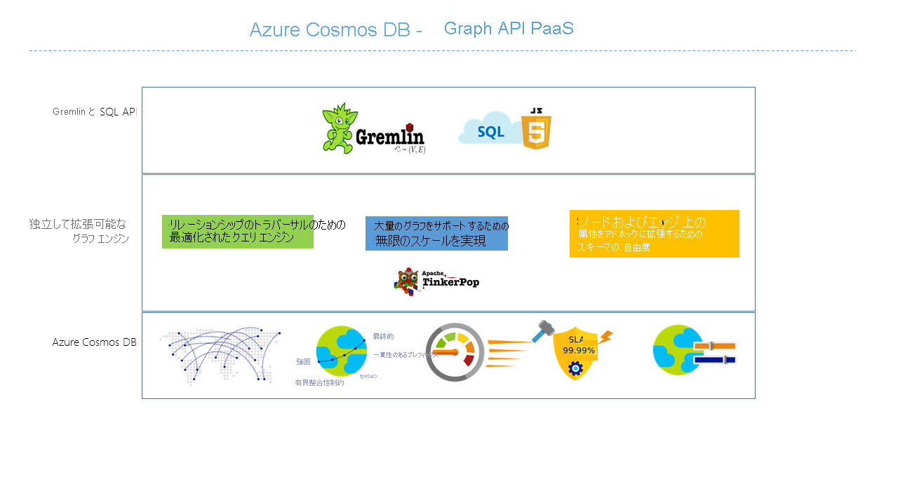

# Azure Cosmos DB の概要: Gremlin API

[Azure Cosmos DB](introduction.md) は、ミッション クリティカルなアプリケーション向けの、Microsoft のグローバル分散マルチモデル データベース サービスです。 また、マルチモデル データベースでもあり、ドキュメント、キーと値、グラフ、列指向の各データ モデルがサポートされています。 Azure Cosmos DB Gremlin API は、グラフ データの保存と操作に使用されます。 Gremlin API ではグラフ データのモデル化がサポートされており、グラフ データを走査する API が用意されています。

この記事では、Azure Cosmos DB Gremlin API の概要と、これを使用して何十億もの頂点と辺のある大規模なグラフを保存する方法について説明します。 ミリ秒の待機時間で、グラフにクエリを実行し、グラフの構造とスキーマを簡単に改善できます。 Azure Cosmos DB にクエリを実行するには、[Apache TinkerPop](https://tinkerpop.apache.org) のグラフ トラバーサル言語である [Gremlin](https://tinkerpop.apache.org/docs/current/reference/#graph-traversal-steps) を使用できます。

## グラフ データベースとは
実世界で出現するデータは、自然に結び付けられています。 従来のデータ モデリングはエンティティに重点を置いています。 しかし、多くのアプリケーションでは、当然、エンティティとリレーションシップの両方をモデル化するというニーズがあります。

[グラフ](http://mathworld.wolfram.com/Graph.html)とは、[頂点](http://mathworld.wolfram.com/GraphVertex.html)と[辺](http://mathworld.wolfram.com/GraphEdge.html)で構成された構造です。 頂点と辺は、いずれも任意の数のプロパティを持つことができます。 

* **頂点** - 頂点は、人、場所、イベントなどの個々のオブジェクトを表します。 

* **辺** - 辺は、頂点間のリレーションシップを表します。 たとえば、あるユーザーは、別のユーザーと知り合いで、あるイベントに関連があり、ある場所に最近行ったような場合です。 

* **プロパティ** - プロパティは頂点と辺に関する情報を表します。 プロパティの例として、名前と年齢を持つ頂点があります。 辺には、タイム スタンプや重みなどのプロパティがあります。 正式には、このモデルは[プロパティ グラフ](https://tinkerpop.apache.org/docs/current/reference/#intro)と呼ばれます。 Azure Cosmos DB は、プロパティ グラフ モデルをサポートしています。

たとえば、次のサンプル グラフは、ユーザー、モバイル デバイス、関心事、オペレーティング システムの間のリレーションシップを示しています。

グラフ データベースにより、グラフを効率的かつ自然にモデル化して格納できるので、さまざまなシナリオでグラフが有益なものになります。 これらのユース ケースでは、スキーマの柔軟性と迅速な反復処理も必要であることが多いため、通常、グラフ データベースは NoSQL データベースです。

グラフ データベースが提供する高速トラバーサルと、深さ優先探索、幅優先探索、ダイクストラ法などのグラフ アルゴリズムを組み合わせることで、ソーシャル ネットワーク、コンテンツ管理、レコメンデーションなどのさまざまな分野の問題を解決できます。

## Azure Cosmos DB グラフ データベースの機能
 
Azure Cosmos DB は、グローバル配布、ストレージとスループットのエラスティック スケーリング、自動インデックス作成とクエリ、調整可能な整合性レベルを提供し、TinkerPop 標準をサポートする、完全に管理されたグラフ データベースです。

Azure Cosmos DB は、市場の他のグラフ データベースと比較した場合、差別化する次の機能を備えています。

* 弾力的にスケーラブルなスループットとストレージ

 実際のグラフは、1 つのサーバーの容量を超えてスケールする必要があります。 Azure Cosmos DB では、グラフを複数のサーバー間でシームレスにスケールできます。 また、アクセス パターンに基づいて、独立してグラフのスループットをスケールすることもできます。 Azure Cosmos DB は、実質的に無制限のストレージ サイズとプロビジョニング スループットにスケールできるグラフ データベースをサポートしています。

* 複数リージョンのレプリケーション

 Azure Cosmos DB では、自分のアカウントに関連付けておいたすべてのリージョンにグラフ データが透過的にレプリケートされます。 レプリケーションを使用すると、データへのグローバル アクセスを必要とするアプリケーションを開発できます。 ただし、整合性、可用性、パフォーマンスと対応する保証の面で妥協が必要になります。 Azure Cosmos DB では、マルチホーム API を使用した透過的なリージョン内フェールオーバーを提供しています。 スループットとストレージを世界規模で弾力的にスケールすることもできます。

* 使い慣れた Gremlin 構文を使用した高速のクエリとトラバーサル

 異種の頂点と辺を格納し、使い慣れた Gremlin 構文を使用してこれらのドキュメントを照会できます。 Azure Cosmos DB では、同時実行性の高い、ロックのないログ構造のインデックス作成技術を利用して、すべてのコンテンツのインデックスを自動的に作成します。 そのため、スキーマのヒント、セカンダリ インデックス、またはビューを指定しなくても、豊富なリアルタイム クエリとトラバーサルが可能になります。 詳細については、[Gremlin を使用したグラフの照会](gremlin-support.md)に関する記事を参照してください。

* フル マネージド

 Azure Cosmos DB を使用すると、データベースやコンピューター リソースを管理する手間がかかりません。 Microsoft Azure サービスは完全に管理されているため、仮想マシンの管理、ソフトウェアのデプロイと構成、スケールの管理、複雑なデータ層のアップグレードを手作業で行う必要はありません。 すべてのグラフが自動的にバックアップされ、リージョンの障害から保護されます。 Azure Cosmos DB アカウントを簡単に追加し、必要に応じて容量をプロビジョニングできるので、データベースの運用と管理ではなく、アプリケーションに注力できます。

* インデックスの自動作成

 既定では、Azure Cosmos DB はグラフのノードおよび辺内のすべてのプロパティのインデックスを自動的に作成するため、スキーマや、セカンダリ インデックスの作成は不要です。

* Apache TinkerPop との互換性

 Azure Cosmos DB は、オープン ソースの Apache TinkerPop 標準をネイティブでサポートしており、他の TinkerPop 対応グラフ システムと統合できます。 そのため、Titan や Neo4j などの別のグラフ データベースから簡単に移行することができます。また、Apache Spark GraphX などのグラフ分析フレームワークで Azure Cosmos DB を使用することもできます。

* 調整可能な整合性レベル

 整合性とパフォーマンスの最適なトレードオフを実現するために、明確に定義された 5 つの整合性レベルの中から選択できます。 Azure Cosmos DB では、クエリと読み取り操作に関して、強固、有界整合性制約、セッション、一貫性のあるプレフィックス、最終的の 5 種類の整合性レベルを提供します。 明確に定義されたきめ細かな整合性レベルにより、整合性、可用性、待機時間の適切なトレードオフを行うことができます。 詳しくは、「[Azure Cosmos DB の調整可能なデータの一貫性レベル](consistency-levels.md)」をご覧ください。

Azure Cosmos DB では、同じコンテナーやデータベース内でドキュメントやグラフなどの複数のモデルを使用することもできます。 ドキュメント コンテナーを使用してグラフ データをドキュメントと共に格納できます。 JSON に対する SQL クエリと Gremlin クエリの両方を使用して、同じデータをグラフとして照会できます。

## 作業開始

Azure コマンド ライン インターフェイス (CLI)、Azure PowerShell、または Azure portal を使用して Azure Cosmos DB Gremlin API アカウントを作成し、アカウントにアクセスできます。 アカウントを作成したら、Gremlin の WebSocket フロントエンドを提供する Gremlin API サービス エンドポイント (`https://<youraccount>.gremlin.cosmosdb.azure.com`) を使用して、そのアカウント内のグラフ データベースにアクセスできます。 [Gremin コンソール](https://tinkerpop.apache.org/docs/current/reference/#gremlin-console)などの TinkerPop 互換ツールを構成してこのエンドポイントに接続し、Java、Node.js、または任意の Gremlin クライアント ドライバーでアプリケーションを構築できます。

次の表に、Azure Cosmos DB に対して使用できる一般的な Gremlin ドライバーを示します。

| ダウンロード | ドキュメント | Getting Started (概要) | サポートされているコネクタのバージョン |
| --- | --- | --- | --- |
| [.NET](https://tinkerpop.apache.org/docs/3.3.1/reference/#gremlin-DotNet) | [Github の Gremlin.NET](https://github.com/apache/tinkerpop/tree/master/gremlin-dotnet) | [.NET を使用してグラフを作成する](create-graph-dotnet.md) | 3.4.0-RC2 |
| [Java](https://mvnrepository.com/artifact/com.tinkerpop.gremlin/gremlin-java) | [Gremlin JavaDoc](https://tinkerpop.apache.org/javadocs/current/full/) | [Java を使用してグラフを作成する](create-graph-java.md) | 3.2.0 以降 |
| [Node.js](https://www.npmjs.com/package/gremlin) | [GitHub の Gremlin-JavaScript](https://github.com/jbmusso/gremlin-javascript) | [Node.js を使用してグラフを作成する](create-graph-nodejs.md) | 2.6.0|
| [Python](https://tinkerpop.apache.org/docs/3.3.1/reference/#gremlin-python) | [GitHub の Gremlin-Python](https://github.com/apache/tinkerpop/tree/master/gremlin-python) | [Python を使用してグラフを作成する](create-graph-python.md) | 3.2.7 |
| [PHP](https://packagist.org/packages/brightzone/gremlin-php) | [Github の Gremlin-PHP](https://github.com/PommeVerte/gremlin-php) | [PHP を使用してグラフを作成する](create-graph-php.md) | 3.1.0 |
| [Gremlin コンソール](https://tinkerpop.apache.org/downloads.html) | [TinkerPop ドキュメント](https://tinkerpop.apache.org/docs/current/reference/#gremlin-console) |  [Gremlin コンソールを使用してグラフを作成する](create-graph-gremlin-console.md) | 3.2.0 以降 |

## グラフ データベースの設計に関する考慮事項

グラフを設計するときに、他の頂点エンティティのプロパティとしてではなく、自身の頂点としてエンティティをモデル化すると、パフォーマンスとコストに影響を及ぼします。 これを決定するかどうかは、主に、データに対するクエリの実行方法と、モデル自体のスケーラビリティによって左右されます。

エンティティをモデル化する方法を計画する前に、次の質問を検討してください。

* ほとんどのクエリで頂点として取得する必要があるエンティティは何か。

* データをフィルター処理するために追加されるグラフに含める情報は何か。

* 値を使用するために取得される他のエンティティへの単なる接続であるエンティティはどれか。

* クエリで取得する必要があるのはどのような情報か。また、それらによってどのような RU 料金が発生するか。

たとえば、次のようなグラフの設計があるとします。

* クエリによっては、District->Store のリレーションシップが、Store 頂点をフィルター処理するために独自に使用される可能性があります。 たとえば、クエリが "特定の地区に属するすべての店舗を取得する"形式であるとします。 この場合、District エンティティを自身の頂点から Store 頂点のプロパティに折りたたむことを検討する価値があります。 

* このアプローチには、一度に 3 つのグラフ オブジェクト (District、District->Store、Store) を取得するのではなく、1 つの Store 頂点を取得することによって、各 Store 頂点を取得するコストが削減されるという利点があります。 これにより、パフォーマンスが向上するだけでなく、クエリあたりのコストも削減できます。

* Store 頂点は、Employee と Product という 2 つの異なるエンティティにリンクしているためです。 これにより、走査される可能性が増えるので、Store は必要な頂点になります。  

## Gremlin API を使用できるシナリオ
Azure Cosmos DB のグラフ サポートを使用できるシナリオを以下に示します。

* ソーシャル ネットワーク

 顧客に関するデータと顧客による他のユーザーとのやり取りに関するデータを組み合わせることで、パーソナライズされたエクスペリエンスを開発したり、顧客の行動を予測したりできます。また、ユーザーを同じような興味を持つ他のユーザーと結び付けることもできます。 Azure Cosmos DB を使用して、ソーシャル ネットワークを管理し、顧客の嗜好やデータを追跡できます。

* 推奨エンジン

 このシナリオは、小売業界で一般的に使用されます。 製品、ユーザー、ユーザー インタラクション (商品の購入、閲覧、評価など) に関する情報を組み合わせることで、カスタマイズされたレコメンデーションを構築できます。 低待機時間、エラスティック スケール、グラフのネイティブ サポートを実現する Azure Cosmos DB は、これらのインタラクションのモデル化に最適です。

* GeoSpatial

 通信、物流、旅行プランニングの各分野の多くのアプリケーションでは、エリア内で対象となる場所を見つけたり、2 つの場所間の最短ルートや最適ルートを見つけたりする必要があります。 Azure Cosmos DB はこれらの問題に自然に適合します。

* モノのインターネット (IoT)

 ネットワークと、グラフとしてモデル化された IoT デバイス間の接続により、デバイスと資産の状態について理解を深めることができます。 さらに、ネットワークのある部分の変更が別の部分に及ぼす可能性のある影響についても学習できます。

## 次の手順
Azure Cosmos DB のグラフ サポートの詳細については、以下をご覧ください。

* [Azure Cosmos DB グラフ チュートリアル](create-graph-dotnet.md)を開始する
* [Gremlin を使用して Azure Cosmos DB のグラフを照会する](gremlin-support.md)方法を確認する。
