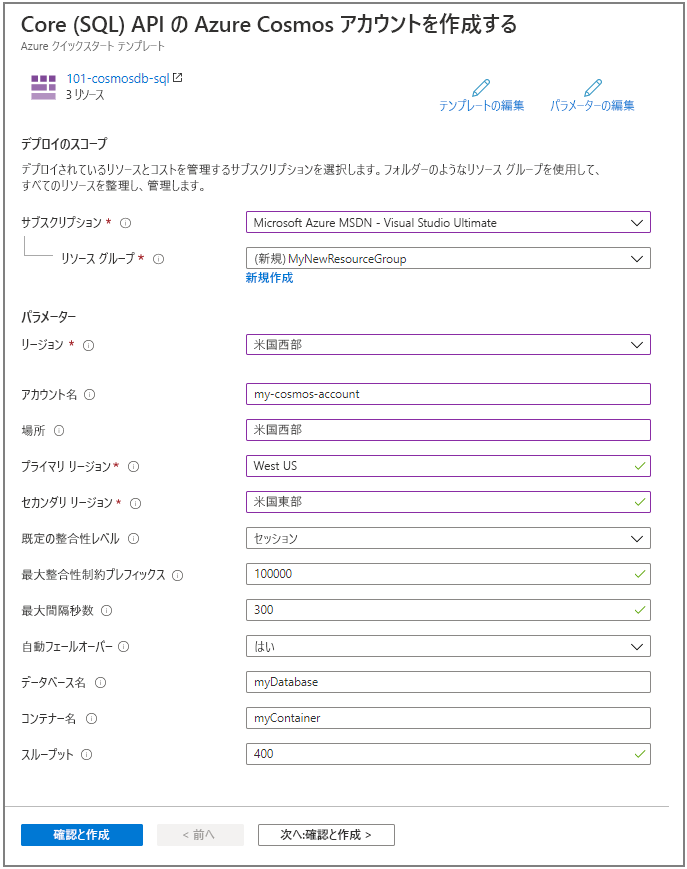

# <a name="quickstart-create-an-azure-cosmos-db-and-a-container-by-using-azure-resource-manager-template"></a>クイック スタート:Azure Resource Manager テンプレートを使用して Azure Cosmos DB とコンテナーを作成する

Azure Cosmos DB、Microsoft のグローバルに配布されるマルチモデル データベース サービスです。 Azure Cosmos DB を使用すると、キーと値のデータベース、ドキュメント データベース、グラフ データベースをすばやく作成し、クエリを実行できます。 このクイックスタートでは、Azure Cosmos データベースを作成してその中にコンテナーを作成する Resource Manager テンプレートのデプロイ プロセスについて重点的に取り上げます。 その後、そのコンテナーにデータを格納することができます。

[Resource Manager テンプレート](../azure-resource-manager/templates/overview.md)は JavaScript Object Notation (JSON) ファイルであり、プロジェクトのインフラストラクチャと構成が定義されています。 このテンプレートでは、デプロイしようとしているものを、それを作成する一連のプログラミング コマンドを記述しなくても記述できる、宣言型の構文を使用しています。 Resource Manager テンプレートの開発に関する詳細を学ぶには、[Resource Manager ドキュメント](/azure/azure-resource-manager/)と[テンプレート リファレンス](/azure/templates/microsoft.DocumentDB/allversions)を参照してください。

Azure サブスクリプションをお持ちでない場合は、開始する前に [無料アカウント](https://azure.microsoft.com/free/?WT.mc_id=A261C142F) を作成してください。

## <a name="prerequisites"></a>前提条件

Azure サブスクリプションまたは Azure Cosmos DB の無料試用版アカウント

- [!INCLUDE [quickstarts-free-trial-note](../../includes/quickstarts-free-trial-note.md)] 

- [!INCLUDE [cosmos-db-emulator-docdb-api](../../includes/cosmos-db-emulator-docdb-api.md)]  

## <a name="create-an-azure-cosmos-account-database-container"></a>Azure Cosmos アカウント、データベース、コンテナーを作成する

このクイック スタートで使用されるテンプレートは [Azure クイック スタート テンプレート](https://azure.microsoft.com/resources/templates/101-cosmosdb-create/)からのものです。

:::code language="json" source="~/quickstart-templates/101-cosmosdb-create/azuredeploy.json":::

テンプレートには、次の 3 つの Azure リソースが定義されています。

* [Microsoft.DocumentDB/databaseAccounts](/azure/templates/microsoft.documentdb/databaseaccounts): Azure Cosmos アカウントを作成します。

* [Microsoft.DocumentDB/databaseAccounts/sqlDatabases](/azure/templates/microsoft.documentdb/databaseaccounts/sqldatabases): Azure Cosmos データベースを作成します。

* [Microsoft.DocumentDB/databaseAccounts/sqlDatabases/containers](/azure/templates/microsoft.documentdb/databaseaccounts/sqldatabases/containers): Azure Cosmos コンテナーを作成します。

その他の Azure Cosmos DB テンプレートのサンプルについては、[クイックスタート テンプレート ギャラリー](https://azure.microsoft.com/resources/templates/?resourceType=Microsoft.Documentdb)をご覧ください。

1. Azure にサインインし、テンプレートを開くには次のイメージを選択します。 テンプレートによって Azure Cosmos アカウント、データベース、コンテナーが作成されます。

   <a href="https://portal.azure.com/#create/Microsoft.Template/uri/https%3A%2F%2Fraw.githubusercontent.com%2FAzure%2Fazure-quickstart-templates%2Fmaster%2F101-cosmosdb-create%2Fazuredeploy.json"></a>

2. 次の値を選択または入力します。

   

    特に明記されていない場合は、既定値を使用して Azure Cosmos リソースを作成してください。

    * **サブスクリプション**: Azure サブスクリプションを選択します。
    * **リソース グループ**: **[新規作成]** を選択し、リソース グループの一意の名前を入力し、 **[OK]** をクリックします。
    * **場所**: 場所を選択します。  たとえば **[米国中部]** です。
    * **アカウント名**: Azure Cosmos アカウントの名前を入力します。 名前はグローバルに一意である必要があります。 
    * **場所**: Azure Cosmos アカウントの作成先となる場所を入力します。 Azure Cosmos アカウントは、リソース グループと同じ場所でかまいません。 
    * **プライマリ リージョン**: Azure Cosmos アカウントのプライマリ レプリカのリージョン。
    * **セカンダリ リージョン**: Azure Cosmos アカウントのセカンダリ レプリカのリージョン。
    * **データベース名**: Azure Cosmos データベースの名前。
    * **コンテナー名**: Azure Cosmos コンテナーの名前。
    * **スループット**:コンテナーのスループット。最小スループット値は 400 RU/秒です。 
    * **上記の使用条件に同意する**: 選択。

3. **[購入]** を選択します。 Azure Cosmos アカウントが正常にデプロイされると、次の通知が表示されます。

   

テンプレートをデプロイするには Azure portal を使用します。 Azure portal だけでなく、Azure PowerShell、Azure CLI、および REST API を使用することもできます。 他のデプロイ方法については、「[テンプレートのデプロイ](../azure-resource-manager/templates/deploy-powershell.md)」を参照してください。

## <a name="validate-the-deployment"></a>デプロイの検証

Azure portal を使用し、Azure Cosmos アカウント、データベース、コンテナーを確認するか、次の Azure CLI または Azure PowerShell スクリプトを使用し、作成されたシークレットを一覧表示できます。

# <a name="cli"></a>[CLI](#tab/CLI)

```azurecli-interactive
echo "Enter your Azure Cosmos account name:" &&
read cosmosAccountName &&
echo "Enter the resource group where the Azure Cosmos account exists:" &&
read resourcegroupName &&
az cosmosdb show -g $resourcegroupName -n $cosmosAccountName
```

# <a name="powershell"></a>[PowerShell](#tab/PowerShell)

```azurepowershell-interactive
$resourceGroupName = Read-Host -Prompt "Enter the resource group name where your Azure Cosmos account exists"
(Get-AzResource -ResourceType "Microsoft.DocumentDB/databaseAccounts" -ResourceGroupName $resourceGroupName).Name 
 Write-Host "Press [ENTER] to continue..."
```

---

## <a name="clean-up-resources"></a>リソースをクリーンアップする

引き続き後続のチュートリアルに取り組む場合は、これらのリソースをそのまま残しておくことをお勧めします。
不要になったら、リソース グループを削除します。これにより、Azure Cosmos アカウントおよび関連リソースが削除されます。 Azure CLI または Azure PowerShell を使用してリソース グループを削除するには次を実行します。

# <a name="cli"></a>[CLI](#tab/CLI)

```azurecli-interactive
echo "Enter the Resource Group name:" &&
read resourceGroupName &&
az group delete --name $resourceGroupName &&
echo "Press [ENTER] to continue ..."
```

# <a name="powershell"></a>[PowerShell](#tab/PowerShell)

```azurepowershell-interactive
$resourceGroupName = Read-Host -Prompt "Enter the Resource Group name"
Remove-AzResourceGroup -Name $resourceGroupName
Write-Host "Press [ENTER] to continue..."
```

---

## <a name="next-steps"></a>次のステップ

このクイックスタートでは、Azure Resource Manager テンプレートを使用して Azure Cosmos アカウント、データベース、コンテナーを作成し、デプロイを検証しました。 Azure Cosmos DB と Azure Resource Manager の詳細については、引き続き以下の記事を参照してください。

- [Azure Cosmos DB の概要](introduction.md)を確認する
- [Azure Resource Manager](../azure-resource-manager/management/overview.md) の詳細を確認する
- 他の [Azure Cosmos DB Resource Manager テンプレート](resource-manager-samples.md)を入手する