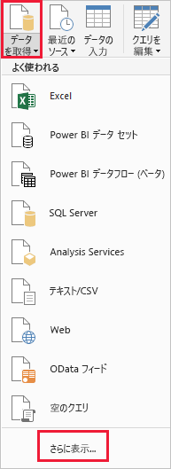
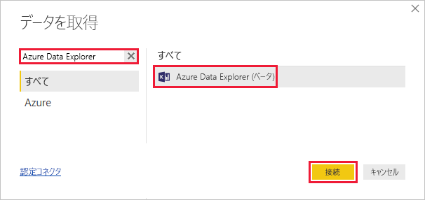
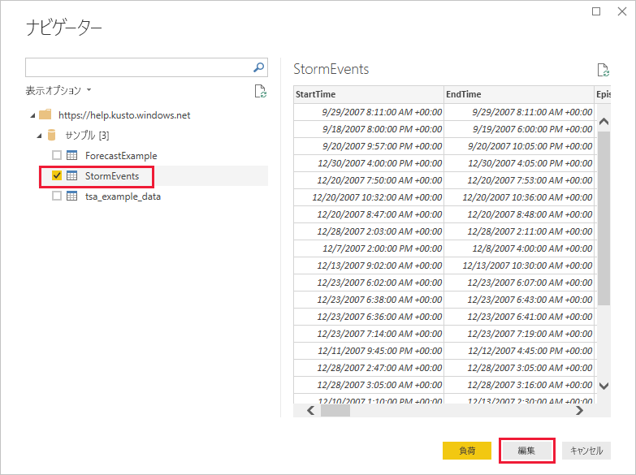
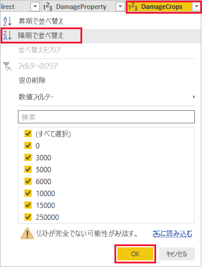
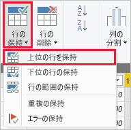
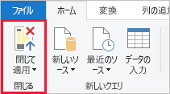

# Power BI 用 Azure Data Explorer コネクタを使用してデータを視覚化する

Azure Data Explorer は、ログと利用統計情報データのための高速で拡張性に優れたデータ探索サービスです。 Power BI はビジネス分析ソリューションであり、データを視覚化して、組織全体で結果を共有することができます。 Azure Data Explorer には、Power BI のデータに接続する方法が 3 つ用意されています。ビルトインのコネクタを使用する方法、Azure Data Explorer からクエリをインポートする方法、SQL クエリを使用する方法です。 この記事では、ビルトインのコネクタを使用してデータを取得し、それを Power BI レポートで視覚化する方法について説明します。 Power BI ダッシュボードの作成に Azure Data Explorer ネイティブ コネクタを使用する方法は簡単です。 Power BI コネクタでは、[Import および DirectQuery 接続モード](https://docs.microsoft.com/power-bi/desktop-directquery-about)がサポートされています。 シナリオ、スケール、およびパフォーマンスの要件に応じて、**Import** または **DirectQuery** モードを使用してダッシュボードを構築できます。 

## 前提条件

この記事を完了するには、以下が必要です。

* Azure サブスクリプションをお持ちでない場合は、開始する前に[無料の Azure アカウント](https://azure.microsoft.com/free/)を作成してください。
* Azure Active Directory のメンバーである組織の電子メール アカウント。このアカウントによって [Azure Data Explorer ヘルプ クラスター](https://dataexplorer.azure.com/clusters/help/databases/samples)に接続できます。
* [Power BI Desktop](https://powerbi.microsoft.com/get-started/) ( **[無料ダウンロード]** を選択)

## Azure Data Explorer からデータを取得する

まず、Azure Data Explorer ヘルプ クラスターに接続し、*StormEvents* テーブルからデータのサブセットを取り込みます。 [!INCLUDE [data-explorer-storm-events](../../includes/data-explorer-storm-events.md)]

1. Power BI Desktop の **[ホーム]** タブで、 **[データの取得]** 、 **[詳細]** の順に選択します。

    

1. *Azure Data Explorer* を検索し、 **[Azure Data Explorer]** を選択して、 **[接続]** を選択します。

    

1. **[Azure Data Explorer (Kusto)]** 画面のフォームに次の情報を入力します。

    

    **設定** | **値** | **フィールドの説明**
    |---|---|---|
    | クラスター | *https://help.kusto.windows.net* | ヘルプ クラスターの URL。 その他のクラスターでは、URL が *https://\<クラスター名\>.\<リージョン\>.kusto.windows.net* 形式になります。 |
    | Database | 空白 | 接続先のクラスターでホストされるデータベース。 これは後の手順で選択します。 |
    | テーブル名 | 空白 | データベース内のいずれかのテーブル、または <code>StormEvents \| take 1000</code> のようなクエリ。 これは後の手順で選択します。 |
    | [詳細オプション] | 空白 | クエリのオプション (結果セットのサイズなど)。 |
    | データ接続モード | *DirectQuery* | Power BI がデータをインポートするか、直接データ ソースに接続するかを決定します。 このコネクタでは、どちらかのオプションを使用できます。 |
    | | | |
    
    > [!NOTE]
    > **Import** モードでは、データは Power BI に移行されます。 **DirectQuery** モードでは、Azure Data Explorer クラスターからデータのクエリが直接実行されます。
    >
    > 次の場合は **Import** モードを使用します。
    > * データ セットが小さい。
    > * ほぼリアルタイムのデータが必要ない。 
    > * データは既に集計済みか、[Kusto で集計](/azure/kusto/query/summarizeoperator#list-of-aggregation-functions)を実行している。    
    >
    > 次の場合は **DirectQuery** モードを使用します。
    > * データ セットが非常に大きい。 
    > * ほぼリアルタイムのデータが必要。   

1. ヘルプ クラスターへの接続がまだない場合は、サインインしてください。 組織アカウントでサインインし、 **[接続]** を選択します。

    

1. **[ナビゲーター]** 画面で **[Samples]** データベースを展開し、 **[StormEvents]** を選択して **[編集]** を選択します。

    

    テーブルが Power Query エディターで開き、データをインポートする前に行と列を編集できます。

1. Power Query エディターで、 **[DamageCrops]** 列の横の矢印を選択して、 **[降順に並べ替え]** を選択します。

    

1. **[ホーム]** タブで **[行の保持]** を選択し、 **[上位の行を保持]** を選択します。 並べ替えたテーブルの上位 1,000 行を取り込むために、値として「*1000*」を入力します。

    

1. **[ホーム]** タブの **[Close & Apply]\(閉じて適用\)** を選択します。

    

## レポートでデータを視覚化する

[!INCLUDE [data-explorer-power-bi-visualize-basic](../../includes/data-explorer-power-bi-visualize-basic.md)]

## リソースのクリーンアップ

この記事で作成したレポートが不要になったら、Power BI Desktop (.pbix) ファイルを削除してください。

## 次の手順

[Power BI 用 Azure Data Explorer コネクタを使用してデータのクエリを実行するためのヒント](power-bi-best-practices.md#tips-for-using-the-azure-data-explorer-connector-for-power-bi-to-query-data)
