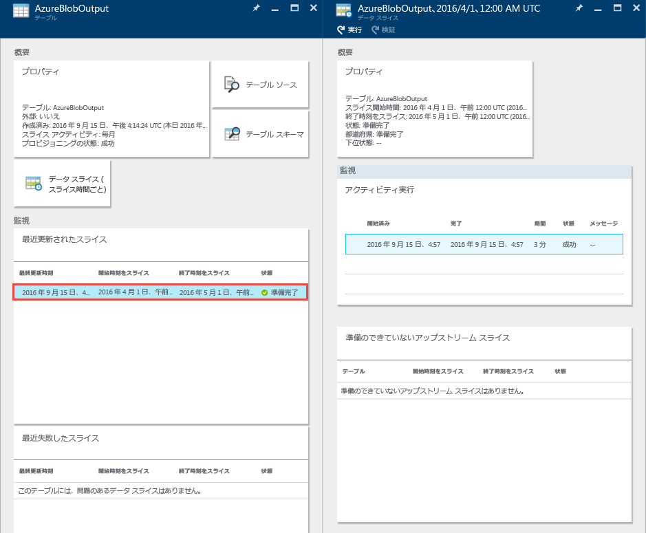
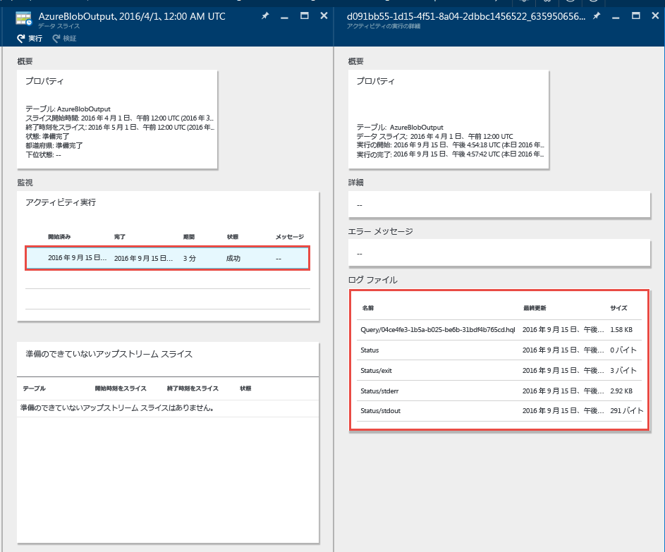
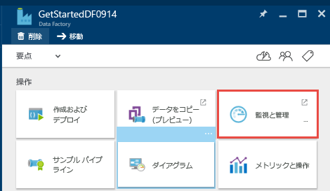
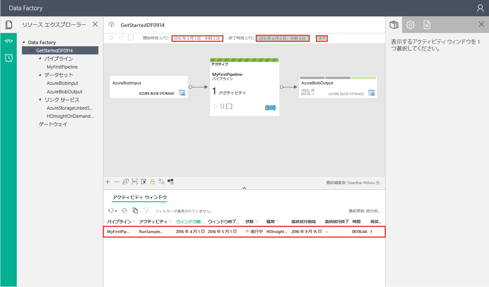

# <a name="tutorial-create-a-data-factory-by-using-visual-studio"></a>チュートリアル: データ ファクトリを Visual Studio で作成する
> [!div class="op_single_selector" title="Tools/SDKs"]
> * [概要と前提条件](data-factory-build-your-first-pipeline.md)
> * [Azure ポータル](data-factory-build-your-first-pipeline-using-editor.md)
> * [Visual Studio](data-factory-build-your-first-pipeline-using-vs.md)
> * [PowerShell](data-factory-build-your-first-pipeline-using-powershell.md)
> * [Resource Manager テンプレート](data-factory-build-your-first-pipeline-using-arm.md)
> * [REST API](data-factory-build-your-first-pipeline-using-rest-api.md)

このチュートリアルでは、Visual Studio を使用して Azure データ ファクトリを作成する方法について説明します。 Data Factory プロジェクト テンプレートを使用して Visual Studio プロジェクトを作成し、JSON 形式で Data Factory のエンティティ (リンクされたサービス、データセット、パイプライン) を定義し、これらのエンティティをクラウドに発行またはデプロイできます。 

このチュートリアルのパイプラインには、1 つのアクティビティ (**HDInsight Hive アクティビティ**) が含まれます。 このアクティビティは、入力データを変換して出力データを生成する Hive スクリプトを Azure HDInsight クラスターで実行します。 このパイプラインは、指定した開始時刻と終了時刻の間で、月 1 回実行されるようスケジュールされています。 

> [!NOTE]
> このチュートリアルでは、Azure Data Factory を使用してデータをコピーする方法は説明しません。 Azure Data Factory を使用してデータをコピーする方法のチュートリアルについては、[Blob Storage から SQL Database へのデータのコピーのチュートリアル](data-factory-copy-data-from-azure-blob-storage-to-sql-database.md)に関するページを参照してください。
> 
> 1 つのパイプラインには複数のアクティビティを含めることができます。 また、1 つのアクティビティの出力データセットを別のアクティビティの入力データセットとして指定することで、2 つのアクティビティを連鎖させる (アクティビティを連続的に実行する) ことができます。 詳細については、[Data Factory のスケジュール設定と実行](data-factory-scheduling-and-execution.md#multiple-activities-in-a-pipeline)に関するページを参照してください。


## <a name="walkthrough-create-and-publish-data-factory-entities"></a>チュートリアル: Data Factory エンティティの作成と発行
このチュートリアルの一部として実行する手順を次に示します。

1. リンクされた次の 2 つのサービス、**AzureStorageLinkedService1** と **HDInsightOnDemandLinkedService1** を作成します。 
   
    このチュートリアルでは、Hive アクティビティの入力データと出力データの両方が、同じ Azure Blob Storage に格納されます。 オンデマンド HDInsight クラスターを使用して既存の入力データを処理し、出力データを生成します。 オンデマンド HDInsight クラスターは、入力データを処理する準備ができたときに、Azure Data Factory によって実行時に自動的に作成されます。 データ ストアまたはコンピューティングをデータ ファクトリにリンクする必要があります。これにより、Data Factory サービスが実行時にこれらに接続できるようになります。 そのため、AzureStorageLinkedService1 を使用して Azure ストレージ アカウントをデータ ファクトリにリンクさせ、HDInsightOnDemandLinkedService1 を使用してオンデマンド HDInsight クラスターをリンクさせます。 発行する際、作成するデータ ファクトリまたは既存のデータ ファクトリの名前を指定します。  
2. **InputDataset** と **OutputDataset** の 2 つのデータセットを作成します。これらは Azure Blob Storage に格納されている入力/出力データを表します。 
   
    これらのデータセットの定義は、前の手順で作成した Azure Storage のリンクされたサービスを参照します。 InputDataset では、入力データが格納された BLOB を含む BLOB コンテナー (adfgetstarted) とフォルダー (inptutdata) を指定します。 OutputDataset では、出力データを保持する BLOB を含む BLOB コンテナー (adfgetstarted) とフォルダー (partitioneddata) を指定します。 また、構造、可用性、ポリシーなど、他のプロパティも指定します。
3. **MyFirstPipeline** という名前のパイプラインを作成します。 
  
    このチュートリアルでは、パイプラインには 1 つのアクティビティ (**HDInsight Hive アクティビティ**) だけが含まれます。 このアクティビティは、オンデマンド HDInsight クラスターで Hive スクリプトを実行することで、入力データを変換し、出力データを生成します。 Hive アクティビティの詳細については、[Hive アクティビティ](data-factory-hive-activity.md)に関するページを参照してください。 
4. **DataFactoryUsingVS** という名前のデータ ファクトリを作成します。 データ ファクトリと、すべての Data Factory エンティティ (リンクされたサービス、テーブル、パイプライン) をデプロイします。
5. 発行した後、Azure Portal のブレードと、監視と管理アプリを使用して、パイプラインを監視します。 
  
### <a name="prerequisites"></a>前提条件
1. 「 [チュートリアルの概要](data-factory-build-your-first-pipeline.md) 」に目を通し、 **前提条件** の手順を完了する必要があります。 冒頭のドロップダウン リストの **[Overview and prerequisites (概要と前提条件)]** というオプションを選択して、その記事に移動することもできます。 前提条件を満たすことができたら、ドロップダウン リストの **[Visual Studio]** というオプションを選択して、この記事に戻ります。
2. Data Factory インスタンスを作成するには、サブスクリプション/リソース グループ レベルで [Data Factory の共同作業者](../active-directory/role-based-access-built-in-roles.md#data-factory-contributor) ロールのメンバーである必要があります。  
3. コンピューターに以下がインストールされている必要があります。
   * Visual Studio 2013 または Visual Studio 2015
   * Azure SDK for Visual Studio 2013 または Visual Studio 2015 をダウンロードします。 [Azure ダウンロード ページ](https://azure.microsoft.com/downloads/)に移動し、**.NET** セクションの **[VS 2013]** または **[VS 2015]** をクリックします。
   * Visual Studio 用の最新の Azure Data Factory プラグイン ([VS 2013](https://visualstudiogallery.msdn.microsoft.com/754d998c-8f92-4aa7-835b-e89c8c954aa5) または [VS 2015](https://visualstudiogallery.msdn.microsoft.com/371a4cf9-0093-40fa-b7dd-be3c74f49005)) をダウンロードします。 メニューで **[ツール]** -> **[拡張機能と更新プログラム]** -> **[オンライン]** -> **[Visual Studio ギャラリー]** -> **[Microsoft Azure Data Factory Tools for Visual Studio]** -> **[更新]** の順にクリックして、プラグインを更新することもできます。

それでは、Visual Studio を使用して、Azure データ ファクトリを作成しましょう。

### <a name="create-visual-studio-project"></a>Visual Studio プロジェクトの作成
1. **Visual Studio 2013** または **Visual Studio 2015** を起動します。 **[ファイル]** をクリックし、**[新規作成]** をポイントして、**[プロジェクト]** をクリックします。 **[新しいプロジェクト]** ダイアログ ボックスが表示されます。  
2. **[新しいプロジェクト]** ダイアログ ボックスで、**[DataFactory]** テンプレートを選択し、**[Empty Data Factory Project (空の Data Factory プロジェクト)]** をクリックします。   

    ![[新しいプロジェクト] ダイアログ ボックス
](./media/data-factory-build-your-first-pipeline-using-vs/new-project-dialog.png)
3. プロジェクトの**名前**、**場所**、**ソリューション**の名前を入力し、**[OK]** をクリックします。

    

### <a name="create-linked-services"></a>リンクされたサービスの作成
この手順では、リンクされたサービスを 2 つ作成します。**Azure Storage** と**オンデマンド HDInsight** です。 

Azure Storage のリンクされたサービスは、接続情報を提供することで、Azure ストレージ アカウントをデータ ファクトリにリンクします。 Data Factory サービスは、リンクされたサービスの設定から接続文字列を使用して、実行時に Azure ストレージに接続します。 このストレージは、パイプラインの入力データと出力データのほか、Hive アクティビティで使用する Hive スクリプト ファイルを保持します。 

オンデマンド HDInsight のリンクされたサービスにより、HDInsight クラスターが、入力データを処理する準備ができたときに、実行時に自動的に作成されます。 処理が終わり、アイドル状態が一定時間続くと、クラスターは削除されます。 

> [!NOTE]
> データ ファクトリを作成するには、Data Factory ソリューションの発行時に、そのデータ ファクトリの名前と設定を指定します。

#### <a name="create-azure-storage-linked-service"></a>Azure Storage のリンクされたサービスを作成する
1. ソリューション エクスプローラーの **[リンクされたサービス]** を右クリックして **[追加]** をポイントし、**[新しい項目]** をクリックします。      
2. **[新しい項目の追加]** ダイアログ ボックスで、一覧から **[Azure Storage Linked Service (Azure Storage のリンクされたサービス)]** を選択し、**[追加]** をクリックします。
    
3. `<accountname>` と `<accountkey>` を Azure ストレージ アカウントの名前とキーで置き換えます。 ストレージ アクセス キーを取得する方法については、「[ストレージ アカウントの管理](../storage/common/storage-create-storage-account.md#manage-your-storage-account)」のストレージ アクセス キーを表示、コピー、再生成する方法に関する情報を参照してください。
    
4. **AzureStorageLinkedService1.json** ファイルを保存します。

#### <a name="create-azure-hdinsight-linked-service"></a>Azure HDInsight のリンクされたサービスを作成する
1. **ソリューション エクスプローラー**の **[リンクされたサービス]** を右クリックして、**[追加]** をポイントし、**[新しい項目]** をクリックします。
2. **[HDInsight のオンデマンドのリンクされたサービス]** を選択し、**[追加]** をクリックします。
3. **JSON** を次の JSON に置き換えます。

     ```json
    {
        "name": "HDInsightOnDemandLinkedService",
        "properties": {
        "type": "HDInsightOnDemand",
            "typeProperties": {
                "version": "3.5",
                "clusterSize": 1,
                "timeToLive": "00:05:00",
                "osType": "Linux",
                "linkedServiceName": "AzureStorageLinkedService1"
            }
        }
    }
    ```

    次の表に、このスニペットで使用される JSON プロパティの説明を示します。

    プロパティ | Description
    -------- | ----------- 
    ClusterSize | HDInsight Hadoop クラスターのサイズを指定します。
    TimeToLive | 削除されるまでの HDInsight クラスターのアイドル時間を指定します。
    linkedServiceName | HDInsight Hadoop クラスターによって生成されるログを保存するために使用されるストレージ アカウントを指定します。 

    > [!IMPORTANT]
    > HDInsight クラスターは、JSON (linkedServiceName) で指定した BLOB ストレージに**既定のコンテナー**を作成します。 クラスターを削除しても、HDInsight はこのコンテナーを削除しません。 この動作は仕様です。 オンデマンド HDInsight のリンクされたサービスでは、既存のライブ クラスター (timeToLive) がある場合を除き、スライスが処理されるたびに HDInsight クラスターが作成されます。 クラスターは、処理が終了すると自動的に削除されます。
    > 
    > 処理されるスライスが多いほど、Azure BLOB ストレージ内のコンテナーも増えます。 ジョブのトラブルシューティングのためにコンテナーが必要ない場合、コンテナーを削除してストレージ コストを削減できます。 これらのコンテナーの名前は、`adf<yourdatafactoryname>-<linkedservicename>-datetimestamp` 形式になります。 Azure BLOB ストレージ内のコンテナーを削除するには、 [Microsoft ストレージ エクスプローラー](http://storageexplorer.com/) などのツールを使用します。

    JSON のプロパティの詳細については、[コンピューティングのリンクされたサービス](data-factory-compute-linked-services.md#azure-hdinsight-on-demand-linked-service)に関する記事を参照してください。 
4. **HDInsightOnDemandLinkedService1.json** ファイルを保存します。

### <a name="create-datasets"></a>データセットを作成する
この手順では、Hive 処理の入力データと出力データを表すデータセットを作成します。 これらのデータセットは、このチュートリアルで前に作成した **AzureStorageLinkedService1** を参照します。 このリンクされたサービスは Azure ストレージ アカウントを指し、データセットは入力データと出力データを保持するストレージのコンテナー、フォルダー、ファイル名を指定します。   

#### <a name="create-input-dataset"></a>入力データセットの作成
1. **ソリューション エクスプローラー**の **[テーブル]** を右クリックし、**[追加]** をポイントして、**[新しい項目]** をクリックします。
2. 一覧から **[Azure BLOB]** を選択し、ファイルの名前を **InputDataSet.json** に変更して、**[追加]** をクリックします。
3. エディターで **JSON** を次の JSON スニペットに置き換えます。

    ```json
    {
        "name": "AzureBlobInput",
        "properties": {
            "type": "AzureBlob",
            "linkedServiceName": "AzureStorageLinkedService1",
            "typeProperties": {
                "fileName": "input.log",
                "folderPath": "adfgetstarted/inputdata",
                "format": {
                    "type": "TextFormat",
                    "columnDelimiter": ","
                }
            },
            "availability": {
                "frequency": "Month",
                "interval": 1
            },
            "external": true,
            "policy": {}
        }
    }
    ```
    この JSON スニペットでは、パイプラインの Hive アクティビティの入力データを表す **AzureBlobInput** というデータセットを定義します。 `adfgetstarted` という BLOB コンテナーと `inputdata` というフォルダーに入力データが配置されるように指定します。

    次の表に、このスニペットで使用される JSON プロパティの説明を示します。

    プロパティ | 説明 |
    -------- | ----------- |
    type |データは Azure Blob Storage に存在するため、type プロパティを **AzureBlob** に設定しています。
    linkedServiceName | 前に作成した AzureStorageLinkedService1 を参照します。
    fileName |このプロパティは省略可能です。 このプロパティを省略した場合は、folderPath のすべてのファイルが取得されます。 このチュートリアルでは、input.log のみが処理されます。
    type | ログ ファイルはテキスト形式です。そのため、TextFormat を使用します。 |
    columnDelimiter | ログ ファイル内の列はコンマ (`,`) で区切られています。
    frequency/interval | frequency を Month に設定し、interval を 1 に設定しています。そのため、入力スライスは 1 か月ごとになります。
    外部 | パイプラインによってアクティビティの入力データが生成されない場合は、このプロパティを true に設定します。 このプロパティは、入力データセットにのみ指定されます。 最初のアクティビティの入力データセットには、常に true を設定します。
4. **InputDataset.json** ファイルを保存します。

#### <a name="create-output-dataset"></a>出力データセットの作成
次に、Azure Blob Storage に格納される出力データを表す出力データセットを作成します。

1. **ソリューション エクスプローラー**の **[テーブル]** を右クリックし、**[追加]** をポイントして、**[新しい項目]** をクリックします。
2. 一覧から **[Azure BLOB]** を選択し、ファイルの名前を **OutputDataset.json** に変更して、**[追加]** をクリックします。
3. エディターで **JSON** を次の JSON に置き換えます。
    
    ```json
    {
        "name": "AzureBlobOutput",
        "properties": {
            "type": "AzureBlob",
            "linkedServiceName": "AzureStorageLinkedService1",
            "typeProperties": {
                "folderPath": "adfgetstarted/partitioneddata",
                "format": {
                    "type": "TextFormat",
                    "columnDelimiter": ","
                }
            },
            "availability": {
                "frequency": "Month",
                "interval": 1
            }
        }
    }
    ```
    この JSON スニペットでは、パイプラインの Hive アクティビティによって生成される出力データを表す **AzureBlobOutput** というデータセットを定義します。 Hive アクティビティによって生成される出力データが、`adfgetstarted` という BLOB コンテナーと `partitioneddata` というフォルダーに配置されるように指定します。 
    
    **availability** セクションでは、出力データセットが 1 か月ごとに生成されることを指定します。 出力データセットにより、パイプラインのスケジュールが開始されます。 パイプラインは、開始時刻と終了時刻の間で、毎月実行されます。 

    これらのプロパティの説明については、「 **入力データセットを作成する** 」セクションを参照してください。 パイプラインによってデータセットが生成されるため、出力データセットの external プロパティは設定しません。
4. **OutputDataset.json** ファイルを保存します。

### <a name="create-pipeline"></a>パイプラインの作成
ここまでで、Azure Storage のリンクされたサービス、入力データセット、出力データセットを作成しました。 次は、**HDInsightHive** アクティビティを含むパイプラインを作成します。 Hive アクティビティの**入力**は **AzureBlobInput** に設定されており、**出力**は **AzureBlobOutput** に設定されています。 入力データセットのスライスは 1 か月ごと (frequency: Month、interval: 1) に入手でき、出力スライスも 1 か月ごとに生成されます。 

1. **ソリューション エクスプローラー**の **[パイプライン]** を右クリックし、**[追加]** をポイントして、**[新しい項目]** をクリックします
2. 一覧から **[Hive 変換パイプライン]** を選択し、**[追加]** をクリックします。
3. **JSON** を次のスニペットに置き換えます。

    > [!IMPORTANT]
    > `<storageaccountname>` をストレージ アカウントの名前に置き換えます。

    ```json
    {
        "name": "MyFirstPipeline",
        "properties": {
            "description": "My first Azure Data Factory pipeline",
            "activities": [
                {
                    "type": "HDInsightHive",
                    "typeProperties": {
                        "scriptPath": "adfgetstarted/script/partitionweblogs.hql",
                        "scriptLinkedService": "AzureStorageLinkedService1",
                        "defines": {
                            "inputtable": "wasb://adfgetstarted@<storageaccountname>.blob.core.windows.net/inputdata",
                            "partitionedtable": "wasb://adfgetstarted@<storageaccountname>.blob.core.windows.net/partitioneddata"
                        }
                    },
                    "inputs": [
                        {
                            "name": "AzureBlobInput"
                        }
                    ],
                    "outputs": [
                        {
                            "name": "AzureBlobOutput"
                        }
                    ],
                    "policy": {
                        "concurrency": 1,
                        "retry": 3
                    },
                    "scheduler": {
                        "frequency": "Month",
                        "interval": 1
                    },
                    "name": "RunSampleHiveActivity",
                    "linkedServiceName": "HDInsightOnDemandLinkedService"
                }
            ],
            "start": "2016-04-01T00:00:00Z",
            "end": "2016-04-02T00:00:00Z",
            "isPaused": false
        }
    }
    ```

    > [!IMPORTANT]
    > `<storageaccountname>` をストレージ アカウントの名前に置き換えます。

    JSON スニペットでは、1 つのアクティビティ (Hive アクティビティ) で構成されるパイプラインを定義します。 このアクティビティは、Hive スクリプトを実行して、オンデマンド HDInsight クラスターで入力データを処理し、出力データを生成します。 パイプライン JSON の activities セクションでは、type が **HDInsightHive** に設定されたアクティビティが配列内に 1 つだけあります。 

    HDInsight Hive アクティビティに固有の type プロパティでは、Hive スクリプト ファイルが存在する Azure Storage のリンクされたサービス、スクリプト ファイルへのパス、スクリプト ファイルに対するパラメーターを指定します。 

    Hive スクリプト ファイル **partitionweblogs.hql** は、Azure ストレージ アカウント (scriptLinkedService で指定) の、`adfgetstarted` コンテナー内にある `script` というフォルダーに保存されます。

    `defines` セクションは、Hive 構成値 (例: `${hiveconf:inputtable}`、`${hiveconf:partitionedtable})` として Hive スクリプトに渡される実行時設定を指定するために使用されます。

    パイプラインの **start** および **end** プロパティでは、パイプラインのアクティブな期間を指定します。 データセットが月単位で生成されるよう構成したので、パイプラインはスライスを 1 つだけ生成します (開始日と終了日が同じ月であるため)。

    アクティビティ JSON では、**linkedServiceName** に指定されたコンピューティング **HDInsightOnDemandLinkedService** で Hive スクリプトが実行されるように指定します。
4. **HiveActivity1.json** ファイルを保存します。

### <a name="add-partitionweblogshql-and-inputlog-as-a-dependency"></a>依存関係として partitionweblogs.hql と input.log を追加する
1. **[ソリューション エクスプローラー]** ウィンドウの **[依存関係]** を右クリックし、**[追加]** をポイントして、**[既存の項目]** をクリックします。  
2. **C:\ADFGettingStarted** に移動し、**partitionweblogs.hql** ファイルと **input.log** ファイルを選択して、**[追加]** をクリックします。 これら 2 つのファイルは、「[チュートリアルの概要](data-factory-build-your-first-pipeline.md)」の前提条件の一環として作成しています。

次の手順でソリューションを発行すると、`adfgetstarted` BLOB コンテナーの **script** フォルダーに **partitionweblogs.hql** ファイルがアップロードされます。   

### <a name="publishdeploy-data-factory-entities"></a>Data Factory エンティティの発行/デプロイ
この手順では、プロジェクト内で Data Factory エンティティ (リンクされたサービス、データセット、パイプライン) を Azure Data Factory サービスに発行します。 発行プロセス中に、データ ファクトリの名前を指定します。 

1. ソリューション エクスプローラーでプロジェクトを右クリックし、 **[発行]**をクリックします。
2. **[Microsoft アカウントへのサインイン]** ダイアログ ボックスが表示されたら、Azure サブスクリプションを所有するアカウントの資格情報を入力し、**[サインイン]** をクリックします。
3. 次のダイアログ ボックスが表示されます。

   ![[発行] ダイアログ ボックス](./media/data-factory-build-your-first-pipeline-using-vs/publish.png)
4. **[Configure data factory]** (データ ファクトリの構成) ページで、次の手順を行います。

    

   1. **[Data Factory の新規作成]** オプションを選択します。
   2. データ ファクトリの一意の **名前** を入力します。 たとえば、**DataFactoryUsingVS09152016** と指定します。 名前はグローバルに一意である必要があります。
   3. **[サブスクリプション]** フィールドで適切なサブスクリプションを選択します。 
        > [!IMPORTANT]
        > サブスクリプションが表示されない場合は、サブスクリプションの管理者または共同管理者のアカウントを使用してログインしたことを確認します。
   4. 作成するデータ ファクトリの **リソース グループ** を選択します。
   5. データ ファクトリの **リージョン** を選択します。
   6. **[次へ]** をクリックし、**[項目の発行]** ページに切り替えます。 (**[次へ]** ボタンが無効になっている場合は、**Tab** キーを押して [名前] フィールドの外に移動します。)

    > [!IMPORTANT]
    > 発行時に "**Data factory 名 "DataFactoryUsingVS" は利用できません**" というエラーが発生した場合は、名前を変更します (yournameDataFactoryUsingVS など)。 Data Factory アーティファクトの名前付け規則については、「 [Azure Data Factory - 名前付け規則](data-factory-naming-rules.md) 」を参照してください。   
1. **[項目の発行]** ページで、すべての Data Factory エンティティが選択されていることを確認し、**[次へ]** をクリックして **[概要]** ページに切り替えます。

         
2. 概要を確認してから **[次へ]** をクリックし、デプロイ プロセスを開始して **[デプロイ ステータス]** を表示します。

    
3. **[デプロイ ステータス]** ページに、デプロイメント プロセスのステータスが表示されます。 デプロイメントが完了したら、[完了] をクリックします。

注意すべき重要な点は、次のとおりです。

- "**サブスクリプションが名前空間 Microsoft.DataFactory を使用するように登録されていません**" というエラー メッセージが表示された場合は、以下のいずれかの操作を行ってから、もう一度発行してみます。
    - Azure PowerShell で次のコマンドを実行して、Data Factory プロバイダーを登録します。
        ```PowerShell   
        Register-AzureRmResourceProvider -ProviderNamespace Microsoft.DataFactory
        ```
        Data Factory プロバイダーが登録されたことを確認するには、次のコマンドを実行します。

        ```PowerShell
        Get-AzureRmResourceProvider
        ```
    - Azure サブスクリプションを使用して [Azure ポータル](https://portal.azure.com) にログインし、[Data Factory] ブレードに移動するか、Azure ポータルでデータ ファクトリを作成します。 この操作によって、プロバイダーが自動的に登録されます。
- データ ファクトリの名前は今後、DNS 名として登録される可能性があるため、一般ユーザーに表示される場合があります。
- Data Factory インスタンスを作成するには、Azure サブスクリプションの管理者または共同管理者である必要があります。

### <a name="monitor-pipeline"></a>パイプラインを監視する
この手順では、データ ファクトリの [ダイアグラム] ビューを使用してパイプラインを監視します。 

#### <a name="monitor-pipeline-using-diagram-view"></a>ダイアグラム ビューを使用してパイプラインを監視する
1. [Azure Portal](https://portal.azure.com/) にログインし、以下の手順を実行します。
   1. **[More services (その他のサービス)]**、**[データ ファクトリ]** の順にクリックします。
       
        
   2. データ ファクトリの一覧から、データ ファクトリの名前 (例: **DataFactoryUsingVS09152016**) を選択します。
   
       
2. 該当するデータ ファクトリのホーム ページで **[ダイアグラム]**をクリックします。

    
3. ダイアグラム ビューに、パイプラインの概要と、このチュートリアルで使用するデータセットが表示されます。

    
4. パイプラインのすべてのアクティビティを表示するために、ダイアグラム内のパイプラインを右クリックし、[パイプラインを開く] をクリックします。

    
5. パイプラインの HDInsightHive アクティビティが表示されることを確認します。

    

    前のビューに戻るには、上部にある階層リンク メニューの **[データ ファクトリ]** をクリックします。
6. **ダイアグラム ビュー**で、**AzureBlobInput** データセットをダブルクリックします。 スライスの状態が **[準備完了]** であることを確認します。 スライスの状態が [準備完了] と表示されるまでに数分かかる場合があります。 しばらく待っても準備完了にならない場合は、入力ファイル (input.log) が適切なコンテナー (`adfgetstarted`) とフォルダー (`inputdata`) に配置されているかどうかを確認してください。 また、入力データセットの **external** プロパティが **true** に設定されていることを確認します。 

   
7. **[X]** をクリックして、**[AzureBlobInput]** ブレードを閉じます。
8. **ダイアグラム ビュー**で、**AzureBlobOutput** データセットをダブルクリックします。 現在処理中のスライスが表示されます。

   
9. 処理が完了すると、スライスの状態に **[準備完了]** が表示されます。

   > [!IMPORTANT]
   > オンデマンド HDInsight クラスターの作成には通常しばらく時間がかかります (約 20 分)。 そのため、パイプラインによるスライスの処理に **約 30 分** かかると想定してください。  
   
        
10. スライスが**準備完了**状態になったら、BLOB ストレージの `adfgetstarted` コンテナー内にある `partitioneddata` フォルダーで出力データを調べます。  

    
11. スライスをクリックすると、 **[データ スライス]** ブレードに詳細が表示されます。

      
12. **[アクティビティの実行]** 一覧でアクティビティの実行をクリックすると、**[アクティビティの実行の詳細]** ウィンドウにアクティビティの実行の詳細 (このシナリオでは Hive アクティビティ) が表示されます。 
  
        

    ログ ファイルで、実行された Hive クエリとステータス情報を確認できます。 これらのログは、すべての問題のトラブルシューティングに役立ちます。  

Azure ポータルを使用して、このチュートリアルで作成したパイプラインとデータセットを監視する方法については、 [データセットとパイプラインの監視](data-factory-monitor-manage-pipelines.md) に関するページを参照してください。

#### <a name="monitor-pipeline-using-monitor--manage-app"></a>監視と管理アプリを使用してパイプラインを監視する
パイプラインは、監視と管理アプリを使用して監視することもできます。 このアプリケーションの使い方の詳細については、 [監視と管理アプリを使用した Azure Data Factory パイプラインの監視と管理](data-factory-monitor-manage-app.md)に関する記事を参照してください。

1. [監視と管理] タイルをクリックします。

    
2. 監視と管理アプリケーションが表示されます。 パイプラインの開始時刻 (2016 年 4 月 1 日午前 12:00) と終了時刻 (2016 年 4 月 2 日午前 12:00) と一致するように、**[開始時刻]** と **[終了時刻]** を変更し、**[適用]** をクリックします。

    
3. アクティビティ ウィンドウの詳細を確認するには、**[Activity Windows (アクティビティ ウィンドウ)] の一覧**でアクティビティ ウィンドウを選択し、詳細を確認します。
    

> [!IMPORTANT]
> 入力ファイルは、スライスが正常に処理された時点で削除されます。 そのため、スライスを再実行したり、このチュートリアルをやり直したりする場合は、`adfgetstarted` コンテナーの `inputdata` フォルダーに入力ファイル (input.log) をアップロードしてください。

### <a name="additional-notes"></a>その他のメモ
- データ ファクトリは、1 つまたは複数のパイプラインを持つことができます。 パイプラインには、1 つまたは複数のアクティビティを含めることができます。 たとえば、コピー元からコピー先のデータ ストアにデータをコピーするコピー アクティビティや、Hive スクリプトを実行して入力データを変換する HDInsight Hive アクティビティなどを含めることができます。 コピー アクティビティでサポートされているすべてのソースとシンクについては、 [サポートされているデータ ストア](data-factory-data-movement-activities.md#supported-data-stores-and-formats) に関する記事を参照してください。 Data Factory でサポートされているコンピューティング サービスの一覧については、「 [コンピューティングのリンクされたサービス](data-factory-compute-linked-services.md) 」を参照してください。
- リンクされたサービスは、データ ストアまたはコンピューティング サービスを Azure Data Factory にリンクします。 コピー アクティビティでサポートされているすべてのソースとシンクについては、 [サポートされているデータ ストア](data-factory-data-movement-activities.md#supported-data-stores-and-formats) に関する記事を参照してください。 Data Factory でサポートされているコンピューティング サービスと、そのコンピューティング サービス上で実行できる[変換アクティビティ](data-factory-data-transformation-activities.md)の一覧については、[コンピューティングのリンクされたサービス](data-factory-compute-linked-services.md)に関する記事を参照してください。
- Azure Storage のリンクされたサービスの定義に使用する JSON プロパティの詳細については、[Azure Blob との間でのデータの移動](data-factory-azure-blob-connector.md#azure-storage-linked-service)に関する記事を参照してください。
- オンデマンド HDInsight クラスターの代わりに、独自の HDInsight クラスターを使用できます。 コピー アクティビティでサポートされているすべてのソースとシンクについては、 [Compute Linked Services](data-factory-compute-linked-services.md) に関するセクションを参照してください。
-  Data Factory は、上記の JSON で **Linux ベース** の HDInsight クラスターを自動的に作成します。 詳細については、 [オンデマンド HDInsight のリンクされたサービス](data-factory-compute-linked-services.md#azure-hdinsight-on-demand-linked-service) に関するセクションを参照してください。
- HDInsight クラスターは、JSON (linkedServiceName) で指定した BLOB ストレージに**既定のコンテナー**を作成します。 クラスターを削除しても、HDInsight はこのコンテナーを削除しません。 この動作は仕様です。 オンデマンド HDInsight のリンクされたサービスでは、既存のライブ クラスター (timeToLive) がある場合を除き、スライスが処理されるたびに HDInsight クラスターが作成されます。 クラスターは、処理が終了すると自動的に削除されます。
    
    処理されるスライスが多いほど、Azure BLOB ストレージ内のコンテナーも増えます。 ジョブのトラブルシューティングのためにコンテナーが必要ない場合、コンテナーを削除してストレージ コストを削減できます。 これらのコンテナーの名前は、`adf**yourdatafactoryname**-**linkedservicename**-datetimestamp` 形式になります。 Azure BLOB ストレージ内のコンテナーを削除するには、 [Microsoft ストレージ エクスプローラー](http://storageexplorer.com/) などのツールを使用します。
- 現在、スケジュールは出力データセットによって開始されるため、アクティビティが出力を生成しない場合でも、出力データセットを作成する必要があります。 アクティビティが入力を受け取らない場合は、入力データセットの作成を省略できます。 
- このチュートリアルでは、Azure Data Factory を使用してデータをコピーする方法は説明しません。 Azure Data Factory を使用してデータをコピーする方法のチュートリアルについては、[Blob Storage から SQL Database へのデータのコピーのチュートリアル](data-factory-copy-data-from-azure-blob-storage-to-sql-database.md)に関するページを参照してください。


## <a name="use-server-explorer-to-view-data-factories"></a>サーバー エクスプローラーを使用して Data Factory を表示する
1. **Visual Studio** のメニューで **[ビュー]** をクリックし、**[サーバー エクスプローラー]** をクリックします。
2. [サーバー エクスプローラー] ウィンドウで、**[Azure]**、**[Data Factory]** の順に展開します。 **[Visual Studio にサインイン]** が表示されたら、Azure サブスクリプションに関連付けられている**アカウント**を入力し、**[続行]** をクリックします。 **パスワード**を入力し、**[サインイン]** をクリックします。 Visual Studio は、サブスクリプション内のすべての Azure データ ファクトリに関する情報を取得しようとします。 **[Data Factory Task List (Data Factory タスク リスト)]** ウィンドウで、この操作のステータスを確認します。

    ![[サーバー エクスプローラー]](./media/data-factory-build-your-first-pipeline-using-vs/server-explorer.png)
3. データ ファクトリを右クリックし、 **[Data Factory を新しいプロジェクトにエクスポートする]** を選択して、既存のデータ ファクトリに基づいて Visual Studio プロジェクトを作成します。

    

## <a name="update-data-factory-tools-for-visual-studio"></a>Visual Studio の Data Factory ツールを更新する
Visual Studio の Azure Data Factory ツールを更新するには、次の手順に従います。

1. メニューで **[ツール]** をクリックし、**[拡張機能と更新プログラム]** を選択します。
2. 左ウィンドウで **[更新]** を選択し、**[Visual Studio ギャラリー]** を選択します。
3. **[Azure Data Factory tools for Visual Studio]** を選択して、**[更新]** をクリックします。 このエントリが表示されない場合は、ツールは既に最新バージョンです。

## <a name="use-configuration-files"></a>構成ファイルを使用する
リンクされたサービス/テーブル/パイプラインには、Visual Studio から構成ファイルを使用して環境ごとに異なるプロパティを構成できます。

Azure Storage のリンクされたサービスに関して次のような JSON 定義があるとします。 Data Factory エンティティのデプロイ先となる環境 (開発/テスト/運用) ごとに異なる値を **connectionString** の accountname と accountkey に指定するには、 環境ごとに個別の構成ファイルを使用します。

```json
{
    "name": "StorageLinkedService",
    "properties": {
        "type": "AzureStorage",
        "description": "",
        "typeProperties": {
            "connectionString": "DefaultEndpointsProtocol=https;AccountName=<accountname>;AccountKey=<accountkey>"
        }
    }
}
```

### <a name="add-a-configuration-file"></a>構成ファイルを追加する
環境ごとに次の手順を実行して構成ファイルを追加します。   

1. Visual Studio ソリューションで Data Factory プロジェクトを右クリックし、**[追加]** をポイントして、**[新しい項目]** をクリックします。
2. 左側にあるインストールされたテンプレートの一覧で **[構成]** を選択し、**[構成ファイル]** を選択して、構成ファイルの**名前**を入力し、**[追加]** をクリックします。

    
3. 次の形式で構成パラメーターとその値を追加します。

    ```json
    {
        "$schema": "http://datafactories.schema.management.azure.com/vsschemas/V1/Microsoft.DataFactory.Config.json",
        "AzureStorageLinkedService1": [
            {
                "name": "$.properties.typeProperties.connectionString",
                "value": "DefaultEndpointsProtocol=https;AccountName=<accountname>;AccountKey=<accountkey>"
            }
        ],
        "AzureSqlLinkedService1": [
            {
                "name": "$.properties.typeProperties.connectionString",
                "value":  "Server=tcp:spsqlserver.database.windows.net,1433;Database=spsqldb;User ID=spelluru;Password=Sowmya123;Trusted_Connection=False;Encrypt=True;Connection Timeout=30"
            }
        ]
    }
    ```

    この例で構成しているのは、Azure Storage のリンクされたサービスと Azure SQL のリンクされたサービスの connectionString プロパティです。 名前を指定するための構文が [JsonPath](http://goessner.net/articles/JsonPath/)であることに注目してください。   

    ここで、JSON のプロパティが、次のコードのように値の配列になっているとします。  

    ```json
    "structure": [
          {
              "name": "FirstName",
            "type": "String"
          },
          {
            "name": "LastName",
            "type": "String"
        }
    ],
    ```

    次の構成ファイルのように、プロパティを構成します (0 から始まるインデックスを使用)。

    ```json
    {
        "name": "$.properties.structure[0].name",
        "value": "FirstName"
    }
    {
        "name": "$.properties.structure[0].type",
        "value": "String"
    }
    {
        "name": "$.properties.structure[1].name",
        "value": "LastName"
    }
    {
        "name": "$.properties.structure[1].type",
        "value": "String"
    }
    ```

### <a name="property-names-with-spaces"></a>スペースが含まれているプロパティ名
プロパティ名にスペースが含まれている場合は、次の例 (Database server name) のように、角かっこを使用します。

```json
 {
     "name": "$.properties.activities[1].typeProperties.webServiceParameters.['Database server name']",
     "value": "MyAsqlServer.database.windows.net"
 }
```

### <a name="deploy-solution-using-a-configuration"></a>構成を指定してソリューションをデプロイする
Azure Data Factory のエンティティを VS で発行するときに、その発行操作に使用する構成を指定できます。

構成ファイルを使用して Azure Data Factory プロジェクトのエンティティを発行するには、次の手順を実行します。   

1. Data Factory プロジェクトを右クリックして **[発行]** をクリックし、**[Publish Items (項目の発行)]** ダイアログ ボックスを表示します。
2. **[Configure data factory (データ ファクトリの構成)]** ページで、既存のデータ ファクトリを選択するか、データ ファクトリを作成するために値を指定して、**[次へ]** をクリックします。   
3. **[Publish Items (項目の発行)]** ページのドロップダウン リストに、**[Select Deployment Config (デプロイ構成の選択)]** フィールドで使用できる構成が表示されます。

    
4. 使用する**構成ファイル**を選択し、**[次へ]** をクリックします。
5. JSON ファイルの名前が **[概要]** ページに表示されていることを確認し、**[次へ]** をクリックします。
6. デプロイ操作が終了したら、 **[完了]** をクリックします。

実際にデプロイすると、JSON ファイルに指定されているプロパティの値が構成ファイルの値を使用して設定された後、Azure Data Factory サービスにエンティティがデプロイされます。   

## <a name="use-azure-key-vault"></a>Azure Key Vault の使用
接続文字列などの機密データをコード リポジトリにコミットすることは、お勧めしません。また、多くの場合、セキュリティ ポリシーに違反します。 機密情報を Azure Key Vault に格納し、Data Factory エンティティの発行中に使用する方法について学習するには、GitHub の [ADF Secure Publish](https://github.com/Azure/Azure-DataFactory/tree/master/Samples/ADFSecurePublish) サンプルを参照してください。 Visual Studio の Secure Publish 拡張機能を使用すると、機密情報を Key Vault に格納することができ、リンクされたサービスやデプロイ構成ではそれらへの参照だけが指定されます。 これらの参照は、Data Factory エンティティを Azure に発行するときに解決されます。 これらのファイルは、機密情報を公開せずに、ソース リポジトリにコミットできます。

## <a name="summary"></a>概要
このチュートリアルでは、HDInsight Hadoop クラスター上で Hive スクリプトを実行してデータを処理するために、Azure データ ファクトリを作成しました。 以下の手順を実行するために、Azure ポータルで Data Factory エディターを使用しました。  

1. Azure **データ ファクトリ**を作成しました。
2. 次の 2 つの **リンクされたサービス**を作成しました。
   1. **Azure Storage** のリンクされたサービス。
   2. **Azure HDInsight** オンデマンドのリンクされたサービス。 Azure Data Factory は、入力データを処理し、出力データを生成するために、HDInsight Hadoop クラスターをジャストインタイムで作成します。
3. パイプラインの HDInsight Hive アクティビティ向けの入出力データを記述する 2 つの **データセット**を作成しました。
4. **HDInsight Hive** アクティビティを持つ**パイプライン**を作成しました。  

## <a name="next-steps"></a>次のステップ
この記事では、オンデマンド HDInsight クラスターで Hive スクリプトを実行する変換アクティビティ (HDInsight アクティビティ) を含むパイプラインを作成しました。 コピー アクティビティを使用して Azure BLOB から Azure SQL にデータをコピーする方法については、「 [チュートリアル: Azure BLOB から Azure SQL にデータをコピーする](data-factory-copy-data-from-azure-blob-storage-to-sql-database.md)」を参照してください。

2 つのアクティビティを連鎖させる (アクティビティを連続的に実行する) には、一方のアクティビティの出力データセットを、もう一方のアクティビティの入力データセットとして指定します。 詳細については、[Data Factory でのスケジュールと実行](data-factory-scheduling-and-execution.md)に関するページを参照してください。 


## <a name="see-also"></a>関連項目
| トピック | Description |
|:--- |:--- |
| [パイプライン](data-factory-create-pipelines.md) |この記事では、Azure Data Factory のパイプラインとアクティビティの概要、およびそれらを利用して実際のシナリオやビジネスのためにデータ主導ワークフローを作成する方法を説明します。 |
| [データセット](data-factory-create-datasets.md) |この記事では、Azure Data Factory のデータセットについて説明します。 |
| [データ変換のアクティビティ](data-factory-data-transformation-activities.md) |この記事には、Azure Data Factory でサポートされているデータ変換のアクティビティ (このチュートリアルで使用した HDInsight Hive 変換など) の一覧を示します。 |
| [スケジュールと実行](data-factory-scheduling-and-execution.md) |この記事では、Azure Data Factory アプリケーション モデルのスケジュール設定と実行の側面について説明します。 |
| [監視アプリを使用したパイプラインの監視と管理に関する記事](data-factory-monitor-manage-app.md) |この記事では、監視と管理アプリを使用してパイプラインを監視、管理、デバッグする方法について説明します。 |

