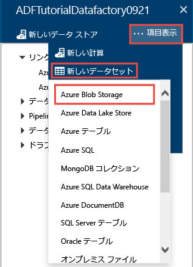
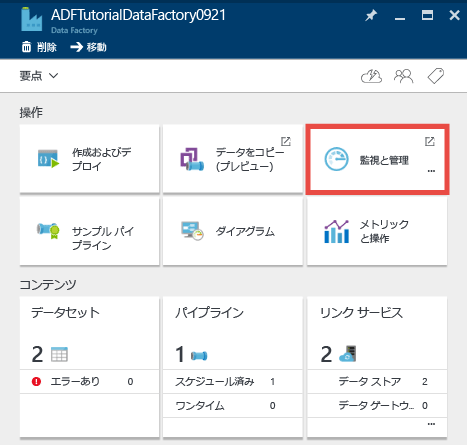
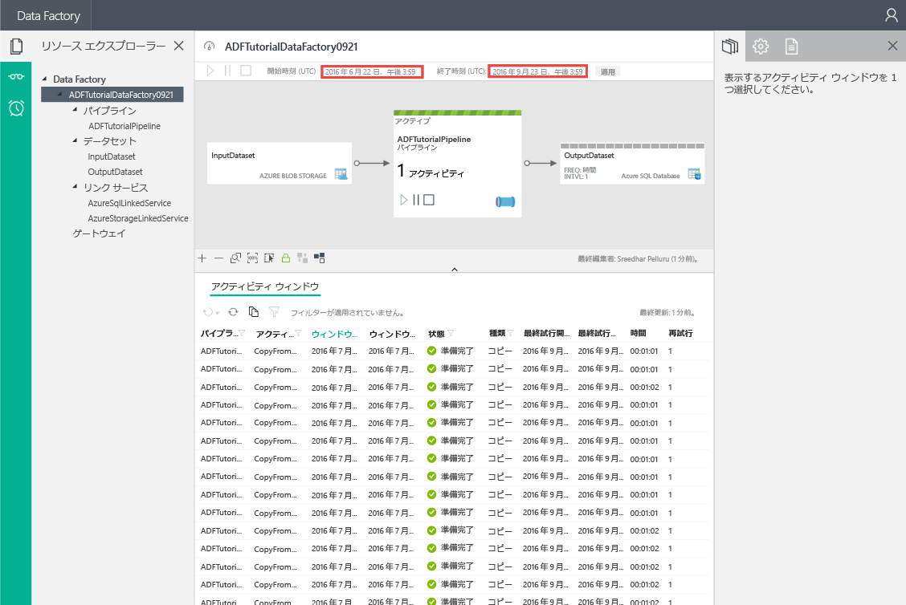
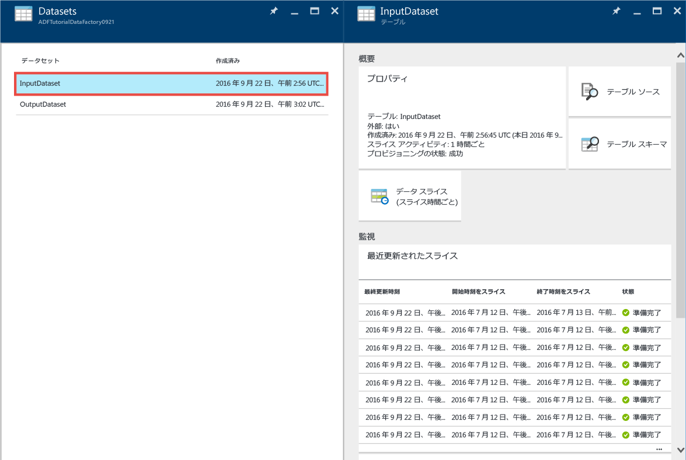
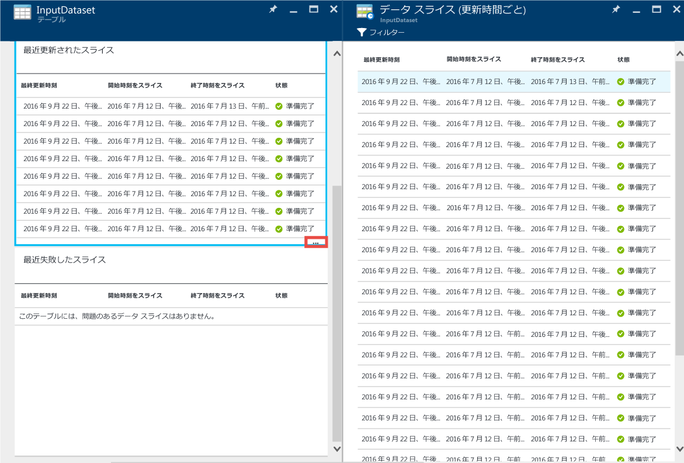

# <a name="tutorial-use-azure-portal-to-create-a-data-factory-pipeline-to-copy-data"></a>チュートリアル: Azure Portal を使用して、データをコピーする Data Factory パイプラインを作成する 
> [!div class="op_single_selector"]
> * [概要と前提条件](data-factory-copy-data-from-azure-blob-storage-to-sql-database.md)
> * [コピー ウィザード](data-factory-copy-data-wizard-tutorial.md)
> * [Azure ポータル](data-factory-copy-activity-tutorial-using-azure-portal.md)
> * [Visual Studio](data-factory-copy-activity-tutorial-using-visual-studio.md)
> * [PowerShell](data-factory-copy-activity-tutorial-using-powershell.md)
> * [Azure Resource Manager テンプレート](data-factory-copy-activity-tutorial-using-azure-resource-manager-template.md)
> * [REST API](data-factory-copy-activity-tutorial-using-rest-api.md)
> * [.NET API](data-factory-copy-activity-tutorial-using-dotnet-api.md)
> 
> 

この記事では、[Azure Portal](https://portal.azure.com) を使用して、Azure Blob Storage から Azure SQL データベースにデータをコピーするパイプラインを備えたデータ ファクトリを作成します。 Azure Data Factory の使用経験がない場合は、このチュートリアルを実行する前に、「[Azure Data Factory の概要](data-factory-introduction.md)」を参照してください。   

このチュートリアルでは、1 つのアクティビティ (コピー アクティビティ) が含まれたパイプラインを作成します。 コピー アクティビティは、サポートされているデータ ストアからサポートされているシンク データ ストアにデータをコピーします。 ソースおよびシンクとしてサポートされているデータ ストアの一覧については、[サポートされているデータ ストア](data-factory-data-movement-activities.md#supported-data-stores-and-formats)に関するセクションを参照してください。 このアクティビティは、安全で信頼性の高いスケーラブルな方法によってさまざまなデータ ストア間でデータをコピーできる、グローバルに利用可能なサービスによって動作します。 コピー アクティビティの詳細については、[データ移動アクティビティ](data-factory-data-movement-activities.md)に関する記事を参照してください。

1 つのパイプラインには複数のアクティビティを含めることができます。 また、1 つのアクティビティの出力データセットを別のアクティビティの入力データセットとして指定することで、2 つのアクティビティを連鎖させる (アクティビティを連続的に実行する) ことができます。 詳細については、「[パイプライン内の複数アクティビティ](data-factory-scheduling-and-execution.md#multiple-activities-in-a-pipeline)」を参照してください。 

> [!NOTE] 
> このチュートリアルのデータ パイプラインでは、ソース データ ストアからターゲット データ ストアにデータをコピーします。 Azure Data Factory を使用してデータを変換する方法のチュートリアルについては、[Hadoop クラスターを使用してデータを変換する最初のパイプラインを作成する方法に関するチュートリアル](data-factory-build-your-first-pipeline.md)を参照してください。

## <a name="prerequisites"></a>前提条件
このチュートリアルを実行する前に、[チュートリアルの前提条件](data-factory-copy-data-from-azure-blob-storage-to-sql-database.md)に関する記事に記載されている前提条件を満たしてください。

## <a name="steps"></a>手順
このチュートリアルの一部として実行する手順を次に示します。

1. Azure **データ ファクトリ**を作成します。 この手順では、ADFTutorialDataFactory という名前のデータ ファクトリを作成します。 
2. **リンクされたサービス**をデータ ファクトリに作成します。 この手順では、Azure Storage と Azure SQL Database の 2 種類のリンクされたサービスを作成します。 
    
    AzureStorageLinkedService は、Azure ストレージ アカウントをデータ ファクトリにリンクします。 [前提条件](data-factory-copy-data-from-azure-blob-storage-to-sql-database.md)の一部として、コンテナーを作成し、データをこのストレージ アカウントにアップロードしました。   

    AzureSqlLinkedService は、Azure SQL データベースをデータ ファクトリにリンクします。 Blob Storage からコピーされたデータは、このデータベースに格納されます。 [前提条件](data-factory-copy-data-from-azure-blob-storage-to-sql-database.md)の一部として、このデータベースに SQL テーブルを作成しました。   
3. 入力および出力**データセット**をデータ ファクトリに作成します。  
    
    Azure Storage のリンクされたサービスは、Data Factory サービスが実行時に Azure ストレージ アカウントへの接続に使用する接続文字列を指定します。 また、入力 BLOB データセットは、コンテナーと、入力データが含まれているフォルダーを指定します。  

    同様に、Azure SQL Database のリンクされたサービスは、Data Factory サービスが実行時に Azure SQL データベースへの接続に使用する接続文字列を指定します。 出力 SQL テーブル データセットは、BLOB ストレージのデータのコピー先となるデータベース内のテーブルを指定します。
4. データ ファクトリに**パイプライン**を作成します。 この手順では、コピー アクティビティのあるパイプラインを作成します。   
    
    コピー アクティビティでは、Azure Blob Storage の BLOB から Azure SQL データベースのテーブルにデータをコピーします。 パイプラインでコピー アクティビティを使用して、任意のサポートされているソースから任意のサポートされているターゲットにデータをコピーできます。 サポートされているデータ ストアの一覧については、[データ移動アクティビティ](data-factory-data-movement-activities.md#supported-data-stores-and-formats)に関する記事を参照してください。 
5. パイプラインを監視します。 この手順では、Azure Portal を使用して、入力および出力データセットのスライスを**監視**します。 

## <a name="create-data-factory"></a>データ ファクトリの作成
> [!IMPORTANT]
> [チュートリアルの前提条件](data-factory-copy-data-from-azure-blob-storage-to-sql-database.md)を完了します (まだ完了していない場合)。   

データ ファクトリは、1 つまたは複数のパイプラインを持つことができます。 パイプラインには、1 つまたは複数のアクティビティを含めることができます。 たとえば、コピー元からコピー先のデータ ストアにデータをコピーするコピー アクティビティや、Hive スクリプトを実行し、入力データを変換して出力データを生成する HDInsight Hive アクティビティなどを含めることができます。 それでは、この手順でデータ ファクトリの作成から始めましょう。

1. [Azure Portal](https://portal.azure.com/) にログインした後、左側のメニューで **[新規]**、**[データ + 分析]**、**[Data Factory]** の順にクリックします。 
   
   ![[新規] -> [DataFactory]](./media/data-factory-copy-activity-tutorial-using-azure-portal/NewDataFactoryMenu.png)    
2. **[新しいデータ ファクトリ]** ブレードで以下の手順を実行します。
   
   1. **[名前]** に「**ADFTutorialDataFactory**」と入力します。 
      
         ![[新しいデータ ファクトリ] ブレード](./media/data-factory-copy-activity-tutorial-using-azure-portal/getstarted-new-data-factory.png)
      
       Azure データ ファクトリの名前は **グローバルに一意**にする必要があります。 次のエラーが発生した場合は、データ ファクトリの名前を変更して (yournameADFTutorialDataFactory など) 作成し直してください。 Data Factory アーティファクトの名前付け規則については、「 [Azure Data Factory - 名前付け規則](data-factory-naming-rules.md) 」を参照してください。
      
           Data factory name “ADFTutorialDataFactory” is not available  
      
       
   2. データ ファクトリを作成する Azure **サブスクリプション**を選択します。 
   3. **[リソース グループ]** について、次の手順のいずれかを行います。
      
      - **[Use existing (既存のものを使用)]**を選択し、ドロップダウン リストから既存のリソース グループを選択します。 
      - **[新規作成]**を選択し、リソース グループの名前を入力します。   
         
          このチュートリアルの一部の手順は、 **ADFTutorialResourceGroup** という名前のリソース グループを使用することを前提としています。 リソース グループの詳細については、 [リソース グループを使用した Azure のリソースの管理](../azure-resource-manager/resource-group-overview.md)に関するページを参照してください。  
   4. データ ファクトリの **場所** を選択します。 Data Factory サービスによってサポートされているリージョンのみ、ドロップダウン リストに表示されます。
   5. **[ダッシュボードにピン留めする]** をオンにします。     
   6. **[作成]**をクリックします。
      
      > [!IMPORTANT]
      > Data Factory インスタンスを作成するには、サブスクリプション/リソース グループ レベルで [Data Factory の共同作業者](../active-directory/role-based-access-built-in-roles.md#data-factory-contributor) ロールのメンバーである必要があります。
      > 
      > データ ファクトリの名前は今後、DNS 名として登録される可能性があるため、一般ユーザーに表示される場合があります。                
      > 
      > 
3. ダッシュボードに、**[Deploying data factory]\(データ ファクトリをデプロイしています\)** というステータスを示したタイルが表示されます。 

    ![[Deploying data factory]\(データ ファクトリをデプロイしています\) タイル](media/data-factory-copy-activity-tutorial-using-azure-portal/deploying-data-factory.png)
4. 作成が完了すると、図に示されているような **[Data Factory]** ブレードが表示されます。
   
   

## <a name="create-linked-services"></a>リンクされたサービスの作成
データ ストアおよびコンピューティング サービスをデータ ファクトリにリンクするには、リンクされたサービスをデータ ファクトリに作成します。 このチュートリアルでは、Azure HDInsight、Azure Data Lake Analytics などのコンピューティング サービスを使用しません。 ここでは、Azure Storage (ソース) と Azure SQL Database (ターゲット) の 2 種類のデータ ストアを使用します。 

したがって、タイプが AzureStorage と AzureSqlDatabase の、AzureStorageLinkedService と AzureSqlLinkedService という名前の 2 つのリンクされたサービスを作成します。  

AzureStorageLinkedService は、Azure ストレージ アカウントをデータ ファクトリにリンクします。 このストレージ アカウントは、[前提条件](data-factory-copy-data-from-azure-blob-storage-to-sql-database.md)の一部としてコンテナーを作成し、データをアップロードしたストレージ アカウントです。   

AzureSqlLinkedService は、Azure SQL データベースをデータ ファクトリにリンクします。 Blob Storage からコピーされたデータは、このデータベースに格納されます。 [前提条件](data-factory-copy-data-from-azure-blob-storage-to-sql-database.md)の一部として、このデータベースに emp テーブルを作成しました。  

### <a name="create-azure-storage-linked-service"></a>Azure Storage のリンクされたサービスを作成する
この手順では、Azure ストレージ アカウントをデータ ファクトリにリンクします。 このセクションで、Azure Storage アカウントの名前とキーを指定します。  

1. **[Data Factory]** ブレードの **[作成およびデプロイ]** タイルをクリックします。
   
   ![[作成とデプロイ] タイル](./media/data-factory-copy-activity-tutorial-using-azure-portal/getstarted-author-deploy-tile.png) 
2. 次の画像のように **Data Factory エディター**が表示されます。 

    
3. エディターのツール バーの **[新しいデータ ストア]** ボタンをクリックし、ドロップダウン メニューから **[Azure Storage]** を選択します。 Azure Storage のリンクされたサービスを作成するための JSON テンプレートが右側のウィンドウに表示されます。 
   
    ![エディターの [新しいデータ ストア] ボタン](./media/data-factory-copy-activity-tutorial-using-azure-portal/getstarted-editor-newdatastore-button.png)    
3. `<accountname>` と `<accountkey>` を Azure ストレージ アカウントの名前とキーの値に置き換えます。 
   
        
4. ツール バーの **[デプロイ]** をクリックします。 これで、デプロイした **AzureStorageLinkedService** がツリー ビューに表示されます。 
   
    

    リンクされたサービスの定義の中の JSON プロパティの詳細については、[Azure Blob Storage コネクタ](data-factory-azure-blob-connector.md#linked-service-properties)に関する記事を参照してください。

### <a name="create-a-linked-service-for-the-azure-sql-database"></a>Azure SQL Database 用にリンクされたサービスを作成する
この手順では、Azure SQL データベースをデータ ファクトリにリンクします。 このセクションで、Azure SQL サーバー名、データベース名、ユーザー名、ユーザー パスワードを指定します。 

1. **Data Factory エディター**のツール バーで **[新しいデータ ストア]** ボタンをクリックし、ドロップダウン メニューから **[Azure SQL Database]** を選択します。 Azure SQL のリンクされたサービスを作成するための JSON テンプレートが右側のウィンドウに表示されます。
2. `<servername>`、`<databasename>`、`<username>@<servername>`、`<password>` を、Azure SQL のサーバー名、データベース名、ユーザー アカウント、パスワードに置き換えます。 
3. ツール バーの **[デプロイ]** をクリックして、**AzureSqlLinkedService** を作成してデプロイします。
4. ツリー ビューの **[リンクされたサービス]** の下に **AzureSqlLinkedService** が表示されることを確認します。  

    これらの JSON プロパティの詳細については、[Azure SQL Database コネクタ](data-factory-azure-sql-connector.md#linked-service-properties)に関する記事を参照してください。

## <a name="create-datasets"></a>データセットを作成する
前の手順では、Azure ストレージ アカウントと Azure SQL データベースをデータ ファクトリにリンクするためのリンクされたサービスを作成しました。 この手順では、InputDataset と OutputDataset という名前の 2 つのデータセットを定義します。これらはそれぞれ、AzureStorageLinkedService と AzureSqlLinkedService が参照するデータ ストアに格納されている入力データと出力データを表します。

Azure Storage のリンクされたサービスは、Data Factory サービスが実行時に Azure ストレージ アカウントへの接続に使用する接続文字列を指定します。 また、入力 BLOB データセット (InputDataset) は、コンテナーと、入力データが含まれているフォルダーを指定します。  

同様に、Azure SQL Database のリンクされたサービスは、Data Factory サービスが実行時に Azure SQL データベースへの接続に使用する接続文字列を指定します。 出力 SQL テーブル データセット (OututDataset) は、BLOB ストレージのデータのコピー先となるデータベース内のテーブルを指定します。 

### <a name="create-input-dataset"></a>入力データセットの作成
この手順では、BLOB ファイル (emp.txt) を参照する InputDataset という名前のデータセットを作成します。このファイルは、リンクされたサービス AzureStorageLinkedService が表す Azure Storage 内の BLOB コンテナー (adftutorial) のルート フォルダーにあります。 fileName の値を指定しなかった場合やこれをスキップした場合、入力フォルダー内のすべての BLOB のデータがターゲットにコピーされます。 このチュートリアルでは、fileName の値を指定します。 

1. Data Factory の**エディター**で、**[...More (...詳細)]**、**[新しいデータセット]** の順にクリックし、ドロップダウン メニューから **[Azure Blob Storage]** を選択します。 
   
    
2. 右側のウィンドウの JSON スクリプトを、次の JSON スニペットに置き換えます。 
   
    ```json
    {
      "name": "InputDataset",
      "properties": {
        "structure": [
          {
            "name": "FirstName",
            "type": "String"
          },
          {
            "name": "LastName",
            "type": "String"
          }
        ],
        "type": "AzureBlob",
        "linkedServiceName": "AzureStorageLinkedService",
        "typeProperties": {
          "folderPath": "adftutorial/",
          "fileName": "emp.txt",
          "format": {
            "type": "TextFormat",
            "columnDelimiter": ","
          }
        },
        "external": true,
        "availability": {
          "frequency": "Hour",
          "interval": 1
        }
      }
    }
    ```   

    次の表に、このスニペットで使用される JSON プロパティの説明を示します。

    | プロパティ | 説明 |
    |:--- |:--- |
    | type | データは Azure Blob Storage に存在するため、type プロパティを **AzureBlob** に設定しています。 |
    | linkedServiceName | 前に作成した **AzureStorageLinkedService** を参照します。 |
    | folderPath | BLOB **コンテナー**と、入力 BLOB を格納する**フォルダー**を指定します。 このチュートリアルでは、adftutorial は BLOB コンテナーで、フォルダーはルート フォルダーです。 | 
    | fileName | このプロパティは省略可能です。 このプロパティを省略した場合は、folderPath のすべてのファイルが取得されます。 このチュートリアルでは fileName に **emp.txt** が指定されているため、このファイルのみが処理のために取得されます。 |
    | format -> type |入力ファイルはテキスト形式のため、**TextFormat** を使用します。 |
    | columnDelimiter | 入力ファイル内の列は**コンマ (`,`)** で区切られています。 |
    | frequency/interval | frequency を **Hour** に設定し、interval を **1** に設定しています。つまり、**1 時間ごと**に入力スライスが取得されます。 言い換えると、Data Factory サービスは、指定された BLOB コンテナー (**adftutorial**) のルート フォルダーにある入力データを 1 時間ごとに検索します。 パイプラインの開始時刻の前または終了時刻の後ではなく、開始時刻と終了時刻の間のデータが検索されます。  |
    | external | このパイプラインによってデータが生成されない場合は、このプロパティを **true** に設定します。 このチュートリアルの入力データは emp.txt ファイルに存在し、このパイプラインで生成されるわけではないため、このプロパティを true に設定します。 |

    これらの JSON プロパティの詳細については、[Azure BLOB コネクタ](data-factory-azure-blob-connector.md#dataset-properties)に関する記事を参照してください。      
3. ツール バーの **[デプロイ]** をクリックし、**InputDataset** データセットを作成してデプロイします。 ツリー ビューに **InputDataset** が表示されることを確認します。

### <a name="create-output-dataset"></a>出力データセットの作成
Azure SQL Database のリンクされたサービスは、Data Factory サービスが実行時に Azure SQL データベースへの接続に使用する接続文字列を指定します。 この手順で作成する出力 SQL テーブル データセット (OututDataset) は、Blob Storage のデータのコピー先となるデータベース内のテーブルを指定します。

1. Data Factory の**エディター**で、**[...More (...詳細)]**、**[新しいデータセット]** の順にクリックし、ドロップダウン メニューから **[Azure SQL]** を選択します。 
2. 右側のウィンドウの JSON スクリプトを、次の JSON スニペットに置き換えます。

    ```json   
    {
      "name": "OutputDataset",
      "properties": {
        "structure": [
          {
            "name": "FirstName",
            "type": "String"
          },
          {
            "name": "LastName",
            "type": "String"
          }
        ],
        "type": "AzureSqlTable",
        "linkedServiceName": "AzureSqlLinkedService",
        "typeProperties": {
          "tableName": "emp"
        },
        "availability": {
          "frequency": "Hour",
          "interval": 1
        }
      }
    }
    ```     

    次の表に、このスニペットで使用される JSON プロパティの説明を示します。

    | プロパティ | 説明 |
    |:--- |:--- |
    | type | type プロパティを **AzureSqlTable** に設定します。これは、データを Azure SQL データベースのテーブルにコピーするためです。 |
    | linkedServiceName | 前に作成した **AzureSqlLinkedService** を参照します。 |
    | tableName | データのコピー先となる**テーブル**を指定します。 | 
    | frequency/interval | frequency は **Hour**、interval は **1** に、それぞれ設定されています。これは、出力スライスがパイプラインの開始時刻から終了時刻までの間 **1 時間ごと**に生成されることを表します (出力スライスは、開始時刻の前および終了時刻の後には生成されません)。  |

    データベース内の emp テーブルには、**ID**、**FirstName**、**LastName** の 3 つの列があります。 ID は ID 列であるため、ここで指定する必要があるのは **FirstName** と **LastName** のみです。

    これらの JSON プロパティの詳細については、[Azure SQL コネクタ](data-factory-azure-sql-connector.md#dataset-properties)に関する記事を参照してください。
3. ツール バーの **[デプロイ]** をクリックし、**OutputDataset** データセットを作成してデプロイします。 ツリー ビューの **[データセット]** の下に **OutputDataset** が表示されることを確認します。 

## <a name="create-pipeline"></a>パイプラインの作成
この手順では、**InputDataset** を入力、**OutputDataset** を出力として使用する**コピー アクティビティ**を備えたパイプラインを作成します。

現在、スケジュールは出力データセットによって開始されます。 このチュートリアルでは、1 時間ごとにスライスを生成するように出力データセットを構成します。 パイプラインの開始時刻と終了時刻の差は 1 日 (24 時間) です。 したがって、24 個の出力データセットのスライスがパイプラインによって生成されます。 

1. Data Factory の**エディター**で、**[...More (...詳細)]**、**[新しいパイプライン]** の順にクリックします。 または、ツリー ビューの **[パイプライン]** を右クリックして、**[新しいパイプライン]** をクリックする方法もあります。
2. 右側のウィンドウの JSON スクリプトを、次の JSON スニペットに置き換えます。 

    ```json   
    {
      "name": "ADFTutorialPipeline",
      "properties": {
        "description": "Copy data from a blob to Azure SQL table",
        "activities": [
          {
            "name": "CopyFromBlobToSQL",
            "type": "Copy",
            "inputs": [
              {
                "name": "InputDataset"
              }
            ],
            "outputs": [
              {
                "name": "OutputDataset"
              }
            ],
            "typeProperties": {
              "source": {
                "type": "BlobSource"
              },
              "sink": {
                "type": "SqlSink",
                "writeBatchSize": 10000,
                "writeBatchTimeout": "60:00:00"
              }
            },
            "Policy": {
              "concurrency": 1,
              "executionPriorityOrder": "NewestFirst",
              "retry": 0,
              "timeout": "01:00:00"
            }
          }
        ],
        "start": "2017-05-11T00:00:00Z",
        "end": "2017-05-12T00:00:00Z"
      }
    } 
    ```   
    
    以下の点に注意してください。
   
    - activities セクションに、**type** が **Copy** に設定されたアクティビティが 1 つだけあります。 コピー アクティビティの詳細については、[データ移動アクティビティ](data-factory-data-movement-activities.md)に関する記事を参照してください。 Data Factory ソリューションでは、[データ変換アクティビティ](data-factory-data-transformation-activities.md)を使用することもできます。
    - アクティビティの入力を **InputDataset** に設定し、出力を **OutputDataset** に設定します。 
    - **typeProperties** セクションでは、ソースの種類として **BlobSource** が指定され、シンクの種類として **SqlSink** が指定されています。 コピー アクティビティでソースおよびシンクとしてサポートされているデータ ストアの完全な一覧については、[サポートされるデータ ストア](data-factory-data-movement-activities.md#supported-data-stores-and-formats)に関するセクションを参照してください。 サポートされているデータ ストアをソースおよびシンクとして使用する方法については、表内のリンクをクリックしてください。
    - start と end の日時は、いずれも [ISO 形式](http://en.wikipedia.org/wiki/ISO_8601)である必要があります。 たとえば、2016-10-14T16:32:41Z とします。 **end** の時刻は省略可能ですが、このチュートリアルでは使用します。 **end** プロパティの値を指定しない場合、"**start + 48 時間**" として計算されます。 パイプラインを無期限に実行する場合は、**9999-09-09** を **end** プロパティの値として指定します。
     
    前の例では、各データ スライスが 1 時間ごとに生成されるため、データ スライスは 24 個になります。

    パイプライン定義内の JSON プロパティの説明については、[パイプラインの作成](data-factory-create-pipelines.md)に関する記事を参照してください。 コピー アクティビティ定義内の JSON プロパティの説明については、[データ移動アクティビティ](data-factory-data-movement-activities.md)に関する記事を参照してください。 BlobSource でサポートされる JSON プロパティの説明については、[Azure BLOB コネクタ](data-factory-azure-blob-connector.md)に関する記事を参照してください。 SqlSink でサポートされる JSON プロパティの説明については、[Azure SQL Database コネクタ](data-factory-azure-sql-connector.md)に関する記事を参照してください。
3. ツール バーの **[デプロイ]** をクリックし、**ADFTutorialPipeline** を作成してデプロイします。 ツリー ビューにパイプラインが表示されることを確認します。 
4. ここで、**[X]** をクリックして **[エディター]** ブレードを閉じます。もう一度 **[X]** をクリックし、**ADFTutorialDataFactory** 用の **Data Factory** ホーム ページを表示します。

**お疲れさまでした。** Azure Blob Storage から Azure SQL データベースにデータをコピーするパイプラインを備えた Azure データ ファクトリが正常に作成されました。 


## <a name="monitor-pipeline"></a>パイプラインを監視する
この手順では、Azure ポータルを使用して、Azure データ ファクトリの状況を監視します。    

### <a name="monitor-pipeline-using-monitor--manage-app"></a>監視と管理アプリを使用してパイプラインを監視する
次の手順は、[監視と管理] アプリケーションを使用してデータ ファクトリ内のパイプラインを監視する方法を示しています。 

1. データ ファクトリのホーム ページの **[監視と管理]** タイルをクリックします。
   
     
2. 新しいタブで **[監視と管理] アプリケーション**が表示されます。 

    > [!NOTE]
    > 承認の処理が進行中であることを示すメッセージが表示されたまま Web ブラウザーが停止してしまう場合は、**サード パーティの Cookie とサイト データをブロック**するチェック ボックスをオフにするか、**login.microsoftonline.com** に対する例外を作成してから、もう一度アプリを開いてください。

    
3. パイプラインの開始時刻 (2017 年 5 月 11 日) と終了時刻 (2017 年 5 月 12 日) が含まれるように、**[開始時刻]** と **[終了時刻]** を変更し、**[適用]** をクリックします。       
3. 中央のウィンドウの一覧のパイプラインの開始時刻と終了時刻の間の各時間に関連付けられた**アクティビティ ウィンドウ**が表示されます。 
4. アクティビティ ウィンドウの詳細を表示するには、**[Activity Windows]\(アクティビティ ウィンドウ\)** 一覧でアクティビティ ウィンドウを選択します。 
    

    右側の [Activity Window Explorer]\(アクティビティ ウィンドウ エクスプローラー\) を見ると、現在の UTC 時刻 (8:12 PM) までのスライスがすべて処理されていることがわかります (緑色の表示)。 8 ～ 9 PM、9 ～ 10 PM、10 ～ 11 PM、11 PM ～ 12 AM のスライスはまだ処理されていません。

    右側のウィンドウの **[試行]** セクションには、このデータ スライスに対するアクティビティ実行に関する情報が表示されます。 エラーが発生していた場合は、エラーの詳細情報が表示します。 たとえば、入力フォルダーまたはコンテナーが存在せず、スライス処理が失敗した場合、コンテナーまたはフォルダーが存在しないことを示すエラー メッセージが表示されます。

     
4. **SQL Server Management Studio** を起動し、Azure SQL Database に接続して、データベース内の **emp** テーブルに行が挿入されていることを確認します。
    
    

このアプリケーションの使い方の詳細については、 [監視と管理アプリを使用した Azure Data Factory パイプラインの監視と管理](data-factory-monitor-manage-app.md)に関する記事を参照してください。

### <a name="monitor-pipeline-using-diagram-view"></a>ダイアグラム ビューを使用してパイプラインを監視する
ダイアグラム ビューを使用してデータ パイプラインを監視することもできます。  

1. **[Data Factory]** ブレードで、**[ダイアグラム]** をクリックします。
   
    ![[Data Factory] ブレードの [ダイアグラム] タイル](./media/data-factory-copy-activity-tutorial-using-azure-portal/getstarted-datafactoryblade-diagramtile.png)
2. 以下の図のようなダイアグラムが表示されるはずです。 
   
    ![[ダイアグラム] ビュー](./media/data-factory-copy-activity-tutorial-using-azure-portal/getstarted-diagram-blade.png)  
5. ダイアグラム ビューで、**[InputDataset]** をダブルクリックしてデータセットのスライスを表示します。  
   
       
5. **[See more]\(もっと見る\)** リンクをクリックして、すべてのデータ スライスを表示します。 パイプラインの開始時刻と終了時刻の間の 24 個の時間スライスが表示されます。 
   
      
   
    現在の UTC 時刻までのデータ スライスはすべて **[準備完了]** になっています。これは、**emp.txt** ファイルが BLOB コンテナー **adftutorial\input** 内に常に存在しているためです。 将来の時刻のスライスはまだ準備完了状態になっていません。 下部の **[最近失敗したスライス]** セクションにスライスが表示されていないことを確認します。
6. ダイアグラム ビューが表示されるまでブレードを閉じる操作を繰り返すか、または左へスクロールしてダイアグラム ビューを表示します。 **[OutputDataset]** をダブルクリックします。 
8. **OutputDataset** の **[テーブル]** ブレードの **[See more]\(もっと見る)** リンクをクリックして、すべてのスライスを表示します。

    ![[データ スライス] ブレード](./media/data-factory-copy-activity-tutorial-using-azure-portal/getstarted-dataslices-blade.png) 
9. 現在の UTC 時刻までのすべてのスライスが、**[実行を保留しています]** 状態から **[処理中]** ==> **[準備完了]** 状態へ移行している点に注意してください。 (現在の時刻の前の) 過去のスライスは、既定では最新のものから最も古いものに向かって順番に処理されます。 たとえば、現在の時刻が 8:12 PM UTC の場合、7 PM ～ 8 PM のスライスは、6 PM ～ 7 PM のスライスよりも先に処理されます。 8 PM ～ 9 PM のスライスは、既定では時間間隔の終了時、つまり 9 PM よりも後に処理されます。  
10. 一覧で任意のデータ スライスをクリックすると、 **[データ スライス]** ブレードが表示されます。 1 つのアクティビティ ウィンドウに関連付けられているデータを、スライスと呼びます。 スライスは、1 つまたは複数のファイルから構成されます。  
    
     ![[データ スライス] ブレード](./media/data-factory-copy-activity-tutorial-using-azure-portal/getstarted-dataslice-blade.png)
    
     スライスが **[準備完了]** 状態でない場合、現在のスライスの実行をブロックしている準備完了でない上位スライスが、**[準備のできていないアップストリーム スライス]** の一覧に表示されます。
11. **[データ スライス]** ブレードの下部にある一覧に、すべてのアクティビティの実行状況が表示されます。 **[activity run (アクティビティの実行)]** をクリックすると、**[アクティビティの実行の詳細]** ブレードが表示されます。 
    
    

    このブレードに、コピー操作にかかった時間、スループット、読み取り/書き込み処理されたデータのバイト数、実行開始時刻、実行終了時刻などが表示されます。  
12. **[X]** をクリックすると、すべてのブレードが閉じられ、**ADFTutorialDataFactory** のホーム ブレードに戻ります。
13. (省略可能) **[データセット]** タイルまたは **[パイプライン]** タイルをクリックして、前の手順で表示したブレードを取得します。 
14. **SQL Server Management Studio** を起動し、Azure SQL Database に接続して、データベース内の **emp** テーブルに行が挿入されていることを確認します。
    
    


## <a name="summary"></a>概要
このチュートリアルでは、Azure Data Factory を作成し、Azure BLOB から Azure SQL Database にデータをコピーしました。 また、Azure ポータルを使用して、データ ファクトリ、リンクされたサービス、データセット、パイプラインを作成しました。 以下は、このチュートリアルで実行した手順の概要です。  

1. Azure **データ ファクトリ**を作成しました。
2. 次の **リンクされたサービス**を作成しました。
   1. 入力データを保持する Azure ストレージ アカウントをリンクするための、 **Azure Storage** のリンクされたサービス。     
   2. 出力データを保持する Azure SQL データベースをリンクするための、 **Azure SQL** のリンクされたサービス。 
3. パイプラインの入力データと出力データを記述する **データセット** を作成しました。
4. ソースとして **BlobSource**、シンクとして **SqlSink** を持つ**コピー アクティビティ**がある**パイプライン**を作成しました。  

## <a name="next-steps"></a>次のステップ
このチュートリアルでは、Azure Blob Storage をコピー操作のソース データ ストア、Azure SQL データベースをターゲット データ ストアとして使用しました。 次の表は、コピー アクティビティによってソースおよびターゲットとしてサポートされているデータ ストアの一覧です。 

[!INCLUDE [data-factory-supported-data-stores](../../includes/data-factory-supported-data-stores.md)]

データ ストアにデータをコピーしたり、データ ストアからデータをコピーしたりする方法を確認するには、表のデータ ストアのリンクをクリックしてください。
