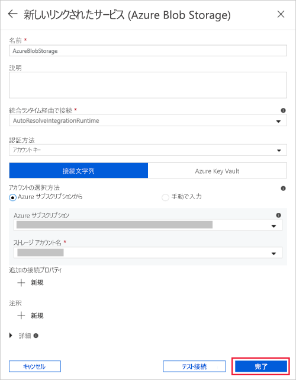

# クイック スタート:データのコピー ツールを使用してデータをコピーする

> [!div class="op_single_selector" title1="使用している Data Factory サービスのバージョンを選択してください。"]
> * [Version 1](v1/data-factory-copy-data-from-azure-blob-storage-to-sql-database.md)
> * [現在のバージョン](quickstart-create-data-factory-copy-data-tool.md)

[!INCLUDE[appliesto-adf-xxx-md](includes/appliesto-adf-xxx-md.md)]

このクイック スタートでは、Azure Portal を使用してデータ ファクトリを作成します。 次に、データのコピー ツールを使用して、Azure Blob Storage 内のフォルダーから別のフォルダーにデータをコピーするパイプラインを作成します。 

> [!NOTE]
> Azure Data Factory を初めて使用する場合は、このクイック スタートを実行する前に、「[Azure Data Factory の概要](introduction.md)」を参照してください。 

[!INCLUDE [data-factory-quickstart-prerequisites](../../includes/data-factory-quickstart-prerequisites.md)] 

## Data Factory の作成

1. Web ブラウザー (**Microsoft Edge** または **Google Chrome**) を起動します。 現在、Data Factory の UI がサポートされる Web ブラウザーは Microsoft Edge と Google Chrome だけです。
1. [Azure ポータル](https://portal.azure.com)にアクセスします。 
1. Azure portal のメニューで、 **[リソースの作成]**  >  **[統合]**  >  **[Data Factory]** の順に選択します。

    

1. **[新しいデータ ファクトリ]** ページで、 **[名前]** に「**ADFTutorialDataFactory**」と入力します。 
 
   Azure Data Factory の名前は、"*グローバルに一意*" にする必要があります。 次のエラーが発生した場合は、データ ファクトリの名前を変更して ( **&lt;yourname&gt;ADFTutorialDataFactory** など) 作成し直してください。 Data Factory アーティファクトの名前付け規則については、[Data Factory の名前付け規則](naming-rules.md)に関する記事を参照してください。
  
   
1. **[サブスクリプション]** で、データ ファクトリを作成する Azure サブスクリプションを選択します。 
1. **[リソース グループ]** で、次の手順のいずれかを行います。
     
   - **[既存のものを使用]** を選択し、一覧から既存のリソース グループを選択します。 
   - **[新規作成]** を選択し、リソース グループの名前を入力します。   
         
   リソース グループの詳細については、 [リソース グループを使用した Azure のリソースの管理](../azure-resource-manager/management/overview.md)に関するページを参照してください。  
1. **[バージョン]** で、 **[V2]** を選択します。
1. **[場所]** で、データ ファクトリの場所を選択します。

   この一覧に表示されるのは、Data Factory でサポートされ、かつ Azure Data Factory のメタ データが格納される場所のみです。 Data Factory で使用する関連データ ストア (Azure Storage、Azure SQL Database など) やコンピューティング (Azure HDInsight など) は他のリージョンで実行できます。

1. **［作成］** を選択します

1. 作成が完了すると、 **[Data Factory]** ページが表示されます。 **[作成と監視]** タイルを選択して、別のタブで Azure Data Factory ユーザー インターフェイス (UI) アプリケーションを起動します。
   
   ![[作成と監視] タイルが表示された、データ ファクトリのホーム ページ](./media/doc-common-process/data-factory-home-page.png)

## データのコピー ツールの起動

1. **[Let's get started]\(始めましょう\)** ページで、 **[データのコピー]** タイルを選択してデータのコピー ツールを起動します。 

   ![[データのコピー] タイル](./media/doc-common-process/get-started-page.png)

1. データのコピー ツールの **[プロパティ]** ページで、パイプラインの名前とその説明を指定できます。 **[次へ]** を選択します。 

   ![[プロパティ] ページ](./media/quickstart-create-data-factory-copy-data-tool/copy-data-tool-properties-page.png)
1. **[ソース データ ストア]** ページで、次の手順を実行します。

    a. **[+ 新しい接続の作成]** をクリックして、接続を追加します。

    b. ソース接続用に作成するリンクされたサービスの種類を選択します。 このチュートリアルでは、**Azure Blob Storage** を使用します。 ギャラリーからそれを選択し、 **[続行]** を選択します。
    
    

    c. **[New Linked Service (Azure Blob Storage)]\(新しいリンクされたサービス (Azure Blob Storage)\)** ページで、リンクされたサービスの名前を指定します。 **[ストレージ アカウント名]** ボックスの一覧からストレージ アカウントを選択し、接続をテストして、 **[作成]** を選択します。 

    

    d. 新しく作成したリンクされたサービスをソースとして選択し、 **[次へ]** をクリックします。

1. **[Choose the input file or folder]\(入力ファイルまたはフォルダーの選択\)** ページで、次の手順を実行します。

   a. **[参照]** をクリックして、**adftutorial/input** フォルダーに移動します。**emp.txt** ファイルを選択し、 **[選択]** をクリックします。 

   d. ファイルをそのままコピーするため、 **[Binary copy]\(バイナリ コピー\)** チェック ボックスをオンにし、 **[次へ]** を選択します。 

   ![[Choose the input file or folder]\(入力ファイルまたはフォルダーの選択\) ページ](./media/quickstart-create-data-factory-copy-data-tool/select-binary-copy.png)

1. **[Destination data store]\(コピー先データ ストア\)** ページで、作成した **Azure Blob Storage** のリンクされたサービスを選択し、 **[次へ]** を選択します。 

1. **[Choose the output file or folder]\(出力ファイルまたはフォルダーの選択\)** ページで、フォルダー パスとして「**adftutorial/output**」と入力し、 **[次へ]** を選択します。 

   ![[Choose the output file or folder]\(出力ファイルまたはフォルダーの選択\) ページ](./media/quickstart-create-data-factory-copy-data-tool/configure-sink-path.png) 

1. **[設定]** ページで、 **[次へ]** を選択して、既定の構成を使用します。 

1. **[概要]** ページで、すべての設定を確認し、 **[次へ]** を選択します。 

1. **[Deployment complete]\(デプロイ完了\)** ページで **[監視]** を選択して、作成したパイプラインを監視します。 

    ![[Deployment complete]\(デプロイ完了\) ページ](./media/quickstart-create-data-factory-copy-data-tool/deployment-page.png)

1. アプリケーションの **[監視]** タブに切り替えます。このタブでは、パイプラインの状態が表示されます。 **[最新の情報に更新]** を選択して、一覧を更新します。 **[パイプライン名]** の下にあるリンクをクリックして、アクティビティの実行の詳細を表示するか、パイプラインを再実行します。 
   
    

1. コピー操作の詳細については、[アクティビティの実行] ページで、 **[アクティビティ名]** 列の下にある **[詳細]** リンク (眼鏡アイコン) を選択します。 プロパティの詳細については、[コピー アクティビティの概要](copy-activity-overview.md)に関するページを参照してください。 

1. [パイプラインの実行] ビューに戻るには、階層リンク メニューの **[すべてのパイプラインの実行]** リンクを選択します。 表示を更新するには、 **[最新の情報に更新]** を選択します。 

1. **adftutorial** コンテナーの **output** フォルダーに **emp.txt** ファイルが作成されていることを確認します。 output フォルダーが存在しない場合は、Data Factory サービスによって自動的に作成されます。 

1. **[監視]** タブの上にある **[編集]** タブに切り替えると、リンクされたサービス、データセット、パイプラインを編集できます。 Data Factory UI での編集の詳細については、[Azure Portal を使用したデータ ファクトリの作成](quickstart-create-data-factory-portal.md)に関する記事を参照してください。

    ![[作成者] タブを選択する](./media/quickstart-create-data-factory-copy-data-tool/select-author.png)

## 次のステップ
このサンプルのパイプラインは、Azure Blob Storage 内のある場所から別の場所にデータをコピーします。 より多くのシナリオで Data Factory を使用する方法については、[チュートリアル](tutorial-copy-data-portal.md)を参照してください。 
