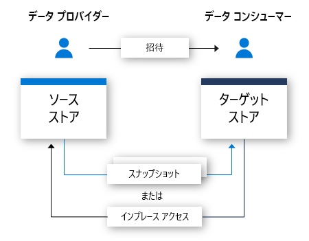

# Azure Data Share とは

今日の世界では、データは、多くの組織が簡単かつ安全に顧客やパートナーと共有する必要がある重要な戦略的資産と見られています。 現在お客様がこれを行うには、FTP、メール、API をはじめとして、多くの方法があります。 組織では、データを誰と共有したのかわからなくなることがよくあります。 データを共有するのに、FTP や、独自の API インフラストラクチャを利用すると、プロビジョニングと管理に多くのコストがかかることがよくあります。 これらの共有方法を大規模に使うと、管理オーバーヘッドが伴います。 

多くの組織では、共有するデータについて説明責任を負う必要があります。 説明責任だけでなく、多くの組織では、すべてのデータ共有を簡単な方法で制御、管理、監視できる必要があります。 今日のようにデータが急激に増加し続けることが予想される場合、組織にはビッグ データを共有するための簡単な方法が必要です。 お客様は、タイムリーな分析情報を得ることができるように、最新のデータを望んでいます。

組織では、Azure Data Share を利用することで、複数の顧客やパートナーとデータを簡単かつ安全に共有することができます。 ほんの数回のクリックで、新しい Data Share アカウントをプロビジョニングし、データセットを追加し、データ共有に顧客やパートナーを招待することができます。 データ プロバイダーは、共有するデータを常に制御しています。 Azure Data Share を使うと、どのようなデータが、いつ、誰と共有されたかを簡単に管理および監視できます。 

データ プロバイダーは、データ共有の使用条件を指定することで、データの処理方法の制御を維持できます。 データ コンシューマーは、データを受け取る前に、これらの条件に同意する必要があります。 データ プロバイダーは、データ コンシューマーが更新を受け取る頻度を指定できます。 データ プロバイダーは、新しい更新へのアクセスをいつでも取り消すことができます。 

Azure Data Share を使うと、サードパーティからのデータを簡単に結合して分析と AI のシナリオを補強できるようになり、分析情報の強化に役立ちます。 Azure の分析ツールの機能を簡単に利用して、Azure Data Share を使って共有されるデータを準備、処理、分析できます。 

データ プロバイダーとデータ コンシューマーは、どちらもデータを共有および受信するための Azure サブスクリプションが必要です。 Azure サブスクリプションをお持ちでない場合は、[無料アカウント](https://azure.microsoft.com/free/)を作成してください。

## Azure Data Share のシナリオ

Azure Data Share はさまざまな業界で使用できます。 たとえば、小売業者はサプライヤーと最新の販売時点データを共有したい場合があります。 Azure Data Share を使うと、小売業者はすべてのサプライヤーに対する販売時点データを含むデータ共有を設定し、1 時間または 1 日ごとに売上を共有することができます。 

また、Azure Data Share を使うと、特定の業界に関するデータ マーケットプレースを確立できます。 たとえば、定期的に人口増加に関する匿名化されたデータをサードパーティと共有する政府機関や研究機関などです。 

Azure Data Share のもう 1 つのユース ケースは、データ コンソーシアムの確立です。 たとえば、複数の異なる研究機関が、1 つの信頼できる団体とデータを共有できます。 データは、Azure の分析ツールを使って分析または集計された後、関心のあるパーティと共有されます。 

## しくみ

Azure Data Share は、現在、スナップショットベースの共有とインプレース共有を提供しています。 

スナップショット ベースの共有では、データはデータ プロバイダーの Azure サブスクリプションからデータ コンシューマーの Azure サブスクリプションに移動されます。 データ プロバイダーは、データ共有をプロビジョニングして、受信者をデータ共有に招待します。 データ コンシューマーは、メールでデータ共有への招待を受け取ります。 データ コンシューマーは、招待を受け入れると、共有されたデータの完全なスナップショットをトリガーできます。 このデータは、データ コンシューマーのストレージ アカウントに送られます。 データ コンシューマーは、共有されているデータの増分更新を定期的に受け取って、常にデータの最新バージョンを保持できます。 

データ プロバイダーは、スナップショットのスケジュールにより、共有しているデータの増分更新をデータ コンシューマーに提供できます。 スナップショットのスケジュールは、時間単位または日単位で提供されます。 データ コンシューマーは、データ共有を受け入れて構成すると、スナップショットのスケジュールをサブスクライブできます。 これは、共有データが定期的に更新され、データ コンシューマーが最新のデータを必要とするシナリオにおいて有益です。 

データ コンシューマーは、データ共有を受け入れると、自分で選択したデータ ストアでデータを受け取ることができます。 たとえば、データ プロバイダーが Azure Blob Storage を使ってデータを共有している場合、データ コンシューマーは Azure Data Lake Store でこのデータを受け取ることができます。 同様に、データ プロバイダーが Azure Synapse Analytics からのデータを共有する場合、データ コンシューマーは、データを Azure Data Lake Store、Azure SQL Database、または Azure Synapse Analytics に受信するかどうかを選択できます。 SQL ベースのソースから共有する場合、データ コンシューマーは、parquet または csv でデータを受信するかどうかを選択することもできます。 

インプレース共有では、データ プロバイダーがデータをコピーすることなく、データが置かれている場所でデータを共有できます。 招待フローを通じて共有関係が確立されると、データ プロバイダーのソース データ ストアとデータのコンシューマーのターゲット データ ストアとの間でシンボリック リンクが作成されます。 データ コンシューマーは、その独自のデータ ストアを使用してリアルタイムにデータを読み取り、照会することができます。 ソース データ ストアに対する変更は、データ コンシューマーに対して即座に提供されます。 インプレース共有は現在、Azure Data Explorer で利用可能です。

## 主な機能

データ プロバイダーは Azure Data Share で次のことができます。

* [サポートされているデータ ストア](supported-data-stores.md)の一覧からのデータを、組織の外部の顧客やパートナーと共有します

* データを誰と共有しているかを追跡します

* スナップショット共有かインプレース共有かの選択

* どのくらいの頻度でデータ コンシューマーがデータの更新を受け取るか

* 顧客が必要に応じて最新バージョンのデータをプルしたり、定義された間隔でデータの増分変更を自動的に受け取ったりできるようにします

データ コンシューマーは Azure Data Share で次のことができます。 

* 共有されているデータの種類の説明を表示します

* データの使用条件を表示します

* Azure Data Share の招待を承諾または拒否します

* 自分と共有されているデータを、[サポートされているデータ ストア](supported-data-stores.md)に受け入れます。

* 配置されているデータにアクセスするか、共有データの完全または増分スナップショットをトリガーします

上記のすべての主要機能は、Azure portal または REST API によってサポートされます。 REST API での Azure Data Share の使用に関して詳しくは、リファレンス ドキュメントをご覧ください。 

## サポートされているリージョン

Azure Data Share を利用できる Azure リージョンの一覧については、「[リージョン別の利用可能な製品](https://azure.microsoft.com/global-infrastructure/services/?products=data-share)」ページで Azure Data Share を検索してください。 

東南アジア (シンガポール) では、Azure Data Share によって格納されるメタデータはこのリージョン内に格納され、その他のすべてのサポートされているリージョンでは geo に格納されます。 Azure Data Share には、共有データ自体のコピーは格納されません。 データは、共有されている基礎のデータ ストアに格納されます。 たとえば、データ プロバイダーが米国西部にある Azure Data Lake Store アカウントにデータを格納した場合は、そこがデータの格納場所です。 西ヨーロッパにある Azure Storage アカウントで、スナップショットを介してデータを共有している場合は、通常、データは西ヨーロッパにある Azure Storage アカウントに直接転送されます。 

サービスを利用するために、Azure Data Share サービスが自分のリージョンで使用できる必要はありません。 たとえば、Azure Data Share をまだ利用できないリージョンにある Azure Storage アカウントにデータが格納されている場合でも、サービスを利用してデータを共有できます。 

## 次のステップ

データの共有を始める方法については、[データの共有](share-your-data.md)に関するチュートリアルをご覧ください。
