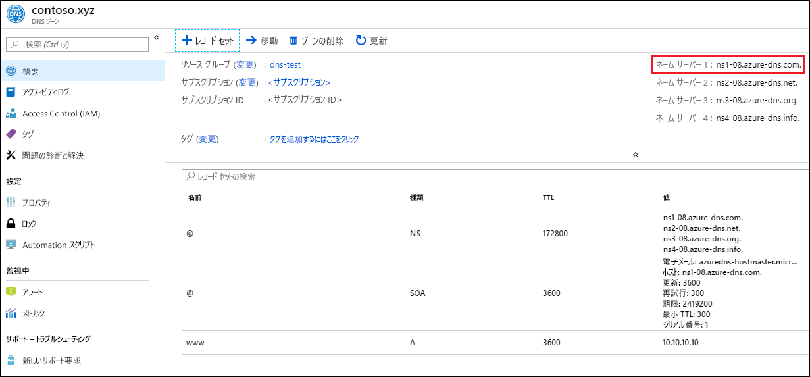

# Azure Portal で Azure DNS の使用を開始する

> [!div class="op_single_selector"]
> * [Azure ポータル](dns-getstarted-portal.md)
> * [PowerShell](dns-getstarted-powershell.md)
> * [Azure CLI 1.0](dns-getstarted-cli-nodejs.md)
> * [Azure CLI 2.0](dns-getstarted-cli.md)

この記事では、Azure Portal を使用して最初の DNS ゾーンとレコードを作成する手順について説明します。 これらの手順は、Azure PowerShell またはクロスプラットフォームの Azure CLI を使用して実行することもできます。

DNS ゾーンは、特定のドメインの DNS レコードをホストするために使用されます。 Azure DNS でドメインのホストを開始するには、そのドメイン名用に DNS ゾーンを作成する必要があります。 ドメインの DNS レコードはすべて、この DNS ゾーン内に作成されます。 最後に、DNS ゾーンをインターネットに公開するには、ドメインのネーム サーバーを構成する必要があります。 ここでは、その手順について説明します。

## DNS ゾーンの作成

1. Azure ポータルにサインインします。
2. ハブ メニューの **[新規]、[ネットワーク]** を順にクリックし、**[DNS ゾーン]** をクリックして [DNS ゾーンの作成] ブレードを開きます。

    ![[DNS ゾーン]](./media/dns-getstarted-portal/openzone650.png)

4. **[DNS ゾーンの作成]** ブレードで、DNS ゾーンの名前を入力します。 たとえば、 *contoso.com*などのドメインです。
 
    

5. 次に、使用するリソース グループを指定します。 新しいリソース グループを作成することも、既存のリソース グループを選択することもできます。 新しいリソース グループを作成する場合は、**[場所]** ドロップダウンを使用して、リソース グループの場所を指定します。 これはリソース グループの場所を指定する設定であり、DNS ゾーンには影響しないことにご注意ください。 DNS ゾーンの場所は常に "グローバル" であり、それは表示されません。

6. ダッシュボードで新しいゾーンをすぐに見つけられるようにするには、 **[ダッシュボードにピン留めする]** チェックボックスをオンのままにします。 **[Create]**をクリックします。

    ![[ダッシュボードにピン留めする]](./media/dns-getstarted-portal/pindashboard150.png)

7. [作成] をクリックした後、ダッシュボードを見ると、新しいゾーンが構成されていることがわかります。

    

8. 新しいゾーンが作成されると、ダッシュボードに新しいゾーンのブレードが開きます。

## DNS レコードの作成

次の例では、新しい "A" レコードを作成する手順を説明します。 他のレコードの種類と、既存のレコードの変更については、「[Azure ポータルを使用した DNS レコードとレコード セットの管理](dns-operations-recordsets-portal.md)」を参照してください。 

1. **[DNS ゾーン]** ブレードの上部にある **[+ レコード セット]** を選択して **[レコード セットの追加]** ブレードを開きます。

    

4. **[レコード セットの追加]** ブレードで、レコード セットの名前を入力します (例: "**www**")。

    ![[レコード セットの追加]](./media/dns-getstarted-portal/addrecordset500.png)

5. 作成するレコードの種類を選択します。 この例では、**[A]** を選択します。
6. **TTL**を設定します。 既定の有効期間は&1; 時間です。
7. レコードの IP アドレスを追加します。
8. ブレード下部の **[OK]** を選択すると、DNS レコードが作成されます。

## レコードの表示

[DNS ゾーン] ブレードの下部に、DNS ゾーンのレコードが表示されます。 ここには、すべてのゾーンで作成される既定の DNS および SOA レコードと、ご自身で作成した新しいレコードが表示されています。

## ネーム サーバーの更新

DNS ゾーンとレコードを正しく設定したら、Azure DNS ネーム サーバーを使用するようにドメイン名を構成する必要があります。 これにより、インターネット上の他のユーザーが DNS レコードを検索できるようになります。

ゾーンのネーム サーバーは、Azure Portal で次のように示されます。

このネーム サーバーは、ドメイン名レジストラー (ドメイン名を購入した場所) で構成する必要があります。 レジストラーにより、ドメインのネーム サーバーを設定するオプションが提供されます。 詳細については、「[Azure DNS へのドメインの委任](dns-domain-delegation.md)」を参照してください。

## 次のステップ

Azure DNS の詳細については、「[Azure DNS の概要](dns-overview.md)」を参照してください。

Azure DNS での DNS レコードの管理の詳細については、「[Azure ポータルを使用した DNS レコードとレコード セットの管理](dns-operations-recordsets-portal.md)」を参照してください。

