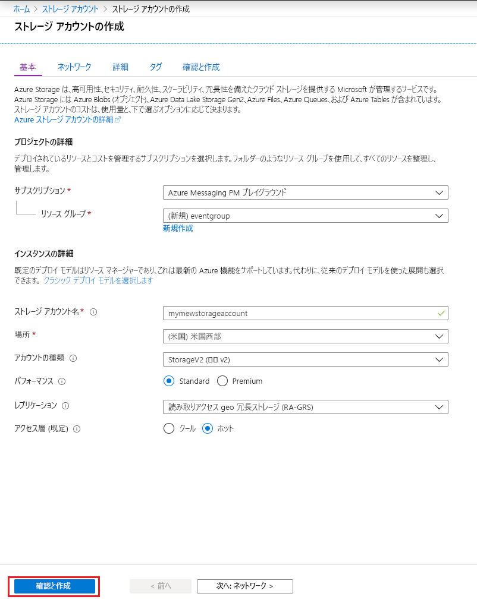
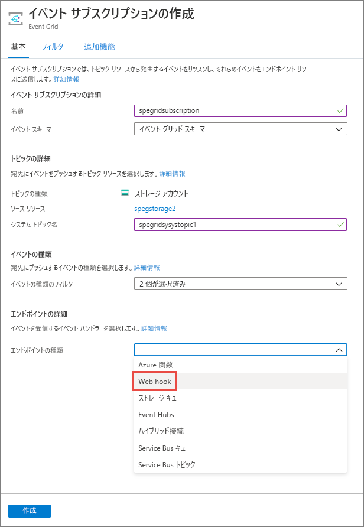
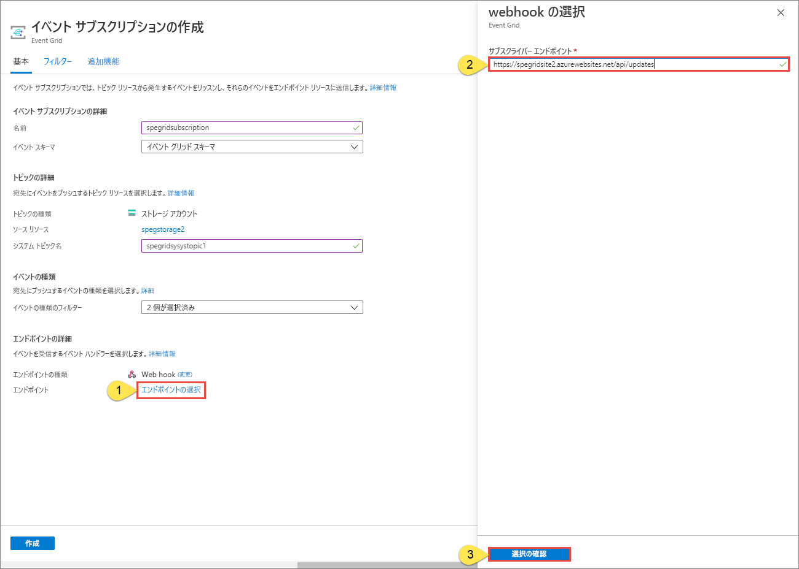
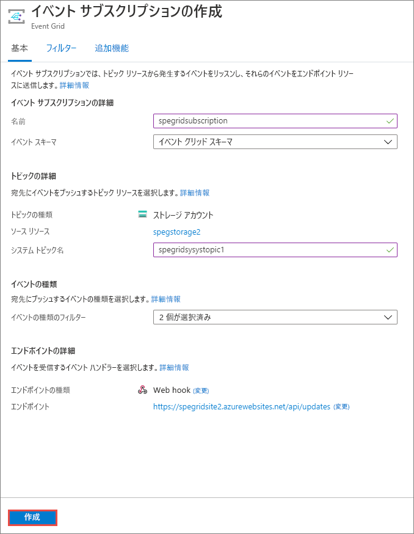

# クイック スタート:Azure portal で Blob Storage のイベントを Web エンドポイントにルーティングする

Azure Event Grid は、クラウドのイベント処理サービスです。 この記事では、Azure portal を使用して BLOB ストレージ アカウントを作成し、その BLOB ストレージのイベントをサブスクライブし、イベントをトリガーして結果を表示します。 通常は、イベント データを処理し、アクションを実行するエンドポイントにイベントを送信します。 ただし、この記事では、単純化するために、メッセージを収集して表示する Web アプリにイベントを送信します。

[!INCLUDE [quickstarts-free-trial-note.md](../../includes/quickstarts-free-trial-note.md)]

最後に、イベント データが Web アプリに送信されたことを確認します。

## ストレージ アカウントの作成

1. [Azure ポータル](https://portal.azure.com/)にサインインします。

1. BLOB ストレージを作成するには、 **[リソースの作成]** を選択します。 

1. 使用可能なオプションをフィルター選択するために **[ストレージ]** を選択し、 **[ストレージ アカウント - Blob、File、Table、Queue]** を選択します。

   ![[ストレージ] を選択する](./media/blob-event-quickstart-portal/create-storage.png)

   イベントに対してサブスクライブするには、汎用 v2 ストレージ アカウントまたは BLOB ストレージ アカウントのどちらかを作成します。
   
1. **[ストレージ アカウントの作成]** ページで、次の手順を実行します。
    1. Azure サブスクリプションを選択します。 
    2. **リソース グループ** には、新しいリソース グループ名を作成するか既存の名前を選択します。 
    3. ストレージ アカウントの名前を入力します。 
    4. **[Review + create]\(レビュー + 作成\)** を選択します。 

           
    5. **[確認および作成]** ページで設定を確認し、 **[作成]** を選択します。 

        >[!NOTE]
        > イベントの統合をサポートしているのは、**StorageV2 (汎用 v2)** と **BlobStorage** の種類のストレージ アカウントだけです。 **Storage (汎用 v1)** では、Event Grid との統合はサポート "*されていません*"。

## メッセージ エンドポイントの作成

BLOB ストレージのイベントをサブスクライブする前に、イベント メッセージのエンドポイントを作成しましょう。 通常、エンドポイントは、イベント データに基づくアクションを実行します。 このクイック スタートを簡素化するために、イベント メッセージを表示する[構築済みの Web アプリ](https://github.com/Azure-Samples/azure-event-grid-viewer)をデプロしします。 デプロイされたソリューションには、App Service プラン、App Service Web アプリ、および GitHub からのソース コードが含まれています。

1. **[Deploy to Azure]\(Azure にデプロイ\)** を選択して、ソリューションをサブスクリプションにデプロイします。 

   
2. **[カスタム デプロイ]** ページで、次の手順を実行します。 
    1. **[リソース グループ]** で、ストレージ アカウントの作成時に作成したリソース グループを選択します。 チュートリアルの完了後は、リソース グループを削除して容易にクリーンアップすることができます。  
    2. **[サイト名]** に、Web アプリの名前を入力します。
    3. Web アプリのホストに使用する App Service プランの名前を **[ホスティング プラン名]** に入力します。
    4. **[上記の使用条件に同意する]** のチェック ボックスをオンにします。 
    5. **[購入]** を選択します。 

       
1. デプロイが完了するまでに数分かかる場合があります。 ポータルでアラート (ベルのアイコン) を選択し、 **[リソース グループに移動]** を選択します。 

    
4. **[リソース グループ]** ページのリソースの一覧で、作成した Web アプリを選択します。 この一覧には、App Service プランとストレージ アカウントも表示されます。 

    
5. Web アプリの **[App Service]** ページで、Web サイトに移動するための URL を選択します。 この URL は、`https://<your-site-name>.azurewebsites.net` 形式になっている必要があります。
    
    

6. サイトは表示されますが、イベントはまだ送信されていないことを確認します。

   

[!INCLUDE [event-grid-register-provider-portal.md](../../includes/event-grid-register-provider-portal.md)]

## BLOB ストレージのサブスクライブ

どのイベントを追跡し、どこにイベントを送信するかは、トピックを購読することによって Event Grid に伝えます。

1. ポータルで、先ほど作成した Azure Storage アカウントに移動します。 左側のメニューにある **[すべてのリソース]** を選択し、自分のストレージ アカウントを選択します。 
2. **[ストレージ アカウント]** ページの左側のメニューにある **[イベント]** を選択します。 
1. **[その他のオプション]** を選択し、 **[webhook]** を選択します。 エンドポイントの Web hook を使用して、ビューアー アプリにイベントを送信します。 

   ![[webhook] を選択する](./media/blob-event-quickstart-portal/select-web-hook.png)
3. **[イベント サブスクリプションの作成]** ページで、次の手順を実行します。 
    1. イベント サブスクリプションの **名前** を入力します。
    2. **システム トピック** の **名前** を入力します。 システム トピックについては、[システム トピックの概要](system-topics.md)に関するページを参照してください。

       
    2. **[エンドポイントのタイプ]** には **[Webhook]** を選択します。 

       
4. **[エンドポイント]** で **[エンドポイントの選択]** をクリックし、Web アプリの URL を入力して、ホーム ページの URL に `api/updates` を追加し (例: `https://spegridsite.azurewebsites.net/api/updates`)、 **[選択の確認]** を選択します。

   
5. 次に、 **[イベント サブスクリプションの作成]** ページの **[作成]** を選択して、イベント サブスクリプションを作成します。 

   

1. Web アプリをもう一度表示し、その Web アプリにサブスクリプションの検証イベントが送信されたことに注目します。 目のアイコンを選択してイベント データを展開します。 Event Grid は検証イベントを送信するので、エンドポイントはイベント データを受信することを確認できます。 Web アプリには、サブスクリプションを検証するコードが含まれています。

   

では、イベントをトリガーして、Event Grid がメッセージをエンドポイントに配信するようすを見てみましょう。

## エンドポイントへのイベントの送信

BLOB ストレージのイベントをトリガーするには、ファイルをアップロードします。 このファイルは、特定のコンテンツを必要としません。 この記事では、testfile.txt という名前のファイルがあると仮定していますが、任意のファイルを使用できます。

1. Azure portal で Blob Storage アカウントに移動し、 **[概要]** ページの **[Containers]** を選択します。

   

1. **[+ コンテナー]** を選択します。 コンテナーに名前を付け、任意のアクセス レベルを使用して、 **[作成]** を選択します。 

   

1. 新しいコンテナーを選択します。

   

1. ファイルをアップロードするには、 **[アップロード]** を選択します。 **[BLOB のアップロード]** ページで、テスト用にアップロードするファイルを参照して選択し、ページ上の **[アップロード]** を選択します。 

   ![[アップロード] を選択する](./media/blob-event-quickstart-portal/upload-file.png)

1. テスト ファイルを参照し、それをアップロードします。

1. 以上でイベントがトリガーされ、そのメッセージが、Event Grid によってサブスクライブ時に構成したエンドポイントに送信されました。 メッセージは JSON 形式であり、1 つまたは複数のイベントの配列が含まれています。 次の例の JSON メッセージには、1 つのイベントの配列が含まれています。 Web アプリを表示して、**BLOB 作成** イベントが受信されたことを確認します。 

   

## リソースをクリーンアップする

引き続きこのイベントを使用する場合は、この記事で作成したリソースをクリーンアップしないでください。 それ以外の場合は、この記事で作成したリソースを削除してください。

リソース グループを選択し、 **[リソース グループの削除]** を選択します。

## 次のステップ

カスタム トピックを作成し、イベントをサブスクライブする方法がわかったら、Event Grid でできることについて、さらに情報を収集しましょう。

- [Event Grid について](overview.md)
- [Blob Storage のイベントをカスタム Web エンドポイントにルーティングする](../storage/blobs/storage-blob-event-quickstart.md?toc=%2fazure%2fevent-grid%2ftoc.json)
- [Azure Event Grid と Logic Apps で仮想マシンの変更を監視する](monitor-virtual-machine-changes-event-grid-logic-app.md)
- [ビッグ データをデータ ウェアハウスにストリーミングする](event-grid-event-hubs-integration.md)
