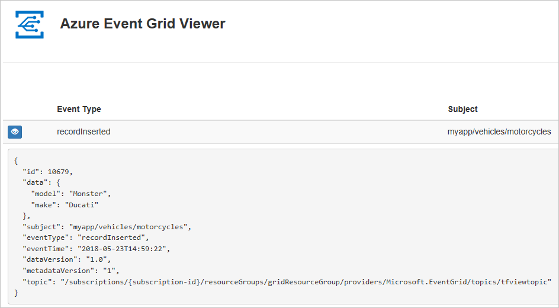
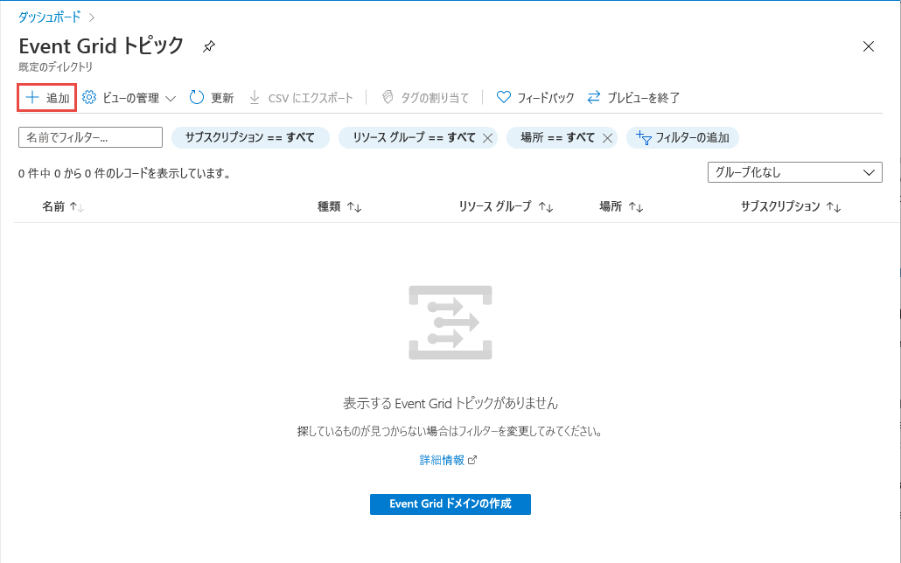
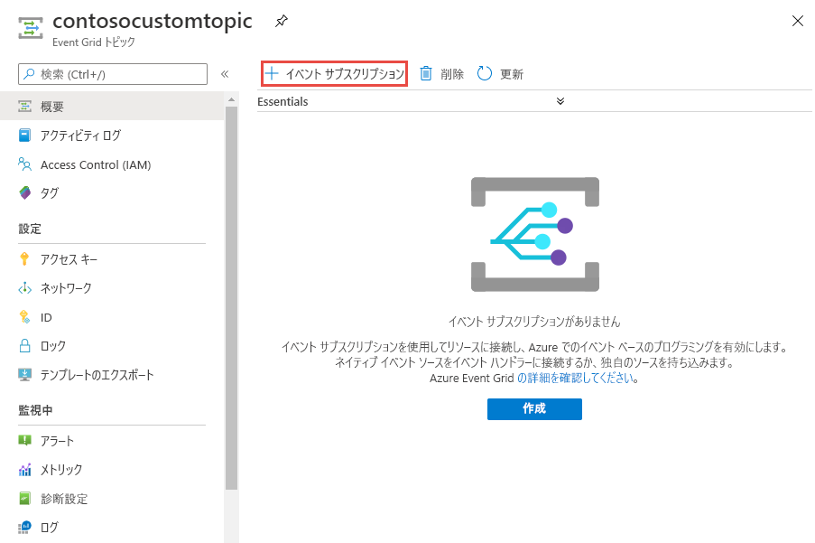
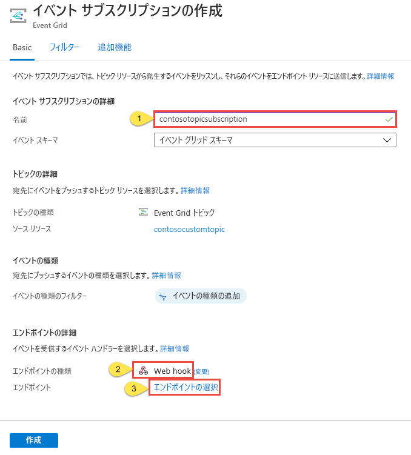
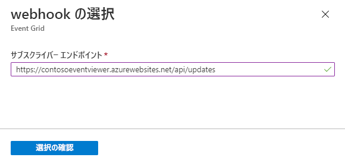

# <a name="quickstart-route-custom-events-to-web-endpoint-with-the-azure-portal-and-event-grid"></a>クイック スタート: Azure portal と Event Grid を使ったカスタム イベントの Web エンドポイントへのルーティング

Azure Event Grid は、クラウドのイベント処理サービスです。 この記事では、Azure portal を使用し、カスタム トピックを作成してそのトピックをサブスクライブし、イベントをトリガーして結果を表示します。 通常は、イベント データを処理し、アクションを実行するエンドポイントにイベントを送信します。 ただし、この記事では、単純化するために、メッセージを収集して表示する Web アプリにイベントを送信します。

最後に、イベント データが Web アプリに送信されたことを確認します。



[!INCLUDE [updated-for-az](../../includes/updated-for-az.md)]

[!INCLUDE [quickstarts-free-trial-note.md](../../includes/quickstarts-free-trial-note.md)]

[!INCLUDE [event-grid-register-provider-portal.md](../../includes/event-grid-register-provider-portal.md)]

## <a name="create-a-custom-topic"></a>カスタム トピックの作成

Event Grid のトピックは、イベントの送信先となるユーザー定義のエンドポイントになります。 

1. [Azure ポータル](https://portal.azure.com/)にサインインします。
2. 左側のナビゲーション メニューで **[すべてのサービス]** を選択します。"**Event Grid**" を検索し、**[Event Grid トピック]** を選択します。 

    ![[Event Grid トピック] を選択する](./media/custom-event-quickstart-portal/select-event-grid-topics.png)
3. **[Event Grid トピック]** ページで、ツール バーの **[+ 追加]** を選択します。 

    
4. **[トピックの作成]** ページで、次の手順に従います。
    1. カスタム トピックの一意の**名前**を指定します。 トピック名は、DNS エントリによって表されるため、一意である必要があります。 画像に示されている名前は使用しないでください。 代わりに、必ず 3 - 50 文字以内で、a - z、A - Z、0 - 9、および "-" のみを含む独自の名前を作成します。
    2. Azure **サブスクリプション**を選択します。
    3. 既存のリソース グループを選択するか、**[新規作成]** を選択し、**リソース グループ**の**名前**を入力します。
    4. イベント グリッド トピックの**場所**を選択します。
    5. **[イベント スキーマ]** フィールドでは、既定値の **[イベント グリッド スキーマ]** をそのまま使用します。 

       ![[トピックの作成] ページ](./media/custom-event-quickstart-portal/create-custom-topic.png)
    6. **作成** を選択します。 
5. カスタム トピックが作成されると、成功の通知が表示されます。 **[リソース グループに移動]** を選択します。 

   
6. **[リソース グループ]** ページで、イベント グリッド トピックを選択します。 

   
7. 自分のイベント グリッドの **[Event Grid トピック]** ページが表示されます。 このページは開いたままにしておきます。 後ほど、このクイック スタートで使用します。 

    ![[Event Grid トピック] ホーム ページ](./media/custom-event-quickstart-portal/event-grid-topic-home-page.png)

## <a name="create-a-message-endpoint"></a>メッセージ エンドポイントの作成
カスタム トピックのサブスクリプションを作成する前に、イベント メッセージのエンドポイントを作成します。 通常、エンドポイントは、イベント データに基づくアクションを実行します。 このクイック スタートを簡素化するために、イベント メッセージを表示する[構築済みの Web アプリ](https://github.com/Azure-Samples/azure-event-grid-viewer)をデプロしします。 デプロイされたソリューションには、App Service プラン、App Service Web アプリ、および GitHub からのソース コードが含まれています。

1. この記事ページで **[Deploy to Azure]\(Azure にデプロイ\)** を選択して、ソリューションを自分のサブスクリプションにデプロイします。 Azure portal で、パラメーターの値を指定します。

   <a href="https://portal.azure.com/#create/Microsoft.Template/uri/https%3A%2F%2Fraw.githubusercontent.com%2FAzure-Samples%2Fazure-event-grid-viewer%2Fmaster%2Fazuredeploy.json" target="_blank"></a>
1. デプロイが完了するまでに数分かかる場合があります。 デプロイが成功した後で、Web アプリを表示して、実行されていることを確認します。 Web ブラウザーで `https://<your-site-name>.azurewebsites.net` にアクセスします
1. サイトは表示されますが、イベントはまだ送信されていません。

   

## <a name="subscribe-to-custom-topic"></a>カスタム トピックのサブスクライブ

どのイベントを追跡し、どこにイベントを送信するかは、イベント グリッド トピックをサブスクライブすることによって Event Grid に伝えます。

1. 次に、カスタム トピックの **[Event Grid トピック]** ページで、ツール バーの **+ [イベント サブスクリプション]** を選択します。

   
2. **[イベント サブスクリプションの作成]** ページで、次の手順に従います。
    1. イベント サブスクリプションの**名前**を入力します。
    3. **[エンドポイントのタイプ]** には **[Webhook]** を選択します。 
    4. **[エンドポイントの選択]** を選択します。 

       
    5. Web hook エンドポイントに対して、Web アプリの URL を入力し、ホーム ページの URL に `api/updates` を追加します。 **[選択の確認]** を選択します。

       
    6. 再び **[イベント サブスクリプションの作成]** ページで、**[作成]** を選択します。

3. Web アプリをもう一度表示し、その Web アプリにサブスクリプションの検証イベントが送信されたことに注目します。 目のアイコンを選択してイベント データを展開します。 Event Grid は検証イベントを送信するので、エンドポイントはイベント データを受信することを確認できます。 Web アプリには、サブスクリプションを検証するコードが含まれています。

    

## <a name="send-an-event-to-your-topic"></a>トピックへのイベントの送信

では、イベントをトリガーして、Event Grid がメッセージをエンドポイントに配信するようすを見てみましょう。 Azure CLI または PowerShell を使用して、テスト イベントをカスタム トピックに送信します。 通常はイベント データをアプリケーションまたは Azure サービスから送信することになります。

最初の例では、Azure CLI を使用しています。 この例では、カスタム トピックの URL とキー、およびサンプル イベント データを取得します。 `<topic name>` には、実際のカスタム トピック名を使用してください。 これによりサンプルのイベント データが作成されます。 JSON の `data` 要素がイベントのペイロードです。 このフィールドには、適切な形式の JSON であればどのようなものでも格納することができます。 また、高度なルーティングやフィルタリングを行う場合には、subject フィールドを使用することもできます。 CURL は、HTTP 要求を送信するユーティリティです。


### <a name="azure-cli"></a>Azure CLI
1. Azure portal で、**[Cloud Shell]** を選択します。 Cloud Shell ウィンドウの左上隅の **[Bash]** を選択します。 

    
1. 次のコマンドを実行して、トピックの**エンドポイント**を取得します。コマンドをコピーして貼り付けた後、コマンドを実行する前に**トピック名**と**リソース グループ名**を更新してください。 

    ```azurecli
    endpoint=$(az eventgrid topic show --name <topic name> -g <resource group name> --query "endpoint" --output tsv)
    ```
2. 次のコマンドを実行して、カスタム トピックの**キー**を取得します。コマンドをコピーして貼り付けた後、コマンドを実行する前に**トピック名**と**リソース グループ**名を更新してください。 

    ```azurecli
    key=$(az eventgrid topic key list --name <topic name> -g <resource group name> --query "key1" --output tsv)
    ```
3. イベント定義を含む次のステートメントをコピーし、**Enter** キーを押します。 

    ```json
    event='[ {"id": "'"$RANDOM"'", "eventType": "recordInserted", "subject": "myapp/vehicles/motorcycles", "eventTime": "'`date +%Y-%m-%dT%H:%M:%S%z`'", "data":{ "make": "Ducati", "model": "Monster"},"dataVersion": "1.0"} ]'
    ```
4. 次の **Curl** コマンドを実行して、イベントを送信します。

    ```
    curl -X POST -H "aeg-sas-key: $key" -d "$event" $endpoint
    ```

### <a name="azure-powershell"></a>Azure PowerShell
2 番目の例では、PowerShell を使用して、同様の手順を実行します。

1. Azure portal で、**[Cloud Shell]** を選択します。 Cloud Shell ウィンドウの左上隅の **[PowerShell]** を選択します。 「Azure CLI」セクションにあるサンプルの **Cloud Shell** ウィンドウの画像を参照してください。 
2. 次のコマンドを実行して、トピックの**エンドポイント**を取得します。コマンドをコピーして貼り付けた後、コマンドを実行する前に**トピック名**と**リソース グループ名**を更新してください。 

    ```powershell
    $endpoint = (Get-AzEventGridTopic -ResourceGroupName <resource group name> -Name <topic name>).Endpoint
    ```
3. 次のコマンドを実行して、カスタム トピックの**キー**を取得します。コマンドをコピーして貼り付けた後、コマンドを実行する前に**トピック名**と**リソース グループ**名を更新してください。

    ```powershell
    $keys = Get-AzEventGridTopicKey -ResourceGroupName gridResourceGroup -Name <topic name>
    ```
4. イベントを準備します。 ステートメントをコピーし、Cloud Shell ウィンドウ内で実行します。 

    ```azurepowershell
    $eventID = Get-Random 99999

    #Date format should be SortableDateTimePattern (ISO 8601)
    $eventDate = Get-Date -Format s

    #Construct body using Hashtable
    $htbody = @{
        id= $eventID
        eventType="recordInserted"
        subject="myapp/vehicles/motorcycles"
        eventTime= $eventDate   
        data= @{
            make="Ducati"
            model="Monster"
        }
        dataVersion="1.0"
    }
    
    #Use ConvertTo-Json to convert event body from Hashtable to JSON Object
    #Append square brackets to the converted JSON payload since they are expected in the event's JSON payload syntax
    $body = "["+(ConvertTo-Json $htbody)+"]"
    ```
5. **Invoke-WebRequest** コマンドレットを使用して、イベントを送信します。 

    ```powershell
    Invoke-WebRequest -Uri $endpoint -Method POST -Body $body -Headers @{"aeg-sas-key" = $keys.Key1}
    ```

### <a name="verify-in-the-event-grid-viewer"></a>Event Grid ビューアーでの確認
以上でイベントがトリガーされ、そのメッセージが、Event Grid によってサブスクライブ時に構成したエンドポイントに送信されました。 Web アプリを表示して、送信したイベント確認します。

```json
{
  "id": "974",
  "eventType": "recordInserted",
  "subject": "myapp/vehicles/motorcycles",
  "eventTime": "2019-03-28T01:11:59+00:00",
  "data": {
    "make": "Ducati",
    "model": "Monster"
  },
  "dataVersion": "1.0",
  "metadataVersion": "1",
  "topic": "/subscriptions/11111111-1111-1111-1111-111111111111/resourceGroups/myegridrg/providers/Microsoft.EventGrid/topics/myegridtopic"
}
```

## <a name="clean-up-resources"></a>リソースのクリーンアップ
引き続きこのイベントを使用する場合は、この記事で作成したリソースをクリーンアップしないでください。 それ以外の場合は、この記事で作成したリソースを削除してください。

1. 左側のメニューの **[リソース グループ]** を選択します。 左側のメニューにこれが表示されていない場合は、左側のメニューの **[すべてのサービス]** を選択し、**[リソース グループ]** を選択します。 
2. リソース グループを選択して **[リソース グループ]** ページを開きます。 
3. ツール バーの **[リソース グループの削除]** を選択します。 
4. リソース グループの名前を入力して削除を確認し、**[削除]** を選択します。 

    

    画像に表示されている他のリソース グループは、Cloud Shell ウィンドウによって作成および使用されたものです。 後で Cloud Shell ウィンドウを使用しない場合はこれを削除してください。 

## <a name="next-steps"></a>次の手順

カスタム トピックを作成し、イベントをサブスクライブする方法がわかったら、Event Grid でできることについて、さらに情報を収集しましょう。

- [Event Grid について](overview.md)
- [Blob Storage のイベントをカスタム Web エンドポイントにルーティングする](../storage/blobs/storage-blob-event-quickstart.md?toc=%2fazure%2fevent-grid%2ftoc.json)
- [Azure Event Grid と Logic Apps で仮想マシンの変更を監視する](monitor-virtual-machine-changes-event-grid-logic-app.md)
- [ビッグ データをデータ ウェアハウスにストリーミングする](event-grid-event-hubs-integration.md)
