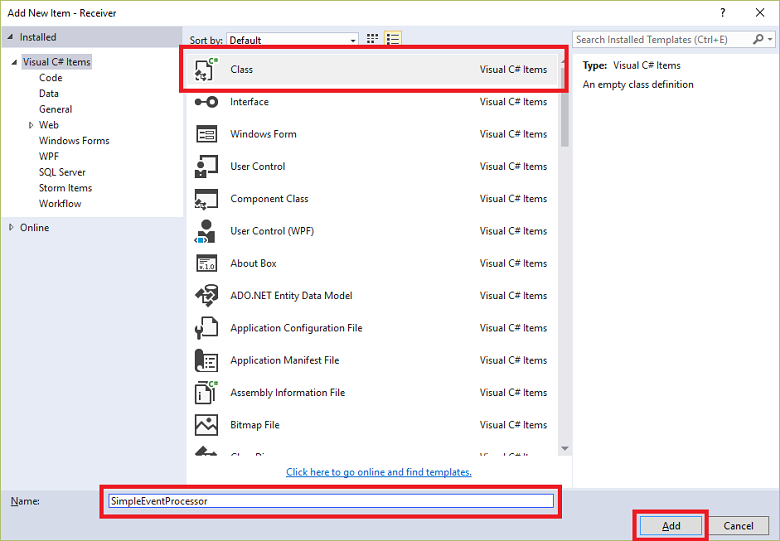

# <a name="receive-events-from-azure-event-hubs-using-the-net-framework"></a>.NET Framework を使用して Azure Event Hubs からイベントを受信する

## <a name="introduction"></a>はじめに
Event Hubs は、接続されているデバイスとアプリケーションからの大量のイベント データ (テレメトリ) を処理するサービスです。 Event Hubs にデータを収集した後、ストレージ クラスターを使用してデータを格納したり、リアルタイムの分析プロバイダーを使用して転送できます。 この大規模なイベントの収集と処理の機能は、モノのインターネット (IoT) など最新アプリケーション アーキテクチャの重要なコンポーネントです。

このチュートリアルでは、**[イベント プロセッサ ホスト][EventProcessorHost]**を使用してイベント ハブからメッセージを受信する .NET Framework コンソール アプリケーションの記述方法を説明します。 .NET Framework を使用してイベントを送信するには、[.NET Framework を使用して Azure Event Hubs にイベントを送信する方法](event-hubs-dotnet-framework-getstarted-send.md)に関する記事を参照するか、左側の目次で適切な送信側の言語をクリックしてください。

[イベント プロセッサ ホスト][EventProcessorHost]は、永続的なチェックポイントの管理によって Event Hubs のイベントの受信を簡素化し、並列してそれらの Event Hubs から受信する .NET クラスです。 [イベント プロセッサ ホスト][Event Processor Host]を使用すると、さまざまなノードでホストされている場合でも、複数の受信側間でイベントを分割できます。 この例では、受信側が単一の場合に[イベント プロセッサ ホスト][EventProcessorHost]を使用する方法を示します。 [イベント処理のスケールアウト][Scale out Event Processing with Event Hubs]のサンプルは、受信者側が複数の場合に[イベント プロセッサ ホスト][EventProcessorHost]を使用する方法を示します。

## <a name="prerequisites"></a>前提条件

このチュートリアルを完了するには、次のものが必要です。

* [Microsoft Visual Studio 2015 以上](http://visualstudio.com)。 このチュートリアルのスクリーンショットには、Visual Studio 2017 が使用されています。
* アクティブな Azure アカウント。 アカウントがない場合は、無料アカウントを数分で作成できます。 詳細については、 [Azure の無料試用版サイト](https://azure.microsoft.com/free/)を参照してください。

## <a name="create-an-event-hubs-namespace-and-an-event-hub"></a>Event Hubs 名前空間とイベント ハブを作成する

最初のステップでは、[Azure Portal](https://portal.azure.com) を使用して Event Hubs 型の名前空間を作成し、アプリケーションがイベント ハブと通信するために必要な管理資格情報を取得します。 名前空間とイベント ハブを作成するには、[この記事](event-hubs-create.md)の手順を踏み、次のステップに進みます。

## <a name="create-an-azure-storage-account"></a>Azure Storage アカウントの作成

[イベント プロセッサ ホスト][EventProcessorHost]を使用するには、[Azure ストレージ アカウント][Azure Storage account]が必要です。

1. [Azure Portal][Azure portal] にログインし、画面の左上にある **[新規]** をクリックします。
2. **[ストレージ]**、**[ストレージ アカウント]** の順にクリックします。
   
    
3. **[ストレージ アカウントの作成]** ブレードで、ストレージ アカウントの名前を入力します。 リソースが作成される Azure サブスクリプション、リソース グループ、場所を選択します。 **[Create]**をクリックします。
   
    
4. ストレージ アカウントの一覧で、新しく作成したストレージ アカウントをクリックします。
5. ストレージ アカウントのブレードで、 **[アクセス キー]**をクリックします。 後でこのチュートリアルで使用するため、 **key1** の値をコピーしておきます。
   
    
6. Visual Studio で、**コンソール アプリケーション** プロジェクト テンプレートを使用して、新しい Visual C# のデスクトップ アプリ プロジェクトを作成します。 プロジェクトの名前として「 **Receiver**」と入力します。
   
    
7. ソリューション エクスプローラーで **[Receiver]** プロジェクトを右クリックし、**[ソリューションの NuGet パッケージの管理]** をクリックします。
8. **[参照]** タブをクリックして、`Microsoft Azure Service Bus Event Hub - EventProcessorHost` を検索します。 **[インストール]**をクリックして、使用条件に同意します。
   
    
   
    Visual Studio によって、 [Azure Service Bus Event Hub - EventProcessorHost NuGet パッケージ](https://www.nuget.org/packages/Microsoft.Azure.ServiceBus.EventProcessorHost)への参照がすべての依存関係と共にダウンロード、インストール、追加されます。
9. **[Receiver]** プロジェクトを右クリックし、**[追加]**、**[クラス]** の順にクリックします。 新しいクラスの名前として「**SimpleEventProcessor**」と入力し、**[追加]** をクリックしてクラスを作成します。
   
    
10. SimpleEventProcessor.cs ファイルの先頭に次のステートメントを追加します。
    
     ```csharp
     using Microsoft.ServiceBus.Messaging;
     using System.Diagnostics;
     ```
    
     次に、クラスの本文に次のコードを置き換えます。
    
     ```csharp
     class SimpleEventProcessor : IEventProcessor
     {
         Stopwatch checkpointStopWatch;
    
         async Task IEventProcessor.CloseAsync(PartitionContext context, CloseReason reason)
         {
             Console.WriteLine("Processor Shutting Down. Partition '{0}', Reason: '{1}'.", context.Lease.PartitionId, reason);
             if (reason == CloseReason.Shutdown)
             {
                 await context.CheckpointAsync();
             }
         }
    
         Task IEventProcessor.OpenAsync(PartitionContext context)
         {
             Console.WriteLine("SimpleEventProcessor initialized.  Partition: '{0}', Offset: '{1}'", context.Lease.PartitionId, context.Lease.Offset);
             this.checkpointStopWatch = new Stopwatch();
             this.checkpointStopWatch.Start();
             return Task.FromResult<object>(null);
         }
    
         async Task IEventProcessor.ProcessEventsAsync(PartitionContext context, IEnumerable<EventData> messages)
         {
             foreach (EventData eventData in messages)
             {
                 string data = Encoding.UTF8.GetString(eventData.GetBytes());
    
                 Console.WriteLine(string.Format("Message received.  Partition: '{0}', Data: '{1}'",
                     context.Lease.PartitionId, data));
             }
    
             //Call checkpoint every 5 minutes, so that worker can resume processing from 5 minutes back if it restarts.
             if (this.checkpointStopWatch.Elapsed > TimeSpan.FromMinutes(5))
             {
                 await context.CheckpointAsync();
                 this.checkpointStopWatch.Restart();
             }
         }
     }
     ```
    
     このクラスは、 **EventProcessorHost** から呼び出されて、Event Hub から受信したイベントを処理します。 `SimpleEventProcessor` クラスは、ストップウォッチを使用して **EventProcessorHost** コンテキストで定期的にチェックポイント メソッドを呼び出します。 これにより、受信側を再起動すると、処理の作業の&5; 分以内に機能が失われます。
11. **Program** クラスで、ファイルの先頭に次の `using` ステートメントを追加します。
    
     ```csharp
     using Microsoft.ServiceBus.Messaging;
     ```
    
     次に、`Program` クラスの `Main` メソッドを次のコードに置き換え、先ほど保存した Event Hub の名前と名前空間レベルの接続文字列、および前のセクションでコピーしたストレージ アカウントとキーを代入します。 
    
     ```csharp
     static void Main(string[] args)
     {
       string eventHubConnectionString = "{Event Hubs namespace connection string}";
       string eventHubName = "{Event Hub name}";
       string storageAccountName = "{storage account name}";
       string storageAccountKey = "{storage account key}";
       string storageConnectionString = string.Format("DefaultEndpointsProtocol=https;AccountName={0};AccountKey={1}", storageAccountName, storageAccountKey);
    
       string eventProcessorHostName = Guid.NewGuid().ToString();
       EventProcessorHost eventProcessorHost = new EventProcessorHost(eventProcessorHostName, eventHubName, EventHubConsumerGroup.DefaultGroupName, eventHubConnectionString, storageConnectionString);
       Console.WriteLine("Registering EventProcessor...");
       var options = new EventProcessorOptions();
       options.ExceptionReceived += (sender, e) => { Console.WriteLine(e.Exception); };
       eventProcessorHost.RegisterEventProcessorAsync<SimpleEventProcessor>(options).Wait();
    
       Console.WriteLine("Receiving. Press enter key to stop worker.");
       Console.ReadLine();
       eventProcessorHost.UnregisterEventProcessorAsync().Wait();
     }
     ```

12. プログラムを実行し、エラーがないことを確認します。
  
お疲れさまでした。 イベント プロセッサ ホストを使用して、イベント ハブからメッセージを受信しました。


> [!NOTE]
> このチュートリアルでは、[EventProcessorHost][EventProcessorHost] の単一のインスタンスを使用します。 スループットを向上させるには、[EventProcessorHost][EventProcessorHost] の複数のインスタンスを実行することをお勧めします ([イベント処理のスケールアウト][イベント処理のスケールアウト]のサンプルを参照してください)。 このような場合、受信したイベントの負荷を分散するために、さまざまなインスタンスが自動的に連携します。 複数の受信側でぞれぞれ *すべて* のイベントを処理する場合、 **ConsumerGroup** 概念を使用する必要があります。 さまざまなコンピューターからイベントを受信する場合、デプロイしたコンピューター (またはロール) に基づいて [EventProcessorHost][EventProcessorHost] インスタンスの名前を指定するのに便利です。 これらのトピックの詳細については、[Event Hubs の概要][Event Hubs Overview]に関するトピックと、「[Event Hubs のプログラミング ガイド][Event Hubs Programming Guide]」を参照してください。
> 
> 

<!-- Links -->
[Event Hubs Overview]: event-hubs-overview.md
[Event Hubs Programming Guide]: event-hubs-programming-guide.md
[Azure Storage account]: ../storage/storage-create-storage-account.md
[Event Processor Host]: /dotnet/api/microsoft.servicebus.messaging.eventprocessorhost
[Azure portal]: https://portal.azure.com

## <a name="next-steps"></a>次のステップ
イベント ハブを作成し、データを送受信する実用的なアプリケーションが構築できたので、以下のリンク先にアクセスして学習を進めることができます。

* [イベント プロセッサ ホスト](/dotnet/api/microsoft.servicebus.messaging.eventprocessorhost)
* [Event Hubs の概要][Event Hubs overview]
* [Event Hubs の FAQ](event-hubs-faq.md)

<!-- Images. -->
[19]: ./media/event-hubs-csharp-ephcs-getstarted/create-eh-proj1.png
[20]: ./media/event-hubs-csharp-ephcs-getstarted/create-eh-proj2.png
[21]: ./media/event-hubs-csharp-ephcs-getstarted/run-csharp-ephcs1.png
[22]: ./media/event-hubs-csharp-ephcs-getstarted/run-csharp-ephcs2.png

<!-- Links -->
[EventProcessorHost]: https://www.nuget.org/packages/Microsoft.Azure.ServiceBus.EventProcessorHost
[Event Hubs overview]: event-hubs-overview.md
[Scale out Event Processing with Event Hubs]: https://code.msdn.microsoft.com/Service-Bus-Event-Hub-45f43fc3
