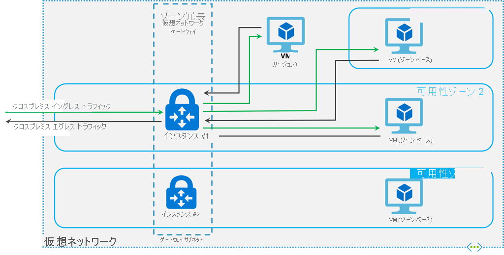

# <a name="about-expressroute-virtual-network-gateways"></a>ExpressRoute の仮想ネットワーク ゲートウェイについて

お使いの Azure 仮想ネットワークとオンプレミス ネットワークを ExpressRoute 経由で接続するには、最初に仮想ネットワーク ゲートウェイを作成する必要があります。 仮想ネットワーク ゲートウェイには 2 つの目的があります。1 つはネットワーク間で IP ルートを交換すること、もう 1 つはネットワーク トラフィックをルーティングすることです。 この記事では、ゲートウェイの種類、ゲートウェイ SKU、および SKU ごとの予測パフォーマンスについて説明します。 また、パフォーマンスを向上させるために、お使いのオンプレミス ネットワークからのネットワーク トラフィックが仮想ネットワーク ゲートウェイをバイパスできるようにする機能、ExpressRoute [FastPath](#fastpath) についても説明します。

## <a name="gateway-types"></a>ゲートウェイの種類

仮想ネットワーク ゲートウェイを作成する場合、設定をいくつか指定する必要があります。 必須の設定の 1 つである '-GatewayType' は、ゲートウェイを ExpressRoute と VPN トラフィックのどちらに使用するかを指定します。 ゲートウェイには、次の 2 種類があります。

* **Vpn** - パブリック インターネットでトラフィックを暗号化して送信するには、ゲートウェイの種類 "Vpn" を使用します。 これは、VPN ゲートウェイとも呼ばれます。 サイト間接続、ポイント対サイト接続、VNet 間接続のすべてで、VPN ゲートウェイが使用されます。

* **ExpressRoute** - プライベート接続でネットワーク トラフィックを送信するには、ゲートウェイの種類 'ExpressRoute' を使用します。 これは ExpressRoute ゲートウェイとも呼ばれ、ExpressRoute の構成時に使用するゲートウェイの種類です。

各仮想ネットワークに配置できる仮想ネットワーク ゲートウェイは、ゲートウェイの種類ごとに 1 つに限られています。 たとえば、-GatewayType が Vpn の仮想ネットワーク ゲートウェイと -GatewayType が ExpressRoute の仮想ネットワーク ゲートウェイをそれぞれ 1 つ配置できます。

## <a name="gwsku"></a>ゲートウェイの SKU
[!INCLUDE [expressroute-gwsku-include](../../includes/expressroute-gwsku-include.md)]

ゲートウェイをより強力なゲートウェイ SKU にアップグレードする場合、ほとんどの場合 "Resize-AzVirtualNetworkGateway" PowerShell コマンドレットを使用できます。 これは、Standard および HighPerformance SKU へのアップグレードの場合でも機能します。 ただし、UltraPerformance SKU へのアップグレードでは、ゲートウェイを再作成する必要があります。 ゲートウェイの再作成によりダウンタイムが発生します。

### <a name="aggthroughput"></a>ゲートウェイ SKU の推定パフォーマンス
次の表は、ゲートウェイの種類と、予測されるパフォーマンスを示したものです。 この表は、リソース マネージャーとクラシック デプロイ モデルの両方に適用されます。

[!INCLUDE [expressroute-table-aggthroughput](../../includes/expressroute-table-aggtput-include.md)]

> [!IMPORTANT]
> アプリケーションのパフォーマンスは複数の要因によって異なります。これらの要因には、エンド ツー エンドの待機時間、アプリケーションが起動するトラフィック フローの数などがあります。 テーブルの数値は、アプリケーションが理想的な環境で理論上達成できる上限を表しています。
>
>

## <a name="gwsub"></a>ゲートウェイ サブネット

ExpressRoute ゲートウェイを作成する前に、ゲートウェイ サブネットを作成する必要があります。 ゲートウェイ サブネットには、仮想ネットワーク ゲートウェイの VM とサービスが使用する IP アドレスが含まれます。 仮想ネットワーク ゲートウェイを作成すると、ゲートウェイ VM はゲートウェイ サブネットにデプロイされ、必要な ExpressRoute ゲートウェイ設定で構成されます。 ゲートウェイ サブネットには、追加の VM などをデプロイしないでください。 ゲートウェイ サブネットを正常に動作させるには、"GatewaySubnet" という名前を付ける必要があります。 ゲートウェイ サブネットに "GatewaySubnet" という名前を付けることで、これが仮想ネットワーク ゲートウェイの VM とサービスをデプロイするサブネットであることを Azure が認識できます。

>[!NOTE]
>[!INCLUDE [vpn-gateway-gwudr-warning.md](../../includes/vpn-gateway-gwudr-warning.md)]
>

ゲートウェイ サブネットを作成するときに、サブネットに含まれる IP アドレスの数を指定します。 ゲートウェイ サブネット内の IP アドレスは、ゲートウェイ VM とゲートウェイ サービスに割り当てられます。 一部の構成では、他の構成よりも多くの IP アドレスを割り当てる必要があります。 

ゲートウェイ サブネットのサイズを計画する際は、作成する構成に関するドキュメントを参照してください。 たとえば、ExpressRoute/VPN Gateway が共存する構成には、他のほとんどの構成より大規模なゲートウェイ サブネットが必要です。 また、ゲートウェイ サブネットには、将来の構成の追加に対応できる十分な数の IP アドレスが含まれるようにしてください。 /29 のような小さいゲートウェイ サブネットを作成できますが、使用できるアドレス空間がある場合は、/27 以上 (/27、/26 など) のゲートウェイ サブネットを作成することをお勧めします。 このゲートウェイ サブネットは、ほとんどの構成に対応します。

次の Resource Manager PowerShell の例では、GatewaySubnet という名前のゲートウェイ サブネットを示しています。 CIDR 表記で /27 を指定しています。これで既存のほとんどの構成で IP アドレスに十分対応できます。

```azurepowershell-interactive
Add-AzVirtualNetworkSubnetConfig -Name 'GatewaySubnet' -AddressPrefix 10.0.3.0/27
```

[!INCLUDE [vpn-gateway-no-nsg](../../includes/vpn-gateway-no-nsg-include.md)]

### <a name="zrgw"></a>ゾーン冗長ゲートウェイ SKU

Azure Availability Zones に、ExpressRoute ゲートウェイをデプロイすることもできます。 これにより、ゲートウェイは異なる Availability Zones に物理的かつ論理的に分離され、オンプレミス ネットワークの Azure への接続がゾーン レベルの障害から保護されます。



ゾーン冗長ゲートウェイでは、ExpressRoute ゲートウェイに特定の新しいゲートウェイ SKU が使用されます。

* ErGw1AZ
* ErGw2AZ
* ErGw3AZ

新しいゲートウェイ SKU では、ニーズに最も適したその他のデプロイ オプションもサポートされます。 新しいゲートウェイ SKU を使用して仮想ネットワーク ゲートウェイを作成する場合、特定のゾーン内にゲートウェイをデプロイするオプションもあります。 これは、ゾーン ゲートウェイと呼ばれます。 ゾーン ゲートウェイをデプロイすると、すべてのゲートウェイ インスタンスが同じ可用性ゾーンにデプロイされます。

## <a name="fastpath"></a>FastPath

ExpressRoute 仮想ネットワーク ゲートウェイの目的は、ネットワーク ルートを交換し、ネットワーク トラフィックをルーティングすることです。 FastPath の目的は、お使いのオンプレミス ネットワークと仮想ネットワークの間のデータ パスのパフォーマンスを向上させることです。 FastPath が有効になっていると、ゲートウェイはバイパスされ、ネットワーク トラフィックが仮想ネットワーク内の仮想マシンに直接送信されます。

制限や要件を含む FastPath の詳細については、[FastPath の概要](about-fastpath.md)に関するページを参照してください。

## <a name="resources"></a>REST API および PowerShell コマンドレット
仮想ネットワーク ゲートウェイの構成に対して REST API および PowerShell コマンドレットを使用する場合のテクニカル リソースおよび特定構文の要件については、次のページを参照してください。

| **クラシック** | **Resource Manager** |
| --- | --- |
| [PowerShell](https://docs.microsoft.com/powershell/module/servicemanagement/azure/?view=azuresmps-4.0.0#azure) |[PowerShell](https://docs.microsoft.com/powershell/module/az.network#networking) |
| [REST API](https://msdn.microsoft.com/library/jj154113.aspx) |[REST API](https://msdn.microsoft.com/library/mt163859.aspx) |

## <a name="next-steps"></a>次の手順

使用可能な接続構成の詳細については、「[ExpressRoute の概要](expressroute-introduction.md)」を参照してください。

ExpressRoute ゲートウェイの作成の詳細については、[ExpressRoute 用の仮想ネットワーク ゲートウェイの作成](expressroute-howto-add-gateway-resource-manager.md)に関するページを参照してください。

ゾーン冗長ゲートウェイの構成の詳細については、[ゾーン冗長仮想ネットワーク ゲートウェイの作成](../../articles/vpn-gateway/create-zone-redundant-vnet-gateway.md)に関するページを参照してください。

FastPath の詳細については、[FastPath の概要](about-fastpath.md)に関するページを参照してください。