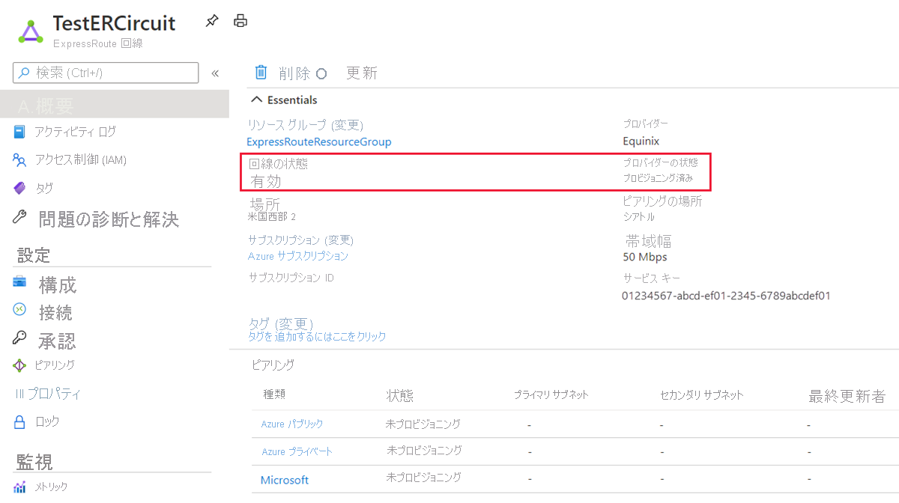

# ExpressRoute 回線の作成と変更

> [!div class="op_single_selector"]
> * [Azure Portal](expressroute-howto-circuit-portal-resource-manager.md)
> * [PowerShell](expressroute-howto-circuit-arm.md)
> * [Azure CLI](howto-circuit-cli.md)
> * [ビデオ - Azure Portal](https://azure.microsoft.com/documentation/videos/azure-expressroute-how-to-create-an-expressroute-circuit)
> * [PowerShell (クラシック)](expressroute-howto-circuit-classic.md)
>

この記事は、Azure portal と Azure Resource Manager デプロイ モデルを使用して、ExpressRoute 回線を作成するときに役立ちます。 状態の確認、および回線の更新、削除、プロビジョニング解除を行うこともできます。

## 開始する前に

* 構成を開始する前に、[前提条件](expressroute-prerequisites.md)と[ワークフロー](expressroute-workflows.md)を確認してください。
* [Azure ポータル](https://portal.azure.com)に対するアクセスできることを確認します。
* 新しいネットワーク リソースを作成するアクセス許可があることを確認します。 適切なアクセス許可がない場合は、アカウント管理者に連絡してください。
* 手順をより理解するため、開始する前に[ビデオを確認](https://azure.microsoft.com/documentation/videos/azure-expressroute-how-to-create-an-expressroute-circuit)できます。

## ExpressRoute 回線の作成とプロビジョニング

### 1.Azure ポータルにサインインします。

ブラウザーから [Azure ポータル](https://portal.azure.com) に移動し、Azure アカウントでサインインします。

### 2.新しい ExpressRoute 回線を作成する

> [!IMPORTANT]
> ExpressRoute 回線の課金は、サービス キーが発行されたときから始まります。 接続プロバイダーが回線をプロビジョニングする準備ができたら、この操作を実行します。

1. 新しいリソースを作成するオプションを選択して、ExpressRoute 回線を作成できます。 次の図に示すように、**[リソースの作成]**  >  **[ネットワーク]**  >  **[ExpressRoute]** をクリックします。

   
2. **[ExpressRoute]** をクリックすると、**[ExpressRoute 回線の作成]** ページが表示されます。 このページで値を入力するときは、正しい SKU レベル (Standard または Premium) とデータ計測課金モデル (無制限または従量制) を指定してください。

   

   * **[レベル]** によって、ExpressRoute の Standard と Premium のどちらのアドオンが有効になるかが決まります。 標準 SKU を取得する場合は **[Standard]** を、プレミアム アドオンの場合は **[Premium]** を指定できます。
   * **[データ計測方法]** によって、課金の種類が決まります。 従量制課金データ プランの場合は **[従量制]** を、無制限データ プランの場合は **[無制限]** を指定できます。 課金の種類を **[従量制]** から **[無制限]** に変更できることに注意してください。

     > [!IMPORTANT]
     > **[無制限]** から **[従量制]** には種類を変更できません。

   * **ピアリングの場所**とは、Microsoft とピアリングしている物理的な場所です。

     > [!IMPORTANT]
     > ピアリングの場所は、Microsoft とピアリングしている[物理的な場所](expressroute-locations.md)を示します。 この場所は "Location" プロパティに**リンクされていません**。それは、Azure Network Resource Provider が配置されている地理的な場所を参照します。 それらは関連付けられていませんが、回路のピアリングの場所と地理的に近い場所にある Network Resource Provider を選択することをお勧めします。

### 手順 3.回線とプロパティを表示する

**すべての回線を表示する**

左側のメニューで **[すべてのリソース]** を選択すると、作成したすべての回線を表示できます。

**プロパティを表示する**

回線を選択し、その回線のプロパティを表示できます。 回線の **[概要]** ページでは、サービス キーがサービス キー フィールドに表示されます。 プロビジョニング プロセスを完了するには、回線のサービス キーをコピーし、サービス プロバイダーに貼り付ける必要があります。 回線のサービス キーは回線に固有です。

### 4.プロビジョニングのためにサービス キーを接続プロバイダーに送信する

このページの **[プロバイダーの状態]** は、サービス プロバイダー側でのプロビジョニングの現在の状態に関する情報を提供します。 **[回線の状態]** は、Microsoft 側での状態を提供します。 回線のプロビジョニング状態に関する詳細については、 [ワークフロー](expressroute-workflows.md#expressroute-circuit-provisioning-states) に関する記事を参照してください。

新しい ExpressRoute 回線を作成する場合、この回線は次の状態になります。

プロバイダーの状態: 未プロビジョニング 
回線の状態: Enabled

回線は、接続プロバイダーが有効にしている間、次の状態に変化します。

プロバイダーの状態: プロビジョニング 
回線の状態: Enabled

ExpressRoute 回線をユーザーが使用できるように、次の状態にする必要があります。

プロバイダーの状態: プロビジョニング済み 
回線の状態: Enabled

### 5.回線キーのステータスと状態を定期的に確認する

関心のある回線を選択し、その回線のプロパティを表示できます。 **[プロバイダーの状態]** が **[プロビジョニング済み]** になっていることを確認してから続行します。

### 6.ルーティング構成を作成する

回線ピアリングの作成と変更の詳しい手順については、「 [PowerShell を使用した ExpressRoute 回線のルーティングの作成と変更](expressroute-howto-routing-portal-resource-manager.md) 」を参照してください。

> [!IMPORTANT]
> 次の手順は、サービス プロバイダーが提供するレイヤー 2 接続サービスで作成された回線にのみ適用されます。 サービス プロバイダーが提供する管理対象レイヤー 3 サービス (MPLS など、通常は IP VPN) を使用する場合、接続プロバイダーがユーザーに代わってルーティングを構成して管理します。

### 7.ExpressRoute 回線への仮想ネットワークのリンク

次に、ExpressRoute 回線に仮想ネットワークをリンクします。 Resource Manager デプロイ モデルを使用するときは、「[ExpressRoute 回線への仮想ネットワークのリンク](expressroute-howto-linkvnet-arm.md)」を参照してください。

## ExpressRoute 回線の状態の取得

回線を選択し、[概要] ページを表示することで回線の状態を表示できます。

## ExpressRoute 回線の変更

ExpressRoute 回線の特定のプロパティは、接続に影響を与えることなく変更できます。 帯域幅、SKU、課金モデルを変更し、**[構成]** ページの従来の操作を許可することができます。 制限と制約事項の詳細については、「[ExpressRoute の FAQ](expressroute-faqs.md)」を参照してください。 

ダウンタイムなく、次のタスクを実行できます。

* ExpressRoute 回線の ExpressRoute Premium アドオンを有効または無効にします。
* ポートに使用可能な容量があれば、ExpressRoute 回線の帯域幅を増やします。

  > [!IMPORTANT]
  > 回線の帯域幅のダウングレードはサポートされていません。

* 課金プランを*従量制課金データ*から*無制限データ*に変更します。

  > [!IMPORTANT]
  > 無制限データから従量制課金データへの課金プランの変更はサポートされていません。

* *従来の操作の許可*を有効または無効にできます。
  > [!IMPORTANT]
  > 既存のポートの容量が不十分な場合、ExpressRoute 回線の再作成が必要になる可能性があります。 その場所に使用可能な追加の容量がない場合、回路をアップグレードすることはできません。
  > 
  > 帯域幅はシームレスにアップグレードできますが、ExpressRoute 回線の帯域幅を中断なく減らすことはできません。 帯域幅をダウングレードするには、ExpressRoute 回線のプロビジョニングを解除してから、新しい ExpressRoute 回線を再度プロビジョニングする必要があります。
  > 
  > Standard 回線で許可されるリソースより多くのリソースを使用する場合、Premium アドオンの無効化操作が失敗することがあります。

ExpressRoute 回線を変更するには、**[構成]** をクリックします。

## ExpressRoute 回線のプロビジョニング解除と削除

**[削除]** アイコンを選択し、ExpressRoute 回線を削除できます。 次の情報をメモしておきます。

* ExpressRoute 回線からすべての仮想ネットワークのリンクを解除する必要があります。 この操作が失敗した場合は、回線にリンクされている仮想ネットワークがないか確認してください。
* ExpressRoute 回線サービス プロバイダーのプロビジョニング状態が**プロビジョニング中**または**プロビジョニング済み**の場合、サービス プロバイダー側の回線のプロビジョニングを解除するには、サービス プロバイダーに連絡する必要があります。 Microsoft は、サービス プロバイダーが回線のプロビジョニング解除を完了し、通知するまで、リソースの予約と課金を続行します。
* サービス プロバイダーが回線のプロビジョニングを解除済み (サービス プロバイダーのプロビジョニング状態が**未プロビジョニング**に設定されている) の場合、回線を削除することができます。 これによって回線の課金が停止されます。

## 次の手順

回線を作成したら、次の手順に移ります。

* [ExpressRoute 回線のルーティングの作成と変更を行う](expressroute-howto-routing-portal-resource-manager.md)
* [仮想ネットワークを ExpressRoute 回線にリンクする](expressroute-howto-linkvnet-arm.md)
