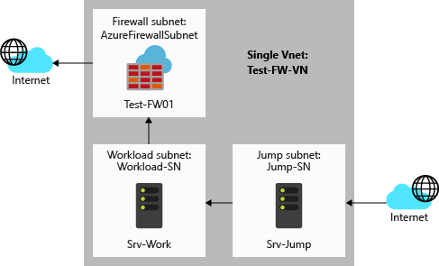

# <a name="deploy-and-configure-azure-firewall-using-azure-powershell"></a>Azure PowerShell を使用して Azure Firewall のデプロイと構成を行う

アウトバウンド ネットワーク アクセスを制御することは、ネットワーク セキュリティ プラン全体の重要な要素です。 たとえば、Web サイトへのアクセスを制限することができます。 また、アクセスできるアウトバウンドの IP アドレスとポートを制限することもできます。

Azure サブネットから外に向かうアウトバウンド ネットワーク アクセスを制御する方法の 1 つとして、Azure Firewall の使用が挙げられます。 Azure Firewall を使用して、次のルールを構成できます。

* アプリケーション ルール: サブネットからアクセスできる完全修飾ドメイン名 (FQDN) を定義します。
* ネットワーク ルール: 送信元アドレス、プロトコル、宛先ポート、送信先アドレスを定義します。

ネットワーク トラフィックは、サブネットの既定ゲートウェイとしてのファイアウォールにルーティングしたときに、構成されているファイアウォール ルールに制約されます。

この記事では、デプロイしやすいよう単純化して、3 つのサブネットを含んだ単一の VNet を作成します。 運用環境のデプロイでは、[ハブとスポーク モデル](https://docs.microsoft.com/azure/architecture/reference-architectures/hybrid-networking/hub-spoke)を採用して、独自の VNet にファイアウォールを配置することをお勧めします。 ワークロード サーバーは、1 つ以上のサブネットを含む同じリージョンのピアリングされた VNet に配置されます。

* **AzureFirewallSubnet** - このサブネットにファイアウォールが存在します。
* **Workload-SN** - このサブネットにはワークロード サーバーがあります。 このサブネットのネットワーク トラフィックは、ファイアウォールを通過します。
* **Jump-SN** - このサブネットには "ジャンプ" サーバーがあります。 ジャンプ サーバーには、リモート デスクトップを使用して接続できるパブリック IP アドレスがあります。 そこから、(別のリモート デスクトップを使用して) ワークロード サーバーに接続できます。



この記事では、次のことについて説明します。

> [!div class="checklist"]
> * テスト ネットワーク環境を設定する
> * ファイアウォールをデプロイする
> * 既定のルートを作成する
> * www.google.com へのアクセスを許可するようにアプリケーションを構成する
> * 外部 DNS サーバーへのアクセスを許可するようにネットワーク ルールを構成する
> * ファイアウォールをテストする

好みに応じて、[Azure portal](tutorial-firewall-deploy-portal.md) を使ってこの手順を実行することもできます。

Azure サブスクリプションをお持ちでない場合は、開始する前に [無料アカウント](https://azure.microsoft.com/free/?WT.mc_id=A261C142F) を作成してください。

## <a name="prerequisites"></a>前提条件

この手順では、PowerShell をローカルで実行する必要があります。 Azure PowerShell モジュールをインストールしておく必要があります。 バージョンを確認するには、`Get-Module -ListAvailable Az` を実行します。 アップグレードする必要がある場合は、[Azure PowerShell モジュールのインストール](https://docs.microsoft.com/powershell/azure/install-Az-ps)に関するページを参照してください。 PowerShell のバージョンを確認した後、`Connect-AzAccount` を実行して Azure との接続を作成します。

## <a name="set-up-the-network"></a>ネットワークのセットアップ

最初に、ファイアウォールをデプロイするために必要なリソースを含めるリソース グループを作成します。 次に、VNet、サブネット、およびテスト サーバーを作成します。

### <a name="create-a-resource-group"></a>リソース グループの作成

このリソース グループには、デプロイのためのすべてのリソースが含まれます。

```azurepowershell
New-AzResourceGroup -Name Test-FW-RG -Location "East US"
```

### <a name="create-a-vnet"></a>VNet を作成する

この仮想ネットワークには次の 3 つのサブネットが含まれています。

```azurepowershell
$FWsub = New-AzVirtualNetworkSubnetConfig -Name AzureFirewallSubnet -AddressPrefix 10.0.1.0/24
$Worksub = New-AzVirtualNetworkSubnetConfig -Name Workload-SN -AddressPrefix 10.0.2.0/24
$Jumpsub = New-AzVirtualNetworkSubnetConfig -Name Jump-SN -AddressPrefix 10.0.3.0/24
```

> [!NOTE]
> AzureFirewallSubnet サブネットの最小サイズは /26 です。

次に、仮想ネットワークを作成します。

```azurepowershell
$testVnet = New-AzVirtualNetwork -Name Test-FW-VN -ResourceGroupName Test-FW-RG `
-Location "East US" -AddressPrefix 10.0.0.0/16 -Subnet $FWsub, $Worksub, $Jumpsub
```

### <a name="create-virtual-machines"></a>仮想マシンを作成する

次に、ジャンプおよびワークロード仮想マシンを作成し、適切なサブネットに配置します。
プロンプトが表示されたら、仮想マシンの HTTPS ユーザー名とパスワードを入力します。

Srv-Jump 仮想マシンを作成します。

```azurepowershell
New-AzVm `
    -ResourceGroupName Test-FW-RG `
    -Name "Srv-Jump" `
    -Location "East US" `
    -VirtualNetworkName Test-FW-VN `
    -SubnetName Jump-SN `
    -OpenPorts 3389 `
    -Size "Standard_DS2"
```

パブリック IP アドレスを持たないワークロードの仮想マシンを作成します。
プロンプトが表示されたら、仮想マシンの HTTPS ユーザー名とパスワードを入力します。

```azurepowershell
#Create the NIC
$NIC = New-AzNetworkInterface -Name Srv-work -ResourceGroupName Test-FW-RG `
 -Location "East US" -Subnetid $testVnet.Subnets[1].Id 

#Define the virtual machine
$VirtualMachine = New-AzVMConfig -VMName Srv-Work -VMSize "Standard_DS2"
$VirtualMachine = Set-AzVMOperatingSystem -VM $VirtualMachine -Windows -ComputerName Srv-Work -ProvisionVMAgent -EnableAutoUpdate
$VirtualMachine = Add-AzVMNetworkInterface -VM $VirtualMachine -Id $NIC.Id
$VirtualMachine = Set-AzVMSourceImage -VM $VirtualMachine -PublisherName 'MicrosoftWindowsServer' -Offer 'WindowsServer' -Skus '2016-Datacenter' -Version latest

#Create the virtual machine
New-AzVM -ResourceGroupName Test-FW-RG -Location "East US" -VM $VirtualMachine -Verbose
```

## <a name="deploy-the-firewall"></a>ファイアウォールをデプロイする

次に、仮想ネットワークにファイアウォールをデプロイします。

```azurepowershell
# Get a Public IP for the firewall
$FWpip = New-AzPublicIpAddress -Name "fw-pip" -ResourceGroupName Test-FW-RG `
  -Location "East US" -AllocationMethod Static -Sku Standard
# Create the firewall
$Azfw = New-AzFirewall -Name Test-FW01 -ResourceGroupName Test-FW-RG -Location "East US" -VirtualNetworkName Test-FW-VN -PublicIpName fw-pip

#Save the firewall private IP address for future use

$AzfwPrivateIP = $Azfw.IpConfigurations.privateipaddress
$AzfwPrivateIP
```

プライベート IP アドレスをメモします。 後で既定のルートを作成するときにこれを使用します。

## <a name="create-a-default-route"></a>既定のルートを作成する

BGP ルート伝達が無効になっているテーブルを作成します

```azurepowershell
$routeTableDG = New-AzRouteTable `
  -Name Firewall-rt-table `
  -ResourceGroupName Test-FW-RG `
  -location "East US" `
  -DisableBgpRoutePropagation

#Create a route
 Add-AzRouteConfig `
  -Name "DG-Route" `
  -RouteTable $routeTableDG `
  -AddressPrefix 0.0.0.0/0 `
  -NextHopType "VirtualAppliance" `
  -NextHopIpAddress $AzfwPrivateIP `
 | Set-AzRouteTable

#Associate the route table to the subnet

Set-AzVirtualNetworkSubnetConfig `
  -VirtualNetwork $testVnet `
  -Name Workload-SN `
  -AddressPrefix 10.0.2.0/24 `
  -RouteTable $routeTableDG | Set-AzVirtualNetwork
```

## <a name="configure-an-application-rule"></a>アプリケーション ルールを構成する

このアプリケーション ルールでは www.google.com へのアウトバウンド アクセスが許可されます。

```azurepowershell
$AppRule1 = New-AzFirewallApplicationRule -Name Allow-Google -SourceAddress 10.0.2.0/24 `
  -Protocol http, https -TargetFqdn www.google.com

$AppRuleCollection = New-AzFirewallApplicationRuleCollection -Name App-Coll01 `
  -Priority 200 -ActionType Allow -Rule $AppRule1

$Azfw.ApplicationRuleCollections = $AppRuleCollection

Set-AzFirewall -AzureFirewall $Azfw
```

Azure Firewall には、既定で許可されるインフラストラクチャ FQDN 用の組み込みのルール コレクションが含まれています。 これらの FQDN はプラットフォームに固有であり、他の目的には使用できません。 詳細については、[インフラストラクチャ FQDN](infrastructure-fqdns.md) に関する記事を参照してください。

## <a name="configure-a-network-rule"></a>ネットワーク ルールを構成する

このネットワーク ルールにより、ポート 53 (DNS) で 2 つの IP アドレスへのアウトバウンド アクセスが許可されます。

```azurepowershell
$NetRule1 = New-AzFirewallNetworkRule -Name "Allow-DNS" -Protocol UDP -SourceAddress 10.0.2.0/24 `
   -DestinationAddress 209.244.0.3,209.244.0.4 -DestinationPort 53

$NetRuleCollection = New-AzFirewallNetworkRuleCollection -Name RCNet01 -Priority 200 `
   -Rule $NetRule1 -ActionType "Allow"

$Azfw.NetworkRuleCollections = $NetRuleCollection

Set-AzFirewall -AzureFirewall $Azfw
```

### <a name="change-the-primary-and-secondary-dns-address-for-the-srv-work-network-interface"></a>**Srv-Work** ネットワーク インターフェイスのプライマリおよびセカンダリ DNS アドレスを変更する

この手順のテスト目的で、サーバーのプライマリおよびセカンダリ DNS アドレスを構成します。 これは、一般的な Azure Firewall 要件ではありません。

```azurepowershell
$NIC.DnsSettings.DnsServers.Add("209.244.0.3")
$NIC.DnsSettings.DnsServers.Add("209.244.0.4")
$NIC | Set-AzNetworkInterface
```

## <a name="test-the-firewall"></a>ファイアウォールをテストする

今度は、ファイアウォールをテストして、想定したように機能することを確認します。

1. **Srv-Work** の仮想マシンのプライベート IP アドレスをメモしてください。

   ```
   $NIC.IpConfigurations.PrivateIpAddress
   ```

1. リモート デスクトップを **Srv-Jump** 仮想マシンに接続し、サインインします。 そこから **Srv-Work** のプライベート IP アドレスへのリモート デスクトップ接続を開いて、サインインします。

3. **[SRV-Work]** で PowerShell ウィンドウを開き、次のコマンドを実行します。

   ```
   nslookup www.google.com
   nslookup www.microsoft.com
   ```

   どちらのコマンドでも、DNS クエリがファイアウォールを通過していることを示す回答を返します。

1. 次のコマンドを実行します。

   ```
   Invoke-WebRequest -Uri http://www.google.com
   Invoke-WebRequest -Uri https://www.google.com

   Invoke-WebRequest -Uri http://www.microsoft.com
   Invoke-WebRequest -Uri https://www.microsoft.com
   ```

   www.google.com の要求は成功し、www.microsoft.com の要求は失敗します。 これは、ファイアウォール ルールが予想どおりに動作していることを示します。

これで、ファイアウォール ルールが動作していることを確認できました。

* 構成された外部 DNS サーバーを使用して DNS 名を解決できます。
* 1 つの許可された FQDN は参照できますが、それ以外は参照できません。

## <a name="clean-up-resources"></a>リソースのクリーンアップ

ファイアウォール リソースは、次のチュートリアルのために残しておいてもかまいませんが、不要であれば、**Test-FW-RG** リソース グループを削除して、ファイアウォール関連のすべてのリソースを削除してください。

```azurepowershell
Remove-AzResourceGroup -Name Test-FW-RG
```

## <a name="next-steps"></a>次の手順

* [チュートリアル:Azure Firewall のログを監視する](./tutorial-diagnostics.md)
